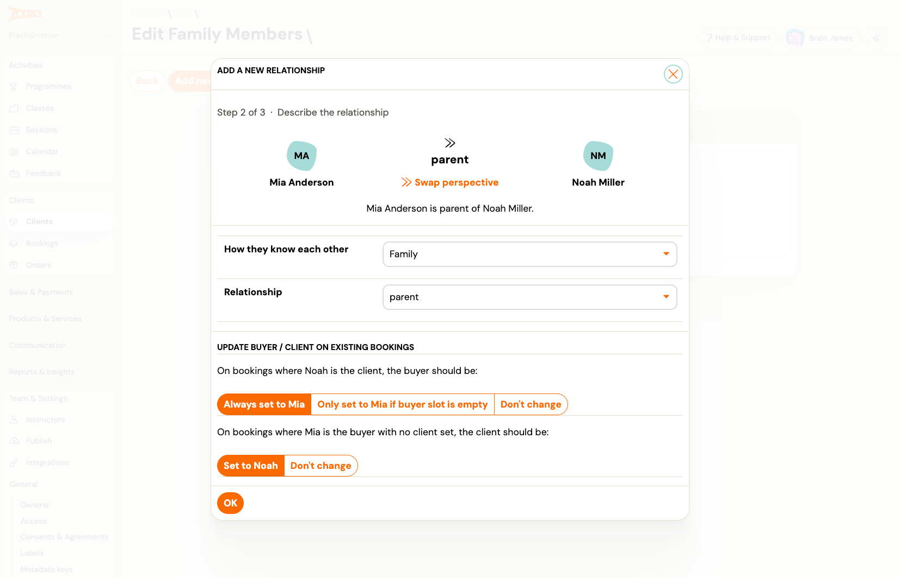
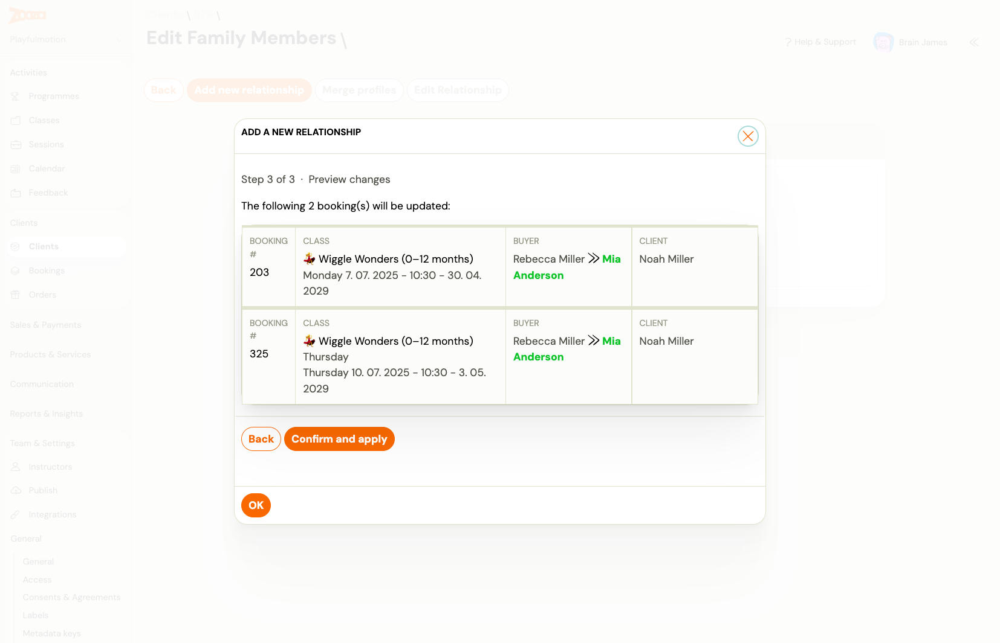

# Add and fix family relationships on a client profile

Family relationships in Zooza link two client profiles — for example, a parent and a child — so the system knows who the buyer is and who the attendee is across bookings. You can add a new relationship and, in the same step, repair the buyer on any existing bookings where the link was missing or incorrect.

> **Navigation:** Go to **Clients** → open a client profile → **Edit Family Members** (top action bar).

---

## When to use this

- **New family** — you want to record that Person A is the parent of Person B.
- **Missing link** — a parent booked using their own email but the booking shows no child linked, or the buyer and client roles are swapped.
- **Repair after a merge or import** — person records were created separately and need to be connected retroactively.

---

## Step 1 — Open Edit Family Members and start a new relationship

1. Open the client profile (parent or child — either works as the starting point).
2. Click **Edit Family Members** in the top action bar.
3. Click **Add new relationship**.
4. Search for the other person by name or email and select them.

---

## Step 2 — Describe the relationship

On Step 2 you set two things:

### Relationship type

| Field | What to set |
|---|---|
| **How they know each other** | Category — typically **Family** |
| **Relationship** | Specific role — e.g. **parent**, **guardian**, **sibling** |

The direction matters: if you started from the parent's profile, the parent is shown on the left. Use **Swap perspective** if the direction is wrong.

### Update buyer / client on existing bookings

This section lets you fix the buyer or client assignment on bookings that already exist — without touching them one by one.

**On bookings where [child] is the client, the buyer should be:**

| Option | What it does |
|---|---|
| **Always set to [parent]** | Replaces the buyer on every booking where this child is the client — even if there is already a different buyer. Use when the parent should always be the responsible party. |
| **Only set to [parent] if buyer slot is empty** | Only fills in the buyer where none is set. Leaves existing buyer assignments untouched. |
| **Don't change** | Makes no changes to buyer on existing bookings. |

**On bookings where [parent] is the buyer with no client set, the client should be:**

| Option | What it does |
|---|---|
| **Set to [child]** | Fills in the child as the client on bookings where the parent is the buyer but no client is linked. |
| **Don't change** | Leaves those bookings as-is. |

> **Tip:** If the booking history is clean and you only want to record the relationship going forward, set both to **Don't change**.

---

## Step 3 — Preview changes and confirm

Step 3 shows every booking that will be changed based on your selections in Step 2. For each affected booking you can see:

- Booking number and class name
- **Buyer** — the old value → new value (highlighted in green)
- **Client** — current value

Review the list carefully. If a booking should not be changed, go back and adjust your repair options in Step 2.

Click **Confirm and apply** to save the relationship and apply all booking updates in one operation. The changes are rolled back entirely if anything fails — you will not end up with a partially applied update.

---

## Editing or removing a relationship

From the **Edit Family Members** screen you can also:

- **Edit relationship** — change the relationship type on an existing link.
- **Delete relationship** — remove the link between the two profiles. This does not change any booking data; it only removes the recorded connection.

---

## Notes

- A relationship is directional (A is parent of B). Zooza records one direction per entry — you do not need to add the inverse separately; the system shows the relationship on both profiles.
- The repair options (**Always set** / **Only set if empty**) apply only at the time you create the relationship. Changing a relationship type later does not re-run the repair.
- If the same relationship already exists between the two people, Zooza rejects the request and no bookings are changed.
