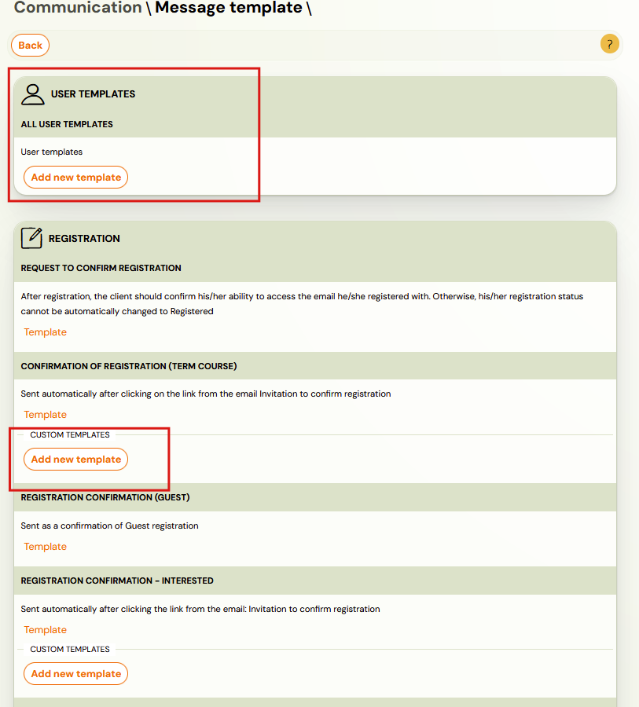
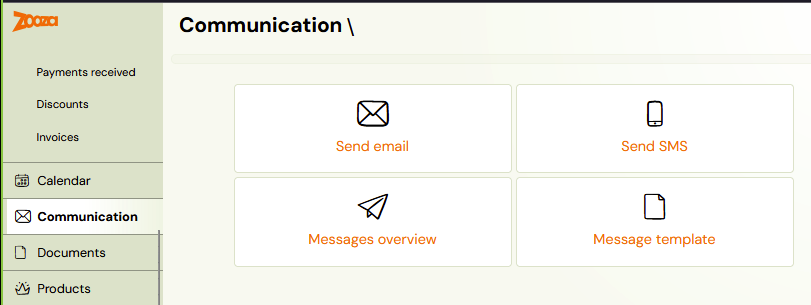
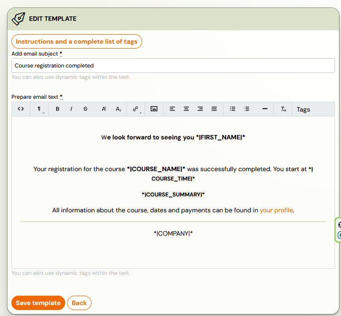
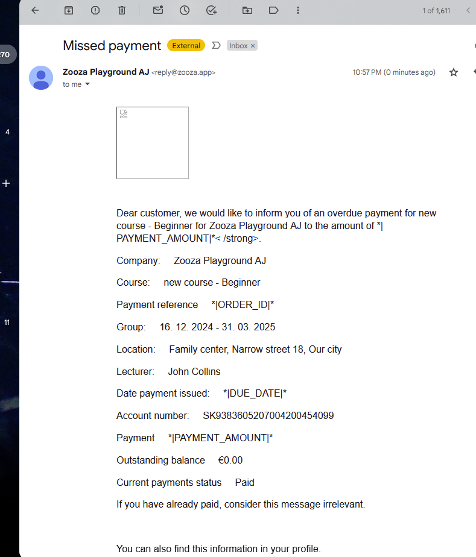

# Automatic communication to clients / Message templates

Zooza does most of the work for you by sending information to the client automatically.

> **Automatic communication includes:**
> - Invitation to confirm booking
> - Confirmation of booking (for programme, one-off, open, lecture, and separate templates for late booking, waiting list booking, class -- Interested)
> - Order confirmation (product purchase)
> - Automatic term reminder
> - Confirmation of opting out from the term
> - Confirmation of payment

This automated communication works through templates designed to serve your needs. We do not recommend changing templates as they are based on mass communication standards. If you need to modify a template, we recommend copying the original and editing the copy, or creating a completely new one. This gives you the opportunity to customise the way you address clients, rewrite the text to describe what you do (e.g., letting clients know you look forward to seeing them *at practice*, or *in class*, or in a *session*), and add or remove information.

The message templates use [dynamic tags](dynamic-tags.md), which fill in data from the client's booking, such as first name, last name, variable symbol, etc. Not all tags can be used in every type of template.

## Message templates

Message templates can be found under **Communication --> Message templates**.

When you open this window, you will see a list of templates. Click on the orange **Template** sign for the specific template you want to view and edit.

The template opens like an email browser, with the subject line and text prepared in advance. You can edit the template just as you would edit an email: overwrite parts of text, highlight in bold, change font size, and align text. You can add both links and images. Do not forget to save your changes.

> **Tip:** View all templates. Customise them according to your needs and be creative.

## Automatic communication without editing capability

There is also automatic communication with default text that cannot be edited. For example: a reminder about an unpaid payment, checking out of an appointment, selecting an alternative session, or an evaluation.

### Reminder about an upcoming appointment

If you want clients to receive an automatic message about an upcoming session, you can set this up in **Programmes --> Online Registration**. See the [automatic session notification manual](automatic-session-notification.md) for how this works, and the [editing manual](edit-session-notification-template.md) for how to customise the template.

### Reminders for outstanding payments

These reminders may or may not be sent to clients automatically. You can set them up at the programme level in **Price and Payment --> Payment Reminder Settings**. See the [automatic payment reminders manual](automatic-payment-reminders.md).

You can set whether and when to send them, as well as whether to automatically delete outstanding bookings.

## System templates vs. user templates

Zooza has two types of templates, and finding the right one can be confusing:

### System templates

- Pre-built templates provided by Zooza (e.g., payment confirmation, booking confirmation).
- Found under **Communication → Message templates** with the orange **Template** label.
- Some system templates **cannot be edited** (e.g., payment confirmations, login codes).
- For editable system templates, we recommend copying the original before making changes.

### User templates

- Custom templates you create for your specific communication needs.
- Found under a separate **User templates** section in the template selector when sending emails.
- You can assign user templates to specific courses or programmes.

### Where to find each type when sending an email

When composing an email from a booking or class, the template dropdown shows two separate sections:

1. **Saved communication templates** — system templates
2. **User templates** — your custom templates

If you cannot find your custom template, check that you are looking in the **User templates** section, not the system templates section.

<!-- REVIEW: Confirm the exact dropdown section names in the current UI — they may have been renamed. -->

## When automatic emails are NOT sent

Zooza sends automatic confirmation emails for online registrations. However, automatic emails are **not sent** in these cases:

- **Copied registrations** — when you copy a registration from one term to another.
- **Manually created registrations** — when you create a registration on behalf of a client.
- **Transferred registrations** — when you transfer a registration between classes.

In all these cases, you must send the confirmation email manually from the registration's **Communication** tab.
