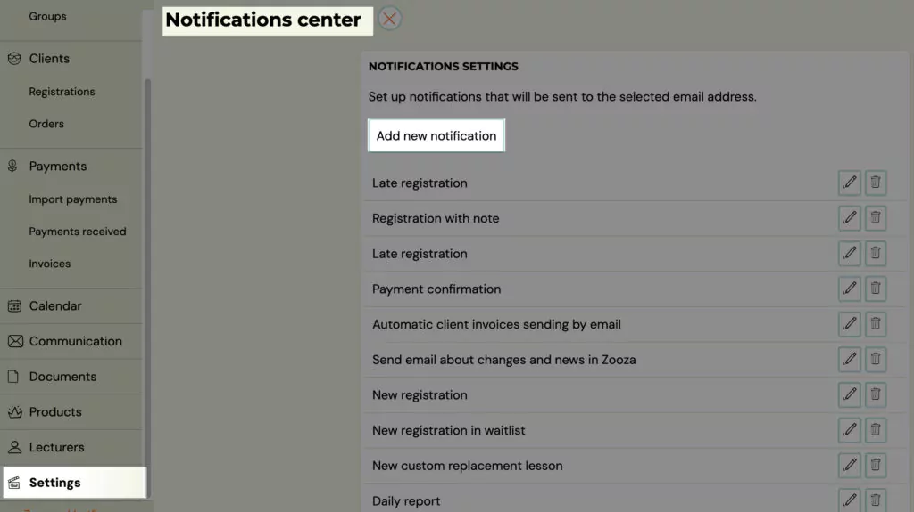
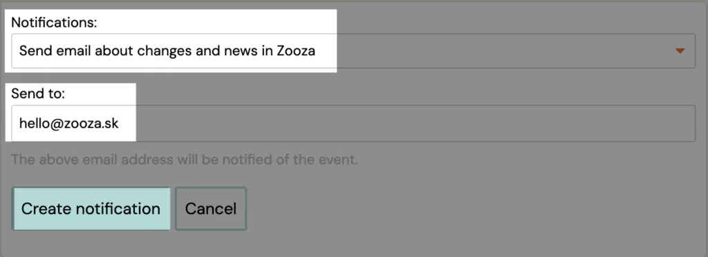

# Notifications Center

The Notification Center is used to notify you as an administrator or your colleagues.

List of notifications you can have sent to you:

## Set up notifications

1. In the *Settings *category, click *Notifications *and click on *Add new notification
 
 *
2. Select the type of notification from the list and type the email you want it to be sent to
3. Confirm your choice by clicking the* Create Notification* button
 

Note: Only one email address can be entered per notification. For the next email you need to create a new notification.
