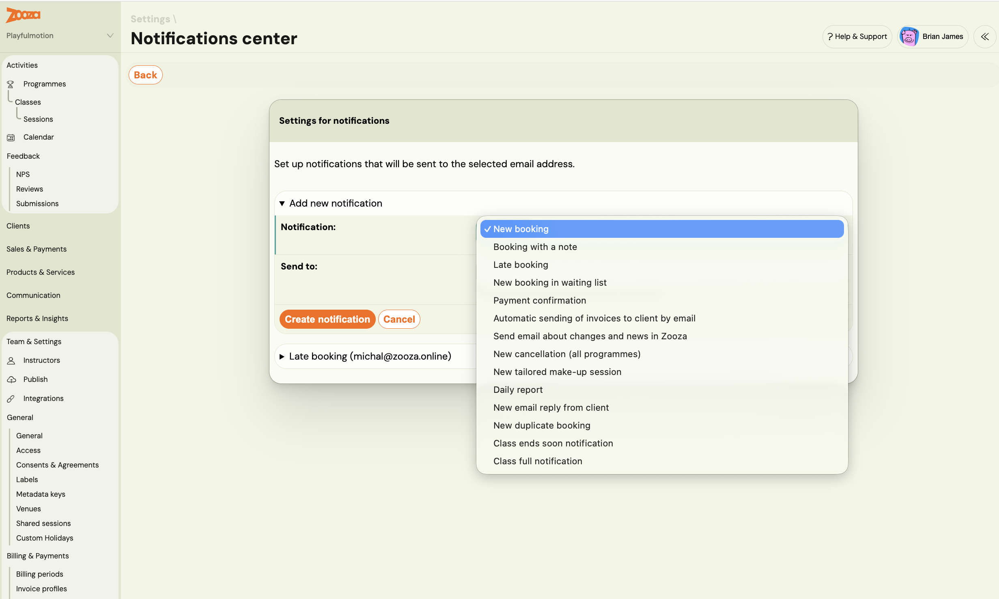

# Notifications Center

The Notification Center is used to notify you as an administrator or your colleagues.

## What you can be notified about

| Notification | Sent when |
|---|---|
| **New booking** | Someone books |
| **Booking with a note** | Someone books and leaves a note — useful if you act on notes |
| **Late booking** | Someone books after the class has started |
| **New booking in waiting list** | Someone joins a waiting list |
| **Payment confirmation** | A payment arrives |
| **Automatic sending of invoices to client by email** | An invoice goes out to the client |
| **Send email about changes and news in Zooza** | Zooza ships an update |
| **New cancellation (all programmes)** | A booking is cancelled |
| **New tailored make-up session** | A client requests a tailored make-up session |
| **Daily report** | A once-a-day summary of your account |
| **New email reply from client** | A client replies to one of your Zooza emails |
| **New duplicate booking** | The system spots what looks like a duplicate |
| **Class ends soon notification** | A class is approaching its end date — your cue to open the next term |
| **Class full notification** | A class reaches its capacity |

That is the whole list, in the order the dropdown shows it. The wording follows your interface language.

> **Yes, there is a "class is full" notification.** It is called **Class full notification** and sits at the very bottom of the dropdown, which is why people miss it and conclude it does not exist.

> **And yes, you can be told when a client writes back.** The type is **New email
> reply from client**. Replies to your Zooza emails land in the app rather than in
> your mailbox, so without this notification nothing announces them — which is why
> people conclude the alert does not exist. It does; it is one row in the same list.
> Where the replies themselves live: [Where do replies to Zooza emails go?](../faq/email-communication-faq.md#where-do-replies-to-zooza-emails-go).

## Set up notifications

1. Go to **Settings → Notification center** and open **Add new notification**
 
 
2. Pick the type in **Notification**, and put the address in **Send to**
3. Click **Create notification**
 

Note: Only one email address can be entered per notification. For the next email you need to create a new notification.
