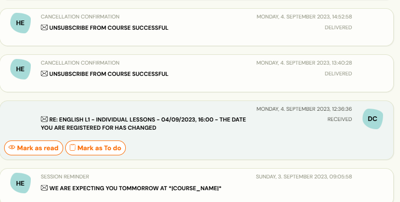
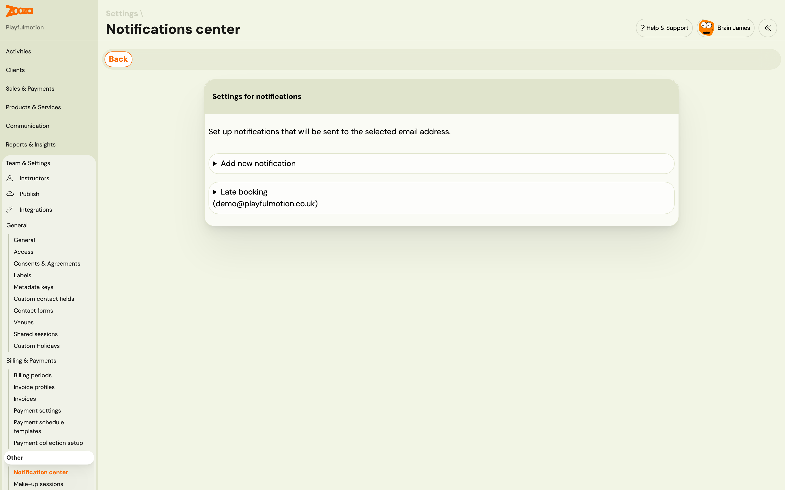
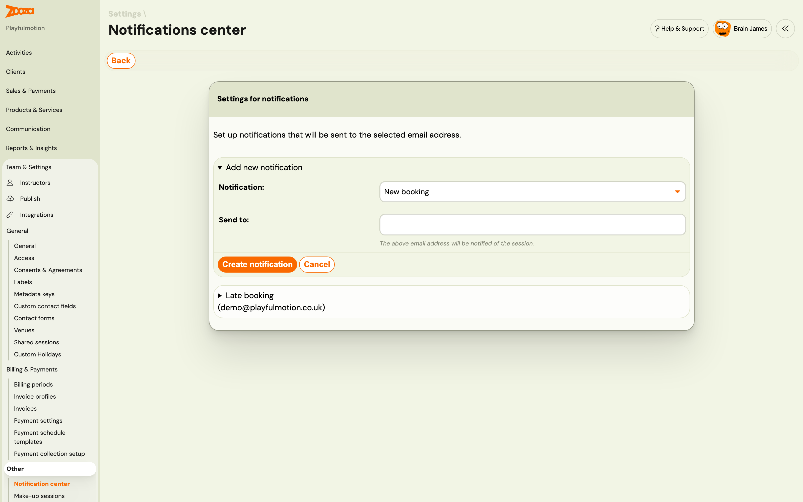

# Notifications Center

The Notification Center is used to notify you as an administrator or your colleagues.

## What you can be notified about

| Notification | Sent when |
|---|---|
| **New registration** | Someone books |
| **New registration with a note** | Someone books and leaves a note — useful if you act on notes |
| **Late registration** | Someone books after the class has started |
| **Waiting list registration** | Someone joins a waiting list |
| **Online payment** | A card or gateway payment arrives |
| **New invoice** | An invoice is generated |
| **New cancellation** | A booking is cancelled |
| **New custom replacement** | A client requests a tailored make-up session |
| **Duplicate registration** | The system spots what looks like a duplicate |
| **Class is filling up / full** | A class reaches its capacity |
| **Class ends soon** | A class is approaching its end date — your cue to open the next term |
| **New reply** | A client replies to a message |
| **New release** | Zooza ships an update |
| **Daily dashboard** | A once-a-day summary of your account |

The exact wording depends on your interface language, but every type above exists in the list.

> **Yes, there is a "class is full" notification.** It is easy to miss in a long dropdown, so if you have been told otherwise, scroll the list — it is there.

## Set up notifications

1. In the *Settings* category, click *Notifications* and click on *Add new notification
 
 
2. Select the type of notification from the list and type the email you want it to be sent to
3. Confirm your choice by clicking the  *Create Notification* button
 

Note: Only one email address can be entered per notification. For the next email you need to create a new notification.
