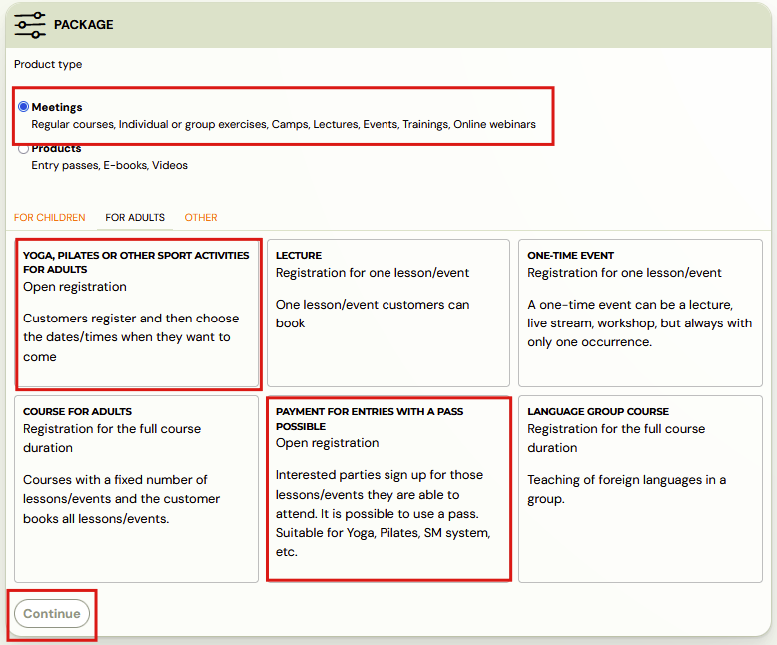
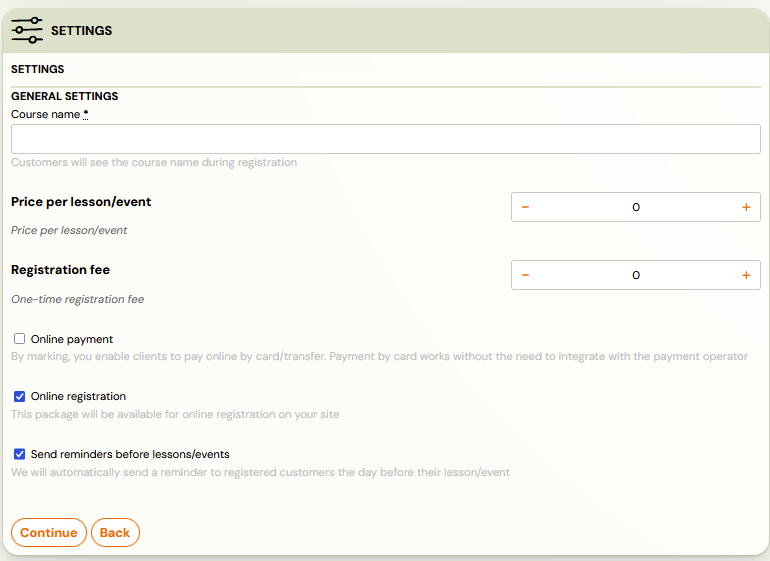
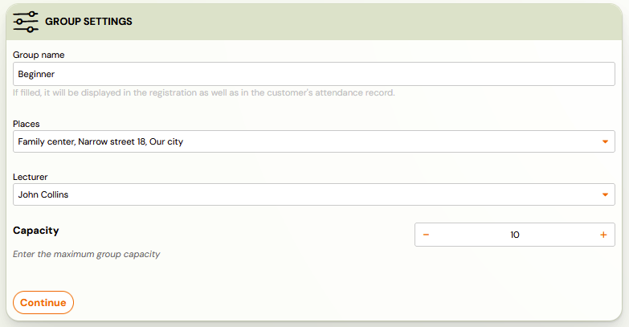
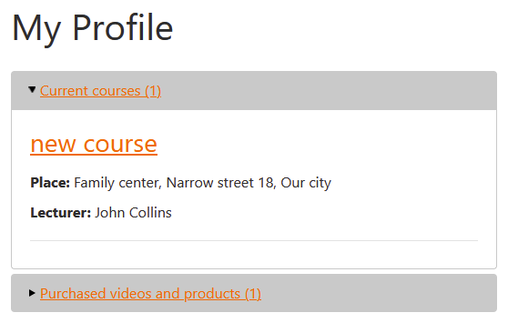
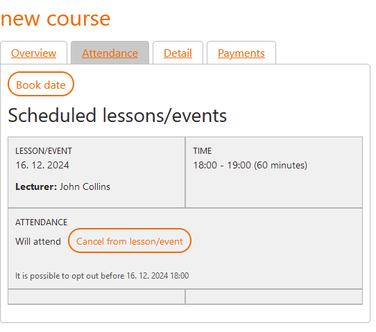
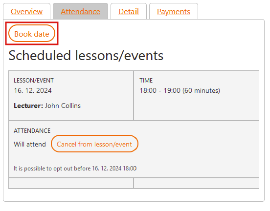
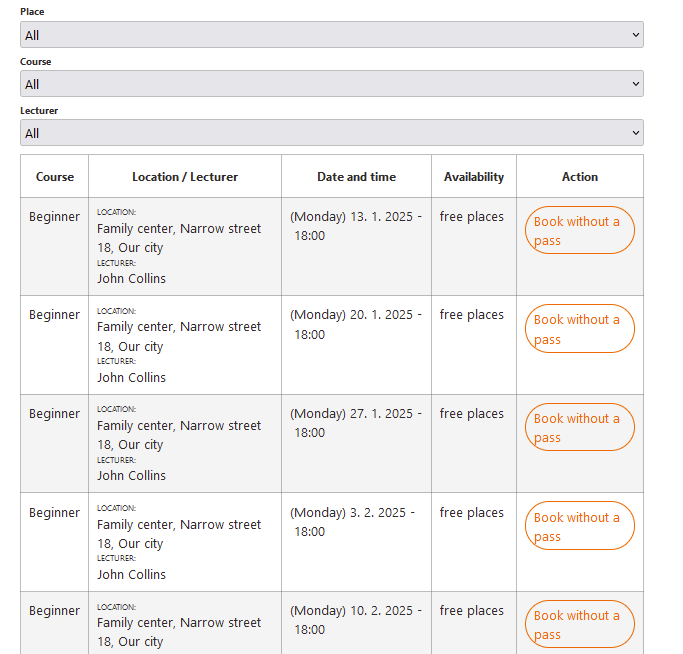
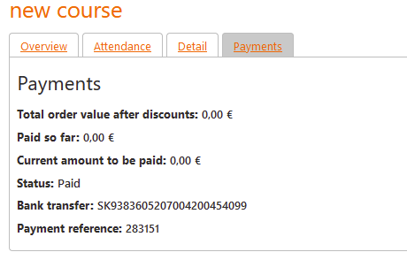

# Open programme creation

When you create a programme, you have the option to specify what type of booking it is for – *Single Session Booking, Full Term Booking*, or *Open Booking*.

## How and when to use open bookings?

Open classes are for programmes that last for a longer period of time,
but you want to give clients the opportunity to choose and pay only for
the term they attend.
This means that the client registers for the
programme as such, but for each term he wants to attend he registers
individually within his profile, in the attendance register.

You could say that this type of booking is like a season pass.
You can choose what type of payment you add to this type of
booking. It works really well with a [Season ticket / Entry pass](https://www.zooza.online/support/creating-vouchers/), but you can also add [Payment template](https://www.zooza.online/support/creating-payment-templates/) after a certain number of terms.

This type of booking is especially suitable for exercises that
are not conducted as regular workouts, but as leisure exercises.

Example: you run a Pilates programme that runs from September to
December, but it is up to the client which dates they attend within that
 period. Then, after signing up for the appointment, the client is
created an obligation for payment according to your assignment.

## Create open programme

To create an open booking, do the following:

- In the *Programmes* tab, click on *Create a programme*
- Select *Offer Type – Meetings* and then the *Adult offer

*

- After clicking *Continue,* enter all the basic details and click *Continue* again.

- Then create the class(s) according to your wishes by clicking the *Add* button and fill in the required data for the class. You can create multiple classes at once. Click *Continue* again to go to the next step.

- Fill the class with dates according to your wishes, if you can determine
 them right away. Classes need to be filled with terms individually. If
you don’t want to create dates, the class will be created as the [group – Interested](https://www.zooza.online/support/what-is-a-collection-basket/) and you can add dates afterwards.

- Detailed instructions on how to create terms can be found [here](https://support.zooza.online/portal/en/kb/articles/creating-events-in-groups)

Note: The set price for the programme is then added up as
the price for one term. So if you set a price of 20 euros per programme, it
 means that one term of the programme will cost 20 euros.

## How does the client manage attendance in their profile?

With this type of booking, the client manages his/her attendance in
 his/her profile. This means that he chooses the actual dates he wants
to attend within his profile.The client accesses their profile by
signing in via your website. He will then be shown a list of the programmes
 for which he has registered.

1. After clicking on the selected programme, the client will be presented with
 a list of dates for which he/she is already registered or has already
attended or unregistered (if he/she has not attended or has not
registered for any terms, this list will be displayed as empty).

<!-- TODO: missing screenshot open-programme-creation-10.png -->

1. To sign up for a new session, the client must click on the *Book date* button*.
 
 *

1. The client is then presented with a list of appointments, where they can
 also see their current availability and the option to sign up for it.
 
2. When the *sign in button* is clicked, the selected appointment
will be displayed in his attendance and a payment instruction will be
automatically generated. The client can find the payment details and its
 status in the *Payments *tab within their profile.
 

<!-- TODO: missing screenshot open-programme-creation-15.png -->

Note: The client is also automatically informed of each appointment selection by a notification email.

The client also has the option to unsubscribe from the appointment by clicking the *Sign Out button* within his/her attendance. The organizer has the possibility to make
this setting for the client. By opting out of the term, the client’s
obligation to pay is cancelled, in other words, the debt is reset to
zero.
