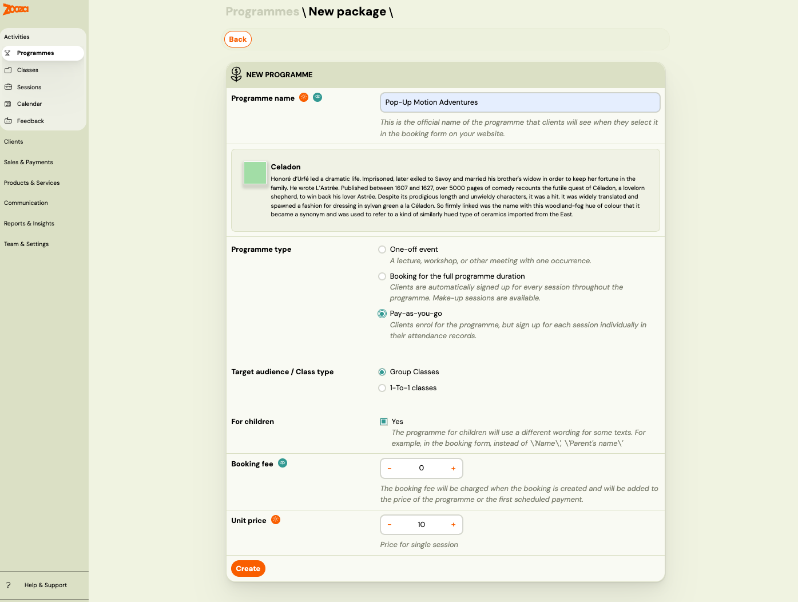
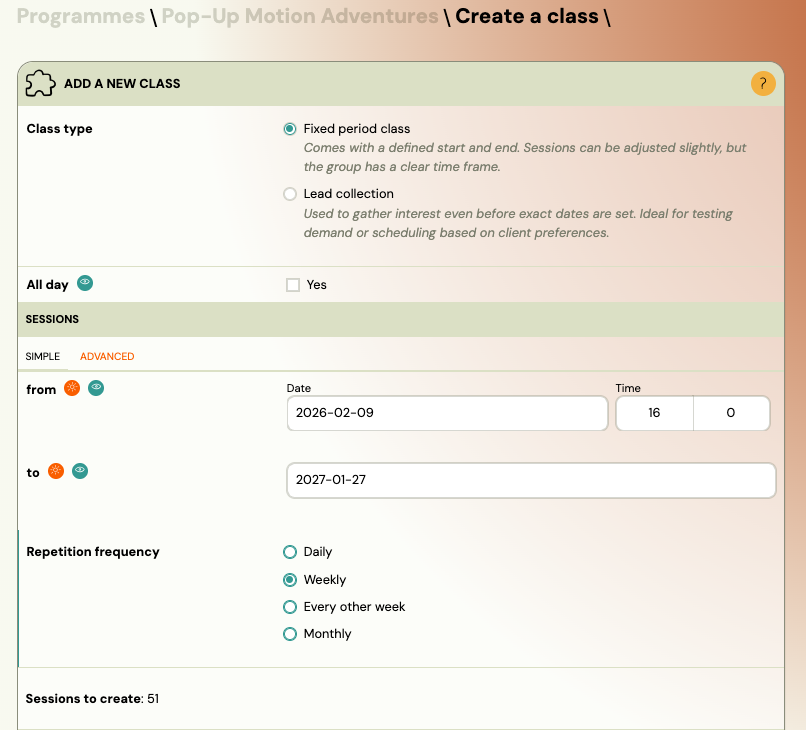
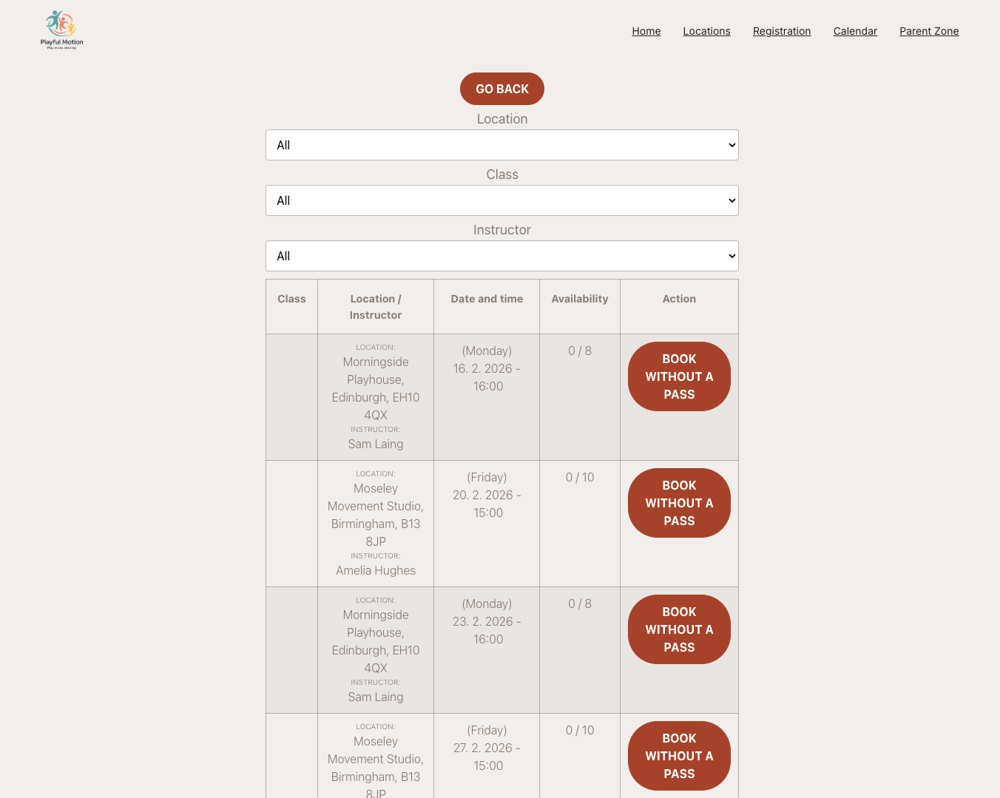
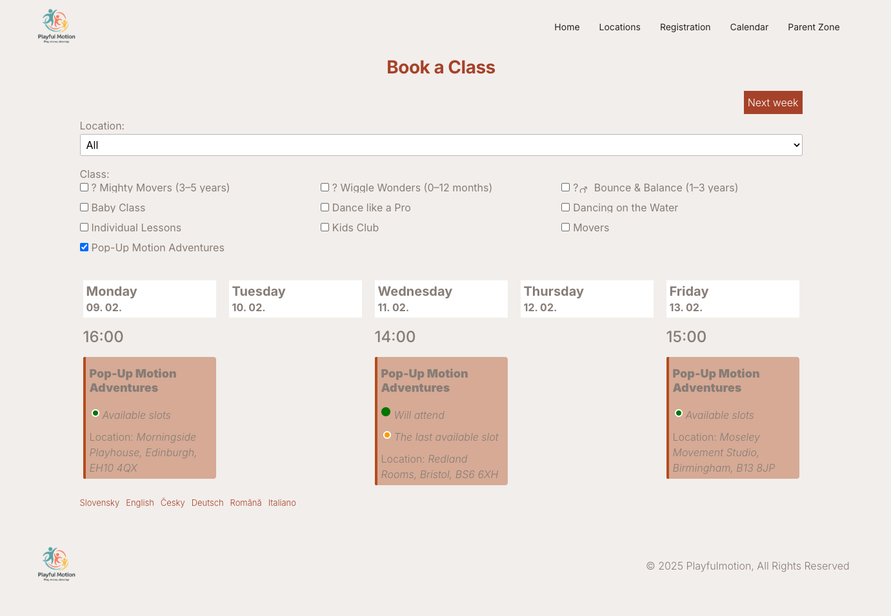

# Pay-as-you-go programme

A Pay-as-you-go programme is a membership-style programme where clients register once and then pick individual sessions at their own pace. Clients only pay for the sessions they attend.

## What is a Pay-as-you-go programme?

Unlike ongoing programmes (where clients commit to all sessions upfront), a Pay-as-you-go programme works like a flexible membership:

1. The client registers for the programme once.
2. From their profile, they choose which sessions to attend.
3. A payment obligation is created for each session they book.
4. If the client cancels a session, the debt is reset to zero.

This model is ideal for studios and providers that offer multiple class types (e.g. yoga, pilates, kickbox) where clients want the freedom to mix and match sessions without a fixed commitment.

## When to use it

Use a Pay-as-you-go programme when:

- You run leisure or fitness classes with no fixed term.
- Clients should be able to choose which sessions to attend.
- You want to charge per session rather than for the full programme.
- You offer multiple class types or schedules that clients can pick from.

## Step-by-step: Create a Pay-as-you-go programme

1. Go to **Programmes** → **New Programme**.
2. Select **Programme type**: **Pay-as-you-go**.
3. Choose **Class** or **Individual**.
4. Choose **Children** or **Adults**.
5. Set the **Admin fee** (optional one-time booking fee charged at booking).
6. Set the **Unit price** (standard price per session).
7. Click **Create**.

The unit price is the amount charged each time a client books a session. For example, if you set a unit price of 20 EUR, each session the client attends costs 20 EUR.

## Step-by-step: Create classes within the programme

After creating the programme, add one or more classes.

### One class vs multiple classes

- **One class** — Use when all sessions share the same theme, instructor, and venue.
- **Multiple classes** — Use when you offer different themes (e.g. Monday Yoga, Wednesday Pilates), different locations, or different instructors.

If you want clients to pick sessions across multiple classes, use [linked classes](linked-classes.md) to connect them.

### Create a class

1. Click **Add** to create a new class.
2. Fill in the class details: name, venue, instructor, capacity.
3. Optionally set a **custom unit price** for this class (overrides the programme-level price).
4. Click **Continue**.

### Add sessions

Create as many sessions ahead as possible so clients have a full schedule to choose from.

1. In the class, click **Add sessions**.
2. Fill in the dates, times, and any session-specific details.
3. Click **Save**.

If you do not add sessions right away, the class is created as a [lead collection class](lead-collection.md) (class without dates). You can add sessions later.

## How clients use it

Once a client registers for a Pay-as-you-go programme, they manage their attendance from their profile.

### Booking sessions

1. The client logs in to their profile on your website.
2. They see the programme they are registered for.
3. They click **Book date** to see available sessions.
4. They select the sessions they want to attend.
5. A payment obligation is created automatically for each booked session.

Clients can also book sessions through the calendar widget on your website.

### Cancelling a session

The client can unregister from a session by clicking **Cancel session** in their attendance list. When they cancel:

- The session is removed from their attendance.
- The payment obligation for that session is cancelled (debt reset to zero).

The client receives a notification email for each session they book or unbook.

## Attendance settings

Pay-as-you-go programmes have two additional attendance settings:

- **Require a valid entry pass** — When enabled, clients must have a valid [entry pass](creating-entry-passes.md) to book a session. Without a valid pass, they cannot register for sessions.
- **Redeem if unpaid** — When enabled, entry passes can be used even if the pass order has not been paid yet.

These settings are optional. Without entry passes, clients simply pay per session at the unit price.

## Related guides

- [Creating entry passes](creating-entry-passes.md) — Set up prepaid visit passes or credit for sessions.
- [Linked classes](linked-classes.md) — Let clients pick sessions across multiple classes.
- [Programme settings](programme-settings.md) — Configure all programme-level settings.
- [Pay-as-you-go FAQ](../faq/pay-as-you-go-faq.md) — Common questions about this programme type.
