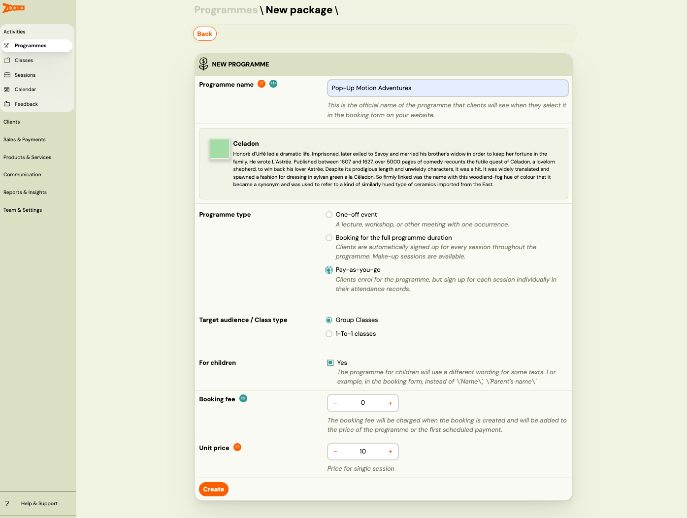
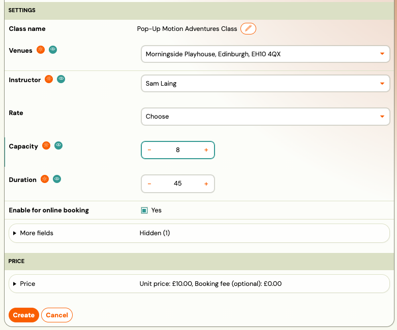
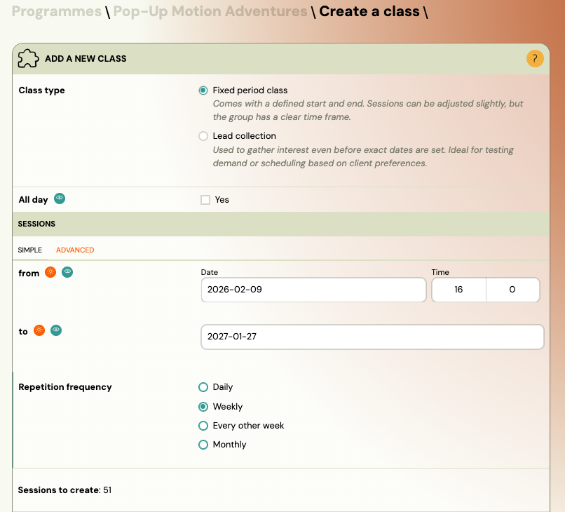
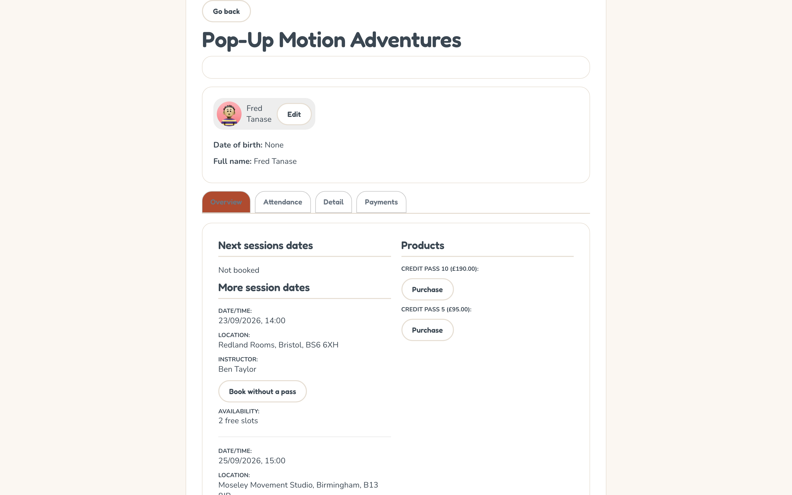
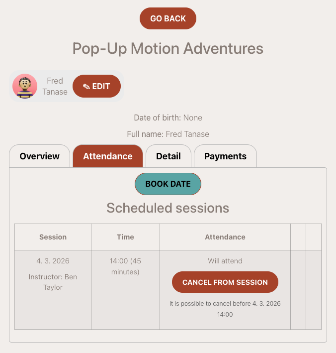
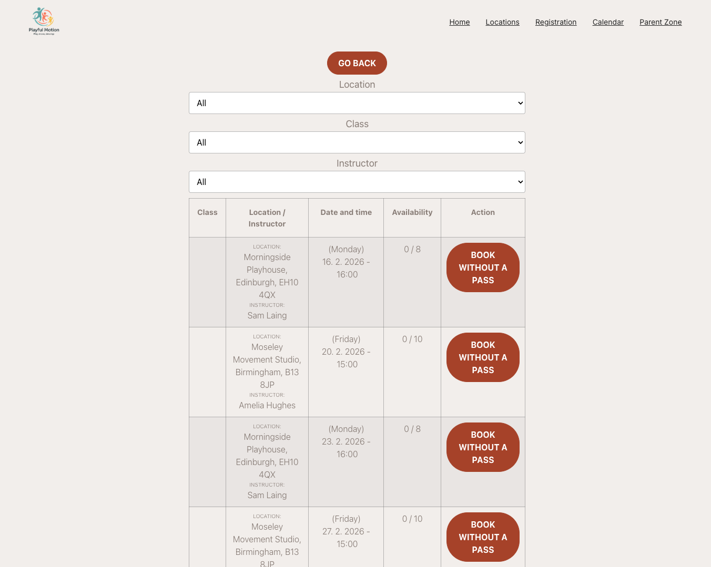
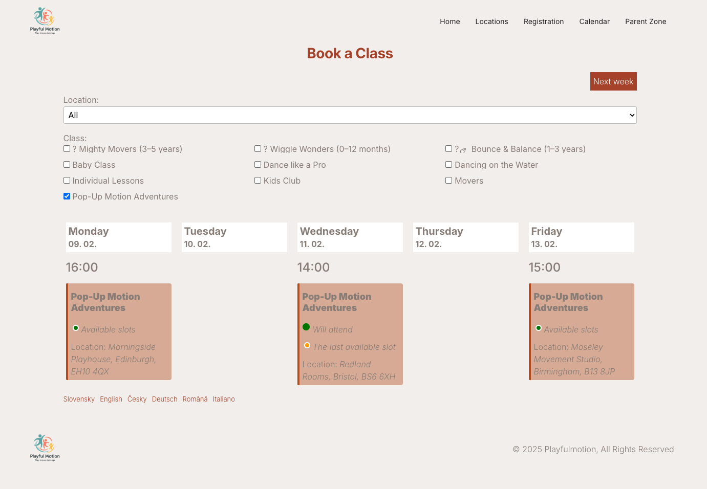
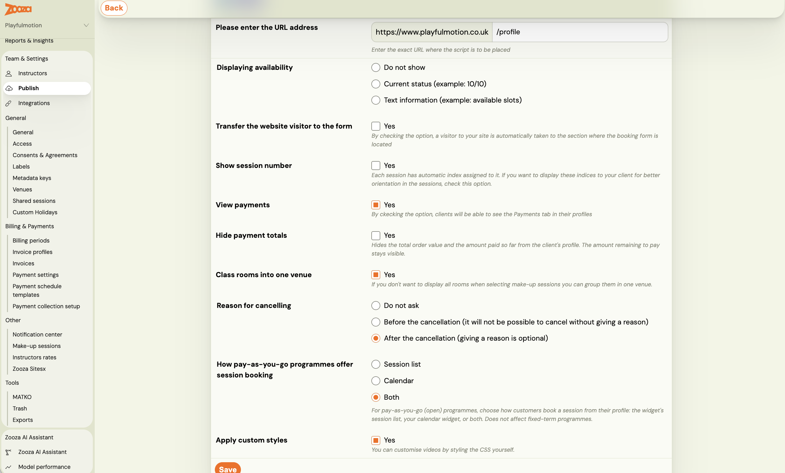

# Pay-as-you-go programme

A Pay-as-you-go programme is a membership-style programme where clients register once and then pick individual sessions at their own pace. Clients only pay for the sessions they attend.

## What is a Pay-as-you-go programme?

Unlike ongoing programmes (where clients commit to all sessions upfront), a Pay-as-you-go programme works like a flexible membership:

1. The client enrols for the programme once.
2. From their profile, they choose which sessions to attend.
3. A payment obligation is created for each session they book.
4. If the client cancels a session, the debt is reset to zero.

This model is ideal for studios and providers that offer multiple class types (e.g. yoga, pilates, kickbox) where clients want the freedom to mix and match sessions without a fixed commitment.

## When to use it

Use a Pay-as-you-go programme when:

- You run leisure or fitness classes with no fixed term.
- Clients should be able to choose which sessions to attend.
- You want to charge per session rather than for the full programme.
- You offer multiple class types or schedules that clients can pick from.

## Step-by-step: Create a Pay-as-you-go programme

1. Go to **Programmes** → **New Programme**.
2. Select **Programme type**: **Pay-as-you-go**.
3. Choose **Class** or **Individual**.
4. Choose **Children** or **Adults**.
5. Set the **Admin fee** (optional one-time booking fee charged at booking).
6. Set the **Unit price** (standard price per session).
7. Click **Create**.

The unit price is the amount charged each time a client books a session. For example, if you set a unit price of 20 EUR, each session the client attends costs 20 EUR.

## Step-by-step: Create classes within the programme

After creating the programme, add one or more classes.

### One class vs multiple classes

- **One class** — Use when all sessions share the same theme, instructor, and venue.
- **Multiple classes** — Use when you offer different themes (e.g. Monday Yoga, Wednesday Pilates), different locations, or different instructors.

If you want clients to pick sessions across multiple classes, use [linked classes](linked-classes.md) to connect them.

### Create a class

1. Click **Add** to create a new class.
2. Fill in the class details: name, venue, instructor, capacity.
3. Optionally set a **custom unit price** for this class (overrides the programme-level price).
4. Click **Continue**.

### Add sessions

Create as many sessions ahead as possible so clients have a full schedule to choose from.

1. In the class, click **Add sessions**.
2. Fill in the dates, times, and any session-specific details.
3. Click **Save**.

If you do not add sessions right away, the class is created as a [lead collection class](lead-collection.md) (class without sessions). You can add sessions later.

## How clients use it

Once a client enrols for a Pay-as-you-go programme, they manage their attendance from their profile.

### Booking sessions

1. The client logs in to their profile on your website.
2. They see the programme they are enroled for.
3. They click **Book date** to see available sessions.
4. They select the sessions they want to attend.
5. A payment obligation is created automatically for each booked session.

Clients can also book sessions through the calendar widget on your website.

### Choose which of those two routes parents get

Until September 2026 every client saw both buttons — **Book session**, which opens the
widget's own session list, and **Go to calendar**, which sends them to your calendar
widget. That is wrong in both directions: a company that never published a calendar was
offering a button leading nowhere, and a company that runs all its booking through the
calendar was offering a second, competing route.

You now choose. Go to **Settings → Publish**, open your **profile widget** and find
**How pay-as-you-go programmes offer session booking**:

| Setting | What the parent gets |
|---|---|
| **Session list** | Only **Book session** — the widget's own picker |
| **Calendar** | Only **Go to calendar** — your calendar widget |
| **Both** | Both buttons, which is the default and how it behaved before |

**If parents find the booking journey confusing, start here.** Two buttons that lead to
two different screens is the most common reason a pay-as-you-go journey feels harder than
it is. Pick the one route you actually support and take the other away.

The setting only affects pay-as-you-go programmes. Fixed-term programmes are untouched.

### Cancelling a session

The client can unregister from a session by clicking **Cancel session** in their attendance list. When they cancel:

- The session is removed from their attendance.
- The payment obligation for that session is cancelled (debt reset to zero).

The client receives a notification email for each session they book or unbook.

If you cancel a session as an admin from the Calendar, all clients who were marked as attending receive a credit automatically — no manual action needed. See [Session payment adjustments](session-payment-adjustments.md).

## Attendance settings

Pay-as-you-go programmes have two additional attendance settings:

- **How clients pay for sessions** — the pass policy for this programme. Four choices, described below.
- **Redeem if unpaid** — When enabled, entry passes can be used even if the pass order has not been paid yet. Useful when clients pay by bank transfer and confirmation takes days.

### How clients pay for sessions

Since 25 September 2026 the old **Require a valid entry pass** switch is gone. It could only say "passes required" or "passes not required"; what providers actually needed was to say *never use a pass* or *let the client decide*. It is replaced by a four-way choice on the **Attendance** settings card:

| Choice | What a client gets when they book |
|---|---|
| **Use entry pass first, then payment** | Passes are spent while they last; once they run out, each session is paid. |
| **Entry pass only** | A session can be booked only with a valid pass. Without one, booking is refused. |
| **Payment only** | Every session is paid. Passes are never used, even if the client holds some. |
| **Client chooses each time** | The client decides per session whether to spend a pass or pay. |

Two things to know:

- **It governs clients booking themselves online.** When you add somebody from the attendance screen, Zooza still asks whether to use their pass — that choice stays with you, deliberately.
- **Existing programmes were converted automatically**, so your previous "required / not required" setting carries over. Open the card and check it reads what you intend, because two of the four options did not exist before.

Without entry passes at all, clients simply pay per session at the unit price.

## Related guides

- [Creating entry passes](creating-entry-passes.md) — Set up prepaid visit passes or credit for sessions.
- [Linked classes](linked-classes.md) — Let clients pick sessions across multiple classes.
- [Programme settings](programme-settings.md) — Configure all programme-level settings.
- [Pay-as-you-go FAQ](../faq/pay-as-you-go-faq.md) — Common questions about this programme type.
