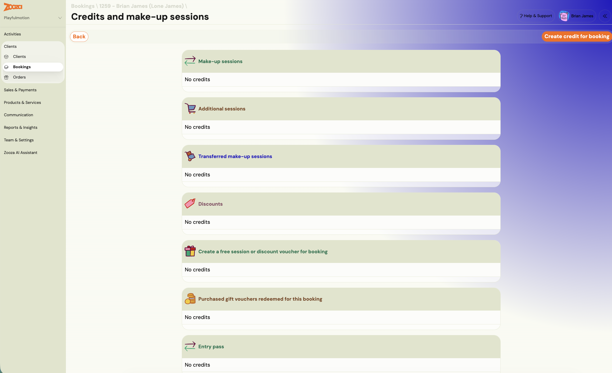

# Payment Correction vs Refund Guide

Zooza provides two ways to adjust a payment on a booking: **Edit payment** (correction) and **Refund**. Choosing the wrong action creates phantom transactions in your financial reports. This guide explains when to use each option and walks you through the steps.

## Quick decision table

| Scenario | Recommended action | Why |
|---|---|---|
| Wrong amount was recorded manually | Edit payment | Corrects the record in place; no extra transaction |
| Payment assigned to wrong booking | Edit payment | Removes the incorrect record without creating a refund line |
| Double-counted payment after copying bookings | Edit payment | The duplicate entry is a data error, not a real transaction |
| Client wants money back (full or partial) | Refund | An actual return of funds that must appear in reports |
| Moving a payment between bookings | Debt correction | No money is leaving your account; adjust the debt instead |
| Manually entered payment needs to be zeroed out | Edit payment | A refund on a manual entry creates a phantom transaction |

## When to use Edit payment (correction)

Use **Edit payment** whenever the underlying transaction data is wrong and no money needs to be returned to the client. Common examples:

- You manually entered an incorrect amount.
- A payment was auto-assigned to a booking it does not belong to.
- A block was double-counted during a registration copy, inflating the paid amount.
- You need to zero out a manual entry that should never have existed.

Editing a payment changes the existing record. It does not create a new transaction line, so your financial reports remain clean.

### How to edit a payment

1. Go to **Bookings** and open the relevant booking.
2. Navigate to the **Payments** tab.
3. In the transaction list, find the payment you need to correct.
4. Click **More** (three-dot menu) next to the transaction.
5. Select **Edit payment**.
6. Change the amount, date, or method as needed. To zero it out, set the amount to 0.
7. Save the change.

<!-- REVIEW: Confirm the exact UI label is "Edit payment" and not "Edit" or "Correct payment" in current builds. Support tickets reference "opravit uhradu" (edit payment) accessed via More menu. -->

> **Tip:** You cannot edit an already-edited payment (you cannot correct a correction). If you need to make a further adjustment, add a new manual payment instead and note the reason in the payment comment.

## When to use Refund

Use **Refund** only when you are genuinely returning money to the client. This action creates a new refund transaction that appears in your financial reports.

Common examples:

- Client cancels and is entitled to a full or partial refund.
- Client overpaid via online payment and the excess needs to be returned.
- Contract terminated early and a prorated refund is due.

### How to issue a refund

1. Go to **Bookings** and open the relevant booking.
2. Navigate to the **Payments** tab.
3. Select the original transaction.
4. Click **Refund**.
5. Choose **Full refund** or enter a **Partial refund** amount.
6. Confirm.

If the original payment was made via Stripe, the refund is processed automatically through Stripe. For bank-transfer payments, the refund is recorded in Zooza but you must return the money manually from your bank account.

<!-- REVIEW: Verify whether GoCardless payments can also be auto-refunded through Zooza or require manual bank action. -->

## The client overpaid and is not getting the money back

A common case, and neither Edit payment nor a plain refund covers it on its own: a
client pays 170 € for a course that costs 80 €, and rather than returning the
difference you want to keep it for their next course.

Do it in two steps. The refund settles the books; the credit holds the money.

1. **Record a refund on the booking** for the overpaid amount. In the note, write
   that the money is not actually being returned — you are converting it into a
   credit. This moves the booking from **Overpaid** to **Paid**.
2. **Create a discount credit** on the same booking. Open **Credits and make-up
   sessions**, click **Create credit for booking**, and create it under **Discounts**
   for the amount the client still has with you. Set the expiry generously — a year is
   sensible — so they have time to use it.

The client then sees the credit and its discount code in their
[client profile](../faq/client-profile-faq.md), and it applies at their next booking.

> **Why the refund step is not optional.** Without it the booking stays Overpaid,
> and an overpaid booking distorts every payment report and every outstanding-amount
> figure it appears in. The note is what stops the refund line being read later as
> money that left your bank account.

> **This is not a make-up credit and not an entry pass.** A discount credit reduces
> what the client owes next time. See
> [Discount codes](discount-code.md) for how it reaches them.

## A duplicate booking was deleted and the debt did not change

A parent books the same child twice, you delete one of the bookings, and the amount
owed is still doubled.

**Deleting a booking does not recalculate what is owed on the other one.** The two
bookings each carried their own debt; removing one removes its own, and leaves the
survivor exactly as it was. If the doubled figure is on a single booking, deleting
anything will not touch it at all.

Correct the amount instead:

1. Open the booking that is still active.
2. In the **Payment plan**, open the instalment carrying the wrong amount.
3. Adjust it down to what the client actually owes — see
   [Session payment adjustments](session-payment-adjustments.md#adjust-a-single-scheduled-payment-manually).

If money has already been received against the duplicate, do not delete that booking
at all until the payment is moved — see debt correction below.

> **Delete only bookings that should never have existed.** A duplicate created by a
> parent in one sitting qualifies. A booking with payments on it does not: deleting
> it takes real money out of your reporting.

## When to use debt correction (moving payments between bookings)

If a client's payment needs to be reassigned from one booking to another, do not use Refund. A refund implies money left your account, which distorts your reports.

Instead, use a **debt correction**:

1. On the original booking, reduce the outstanding debt to reflect that the payment is being moved.
2. On the target booking, adjust the debt to account for the incoming amount.

This approach keeps your transaction history accurate because no money actually changed hands between you and the client.

<!-- REVIEW: Document the exact UI steps for debt correction. Support replies mention "korekcia dlhu" (debt correction) as the preferred method but exact navigation path needs confirmation. -->

## Why this matters for financial reports

Every refund transaction, whether real or accidental, appears as a separate line item in your payment reports. If you use Refund to zero out a manual entry instead of Edit payment, your reports will show:

1. The original (incorrect) payment as income.
2. The refund as money returned.

Both lines inflate your transaction volume and create misleading totals. Over time, these phantom transactions make it difficult to reconcile your books.

**Rule of thumb:** If no money is leaving your bank account, do not use Refund.

## Decision flowchart

Follow these questions in order:

1. **Is the client getting money back?**
   - Yes -- use **Refund** (full or partial).
   - No -- continue to step 2.
2. **Is the payment record itself wrong (wrong amount, wrong booking, should not exist)?**
   - Yes -- use **Edit payment** to correct or zero it out.
   - No -- continue to step 3.
3. **Do you need to move the payment to a different booking?**
   - Yes -- use **Debt correction** on both bookings.
   - No -- the payment is likely correct. No action needed.

## Common mistakes to avoid

- **Using Refund to zero out a test or manual entry.** This creates a phantom refund in reports. Use Edit payment instead.
- **Using Refund to move a payment between bookings.** This creates both a phantom refund and a new manual payment. Use debt correction instead.
- **Trying to edit an already-edited payment.** The system does not allow editing a correction. Add a new manual payment with a note explaining the adjustment.

## Related resources

- [Payments and Billing FAQ](../faq/payments-and-billing-faq.md) -- includes a short version of the correction vs refund guidance.
- [Payment Pairing for Bank Transfers & Direct Debit](payment-pairing.md) -- covers how payments are matched to bookings.
- [Edit Payment on a Booking](edit-payment-on-booking.md) -- detailed guide on modifying payment records.
