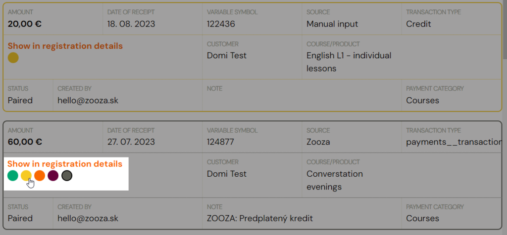

# Labels/drawers for selected payments

The payment drawers act as a colour-coded marker for individual payments. They are mainly used for the selection and subsequent display of specific payments.

In the *Payments Received *section, simply click on the colour of the payment.

You can select the same colour-coded payments by setting the filter also in the *Payments Received* section and clicking on the *Search *button.

