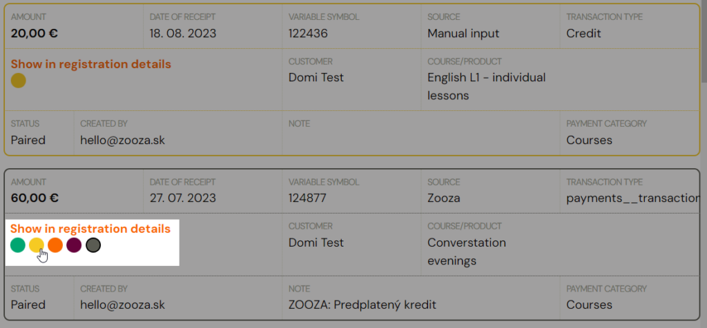
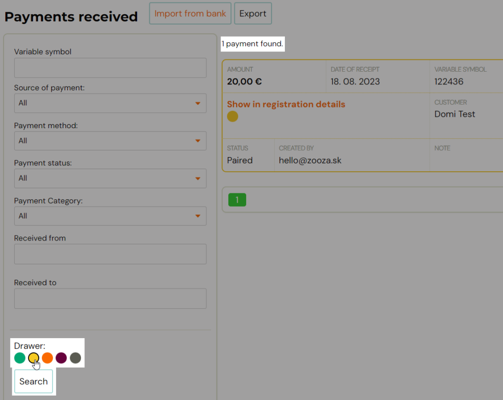

# Labels/drawers for selected payments

The payment drawers act as a colour-coded marker for individual payments. They are mainly used for the selection and subsequent display of specific payments.

In **Payments → Transactions**, simply click on the colour of the payment.

You can select the same colour-coded payments by setting the filter in **Payments → Transactions** and clicking **Search**.

