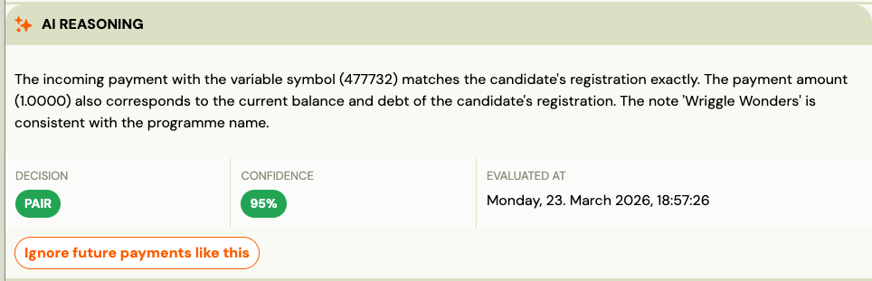

# Payment Pairing for Bank Transfers & Direct Debit

Every booking in Zooza automatically creates an expected amount to pay based on your programme or class settings. Payments can then be paired with that booking in one of four ways:

- Manually (cash or bank transfer)
- Automatically via bank integrations
- Bulk import via CSV file
- Automatically via GoCardless (recommended)

## Manual payment pairing

Manual pairing is useful if you accept cash, occasional bank transfers, or need to correct a payment.

1. The amount due is created automatically when the booking is created.
2. If you receive a payment (cash or bank transfer), open the booking and click Add payment.
3. Enter the payment details (amount, date, method).
4. Alternatively, use *View Payments* to apply discounts, correct amounts, create instalment plans (payment templates), or issue refunds.

## Automatic payment pairing (bank transfers)

Zooza can automatically match incoming bank transfers to bookings, so you do not need to pair them manually.

Important: Automatic pairing depends on how your bank provides transaction data. The exact method may vary by country.

## How automatic pairing works

1. Bank account identification (IBAN)
 Zooza identifies which account received the payment using the IBAN.
 The IBAN must be set either in General Settings or directly on the programme.
2. Booking identification (Payment Reference)
 Zooza matches the payment to a booking using the payment reference.
 In some countries this is called a *Variable Symbol*; internationally, it is simply the *Payment Reference* sent with the bank transfer.
3. Amount and status check
 Payments are automatically applied only if:
 The booking is in Unpaid status
4. The payment amount matches the expected amount due

If all conditions are met, the payment is automatically paired with the booking. If not, the payment remains unassigned and can be paired manually in *Payments – Received payments*.

### Bulk upload via CSV file

If your bank does not support live integrations, you can import payments in bulk.

- Export a transaction list from your online banking
- Upload the CSV file into Zooza
- Transactions are matched using the payment reference / booking number

If a payment is not matched due to an incorrect or missing reference, you can reassign it manually.

See the detailed step-by-step guide in the [documentation](https://support.zooza.online/portal/sk/kb/articles/parovanie-platieb-cez-csv-subor).

### Automatic pairing via bank email notifications

Some banks can send transaction notifications by email.

In this setup, your bank emails Zooza about account movements, and Zooza processes those emails automatically.

- The notification must contain the correct bank account (IBAN)
- The payment reference must match a booking

Only payments that meet these conditions are stored and processed. All other notifications are ignored.

Note: Not all banks support reliable email notifications. Please check with your bank before using this method.

Setup instructions are available in the [documentation](https://support.zooza.online/portal/sk/kb/articles/parovanie-platieb-cez-emailovu-notifikaciu).

### Automatic pairing via GoCardless (recommended)

GoCardless is the recommended way to automate payment pairing internationally.

- Connect one or more bank accounts via GoCardless
- Supported banks depend on your country
- No CSV files or email parsing required

Zooza syncs payments from GoCardless automatically twice per day. This means there may be a short delay between the client paying and the booking being marked as Paid.

This method is ideal for franchises and international businesses using Direct Debit as their primary payment method.

See setup instructions in the [documentation](https://support.zooza.online/portal/sk/kb/articles/fakturacia).

## Frequently Asked Questions

### What is a payment reference?

A payment reference is the text or number sent with a bank transfer to identify what the payment is for. In some countries this is called a variable symbol.

### What happens if a client forgets the payment reference?

The payment will not be paired automatically. You can manually assign it from *Payments – Received payments*.

### Do I need GoCardless if I already use bank transfers?

No, but GoCardless provides the most reliable and low-maintenance automation, especially for international and multi-account setups.

### Can I use multiple bank accounts?

Yes. This is fully supported when using GoCardless.

### Why was a payment not paired even though automatic pairing is enabled?

This situation usually occurs when you have enabled the setting “Automatically pair payments only for unpaid bookings”.

Zooza > Settings > Payments

In this mode, Zooza pairs payments only if a booking already has an outstanding balance at the moment the payment is received.

Typical scenarios include:

- Early payment: The client pays *before* any amount is due (for example, after receiving a notification about an upcoming instalment). The payment is imported into Zooza, but it is not paired because no debt existed at that time.
- Overpayment: The client pays a higher amount than the current outstanding balance. In this case, the payment is also not paired automatically.

In these situations, Zooza does not attempt to re-pair the payment automatically later — even if a debt is created afterwards or the amount due changes.

You can always check the exact reason why a payment was not paired directly in the payment detail, in the field “Pairing process summary”.

Solution: Such payments can be safely paired manually to the correct booking, typically using the *payment reference*.
