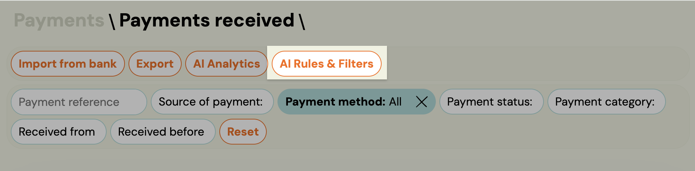
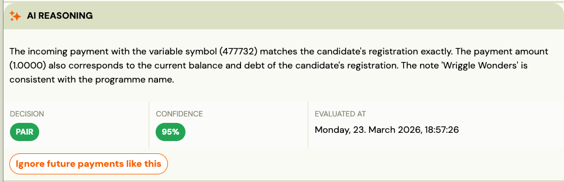
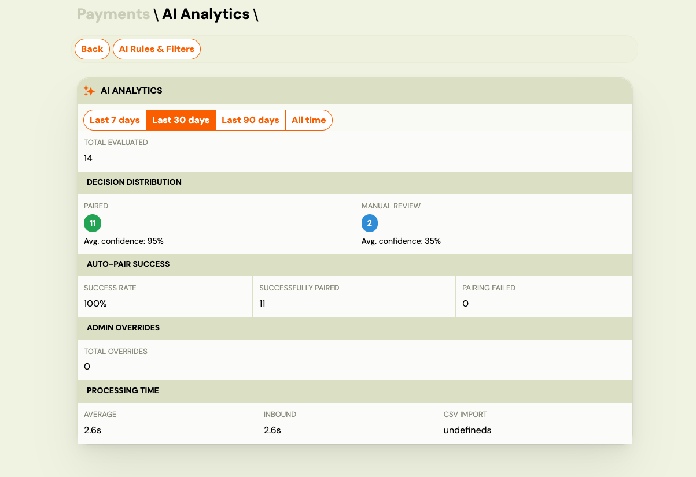
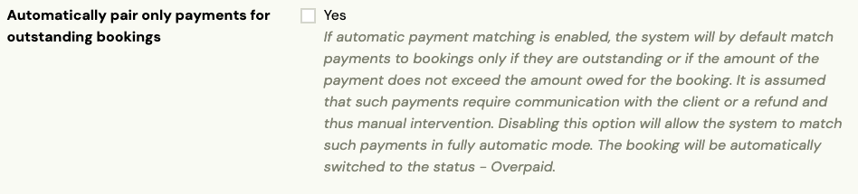

# Payment Pairing for Bank Transfers & Direct Debit

Every booking in Zooza automatically creates an expected amount to pay based on your programme or class settings. Payments can then be paired with that booking in one of four ways:

- Manually (cash or bank transfer)
- Automatically via bank integrations
- Bulk import via CSV file
- Automatically via GoCardless (recommended)

## Manual payment pairing

Manual pairing is useful if you accept cash, occasional bank transfers, or need to correct a payment.

1. The amount due is created automatically when the booking is created.
2. If you receive a payment (cash or bank transfer), open the booking and click Add payment.
3. Enter the payment details (amount, date, method).
4. Alternatively, use *View Payments* to apply discounts, correct amounts, create instalment plans (payment templates), or issue refunds.

## Automatic payment pairing (bank transfers)

Zooza can automatically match incoming bank transfers to bookings, so you do not need to pair them manually.

Important: Automatic pairing depends on how your bank provides transaction data. The exact method may vary by country.

## How automatic pairing works

1. **Bank account identification (IBAN)** - Zooza identifies which account received the payment using the IBAN. The IBAN must be set either in General Settings or directly on the programme.
2. **Booking identification (Payment Reference)** - Zooza matches the payment to a booking using the payment reference. In some countries this is called a *Variable Symbol*; internationally, it is simply the *Payment Reference* sent with the bank transfer.
3. **Amount and status check**
 Payments are automatically applied only if:
 - The booking is in Unpaid status
 - The payment amount matches the expected amount due

If all conditions are met, the payment is automatically paired with the booking. If not, the payment remains unassigned and can be paired manually in *Payments – Received payments*.

> **Multi-level pairing (linked bookings):** When you use [linked bookings](linked-bookings.md) with the **Manage parent/main booking** option, one registration collects payments on behalf of others. Zooza's automatic pairing follows this chain — a payment matched to any booking in the group is correctly attributed to the managing registration, even across multiple levels (e.g., order → registration A → registration B). The full resolution path is visible in the **Pairing process summary** on the payment detail. You do not need to do anything extra; this happens automatically.

### Bulk upload via CSV file

If your bank does not support live integrations, or you need to catch up after an outage, you can import payments in bulk from a bank statement export.

- Export a transaction list from your online banking as a **CSV file** (not PDF, not Excel).
- Go to **Payments → Import**, select your bank, and upload the file.
- Zooza matches transactions to bookings using the payment reference number.
- Unmatched transactions can be paired manually or ignored.
- After review, confirm the import — you can generate invoices for all payments in the same step.

> **Important:** Never import the same file twice. Duplicate imports record payments twice and cannot be automatically reversed.

For the full step-by-step process, see [Importing bank payments via CSV](csv-payment-import.md).

### Automatic pairing via bank email notifications

Some banks can send transaction notifications by email. In this setup, your bank emails Zooza about account movements, and Zooza processes those emails automatically.

- The notification must contain the correct bank account (IBAN)
- The payment reference must match a booking

Only payments that meet these conditions are stored and processed. All other notifications are ignored.

> Not all banks support reliable email notifications. Contact support to check if your bank is supported.

Setup instructions are available in [Email payment notifications](../setup/email-payment-notifications.md).

### Automatic pairing via GoCardless (recommended)

GoCardless is the recommended way to automate payment pairing internationally.

- Connect one or more bank accounts via GoCardless
- Supported banks depend on your country
- No CSV files or email parsing required

Zooza syncs payments from GoCardless automatically twice per day. This means there may be a short delay between the client paying and the booking being marked as Paid.

This method is ideal for franchises and international businesses using Direct Debit as their primary payment method.

See [GoCardless Direct Debit](gocardless-direct-debit-mandates.md) for setup instructions.

## AI evaluation of incoming payments

All automated payments (bank email, GoCardless, CSV import) pass through an AI evaluation step before being committed to a booking. The AI decides whether to:

- **Auto-pair** — high confidence match, paired immediately.
- **Ignore** — identified as a duplicate of an existing payment.
- **Flag for manual review** — ambiguous match or low confidence.

### Inbound payment statuses

| Status | Meaning | What to do |
|---|---|---|
| **Processing** | AI is evaluating the payment. | Wait — resolves automatically within seconds. |
| **New** | AI flagged for manual review, or AI evaluation failed. | Review and action (see below). |
| **Paired** | Matched to a booking (by AI or manually). | Nothing needed. |
| **Ignored** | Dismissed as duplicate or manually ignored. | Nothing needed. |
| **Error** | AI service unavailable. | Treat as **New** — pair or ignore manually. |

> **Pending review badge:** The payments toolbar shows a count of **New** + **Error** payments so you can see at a glance if there is work to review.

### AI reasoning card

When an AI evaluation exists, the payment detail shows an **AI reasoning** card with:

- **Reasoning** — plain-language explanation of the AI's decision, in your company language.
- **Decision badge** — what the AI decided: **Pair**, **Ignore**, or **Manual review**.
- **Confidence** — green (≥ 85%), yellow (60–84%), red (< 60%).
- **Duplicate reference** — if the payment may be a duplicate, a link to the matching existing payment.
- **Alternative suggestions** — "Did you mean...?" links to other bookings the AI considered.

The reasoning card is visible on all statuses — including already **Paired** and **Ignored** payments — as a full audit trail.

### Reviewing a payment manually

When a payment has status **New**:

1. Open the payment from **Payments → Received payments**.
2. Read the AI reasoning and check the suggested booking.
3. Choose an action:

| Action | When to use |
|---|---|
| **Approve** | AI's suggested booking is correct — confirm the pairing. |
| **Reassign** | AI matched the wrong booking — select the correct one. |
| **Ignore** | Payment is a duplicate or should not be recorded. |

Add an optional **note** when acting. Notes are stored and improve future AI evaluations for the same client.

### Duplicate detection

The AI compares each incoming payment against existing recorded payments, other unmatched inbound payments, and manually entered payments. If a match is found, the reasoning card links directly to the suspected duplicate.

> **Two children, same payer:** When a parent pays for two children using the same payment reference, the AI cannot automatically distinguish the transactions. It flags both for review and suggests the sibling registrations as alternatives — review each payment and assign to the correct booking.

### AI pairing rules

You can configure company-specific rules that influence AI decisions via **Payments → Payments Received → AI Rules & Filters**. Examples: ignore payments from a specific IBAN, prefer a specific programme when the variable symbol is ambiguous, or require manual review above a certain amount. Company rules override system defaults.

### AI Analytics

Go to **Payments → Payments Received → AI Analytics** to see how the AI is performing for your company.

| Metric | Description |
|---|---|
| **Total evaluated** | Number of payments the AI has processed. |
| **Decision distribution** | Breakdown of Paired vs Manual review decisions, with average confidence per category. |
| **Auto-pair success rate** | Percentage of auto-paired payments that completed successfully. |
| **Admin overrides** | Number of times an admin disagreed with the AI's decision. |
| **Processing time** | Average time from payment arrival to AI decision. |

Filter by **Last 7 days**, **Last 30 days**, **Last 90 days**, or **All time**.

## Frequently Asked Questions

### What is a payment reference?

A payment reference is the text or number sent with a bank transfer to identify what the payment is for. In some countries this is called a variable symbol.

### What happens if a client forgets the payment reference?

The payment will not be paired automatically. You can manually assign it from *Payments – Received payments*.

### Do I need GoCardless if I already use bank transfers?

No, but GoCardless provides the most reliable and low-maintenance automation, especially for international and multi-account setups.

### Can I use multiple bank accounts?

Yes. This is fully supported when using GoCardless.

### Why was a payment not paired even though automatic pairing is enabled?

This situation usually occurs when you have enabled the setting *Automatically pair payments only for unpaid bookings*.

Zooza > Settings > Payments

In this mode, Zooza pairs payments only if a booking already has an outstanding balance at the moment the payment is received.

Typical scenarios include:

- Early payment: The client pays *before* any amount is due (for example, after receiving a notification about an upcoming instalment). The payment is imported into Zooza, but it is not paired because no debt existed at that time.
- Overpayment: The client pays a higher amount than the current outstanding balance. In this case, the payment is also not paired automatically.

In these situations, Zooza does not attempt to re-pair the payment automatically later — even if a debt is created afterwards or the amount due changes.

You can always check the exact reason why a payment was not paired directly in the payment detail, in the field “Pairing process summary”.

Solution: Such payments can be safely paired manually to the correct booking, typically using the *payment reference*.

## Troubleshooting payment pairing failures

### Linked booking payment not paired to the managing registration

If you use linked bookings with **Manage parent/main booking** and an automatic payment was not paired — or was paired to the wrong booking — check the **Pairing process summary** in the payment detail. It shows the full chain resolution path and, if resolution failed, the reason (e.g., a broken link, a misconfigured chain).

Common causes:
- The linked booking chain was set up incorrectly (the managing registration ID is invalid or belongs to a different company).
- The chain has more than 10 levels (extremely rare in practice).

**Solution:** Review the linked bookings setup. Go to the booking → open the registration detail → check the **Linked to** field. Repair the link if needed, then pair the payment manually.

### Payments from Revolut or foreign banks

Some banks (notably Revolut) place the variable symbol in the "Reference" or "Note" field rather than the standard variable symbol field. Zooza's pairing algorithm checks the note/reference field as a fallback, but matching may fail if the format is unexpected.

**Solution:** If Revolut payments are not auto-matching, check the payment detail in **Payments → Received payments**. Look at the "Pairing process summary" field to see why pairing failed. You can always pair manually using the booking number.

### Payment arrives before debt is created

When a client pays in advance (e.g., semi-annual payment before the next instalment is posted), auto-pairing may fail because no matching debt exists at the time the payment is received. Zooza does **not** retry pairing later when the debt is created.

**Solution:** Pair the payment manually from **Payments → Received payments**. Match it using the payment reference / variable symbol.

### Bank notification service outages

If your bank's notification service (email or GoCardless) has an outage, payments made during that period will not appear in Zooza until the service resumes. GoCardless syncs once daily, so a brief outage may delay pairing by 24-48 hours.

**Solution:** After the outage resolves, check **Payments → Received payments** for any unmatched transactions. You can also use the CSV bulk upload as a fallback during extended outages.

### Email-notification pairing as an alternative to GoCardless

If GoCardless connections are unreliable for your bank, consider switching to email-notification-based pairing. In this method, your bank sends transaction notifications to a special Zooza email address, and Zooza processes them in near real-time.

**Advantages over GoCardless:**
- Near real-time processing (vs. once daily with GoCardless)
- No 90-day connection renewal required
- Works with any bank that supports email transaction alerts

**Setup:** Go to **Settings → Payments → Billing profiles** and configure the notification email address. See the [GoCardless lifecycle guide](gocardless-connection-lifecycle.md) for details on switching.

<!-- REVIEW: Confirm the exact setup steps for email-notification pairing — the legacy documentation link points to a Slovak-only page. -->
