# Payment templates creation

Within the payment templates, you have several options on how to use them for your programmes and clients. Please refer to [the instructions for](http://zooza.online/sk/support/druhy-platieb-za-kurz/) more information.

## Usage

For a practical application of the different payment types, here are some examples.

## Language programmes

I am an organizer of language programmes that last the whole school year, i.e. from September to June of the following year. I want to allow clients to pay for the programme monthly, semi-annually, or in one lump sum for the entire year, as it suits them according to their means. I want to provide an incentive discount for paying in advance for the entire programme. For such a programme I will set up the following templates:

1. Periodic payment in advance with no discount – monthly. It will be used for regular monthly payments for the programme, which will go out to the client on the day of the month that you can choose.
2. Periodic payment in advance with a smaller discount – semi-annually. It will be used to pay for the programme in two installments. If the client chooses this payment, he will have a discount of, for example, 5% on the programme, which will be automatically calculated from the price of the programme.
3. One-time payment in advance with a larger discount. It will be used to pay for the programme for its entire duration, i.e. the whole year. If the client chooses this payment, he will have a discount of, for example, 10% on the programme, which will be automatically calculated from the price of the programme.

## Children programmes

I am an organizer of exercises for children, which have a duration of one semester. I want to allow parents to pay for the programme in 3 instalments or in one lump sum for the whole duration of the programme, as it suits whom. I want to provide an incentive discount for paying in advance for the entire programme. I also want them to have the option of a discount if they have and register more children. For such a programme I will set up the following templates:

1. One-time payment with discount. It will be used to pay for the entire duration of the programme if the parent registers only one child. I will set a smaller incentive discount, for example 3%.
2. One-time payment Siblings with a discount of, for example, 20%. It will be used to pay for the entire duration of the programme, in case a parent registers more than one child. The discount is automatically calculated from the price for 2x programme price You need to set up the option to add a person at the programme level – online registration.
3. Periodic payment for a fixed number of installments without discount. It will be used for payment divided into 3 equal parts, in case the parent registers only one child. Here I have no reason to give a discount.
4. Periodic payment for a fixed number of installments, Siblings with a discount of, for example, 10%. It will be used for payment divided into 3 equal parts, in case a parent registers more than one of his/her children. The discount is automatically calculated from the price for 2x programme price and divided into 3 parts. You need to set up the option to add a person at the programme level – online registration.

## Set up payment templates

In order to set up payments on a programme, you need to create payment templates first. To set them up, proceed as follows:

- Click on the Settings tab in the left menu and then click on the Payments

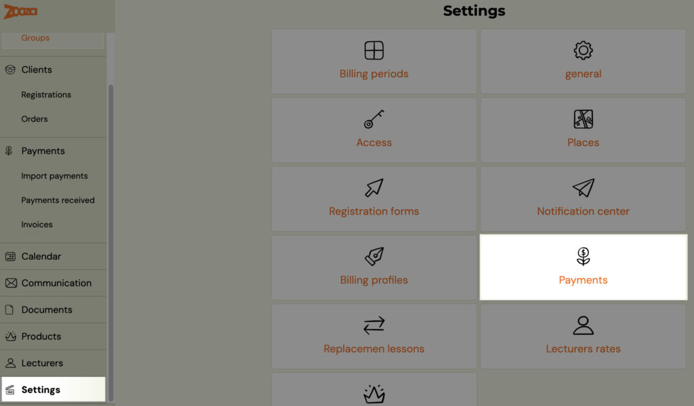
- To add a new payment template, click the Add button at the top of the screen and fill in the required parameters for the template

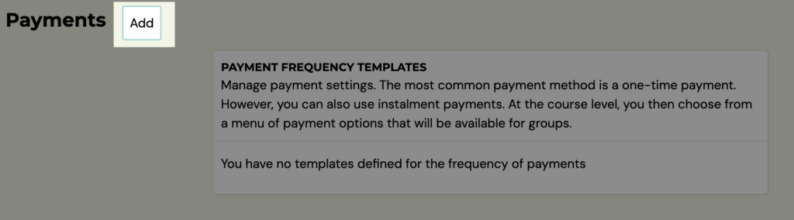
- Select one of the options as required:
- One-time payment – you have the option to set up a one-time payment for the programme.For example, if a client chooses a programme that lasts half a year, but
does not want to pay monthly, they choose to pay for the entire programme
at once.For such a payment you can give a discount either none, in EUR or as a percentage.

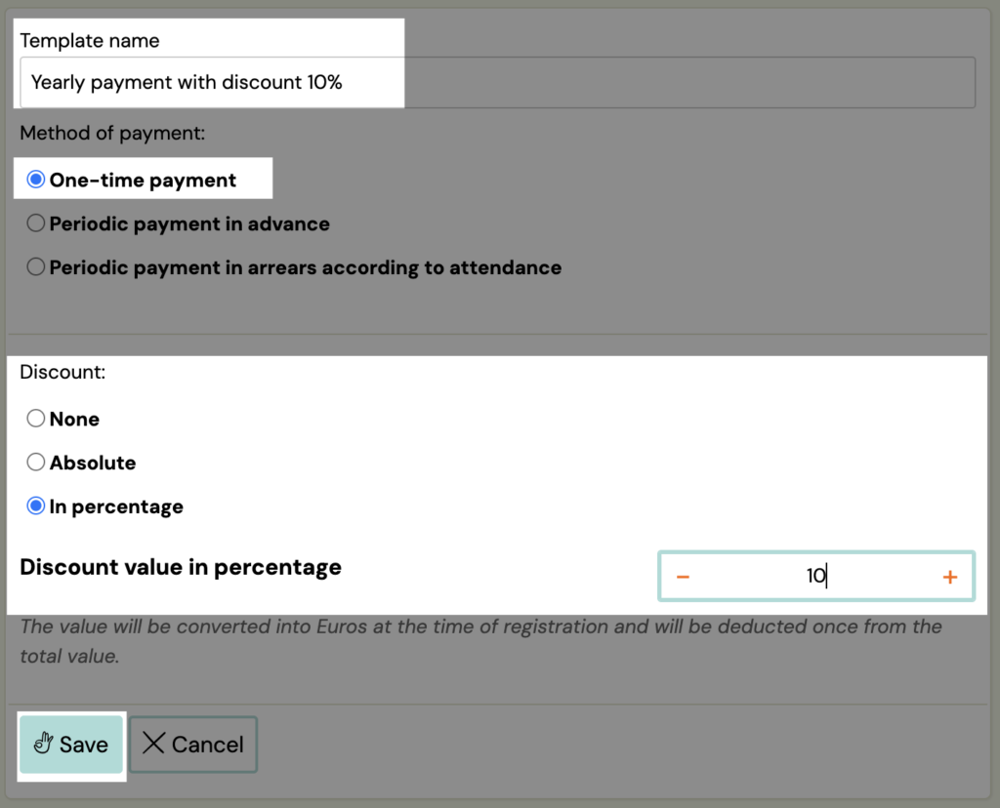
- Periodic pre-paid payment – you have the option to set whether the programme can be paid gradually, i.e. in frequency.Here you select from the options – Monthly, Quarterly, Semi-annually,
Annually, After N terms (the number of terms after which the next
installment for the programme will be issued), Fixed number of installments
 (the number of installments into which the price for the programme will be
 divided).The programme provider has the option to grant a discount for this type of payment either none, in EUR or as a percentage.

- Periodic payment paid in arrears according to attendance
- This option allows you to charge clients based on their actual attendance. The system creates and sends instalments only after the client has attended the required number of sessions, depending on the frequency you set.There are two possible modes:

1) Periodic frequency (e.g., monthly)

When using a time-based frequency:

1. When attendance is recorded, the system creates an instalment scheduled for the next anniversary date of the frequency (e.g., next month).
2. Each time attendance is marked as *“attended”*, the amount on that instalment increases.
3. When the instalment’s scheduled date arrives, it is processed during the nightly job and the client receives the payment request. At this moment, the booking receives the corresponding outstanding balance.
4. If the client does not attend any session within the chosen frequency period (e.g., no attendance in a whole month), no instalment is generated.

2) After N sessions (e.g., payment after every 2 sessions)
A When using a frequency based on a number of attended sessions:

1. When attendance is recorded, the system creates an instalment scheduled one year ahead.*(This is only a placeholder date — it will be adjusted once the required number of attendances is reached.)*

1. Each time an attendance is marked as *“attended”*, the amount on that instalment increases.

1. When the required number of attended sessions (N) is reached, the instalment is rescheduled to “today” and will be processed during the nightly job. At this moment, the booking receives the outstanding balance.

1. If the required number of attendances is reached multiple times on the same day(example: frequency = every 2 sessions, and 4 sessions are recorded in one day),then multiple instalments will be created on that same day.

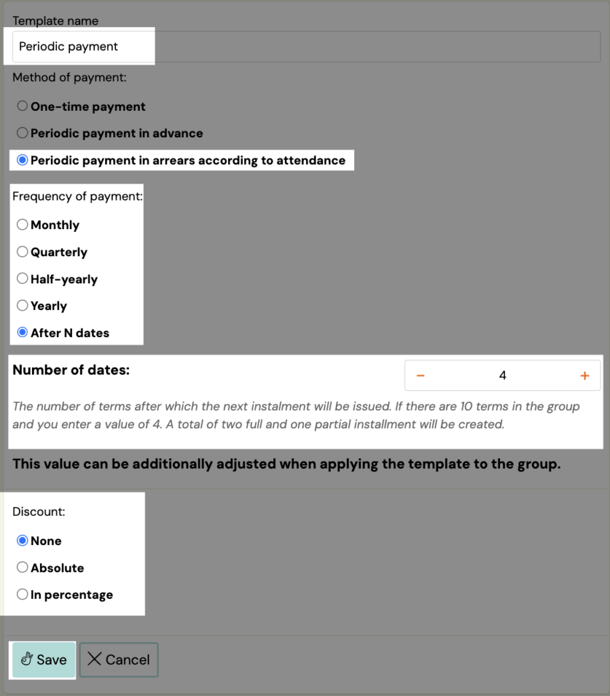

Save the template by clicking the *Save button.*

Note: If you use discounted payment templates, you can find a clear list of them in the Payments - Discounts section.

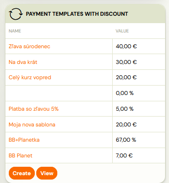

## Other template settings, template activation in programmes

In the payment settings, you can edit individual templates, set their
visibility to clients/instructors or delete a template. You can also
quickly and easily activate the template on the programmes of your choice.
To change and modify the template or activate it on the programme, please follow these steps:

- V zozname platobných šablón kliknite na ikonu pera vedľa šablóny, ktorú chcete upravovať

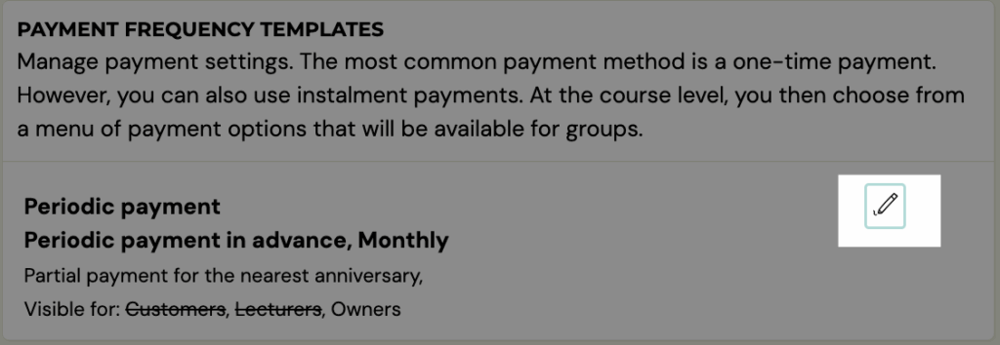

- In template editing you have the option to set the visibility of the template, i.e. what class of people will be able to use this template – Clients, Instructors or both.1. Clients – you choose the option to have the template visible to clients directly when they register on your site. 2. Instructors – visibility for instructors means that the instructor will also be able to assign bookings to a given template

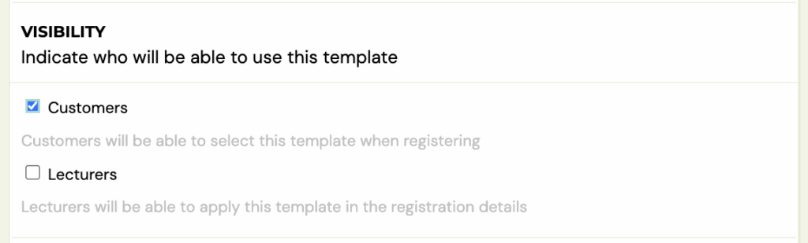

- Below in the programmes section you have a list of your programmes and for each of them you can activate or deactivate the template

- When you make changes to the template, we recommend that you *Sync Settings.* This will ensure that any changes made to the template will also be
reflected in programmes and classes where it has already been activated.

Note: If you have changed template settings, these
will not automatically be transferred to the programmes where the template
is applied. If you want all programmes to have their installment calendars
set according to this version of the template, synchronize their
settings. The system also keeps alerting you

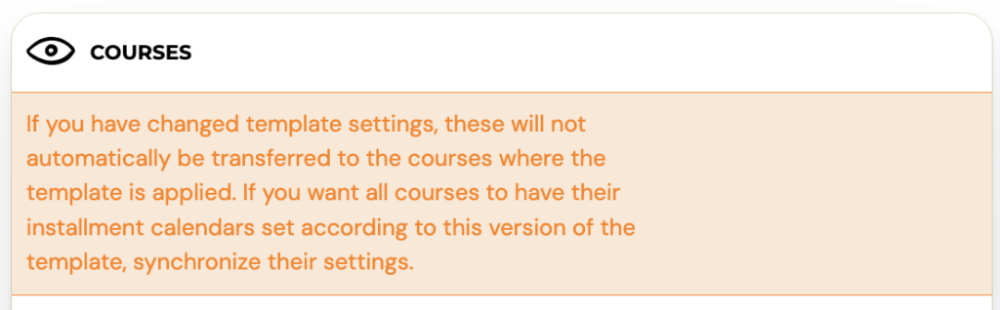

- Then *Save* the changes. Alternatively, you also have the option of using the *Delete* template

These payment templates created can then be used and inserted into your new or existing programmes/classes.

## Insert payment templates into a programme/class

The created payment templates need to be inserted into newly created or
already existing programmes. The templates created in this way can be
combined in the programmes according to your wishes and needs. This means
that you can use multiple payment templates for one programme.

## Insert templates into programmes

To insert templates into programmes, do the following:

- In the list of programmes, click on the name of the programme in which you want to add a template or check the activation of the selected templates
- In the *Price *and *Payment *section, click the *Edit *button

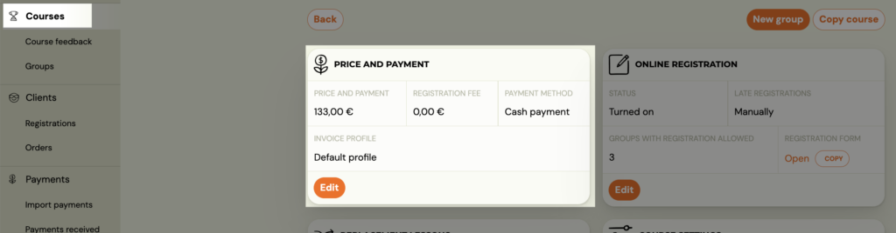
- Below in the *Payment Frequency* section you can see which payment templates you have *Active* and which *Inactive*. *Active* payment templates are the ones highlighted in colour (yellow background under the text, blue knob)

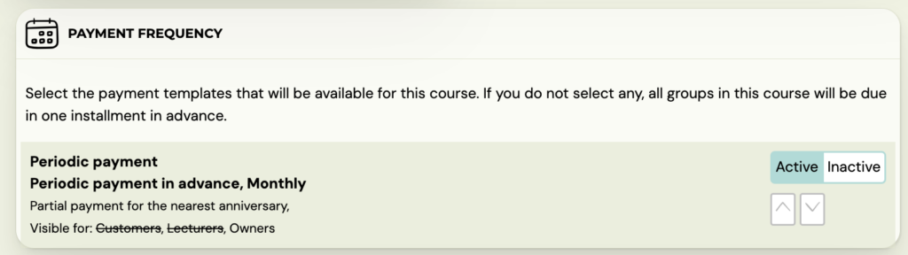

1. If you wish to activate the template, click on the white *Active* button
2. If you wish to deactivate the template, click on the white *Inactive* button

## Within creating a new class

This selection of templates will appear in the menu when you create a
 class for the programme, where you again have the option to decide whether
 or not to enable this payment option. To activate the template on the
class, click on the white *Active* button.

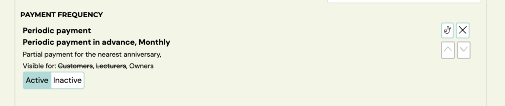

Then save your selection by clicking *Create*.

## When inserting into an existing class. Edit payment templates in existing classes

1. Select a class. In the *Payment Frequency* section, click the *Add Template* button. You will only see the ones that are activated on the programme.
 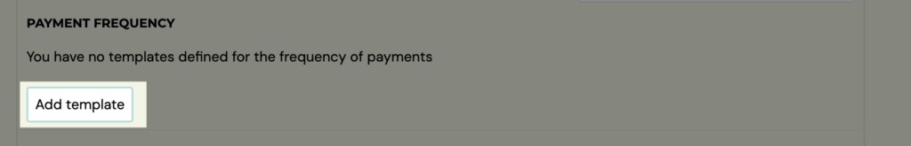

1. When you click on the *pen icon*, you will be presented with the option to activate/deactivate the template. Then click on the pipe icon and the *Save *button at the end of the screen to confirm the changes you have made.
 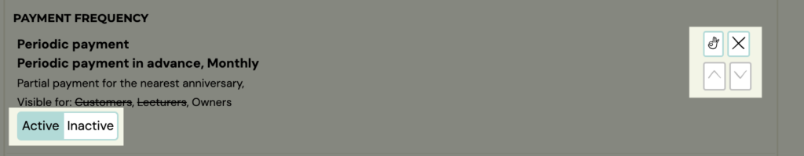

1. To delete a template from the class, click on the trash icon.

1. You can use the arrow keys to change the order of the templates and
set them as you want them to appear in the booking form.
 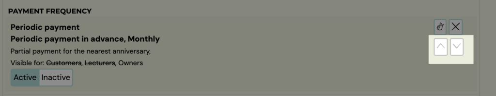

1. This selection of payment options will then be displayed in the booking form on your website as follows:
 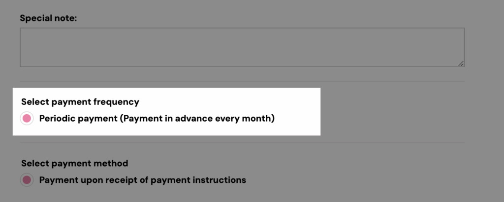

The client has to choose one of the offered options and the final price
for the programme is recalculated according to the client’s choice, if it
is affected by this choice (if a discount has been set in the template).

Note: If a client registers for a programme that has already started and you have set up manual approval for late bookings in the programme settings, the payment type will not appear on their
booking. Such bookings are marked as late by the application
and require manual editing.

1. Adjust the amount owed as needed or add a compliant payment template to your booking.
2. Manually change the booking status to **Registered** on the same day.

> **Important:** At midnight, the system runs an automatic check on payment schedules. Only payment schedules linked to bookings with **Registered** status are confirmed. If the booking remains in **Late registration** status, any manually applied payment schedule is automatically removed. Always change the status to **Registered** before the end of the day.

## Payment templates on booking

- Select the booking you want to edit.
- Under *Payments*, click *View Payments*

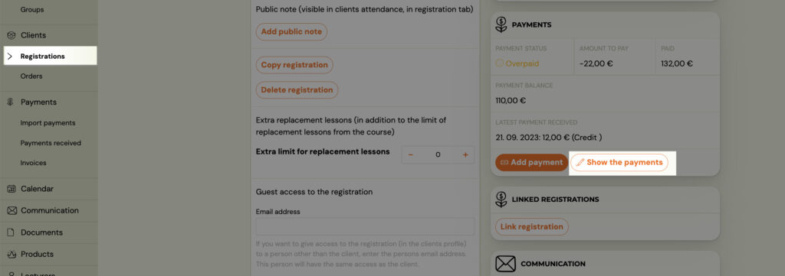

- In the *Installment Plan *section, click *Create *(if no installment plan has been set up on the booking) or *Change *(if an installment plan has already been set up on the booking).

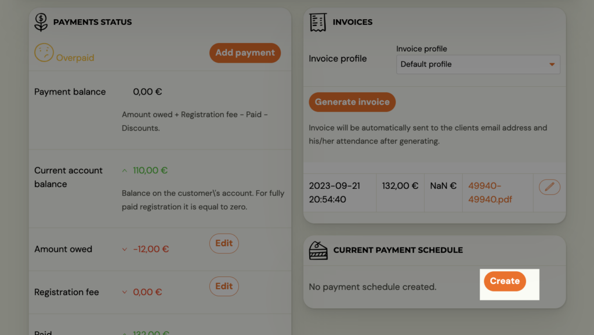

- This will open the settings for creating a payment plan. Select the
options that suit you and click continue. If you enter a value in the
Registration Fee field, it will be applied as part of the first
instalment – so the first instalment will be increased by the value of
the registration fee.

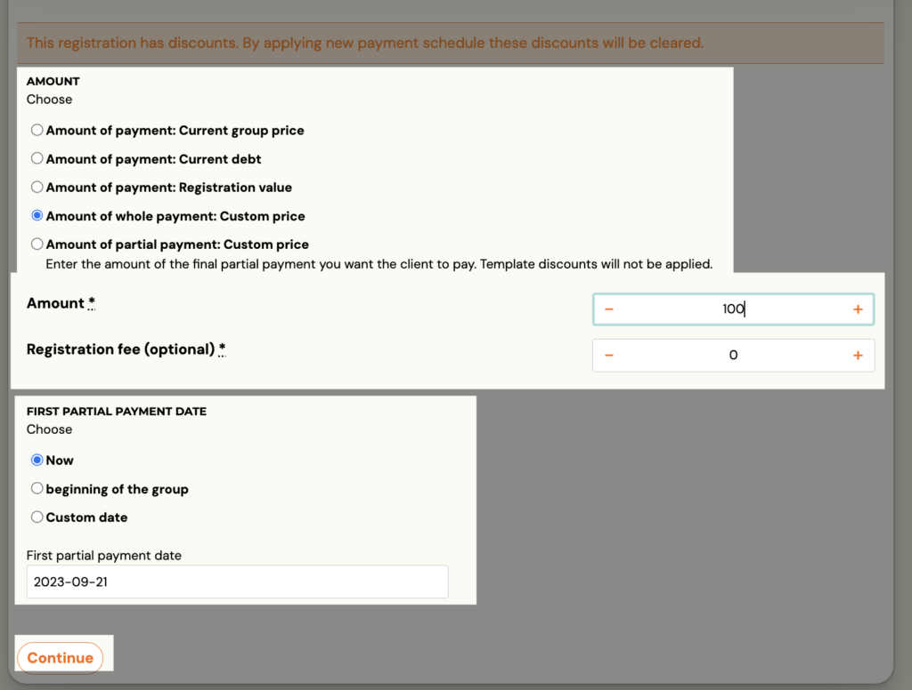

- Click the *Select* button next to the template you want to
apply. Zooza will show you what the repayment amount is, how many
repayments will be incurred, what the discount is and what the final
amount paid by the client is after all repayments have been made. Then
 click *Continue*

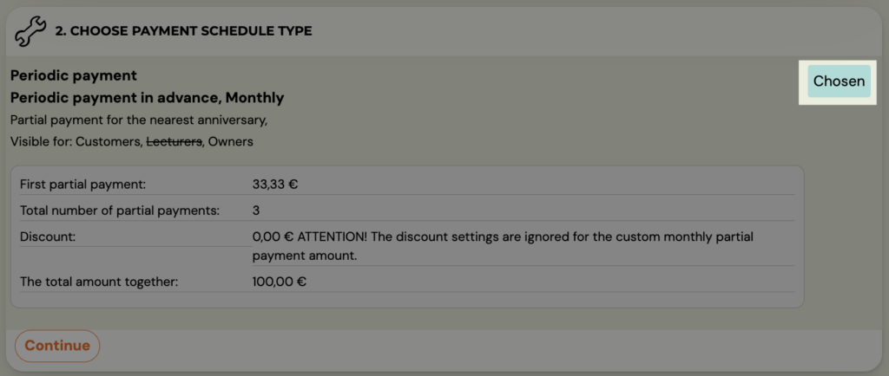

- In the next step, check your settings and click *Continue*

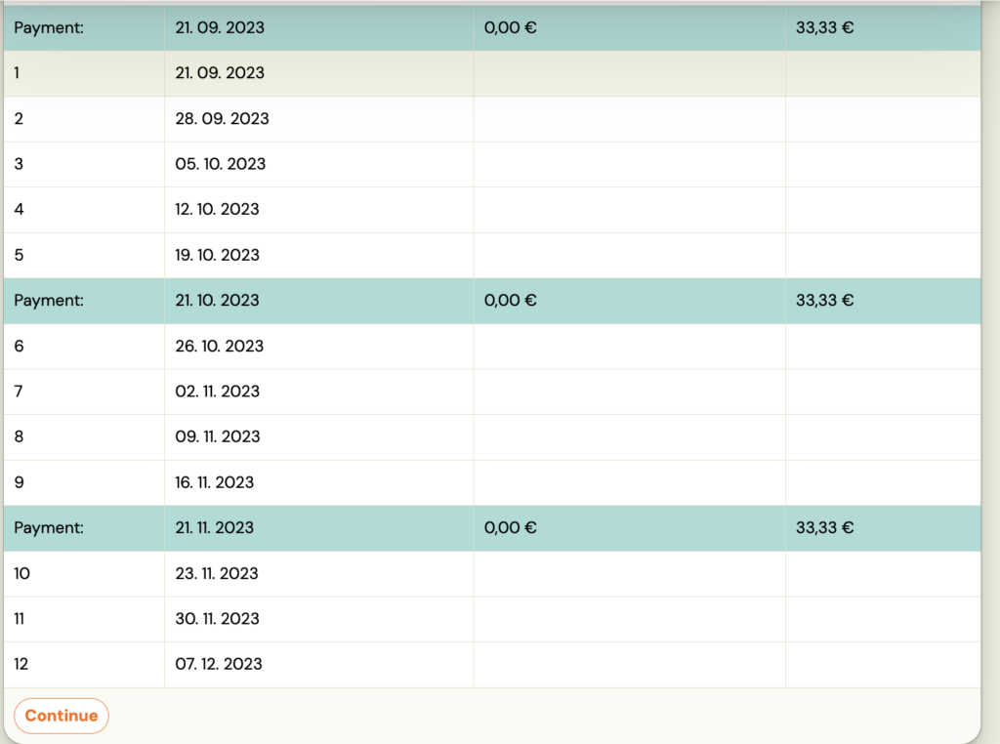

- To apply the payment plan to a given booking, confirm your selection by clicking on the *Finish* button.

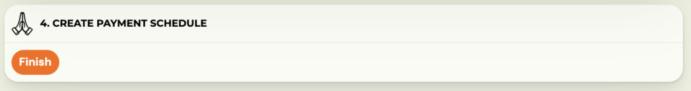

The payment schedule entered in this way will be automatically reflected in the client's profile and invoices for payments will be issued and notifications for payments will also be sent to the client based on this schedule.

### How to delete payment template on booking?

1. You can delete the set instalment plan on the regisdtration by clicking on the *Partial payments overview* button.
 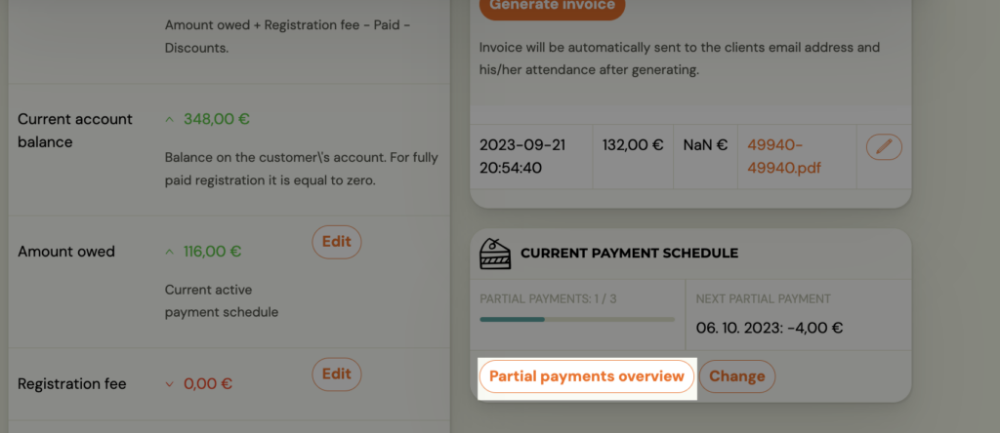

1. Then click the *Delete* button. The booking reverts to a no-payment status.

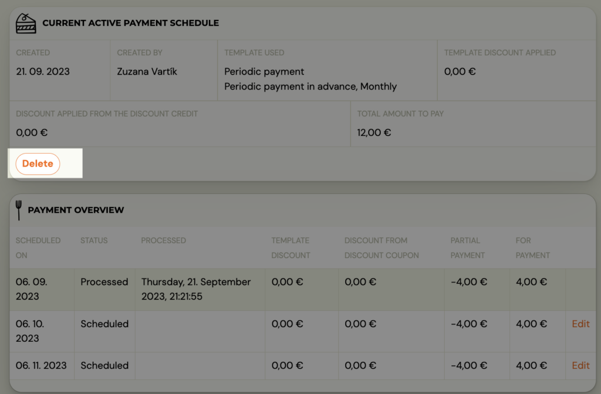

## Payment Plan Preview

If you have multiple bookings with active payment templates, use the *Payments - Installments Overview* section for a better overview of the next installments issued.

This way you can quickly and easily track all active payments from the date you have selected.

For a quick search, you can use the filter that allows you to enter:

1. Client - to search for a specific client,
2. Status - you select whether the installments are scheduled or processed,
3. Scheduled Date - search for installments by date.

This way you can quickly and easily keep track of all active payments.

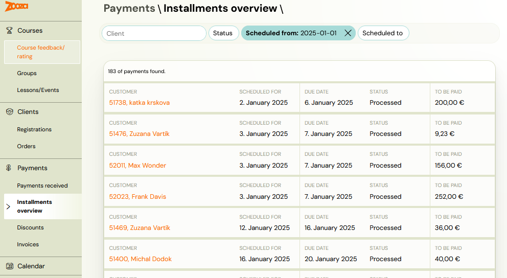

## Apply a payment template to the whole class

For each class/class, you can apply the payment template in one go:

1. Open the Class
 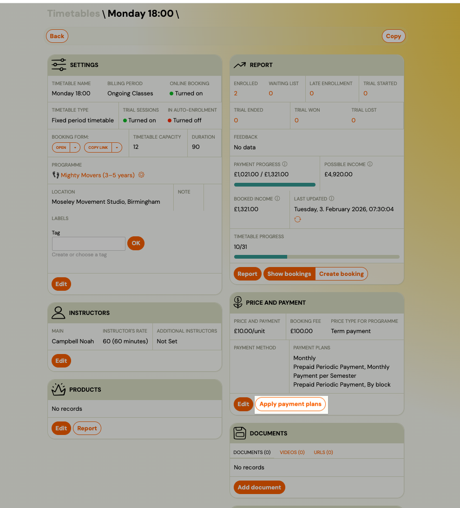

2. Go to Price & Payments
3. Click Apply payment template
4. Set the amount (based on that class pricing)
5. Choose the start date (example: 1 January 2026)
 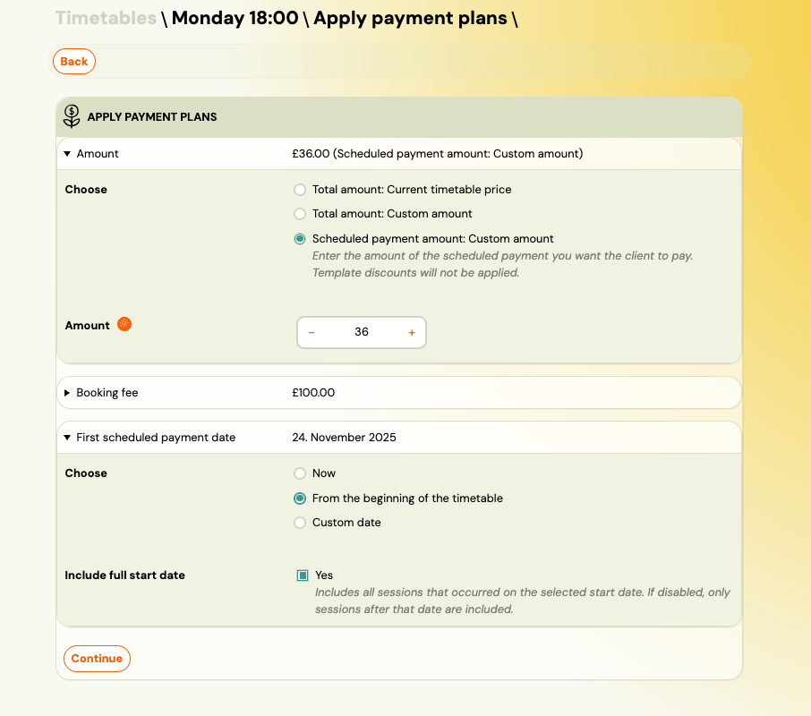
6. Select which bookings/bookings it applies to (usually All)
 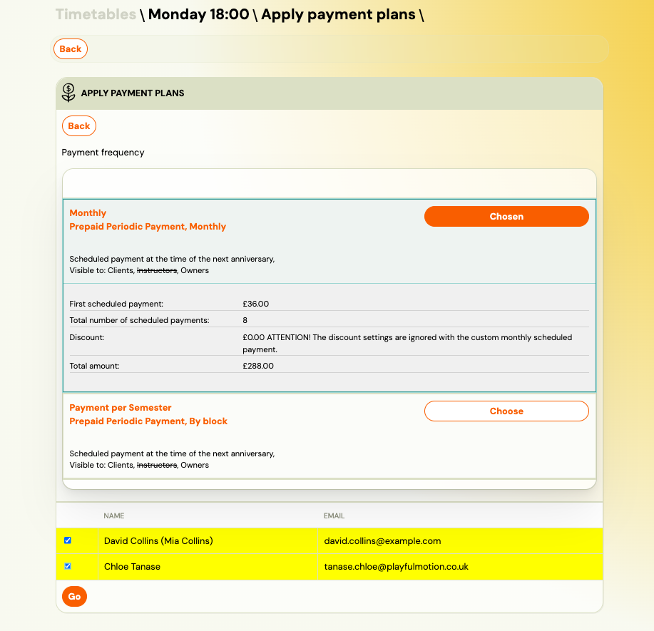
7. Confirm and continue

## Payment templates and registration copy

When you copy a registration from one class to another (e.g., moving clients to a new semester), the payment template from the original registration does **not** carry over. The new registration receives the default payment template configured on the target class.

This means you must re-apply payment templates after copying registrations. You can do this either:

1. One by one — open each copied registration and assign the payment template manually (see [Payment templates on booking](#payment-templates-on-booking) above).
2. In bulk — use the **Apply payment template** action on the target class (see [Apply a payment template to the whole class](#apply-a-payment-template-to-the-whole-class) above).

<!-- REVIEW: Confirm whether "no template carries over" applies equally to both the Copy and Transfer registration workflows, or only to Copy. -->

## Visible to clients flag

Each payment template has a **Visible to clients** toggle in its settings. This controls two things:

1. **Registration form** — when enabled, the template appears as a selectable payment option during online registration. When disabled, only admins and instructors (if instructor visibility is also enabled) can assign the template.
2. **Client Profile** — when enabled, the payment plan details (installment amounts, due dates, remaining balance) are visible to the client in their Client Profile under the Payments section.

If clients report they cannot see payment options during registration, check that the relevant templates have the **Visible to clients** toggle turned on. Go to **Settings** > **Payments**, click the pen icon next to the template, and verify the visibility setting.

<!-- REVIEW: Confirm whether "Visible to clients" also controls visibility in the Parent Portal payment tab, or only in the registration widget and profile widget. -->

## Anniversary date on payment templates

For periodic (recurring) payment templates, the `anniversary date` determines the day of the month when installments are generated and sent to clients.

- If you set the anniversary date to the **1st**, installments are created on the 1st of each billing period.
- If you set it to the **15th**, installments are created on the 15th, and so on.

The anniversary date affects the entire installment schedule. For example, if a monthly template has an anniversary date of the 10th:

1. The first installment is scheduled for the 10th of the current (or next) month.
2. Each subsequent installment falls on the 10th of the following months.
3. The period covered by each installment runs from one anniversary date to the next (e.g., 10 January to 9 February).

If you accidentally set the wrong anniversary date (e.g., 10th instead of 1st), you need to update the template and then use **Sync Settings** to propagate the change to all programmes and classes where the template is active. Existing registrations that already have an installment plan may need to have their plan deleted and re-created to reflect the corrected date.

<!-- REVIEW: Confirm whether changing the anniversary date and syncing automatically updates existing installment plans, or whether each registration's plan must be manually re-created. -->
