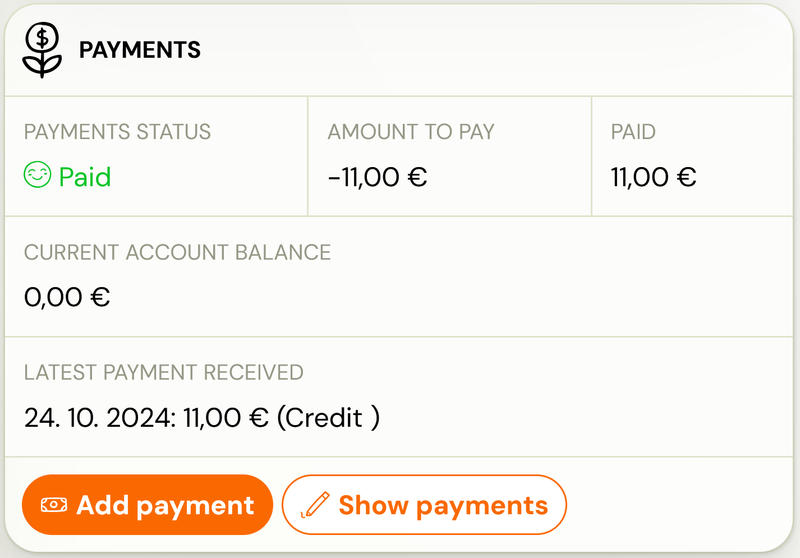
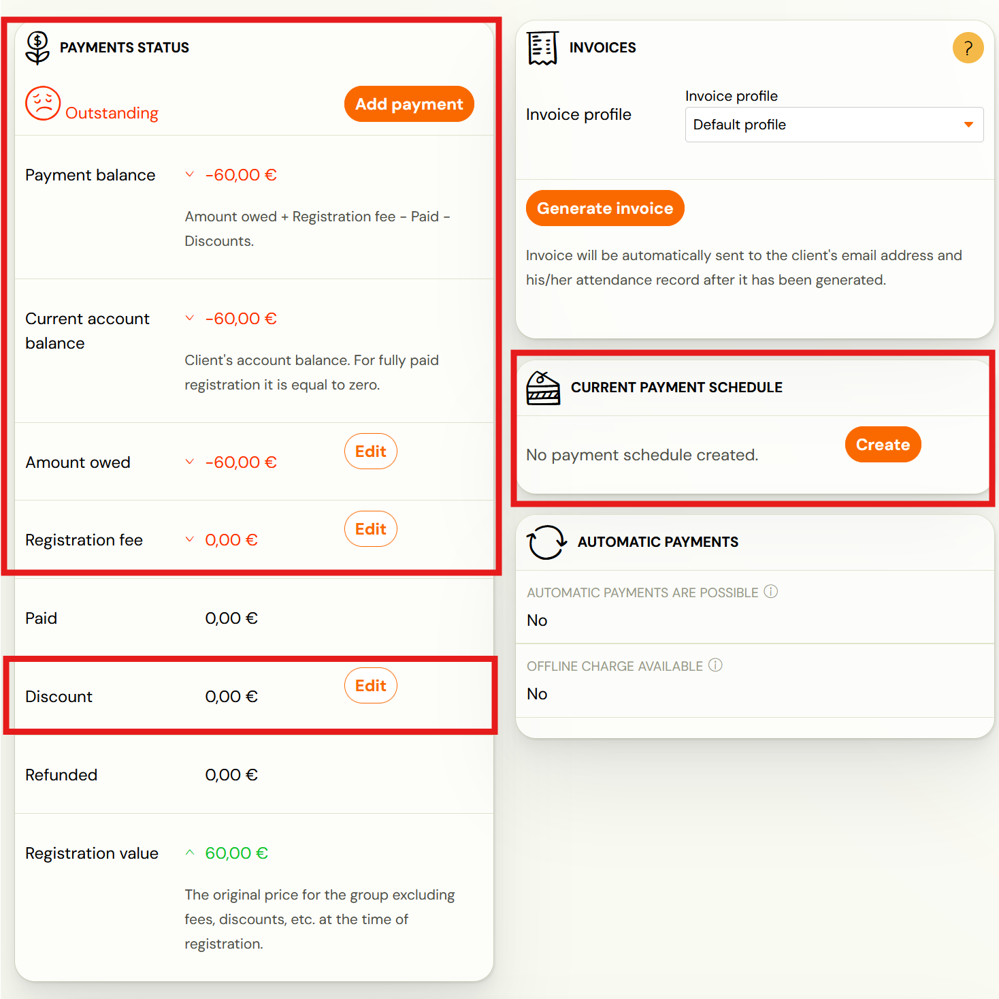
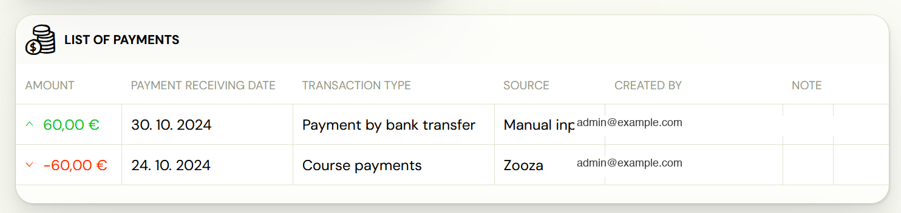
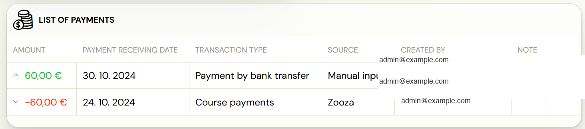
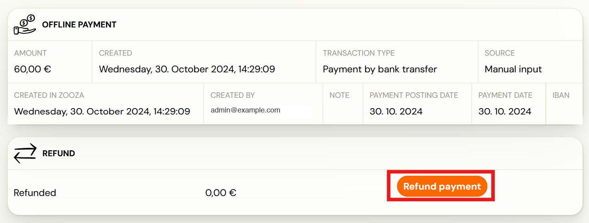
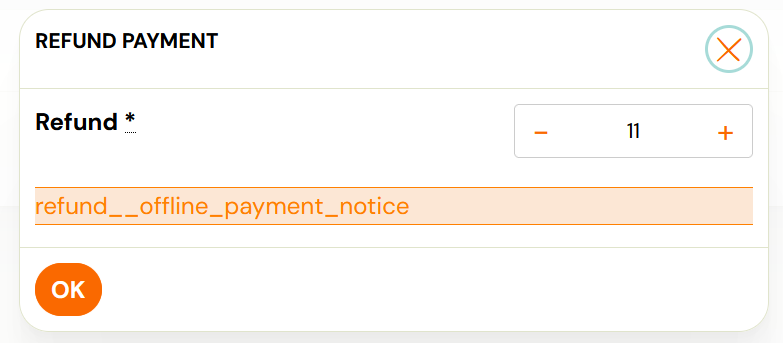

# Payment tile on booking

You can correct or modify each payment. Modifications can be made to bookings separately. In this case, you are adjusting the amount owed. What is the amount due can be found in more detail [HERE](outstanding-amount.md).

The amount owed on the booking itself can be adjusted in the form of discounts (how to enter a discount to a client can be found [HERE](discount-types.md)), by adding a new payment, refunding a payment or entering a payment plan.

## Assignment of payment

Manual payment editing, i.e. you manually enter the amount and the way you were paid.

1. In the Bookings tab, find the booking on which you want to edit the payment.
2. In the booking details, click on the Add payment button.
 
3. Fill in the required fields and click OK

## Adjustment of payments

You can make payment adjustments in several ways. Therefore, it is up to you which option you choose.

1. In the *Bookings *tab, find the booking on which you want to edit the payment.
2. Under *Payments*, click *View Payments
 
 *
3. Select the option you want
4. Amount owed – adjustment of the amount the client has to pay you
5. Registration fee – adjustment of the registration fee
6. Discount – adjustment of the amount due by granting a discount
7. Payment schedule – an arrangement for paying the amount owed by instalments. For more information on how to enter a payment plan in the booking, please click [HERE](payment-options.md).
 

After each adjustment of the amount due, the balance of payments shall also be recalculated. Thus, it may happen that a booking goes from “paid” to “unpaid” or, conversely, “overpaid”.

For a detailed breakdown of both payments and adjustments, please refer to the *TList of payments *tile.

Refund/correction of payment

It happens that the payment was incorrectly paid by the client or, on the contrary, incorrectly entered by you directly in the system. In this case, it is necessary to modify the transaction itself. This option is only available for remittance type transactions.

Reimbursement may come from several sources:

1. Manual entry– the payment was manually entered into the system directly on booking. A refund does not actually return money to the client’s account. It is just an adjustment in the application. The return payment must be made manually to the client from your bank account.
2. Automatic matching – the payment has been entered into the system via automatic payment matching. A refund does not actually return money to the client’s account. It is just an adjustment in the application. The return payment must be made manually to the client from your bank account.
3. Online payment by card/transfer – the payment was entered into the system automatically after the client made the payment. The refund will return the money directly to the client’s card/account. At the same time, the transaction is also written in the application.

1. In the Bookings tab, locate the booking on which you want to edit the payment.
2. in the *List of payments* section, click on the *More *button next to the payment you want to refund/edit.
 
3. Click *Refund *Payment
 
4. Enter the amount to be refunded/adjusted and then click OK
 

Note: In this case of a payment correction, it is not a refund of the payment back to the client’s account. Just a systemic change. You also don’t have to worry about the client seeing these changes in their account. The client only sees the resulting amounts in his/her profile – the amount to be paid, the amount of the registration fee, the amount of the discount and, in the case of a payment plan, a breakdown of future payments.
