# Personas

Personas is a feature that distinguishes between attendees and clients, giving each their own dedicated profile. Instead of treating a child (or other attendee) as just an extra field on a registration form, Personas creates a full record for them — complete with progress notes, order history, and family relationships. This provides a clearer, more detailed overview of each person’s engagement, helping you track their journey and interactions over time.

## Person creation

Person can be created in 2 ways:

1. Automatically during booking
2. Manually within the application

There are 2 types of persons you can work with:

1. Client – the email address used to create the booking
2. Attendee – the person who actually attends the programme

Example: In children’s programmes, the client is typically the parent, while the attendee is the child.

## Automatic creation

When a person is created automatically during booking, the system follows these rules:

1. The person who enters the email and basic details is always the Client.
2. The Client is also an Attendee unless the programme requires the Full Name and/or Date of Birth fields.
3. If the Client is not attending (e.g., a parent registering a child), they must fill in the additional fields including Full Name and/or Date of Birth for each Attendee.

## Manual booking

Sometimes an administrator may need to manually register a client for a programme. To do this, follow these steps:

1. Select the class you want to register the client for.
2. Choose the client type:
3. Existing client - search for the client in the search box and click on their name
4. New client - enter their email address and click *Continue *to create a new booking
 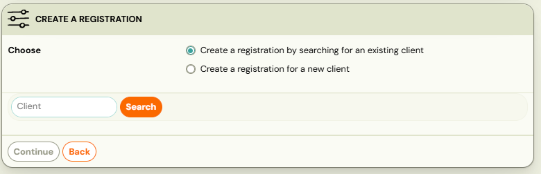

If registering an existing client:

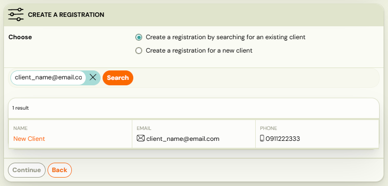

1. Select who will be the attendee — the client themselves or another person linked to their email address.
2. If the attendee is not yet in Zooza, select* Create New, *fill in the required fields and click *Continue*
 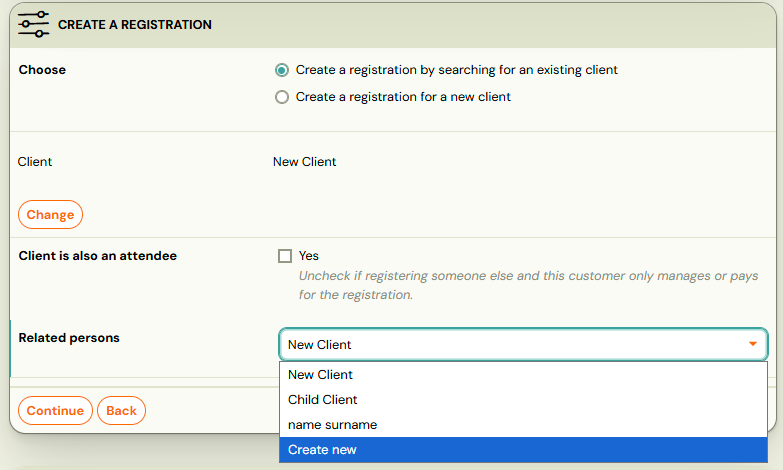

If registering a new client:

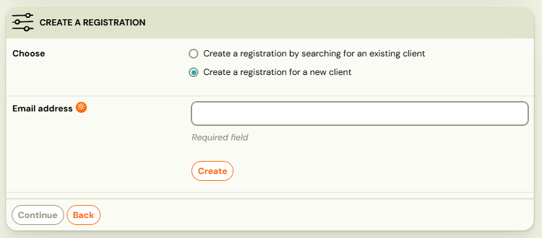

1. Fill in all required fields for the new client
2. Choose who will be the attendee - the client or another person
3. If the client is not attendee, uncheck the Client is also an attendee box and enter attendee’s first and last name.
 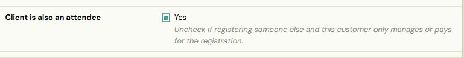
4. Click *Continue*.

## Change of attendee

If a booking has the wrong attendee, you can update it in the *Booking Detail *view.

1. In the *Attendee *tile, click *Change *to select a different attendee for the booking.
 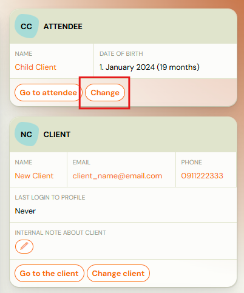
2. If the correct attendee already exists in Zooza, select them from the list.
3. If the attendee does not yet exist in Zooza under this email, click *Create*, fill in the required fields for the new attendee, and then click *OK*.
 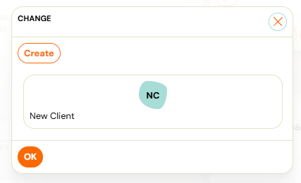
 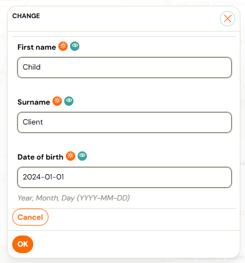

## Client Card

To view a client (whether the registrant or attendee) in full detail, Zooza provides a *Client Card*. This feature lets you see the client’s complete history — including bookings, orders, credits, and notes written by instructors during attendance. You can also edit the client’s information or merge duplicate client cards if necessary.

## Access a Client Card

1. Go to the *Clients *tab and search for the client by name, email, or other details.
 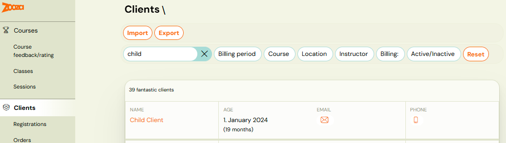
2. From a booking detail page, click the* Go to Attendee* button.
 

## Client Card detail

Once in the Client Card, you can:

1. Edit client information by clicking *Edit *in the tiles containing basic details.

Note: This action can only be performed if the Client is not the same as the Attendee. If they are the same person, you must submit a new request, which will need to be approved by Zooza.

 2. Manage family & connections by creating or editing relationships between clients.

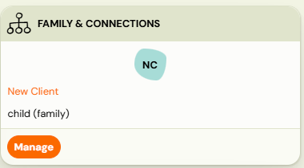

 3. View History, which includes all internal notes, a list of bookings, orders, and a credit overview.

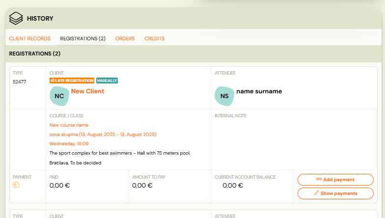

## Family & Connection

Each client or attendee can be linked to other people in Zooza (e.g., Parent–Child, Guardian, Spouse).

To manage relationships, open the person’s Client Card and click *Manage *in the Family & Connections section.

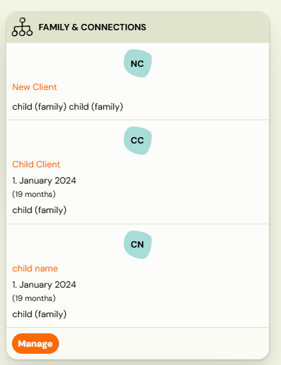

### Merge Profiles

If you find duplicate records for the same person, you can merge them into a single profile.

1. Select all duplicate entries and click* Merge profiles
 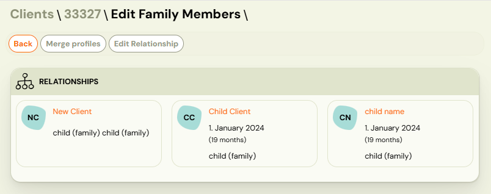
 *
2. Select the main person to keep as primary to merge records together
 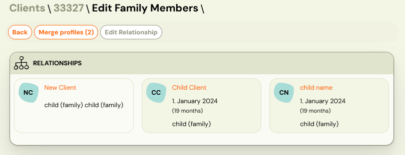
3. Click *Save *to complete the merge.

Tip: Before saving, review names, contact details, and other fields so the main profile reflects the correct information.

### Edit relationship

If a relationship was created incorrectly, you can update it.

1. In *Family & Connections,* select the member whose relationship you want to change and click* Edit Relationship*.
 
2. Choose the correct relationship from the drop down lists (e.g., Parent, Child, Guardian, Spouse).
 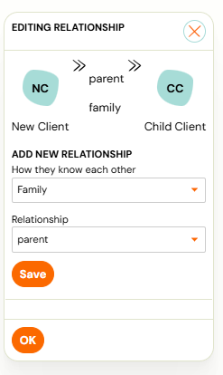
3. Click *Save*, then *OK *to confirm.

### Client records

*Attendance *page includes a feature button for all attendees where it is possible to write a internal note about that session - e.g. progress on the session, homework, etc. addressing only the one particular attendee.

By clicking on the *Client Card* button you will see the full overview of client records created by instructors for a better understanding.

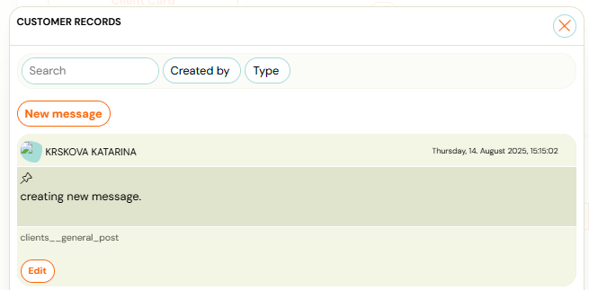

You can search in the notes or create a new one by clicking the *New Message* button.When creating a new message that is important for all instructors and admins, you can pin the message by ticking the checkbox.

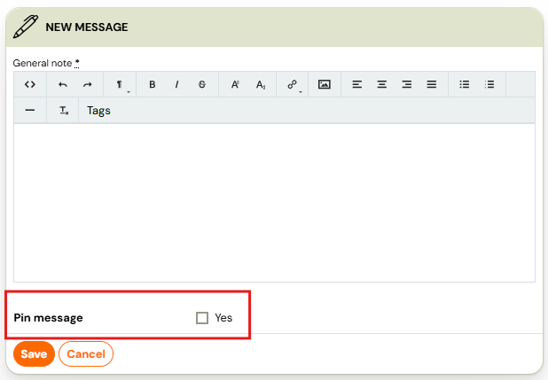

Info: All messages created during attendance are visible in the client card in client's detail.

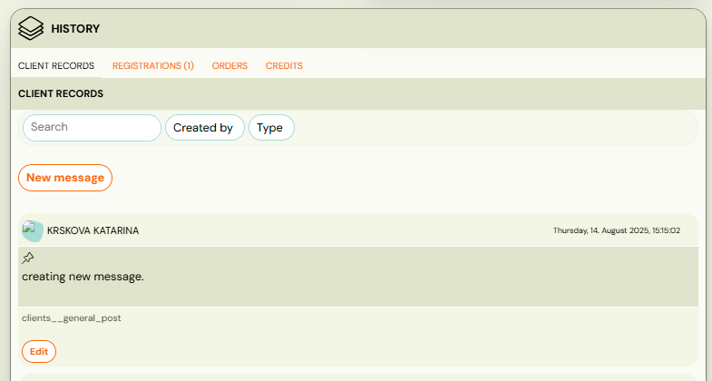
