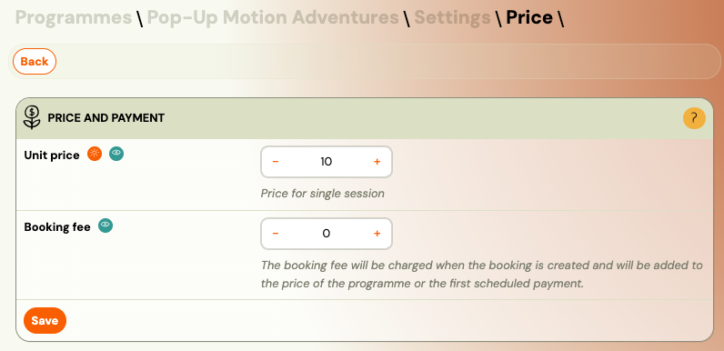
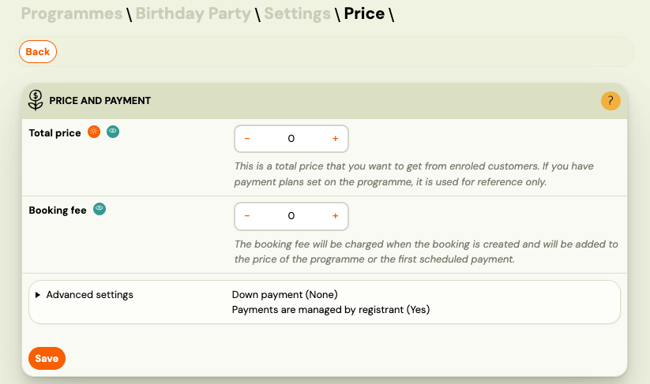
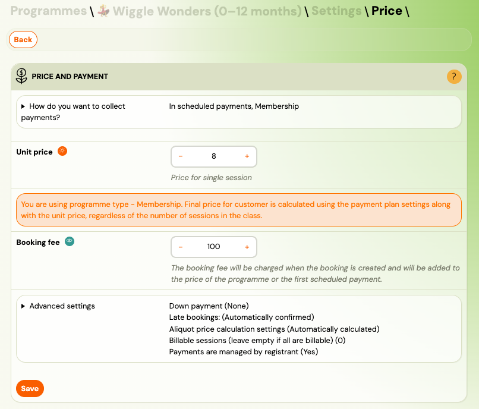

<!-- Synonyms: setting the price, course pricing, programme pricing, nastavenie ceny, cena programu, platobné nastavenia -->

# Price and payment setup

The **Price and Payment** tile on a programme controls how much clients pay and how payments are collected. You set it when creating a programme, but you can update it any time in the programme settings.

> **Navigation:** Go to **Programmes** → select the programme → **Edit Settings** → **Price and Payment**.

This guide explains every section of the Price and Payment tile: pricing models, unit price, downpayments, payment frequency, payment methods, and invoicing.

## Programme types and their pricing

When you create a programme, you choose a programme type. Each type has a different pricing model:

| Programme type | How pricing works |
|---|---|
| **Pay-as-you-go (Open registration)** | Clients pay per session. You set a **unit price** (price per session) and an optional **booking fee**. No payment schedules. |
| **Registration for one session** | Clients pay a fixed **total price** for a single event (e.g., a camp, workshop, or tour). Optional booking fee. |
| **Registration for full duration** | Clients enrol for the entire programme. You choose between a one-off payment or scheduled payments (instalments). |

## Pay-as-you-go pricing

For pay-as-you-go programmes, set:

- **Unit price** — the amount clients pay when enrolling for each individual session.
- **Booking fee** — optional one-time fee charged at booking.

The client selects which sessions to attend and pays the unit price for each one.

## One-session pricing

For single-event programmes (camps, tours, retreats), set:

- **Total price** — the full price for the event.
- **Booking fee** — optional.

You can also configure a **down payment** if you want clients to pay a deposit upfront (see below).

## Full-duration pricing

For full-duration programmes, you first choose how to collect payments:

| Option | Description |
|---|---|
| **One off payment** | A single payment for the entire programme. No payment schedules are offered to the client. |
| **In scheduled payments** | Recurring payments based on a payment template. Clients pay in instalments (monthly, termly, etc.). |

If you choose **scheduled payments**, you must also select the **price type**:

### Course fee vs Membership

| Price type | How it works | Best for |
|---|---|---|
| **Course fee** | A fixed total price split into instalments by the payment template. The client knows the full price upfront. Price = unit price x number of sessions. | Term-based programmes with a fixed start and end date (language courses, swimming terms, dance terms). |
| **Membership** | A fixed recurring amount charged at a regular interval (e.g., monthly), regardless of how many sessions the client attends. No total price is calculated. | Ongoing programmes with no fixed end date (football clubs, gyms, martial arts, "Netflix-style" subscriptions). |

**Key differences:**

- **Course fee** calculates the total from the unit price and session count. The payment template splits this total into instalments.
- **Membership** charges the unit price directly as the recurring fee. The total depends on how long the client stays enrolled.
- **Memberships cannot use billable sessions.** If you need to exclude specific sessions from pricing, use Course fee instead.

## Unit price

The **unit price** is the price per session. When you enter a unit price, Zooza automatically calculates the total programme price:

**Total price = Unit price x Number of sessions in the class**

If the class uses billable sessions, the formula becomes:

**Total price = Unit price x Number of billable sessions**

### Why use unit price

1. The total price is calculated automatically — no need to enter it manually.
2. When you add or remove sessions, the total updates accordingly.
3. Payment schedules are calculated reliably from the total.
4. Credit costs (make-up sessions) are based on the unit price.
5. For billable sessions, only paid sessions are counted in the total.

If you do not set a unit price, Zooza calculates it internally as:

**Total price / Number of sessions = Implied unit price**

This implied unit price is used for credit calculations even if you entered only the total price.

## Down payment

A **down payment** (deposit) allows clients to pay part of the price in advance as a commitment to attend. The remaining amount is due later according to the payment schedule.

Down payment is available for:
- Registration for full duration
- Registration for one session

### Down payment options

| Option | Description |
|---|---|
| **None** | No down payment required. |
| **Fixed amount** | A specific amount (e.g., 50 EUR). |
| **Percentage** | A percentage of the total price (e.g., 20%). |

When **Payments managed by registrant** is also enabled and multiple children are registered at once:

- **Fixed amount** — the down payment is multiplied by the number of attendees.
- **Percentage** — the down payment is calculated from the total combined debt of all bookings.

Down payments are commonly used for one-off events such as summer camps, retreats, or multi-day workshops.

## Payments managed by registrant

This setting is useful when one registrant (e.g., a parent) books multiple children at once. When enabled:

- The payment obligations (debts) of all bookings are consolidated under the first attendee's booking.
- If a payment schedule is set up, it is generated from the total combined debt of all bookings.
- The registrant receives one payment reference and one confirmation email instead of separate ones per child.

This simplifies the payment process for families with multiple children in the same programme.

## Payment frequency

The **Payment Frequency** section lets you select which payment templates are available to clients during booking. This section is only visible when using **scheduled payments** (not for one-off payments).

Each payment template in the list can be set to **Active** or **Inactive**:

- **Active** — clients see this option during booking and can choose it.
- **Inactive** — this template is hidden from clients.

You can reorder templates using the arrows. The first active template is the default selection on the booking form.

Payment templates are created under **Settings** → **Payments**. For details on creating and configuring templates, see [Payment templates creation](payment-templates-creation.md).

> **Note:** If a payment template includes a discount, the discount is distributed evenly across all scheduled payments for Course fee programmes. For Membership programmes, the entire discount is applied to the first scheduled payment.

## Payment methods

The **Payment Methods** section defines how clients can pay. You can enable multiple methods at the same time.

| Method | Description |
|---|---|
| **Online payment by card** | Client pays immediately via Stripe or CardPay. The booking is marked as paid automatically. |
| **Online payment by transfer** | Client approves a pre-filled payment order in their internet banking. The booking is marked as paid automatically. |
| **Cash / bank transfer** | Client completes the booking without paying online. Payment instructions are sent via email. You process the payment manually (cash, bank transfer, or SEPA direct debit). |

For details on how each method works, see [Payment options](payment-options.md).

## Payment instructions and invoicing

### Payment instructions

Enter the **IBAN** of the bank account where payments should be received. This is included in the payment instructions sent to clients who pay by bank transfer.

Additional fields:
- **Constant symbol** — used for QR code payments (region-specific).
- **Specific symbol** — used for QR code payments (region-specific).

> **Note:** Only fill in the IBAN field here if you want payments for this specific programme to go to a different account than the one in your main **Settings**. If left empty, the global account from Settings is used.

### Invoicing

Select the **invoice profile** that will appear on invoices for this programme. Invoice profiles are managed in **Settings** → **Billing** → **Invoice Profiles**.

## Payment reminders settings

Payment reminders automatically notify clients when payments are due or overdue. You can define:

- When reminders are sent (before or after due date).
- Automatic deletion of bookings if payments are not made within a specified period.

Click **Change** to open the reminders configuration. For detailed setup instructions, see [Automatic payment reminders](automatic-payment-reminders.md).

## Quick reference: settings by programme type

| Setting | Pay-as-you-go | One session | Full duration (one-off) | Full duration (scheduled) |
|---|---|---|---|---|
| Unit price | Yes | — | — | Yes |
| Total price | — | Yes | Yes | Calculated |
| Booking fee | Yes | Yes | Yes | Yes |
| Down payment | — | Yes | Yes | Yes |
| Payment frequency | — | — | — | Yes |
| Billable sessions | — | — | — | Course fee only |
| Late bookings | — | — | Yes | Yes |
| Payments managed by registrant | — | Yes | Yes | Yes |

## Related

- [Programme Settings Reference](../reference/programme-settings.md) — full field reference for the Price and Payment tile.
- [Late bookings (pro-rata management)](late-bookings.md) — late booking modes and aliquot price calculation.
- [Billable sessions](billable-sessions.md) — marking which sessions are paid.
- [Payment templates creation](payment-templates-creation.md) — creating and configuring payment schedules.
- [Membership Subscription Setup](membership-subscription-setup.md) — step-by-step Netflix-style membership configuration.
- [Payment options](payment-options.md) — details on card, transfer, and cash payments.
- [Automatic payment reminders](automatic-payment-reminders.md) — configuring payment reminder emails.
- [Discount code](discount-code.md) — applying discounts to bookings.
