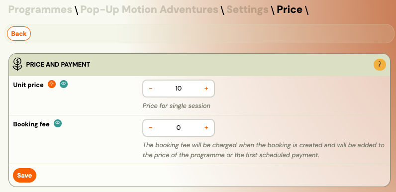
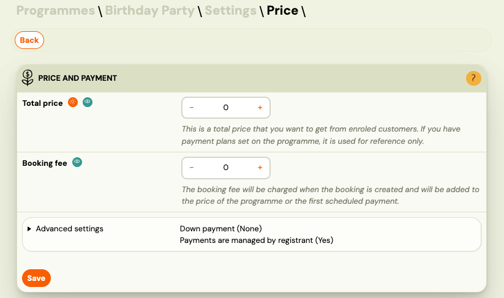
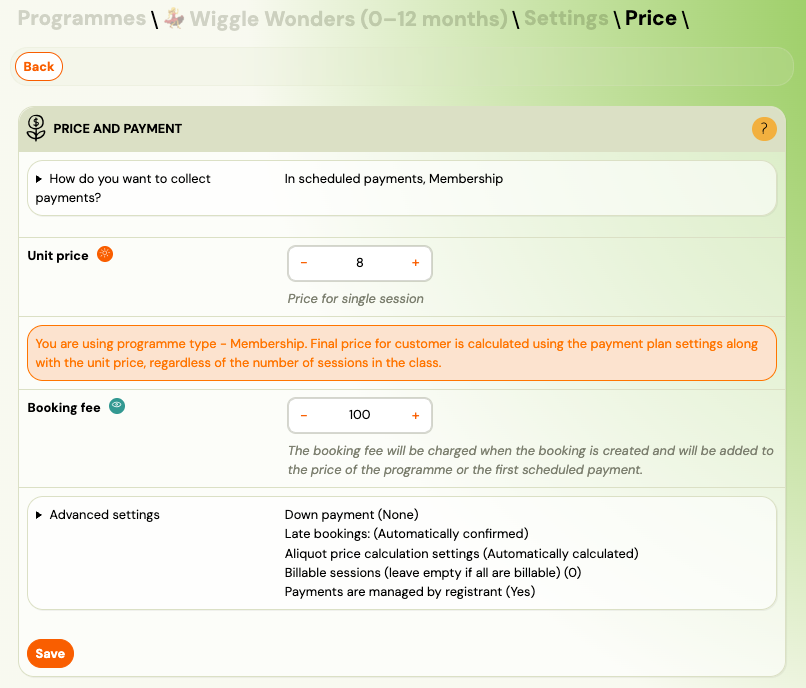
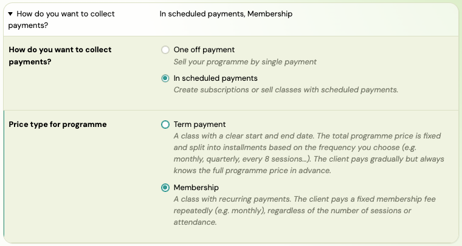
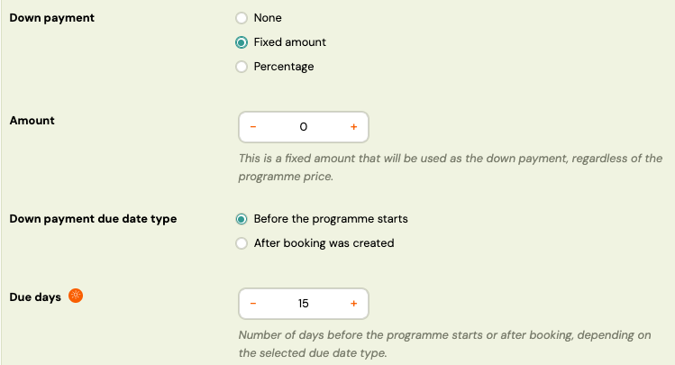
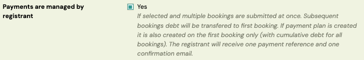

# Price and payment setup

The **Price and Payment** tile on a programme controls how much clients pay and how payments are collected. You set it when creating a programme, but you can update it any time in the programme settings.

> **Navigation:** Go to **Programmes** → select the programme → **Edit Settings** → **Price and Payment**.

This guide explains every section of the Price and Payment tile: pricing models, unit price, downpayments, payment frequency, payment methods, and invoicing.

## Programme types and their pricing

When you create a programme, you choose a programme type. Each type has a different pricing model:

| Programme type                        | How pricing works                                                                                                            |
| ------------------------------------- | ---------------------------------------------------------------------------------------------------------------------------- |
| **Pay-as-you-go (Open registration)** | Clients pay per session. You set a **unit price** (price per session) and an optional **booking fee**. No payment schedules. |
| **Registration for one session**      | Clients pay a fixed **total price** for a single event (e.g., a camp, workshop, or tour). Optional booking fee.              |
| **Registration for full duration**    | Clients enrol for the entire programme. You choose between a one-off payment or scheduled payments.                          |

## Pay-as-you-go pricing

For pay-as-you-go programmes, set:

- **Unit price** — the amount clients pay when enrolling for each individual session.
- **Booking fee** — optional one-time fee charged at booking.

The client selects which sessions to attend and pays the unit price for each one.

## One-session pricing

For single-event programmes (camps, tours, retreats), set:

- **Total price** — the full price for the event.
- **Booking fee** — optional.

You can also configure a **down payment** if you want clients to pay a deposit upfront (see below).

## Full-duration pricing

For full-duration programmes, you first choose how to collect payments:

| Option                    | Description                                                                                                |
| ------------------------- | ---------------------------------------------------------------------------------------------------------- |
| **One off payment**       | A single payment for the entire programme. No payment schedules are offered to the client.                 |
| **In scheduled payments** | Recurring payments based on a payment template. Clients pay in scheduled payments (monthly, termly, etc.). |

If you choose **scheduled payments**, you must also select the **price type**:

### Programme fee vs Membership

| Price type     | How it works                                                                                                                                                 | Best for                                                                                                       |
| -------------- | ------------------------------------------------------------------------------------------------------------------------------------------------------------ | -------------------------------------------------------------------------------------------------------------- |
| **Programme fee** | A fixed total price split into scheduled payments by the payment template. The client knows the full price upfront. Price = unit price x number of sessions. | Term-based programmes with a fixed start and end date (language programmes, swimming terms, dance terms).         |
| **Membership** | A fixed recurring amount charged at a regular interval (e.g., monthly), regardless of how many sessions the client attends. No total price is calculated.    | Ongoing programmes with no fixed end date (football clubs, gyms, martial arts, "Netflix-style" subscriptions). |

**Key differences:**

- **Term payment** calculates the total from the unit price and session count. The payment template splits this total into scheduled payments.
- **Membership** charges the unit price directly as the recurring fee. The total depends on how long the client stays enrolled.
- **A session you mark as non-billable is free under both.** An open lesson, a bonus date or a make-up session that you exclude from pricing is left out of the amount the client is charged — on the booking screen, in per-block instalments, and in a membership's prorated first payment alike.

> One thing a non-billable session still does: if it is the **first** session of a block, the instalment for that block is still due on its date. The amount drops, the due date does not move.

### "I want them to pay 35 € a month" — which one is that?

This is the most common setup question, and the answer depends on what the 35 € means.

**If 35 € is the same every month regardless of how many sessions fall in it** — four sessions in October, five in November, still 35 € — that is **Membership**. Go to **Programmes → programme → Settings → Price and Payment**, choose scheduled payments, set the price type to **Membership**, and attach a monthly payment template. Typical for clubs and ongoing groups with no fixed end.

> **The template has to be a membership template.** Full walkthrough: [Charge a monthly membership fee](membership-fee-setup.md). This is the step people miss, and it is why Membership sometimes refuses to work at all. A payment template is created *as* a membership template — you choose that, along with its frequency (monthly, half-yearly, yearly) and any discount, when you create it in **Settings → Billing & Payments → Payment schedule templates**. An ordinary template will not do, so if the Membership option is not behaving, check what kind of template you attached before you check anything else.

**If you have a total for the year and want it spread over months** — 350 € for the school year, paid monthly — that is **Programme fee**. Set the price per session, and the payment template splits the calculated total into instalments. Typical for term-based programmes with a start and an end.

Both start from a price per session. The difference is that Membership charges a flat recurring amount, while Programme fee divides a calculated total.

> A monthly template with the due day set to **1** charges on the first of each calendar month. Set it to **0** to charge on the same day of the month the client joined.

> **Changing your legal form is not a reason to switch.** Becoming a non-profit or an association does not require Membership — plenty of associations charge a programme fee and always have. Pick the model that matches how you actually bill: a known total you divide, or a flat amount per period. Nothing in Zooza ties either one to a legal structure.

### Setting a fixed price for a class

If you simply want one fixed sum with no instalments, choose the **one-off** collection method and enter the price. Nothing else is needed.

If you want a fixed sum but still need pro-rata for people who join late, use scheduled payments with **Programme fee**, set the **price per session**, and attach a **one-off** payment template (payment due before the programme starts). The client still pays in a single payment, but because the price is built from a per-session rate, Zooza can calculate a reduced amount for a late joiner. See [Late bookings (pro-rata management)](late-bookings.md).

## Unit price

The **unit price** is the price per session. When you enter a unit price, Zooza automatically calculates the total programme price:

**Total price = Unit price x Number of sessions in the class**

If the class uses billable sessions, the formula becomes:

**Total price = Unit price x Number of billable sessions**

### Why use unit price

1. The total price is calculated automatically — no need to enter it manually.
2. When you add or remove sessions, the total updates accordingly.
3. Payment schedules are calculated reliably from the total.
4. Credit costs (make-up sessions) are based on the unit price.
5. For billable sessions, only paid sessions are counted in the total.

If you do not set a unit price, Zooza calculates it internally as:

**Total price / Number of sessions = Implied unit price**

This implied unit price is used for credit calculations even if you entered only the total price.

## Down payment

A **down payment** (deposit) allows clients to pay part of the price in advance as a commitment to attend. The remaining amount is due later according to the payment schedule.

Down payment is available for:
- Registration for full duration
- Registration for one session

### Down payment options

| Option | Description |
|---|---|
| **None** | No down payment required. |
| **Fixed amount** | A specific amount (e.g., 50 EUR). |
| **Percentage** | A percentage of the total price (e.g., 20%). |

When **Payments managed by registrant** is also enabled and multiple children are registered at once:

- **Fixed amount** — the down payment is multiplied by the number of attendees.
- **Percentage** — the down payment is calculated from the total combined debt of all bookings.

Down payments are commonly used for one-off events such as summer camps, retreats, or multi-day workshops.

## Payments managed by registrant

This setting is useful when one registrant (e.g., a parent) books multiple children at once. When enabled:

- The payment obligations (debts) of all bookings are consolidated under the first attendee's booking.
- If a payment schedule is set up, it is generated from the total combined debt of all bookings.
- The registrant receives one payment reference and one confirmation email instead of separate ones per child.

This simplifies the payment process for families with multiple children in the same programme.

## Payment frequency

The **Payment Frequency** section lets you select which payment templates are available to clients during booking. This section is only visible when using **scheduled payments** (not for one-off payments).

Each payment template in the list can be set to **Active** or **Inactive**:

- **Active** — clients see this option during booking and can choose it.
- **Inactive** — this template is hidden from clients.

You can reorder templates using the arrows. The first active template is the default selection on the booking form.

Payment templates are created under **Settings** → **Payments**. For details on creating and configuring templates, see [Payment templates creation](payment-templates-creation.md).

### Offering "pay in full" and "pay in instalments" side by side

This is the setup most people want, and the way to get it is counter-intuitive: **set the programme to scheduled payments, not to one-off.**

1. Set **Payment collection** to scheduled payments.
2. Set the **unit price**.
3. Activate **both** templates — the one-off template and the instalment template.

Clients then choose between them on the booking form.

If you set the programme to one-off payment instead, the Payment Frequency section disappears entirely and no template can be offered — including the one-off template. A programme set to one-off has exactly one way to pay, by definition.

> **Switching an existing programme from instalments to one-off can leave templates behind.** If prices start displaying incorrectly after such a switch — the class showing one figure and the payment settings another — the old templates are usually still attached to the classes. Contact support rather than trying to unpick it; the mismatch is in the stored records, not in a setting you can see.

### The registration link shows a price of 0.00

The link works, the class is there, and the price reads `0,00`. Nothing is broken —
**no price has been set for the thing the client is being offered.**

Check both levels, in this order:

1. **The programme.** Programme → **Settings → Price and Payment**. Is there a price
   or a unit price at all?
2. **The class.** Open the class the link points to and check it carries a value.
   A class can sit at zero while the programme above it has a price, and the client
   is buying the class.

If you use blocks, trials or products, check the price on the specific offer the
client is choosing rather than on the programme as a whole — each can be priced in
its own right, and it is the one being bought that shows up in the link.

> **Zero is a valid price, not an error state.** Zooza will happily take a booking at
> 0,00 and confirm it, so nothing warns you. Open your own registration link after
> setting up a class and read the price back — it is the fastest check there is, and
> it catches this before a parent does.

### The payment step is blank on the booking form

If clients reach the payment screen and it renders empty, check these three in order:

1. **The template is not visible to clients.** Open the template in **Settings → Payments** and turn on **Visible to clients**. Active is not the same as visible.
2. **The class is in Lead collection.** A class with no sessions has no billing period, so no payment options exist to show. Switch it to a fixed period and add sessions.
3. **A cookie banner is blocking the scripts** — see [Widget embedding troubleshooting](../troubleshooting/widget-embedding.md).

> **Note:** If a payment template includes a discount, the discount is distributed evenly across all scheduled payments for Term payment programmes. For Membership programmes, the entire discount is applied to the first scheduled payment.

## Payment methods

The **Payment Methods** section defines how clients can pay. You can enable multiple methods at the same time.

| Method | Description |
|---|---|
| **Online payment by card** | Client pays immediately via Stripe or CardPay. The booking is marked as paid automatically. |
| **Online payment by transfer** | Client approves a pre-filled payment order in their internet banking. The booking is marked as paid automatically. |
| **Cash / bank transfer** | Client completes the booking without paying online. Payment instructions are sent via email. You process the payment manually (cash, bank transfer, or SEPA direct debit). |

For details on how each method works, see [Payment options](payment-options.md).

## Payment instructions and invoicing

### Payment instructions

Enter the **IBAN** of the bank account where payments should be received. This is included in the payment instructions sent to clients who pay by bank transfer.

Additional fields:
- **Constant symbol** — used for QR code payments (region-specific).
- **Specific symbol** — used for QR code payments (region-specific).

> **Note:** Only fill in the IBAN field here if you want payments for this specific programme to go to a different account than the one in your main **Settings**. If left empty, the global account from Settings is used.

### Invoicing

Select the **invoice profile** that will appear on invoices for this programme. Invoice profiles are managed in **Settings** → **Billing** → **Invoice Profiles**.

## Payment reminders settings

Payment reminders automatically notify clients when payments are due or overdue. You can define:

- When reminders are sent (before or after due date).
- Automatic deletion of bookings if payments are not made within a specified period.

Click **Change** to open the reminders configuration. For detailed setup instructions, see [Automatic payment reminders](automatic-payment-reminders.md).

## Quick reference: settings by programme type

| Setting | Pay-as-you-go | One session | Full duration (one-off) | Full duration (scheduled) |
|---|---|---|---|---|
| Unit price | Yes | — | — | Yes |
| Total price | — | Yes | Yes | Calculated |
| Booking fee | Yes | Yes | Yes | Yes |
| Down payment | — | Yes | Yes | Yes |
| Payment frequency | — | — | — | Yes |
| Billable sessions | — | — | — | Programme fee only |
| Late bookings | — | — | Yes | Yes |
| Payments managed by registrant | — | Yes | Yes | Yes |

## Related

- [Programme Settings Reference](../reference/programme-settings.md) — full field reference for the Price and Payment tile.
- [Late bookings (pro-rata management)](late-bookings.md) — late booking modes and aliquot price calculation.
- [Billable sessions](billable-sessions.md) — marking which sessions are paid.
- [Payment templates creation](payment-templates-creation.md) — creating and configuring payment schedules.
- [Membership prices by number of blocks](payg-segment-pricing.md) — charging less per block when a client takes several.
- [Membership Subscription Setup](membership-subscription-setup.md) — step-by-step Netflix-style membership configuration.
- [Payment options](payment-options.md) — details on card, transfer, and cash payments.
- [Automatic payment reminders](automatic-payment-reminders.md) — configuring payment reminder emails.
- [Discount code](discount-code.md) — applying discounts to bookings.
