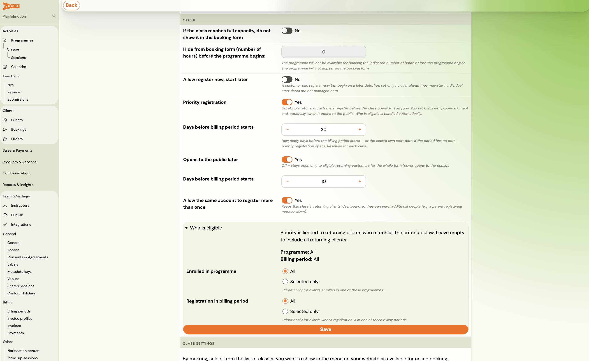

# Priority registration for returning customers

Priority registration opens a term to your existing students first, and to everyone else later — or never. Eligibility is decided by **who the person is**, not by a link you have to send out.

This is the mechanism for protecting returning students' places before new customers can book.

## How it differs from what you may already use

Zooza has two older ways to give existing students a head start. They solve different problems:

| | What it does | When it fits |
|---|---|---|
| **Auto-enrolment** | Offers each existing booking a place in the next term, which they accept or decline | You know exactly who should continue and into which class |
| **Share link** | An unlisted link that exposes one class | A small, hand-picked group you can email |
| **Priority registration** | A window where any eligible customer can book a class that is closed to the public | You want returning students to choose freely, without sending anyone a link |

The practical difference is the last column. With a share link you decide who gets it; with priority registration Zooza decides who qualifies, and the customer browses and books normally.

## Setting it up

Go to **Programmes → the programme → Settings → Online booking**, and switch on **Priority registration**.

1. Under **Priority open**, either enter **Days before billing period starts** and let Zooza fill in the date, or set **Priority opens on** directly. The offset resolves against the billing period's start — or the class's own start date if the period has no dates.
2. Decide whether it ever opens to everyone. **Opens to the public later** off means the term stays restricted to eligible returning clients for its whole length. On, you set **Days before billing period starts** or **Public opens on** the same way.
3. Optionally narrow who qualifies under **Who is eligible** (see below).
4. Click **Save**.

> There is a related switch just below: **Allow the same account to register more than once**. It keeps the class on a returning client's dashboard after they have booked, so a parent can come back and enrol another child. Without it, the class disappears from their dashboard once they have registered once.

> **Dates are anchored to the start of the term**, not to each class. An offset resolves against the earliest class start in the billing period, so every class in the term opens together. That is usually what you want — a parent with two children in different classes should not face two different opening dates.

### Excluding individual classes

A programme with priority registration on does not force it onto every class. Open the class and untick **Include in the priority window** — it then opens to everyone on the normal schedule, so a class aimed at newcomers can go public while the rest of the term is reserved.

The class also shows which phase it is in: **Priority only — never opens to the public**, **Priority now — opens to the public on** the date shown, or **Open to the public**. Check there rather than working it out from the dates.

## Who qualifies

By default: **any existing customer of yours who is logged in.** Someone who has never booked with you does not qualify, and neither does a visitor who is not signed in.

Under **Who is eligible**, you can narrow it further. As the screen says, priority is limited to returning clients who match **all** the criteria — they combine.

There are two, and each is either **All** or **Selected only**:

| Criterion | What it limits priority to |
|---|---|
| **Enrolled in programme** | Clients enrolled in one of the programmes you pick |
| **Registration in billing period** | Clients whose registration falls in one of the billing periods you pick |

Leave both on **All** and every returning client qualifies.

Setting both narrows twice over: a client would have to be in one of the chosen programmes **and** in one of the chosen terms.

Eligibility is worked out by Zooza, not by the booking form. There is no setting that lets a visitor claim eligibility for themselves.

## What customers see

**Before they log in**, a class in its priority window does not appear on the booking form at all. It is not shown as full or as closed — it is simply absent.

**Once they log in**, the list is fetched again and the class appears if they qualify. Logging in happens inline on the booking form, without leaving the page — see [the login step](../faq/booking-widget-faq.md#the-booking-form-now-asks-people-to-log-in--can-they-still-book-without-an-account).

Eligible customers also see the open window on their profile dashboard, with a button to register — so they do not have to remember to check.

## When the class opens to the public

If you set a public date, Zooza flips the class overnight on that date. You can also open it early by hand.

The flip happens **once and in one direction**. Once a class is public it stays public; nothing reverts it to the priority window.

If you set no public date, the class stays restricted to eligible customers for the whole term.

## Troubleshooting

**A parent says the class is not on the list.** Ask whether they are logged in. This is the most common report, and it is the feature working as designed — the class is invisible to anonymous visitors.

**A returning customer is logged in but still cannot see it.** Check the audience conditions on the programme. They combine, so a customer who attended the right programme but at a different venue will not qualify.

**The class did not open to the public.** Check that a public date is set. A programme configured before priority registration existed is not managed by the nightly flip, so a class from an older term will not open on its own.

## Related

- [Booking widget FAQ](../faq/booking-widget-faq.md) — the login step on the booking form.
- [Auto-enrolment responses](auto-enrolment-responses.md) — offering places directly instead.
- [Share a class link](share-course-link.md) — an unlisted link for a hand-picked group.
- [Delayed start](delayed-start-registration.md) — letting clients join a term late rather than waitlist them.
- [Shared sessions](shared-sessions.md) — when the returning-student and newcomer classes share a room.
