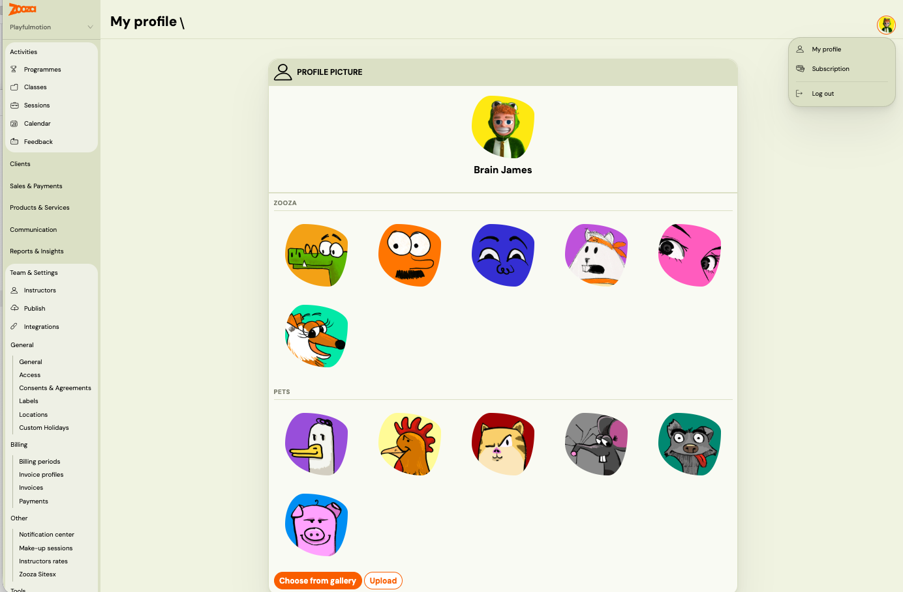

# Set your profile avatar

Your avatar appears in the Zooza team member list and in other places across the app where your profile is shown. You can set it by uploading your own photo or by picking from a gallery of preset images — no photo needed.

---

## Choose a preset avatar

1. Go to **Settings → My profile** (or click your name in the top right corner).
2. Click your current avatar or the **Change avatar** button.
3. Select **Choose from gallery**.
4. Browse the preset images and click the one you want.
5. Click **Save**.

Your avatar is updated immediately.

---

## Upload your own photo

1. Go to **Settings → My profile**.
2. Click your current avatar or the **Change avatar** button.
3. Select **Upload photo**.
4. Choose an image file from your device.
5. Click **Save**.

---

## Remove your avatar

To go back to the default placeholder, select any preset from the gallery — there is no separate "remove" option. Alternatively, upload a blank or neutral image.

---

## Related

- [User roles](./user-roles.md)
