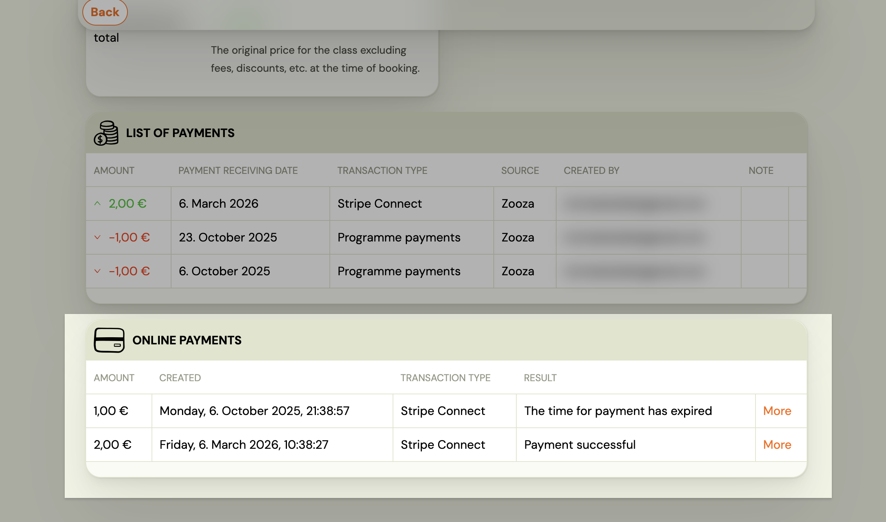
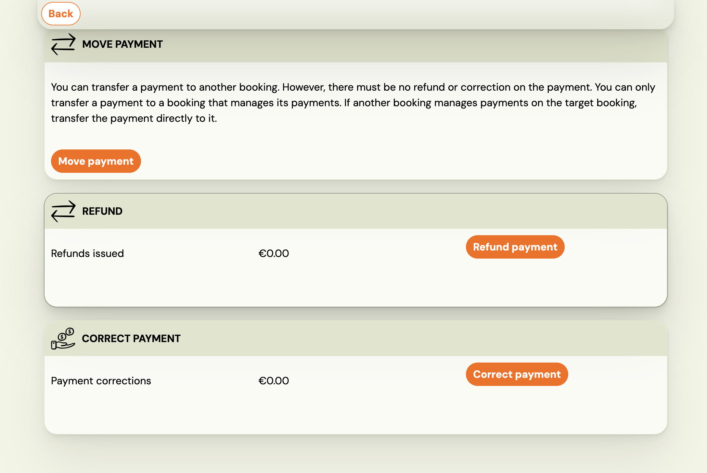
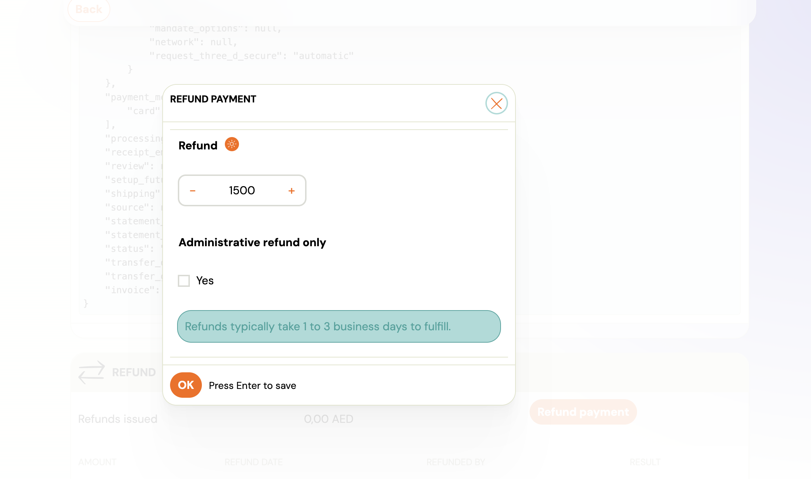
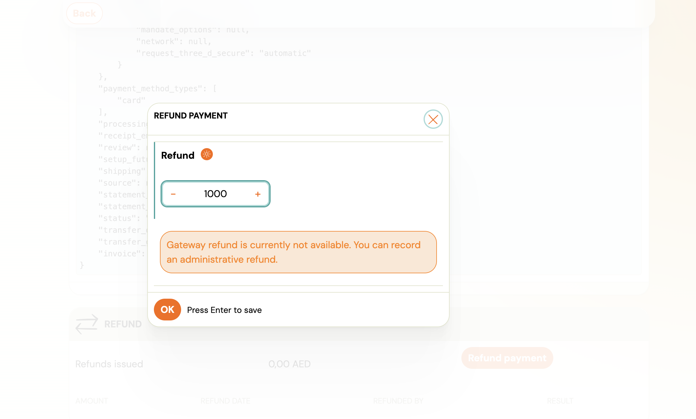
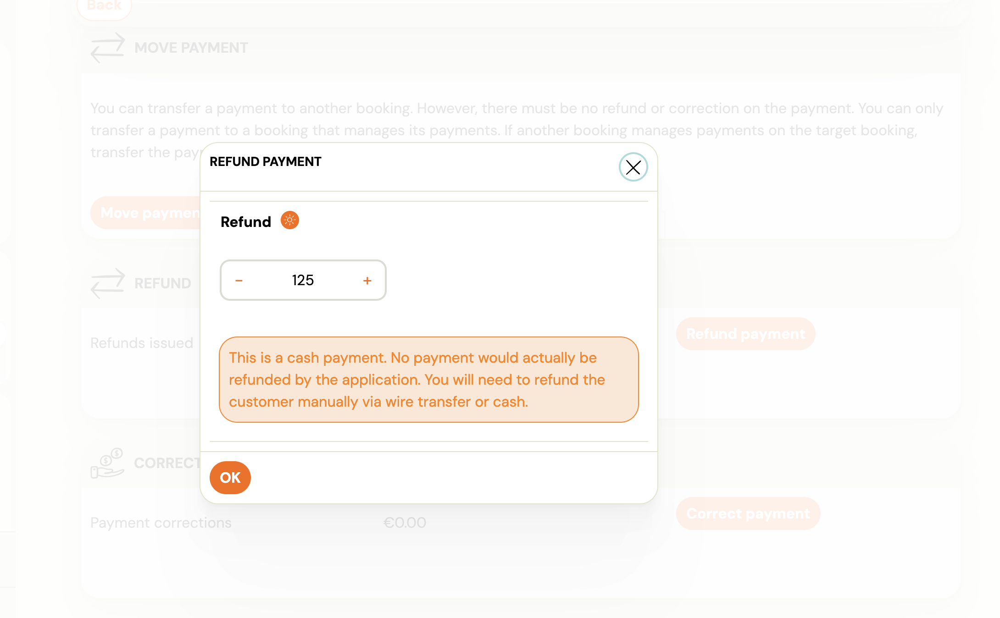

# Recording an Administrative Refund for an Online Payment

An administrative refund lets you record a return of funds in Zooza **without triggering a gateway refund through Stripe**. Use this when:

- The money was returned outside Zooza (bank transfer, cash, offset against another invoice).
- Stripe is no longer connected to your Zooza account but you need the refund in your records.
- You want to record the refund now and process the actual return through Stripe separately.

The refund creates a negative transaction in Zooza and reduces the recorded income on the booking. It does **not** automatically adjust the client's outstanding debt — that step is separate and depends on your agreement with the client.

## How to record an administrative refund

1. Go to **Clients** → **Bookings** and open the relevant booking.
2. Scroll to the **Payments** section and find the transaction list at the bottom.
3. Click the online payment transaction you want to refund.
4. Click **Refund payment**.
5. Enter the amount — full or partial.
6. Choose whether this is an administrative record only:
   - **If Stripe is connected:** You will see an **Administrative refund only** checkbox. Tick **Yes** to record the refund in Zooza without sending money through Stripe. Leave it unticked to process a real Stripe refund.
   - **If Stripe is disconnected:** The dialog shows *"Gateway refund is currently not available. You can record an administrative refund."* Only the administrative record option is available.
   
   
Click **OK**.

The refund is recorded immediately with status `ok`. A negative transaction appears in the payment list, reducing the total income on the booking.

## What to do after recording the refund

Recording the refund does **not** automatically change what the client owes. Decide what applies to your situation:

| Situation | What to do next |
|---|---|
| Client overpaid and you returned the excess | No further action needed — the refund record is sufficient. |
| Client should now owe less (e.g. cancelled part of programme) | Go to **Payments → Edit** and reduce the total charge (debt) accordingly. |
| You agreed a discount instead of a cash return | Add a discount or manual credit to the booking instead of reducing the debt. |

## How administrative refunds appear in reports

Administrative refunds are recorded as negative payment transactions, the same as gateway refunds. In your payment reports they reduce total income. The `source` field in the underlying data distinguishes administrative refunds (`administrative`) from gateway refunds (`gateway`), so your accountant or Zooza support can identify them if needed.

## Related

- [Payment Correction vs Refund](payment-correction-vs-refund.md) — when to use a refund versus editing a payment record.
- [Administrative Refund FAQ](../faq/administrative-refund-faq.md) — common questions about this feature.
