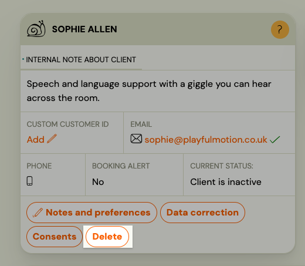
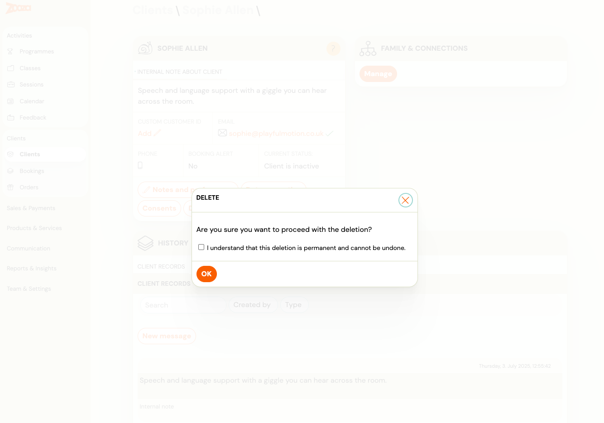

# Remove a Client or User from Your Account

You can remove a person or a user login from your Zooza account. This is a company-scoped action — the person's data is disassociated from your company but is never permanently deleted from the Zooza platform.

---

## Remove a person (client record)

Removing a person cleans up all their data within your company: their profile, custom fields, relationships, and booking history links. The person's bookings are unlinked from your company scope.

1. Go to **Clients** and open the client's profile.
2. Click the **Delete** menu. 
3. Select **Remove from company**.
4. Confirm the action.

**What happens:**
- The person is removed from your client list.
- All their booking associations within your company are cleaned up.
- The person record itself is not deleted — if they exist in another Zooza account, that account is unaffected.

> **Note:** Orders are not yet cleaned up automatically when a person is removed. This will be addressed in a future update.

---

## Remove a user (login account)

Removing a user disables their ability to log into your Zooza account. If the user has an associated client profile (person), that person is also disassociated from your company.

1. Go to **Settings → Team** (or the Users section).
2. Find the user and open their record.
3. Click **Remove from company**.
4. Confirm the action.

**What happens:**
- The user can no longer log in to your Zooza instance.
- Their associated client profile is removed from your company (if one exists).
- The user account itself is not deleted — they can still exist in other Zooza accounts.

---

## Frequently asked questions

### Is this permanent?

The removal is permanent for your company — the person or user will not appear in your account after removal. However, the underlying record is never hard-deleted from Zooza. Contact support if you need to restore access.

### What about the client's payment history?

Payments linked to bookings within your company are part of the booking record, not the person record directly. Booking cleanup is handled as part of the removal process.

### Can I remove an admin or instructor?

Yes. Use **Settings → Team** to remove staff users. Removing a team member revokes their access immediately.

### Can a removed client re-register?

Yes. If they use the same email address to book again via your booking form, they will be re-created as a new client in your account.
