# Replacement Hours — Complete Guide

Replacement hours (also called make-up or catch-up sessions) allow children who miss a class to attend a different session as a substitute. This guide covers the full replacement workflow: enabling replacements, how credits are earned, how parents book them, capacity rules, cross-company replacements, and troubleshooting.

For quick answers, see [Replacement Hours FAQ](../faq/make-up-sessions-faq.md).

---

## How the replacement system works

The replacement flow follows these steps:

1. A child is registered in a class with replacement hours enabled.
2. The child misses a session and is marked as **Cancelled** (excused) in attendance.
3. The system generates a **replacement credit** on the registration.
4. The parent opens their **Client Profile** and sees available replacement sessions.
5. The parent selects a session with available capacity and confirms the replacement.
6. The child attends the replacement session.

Key points:

- Replacement credits are tied to the **registration**, not to the child globally.
- Available replacement sessions are calculated dynamically based on capacity, programme match, and timing rules.
- The system limits the replacement offer to a maximum of approximately 200 options to keep the profile loading time reasonable. If the programme has a very large number of sessions, each parent may see a slightly different subset of available slots.

---

## Enabling replacements on a programme

Replacement hours are configured at the **programme level** and can be fine-tuned per class.

1. Go to the programme and open **Settings**.
2. Find the **Replacement hours** (make-up sessions) section.
3. Enable replacement hours for the programme.
4. Configure the replacement settings:
   - **Credit expiration policy** — choose one of three options:
     - Credits carry over to the next billing period (trimester/semester).
     - Credits expire at the end of the current class (group).
     - Credits expire after a set number of days.
   - **Replacement waiting list** — enable or disable the waiting-list/queue feature.
   - **Cancellation deadline** — set how far in advance a client must cancel to earn a replacement credit (e.g., 1 hour before the session).

You can also access the global replacement settings at:
`Settings > Replacement hours` (`zooza.app/#settings/replacements`).

<!-- REVIEW: Confirm whether per-programme settings override or inherit from the global replacement settings page. -->

---

## Attendance states and their impact on replacement credits

The attendance state recorded for a session determines whether a replacement credit is generated.

| Attendance state | Replacement credit generated? | Description |
|---|---|---|
| **Cancelled** (excused / unsubscribed) | Yes | The client actively cancelled before the session. This is the only state that creates a replacement credit. |
| **Did not attend** (no-show) | No | The client did not show up and did not cancel in advance. No credit is granted. |
| **Attended** | No (not applicable) | The child attended the session normally. |

This distinction is by design. Clients who simply do not show up without cancelling are not eligible for make-up sessions.

### Automatic "Did not attend" status

If a client does not cancel before the session and the instructor does not mark them as attended, the system automatically sets the status to **Did not attend** after the session ends. This automatic status does **not** generate a replacement credit.

### Correcting an attendance state

If a client contacts you saying they did not receive a replacement credit, check the attendance record for that session:

1. Open the session from the **Calendar**.
2. Find the child in the attendance list.
3. If the status shows **Did not attend** instead of **Cancelled**, that explains why no credit was generated.
4. If the absence was legitimately excused, manually change the state to **Cancelled**. The system will then generate the replacement credit.

For more details on attendance, see [Attendance and Catch-up Classes FAQ](../faq/attendance-and-catchups-faq.md).

---

## Capacity settings for replacements

Replacement bookings respect class capacity. You can configure extra capacity specifically for replacement students at two levels.

### Global extra capacity (programme level)

1. Go to **Settings > Replacement hours** (`zooza.app/#settings/replacements`).
2. Set the **Extra capacity for replacement hours** value (e.g., `1`).
3. This means every class in every programme gets one additional slot beyond its normal capacity, reserved for replacement students.

For example, if a class has a capacity of 10 and the extra capacity is set to +1, up to 11 students can attend that session: 10 regular plus 1 replacement.

### Per-class override

On the class detail page, you can override the global extra capacity value. There are two modes:

- **Replace** — the per-class value completely replaces the global setting. If the global setting is 1 and you set the class override to 0, that class will have 0 extra replacement slots.
- **Add to** — the per-class value is added on top of the global setting. If the global setting is 1 and you add 1 more on the class, that class gets 2 extra replacement slots.

If you do not set any per-class override, the global value applies.

<!-- REVIEW: Confirm exact navigation path for per-class extra capacity setting — may be under class detail > Settings tile or a dedicated Replacement hours section. -->

---

## The 4-day rule (replacement availability timing)

The system does **not** allow replacement bookings into classes that have not yet started. Specifically, replacement sessions in a class become available only **4 days before the class start date**.

This rule exists to protect capacity for regular paying clients. Without it, replacement students could fill up a new class before it officially begins, leaving no room for full-term registrations.

### Example

A new class is scheduled to start on January 15. Replacement sessions in that class will not appear in parent profiles until January 11 (4 days before the start).

### Workaround for single-session classes

If you create one-off classes (single-session groups) for replacement purposes, the 4-day rule still applies. To make the replacement session available sooner, change the **class start date** in the class settings to an earlier date (at least 4 days before the session).

<!-- REVIEW: Confirm whether the 4-day rule is a fixed system constant or configurable per account. Support tickets suggest it is currently fixed but could become configurable. -->

---

## How parents book replacements in the Client Profile

Once a replacement credit exists on a registration, the parent can book a replacement session through their **Client Profile** (the parent portal):

1. The parent logs in to the profile widget on your website (or via `zooza.app`).
2. They navigate to their child's registration or attendance view.
3. Sessions where the child was cancelled show a replacement option.
4. The parent sees a list of available replacement sessions filtered by:
   - Programme compatibility (matching age group / programme type).
   - Available capacity (including extra replacement capacity).
   - The 4-day rule (only classes that have started or start within 4 days).
   - The cancellation deadline (sessions that have not yet passed the cutoff time).
5. The parent selects a session and confirms.
6. The system books the child into the replacement session and deducts the credit.

### Filtering and display limits

The replacement offer is calculated dynamically. If the programme has a very large number of eligible sessions (more than approximately 200), the system limits the display to keep loading times reasonable. This means:

- Different parents may see slightly different subsets of available sessions.
- The available sessions can change throughout the day as capacity shifts.
- If a parent does not see a specific session, it may be because it was not included in the current calculation batch, or because capacity was temporarily unavailable.

---

## The "sign back up" button

When a client cancels (unsubscribes) from a session, they may later want to return to that same session. The **"Sign back up for this session"** button in the Client Profile allows this.

### How it works

1. The client cancels from a session (earns a replacement credit).
2. Optionally, the client books a replacement session elsewhere.
3. If the client changes their mind, they can click **"Sign back up for this session"** on the original session they cancelled from.
4. If capacity is available on the original session, the system:
   - Re-enrolls the client on the original session.
   - Cancels any unused replacement bookings or waiting-list entries for that credit.
5. If capacity is **not** available (e.g., a replacement student took the spot), the system shows a message that the session is full.

### Important notes

- This button is available automatically when replacement hours are enabled. You do not need to enable it separately.
- Capacity is checked at the moment the client clicks the button. Even if the calendar shows a free spot when you (the admin) look at it, the spot may have been taken at the exact moment the client tried.
- The button is intended to handle accidental cancellations or clients who change their mind.

---

## Cross-company / franchise replacements

In franchise networks where multiple branches operate as separate legal entities (separate Zooza accounts), replacement hours can be shared across companies. This allows a child registered at one branch to book a make-up session at a different branch.

The setup has three steps:

1. Linking the companies.
2. Enabling cross-company replacements on the programme.
3. Configuring restrictions for incoming replacement clients.

### Step 1 — Linking companies

Before clients can use replacements across branches, you must link the branches in Zooza.

1. Go to **Settings** → **Replacement lessons**.

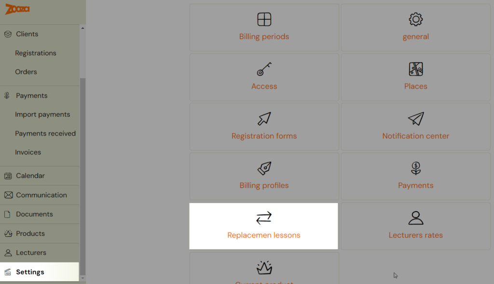

2. Click **Cooperate with a company**.

3. Enter the email address of the branch you want to link. This must be the same email the branch used to register their Zooza account.
4. Click **Send an invitation**. The other branch receives a notification requesting the link.
5. Once the other branch approves, the companies are linked.

You can see all sent requests and their status in the **Replacement lessons** tab. If a request is approved, you can click **Cancel request** to unlink the companies.

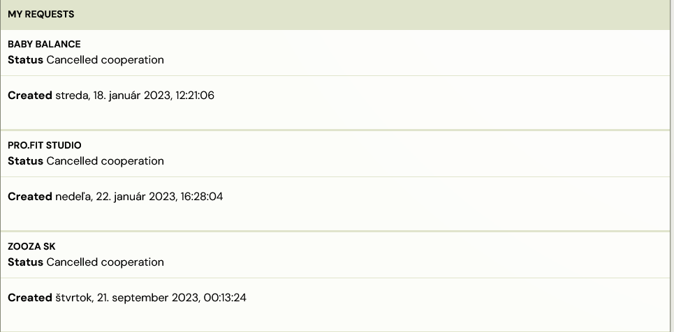

### Step 2 — Enabling replacements from other companies on a programme

Once the branches are linked, you can allow cross-company replacements at the programme level.

1. Open the programme and go to the **Replacement lessons** section.
2. Click **Edit**.

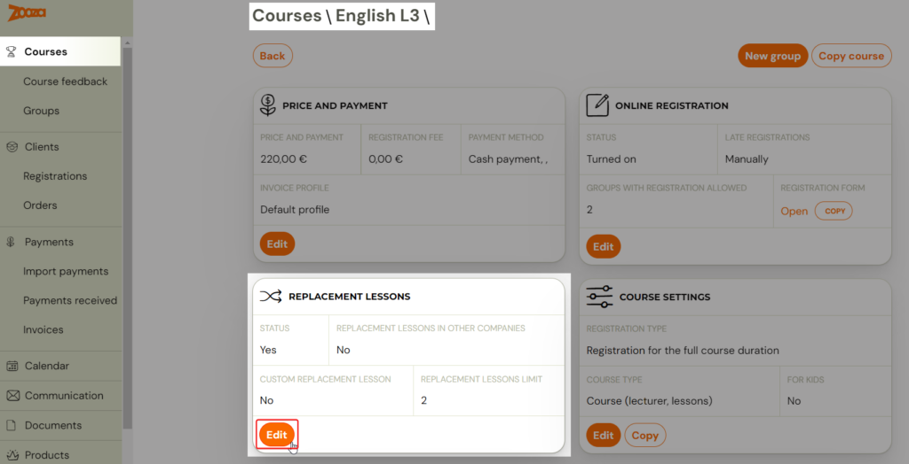

3. Under **Replacement lessons**, check **Allow replacement lessons from other companies**.
4. Click **Save**.

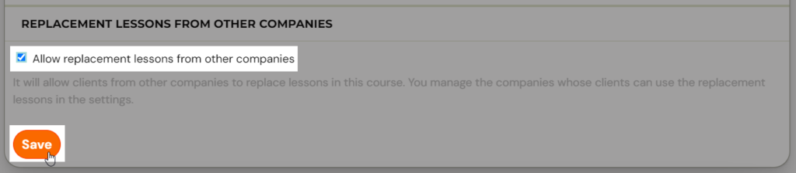

### Step 3 — Configuring restrictions

In the **Restrictions** section, configure the conditions under which clients from other branches can book replacement sessions in your programmes.

> **Important:** These restriction settings control incoming replacements — they define under what conditions clients from another branch can take a replacement session at **your** company. They do not affect your own clients booking replacements elsewhere.

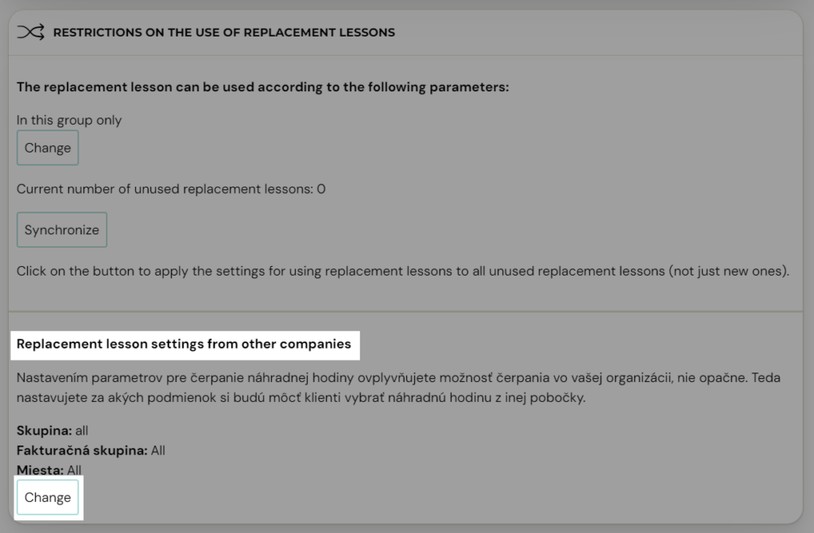

### Client perspective

In the Client Profile, the client sees a combined view of all available replacement sessions regardless of which branch offers them. The client can see their replacement entitlements in the **Unexpired replacement lessons** tab.

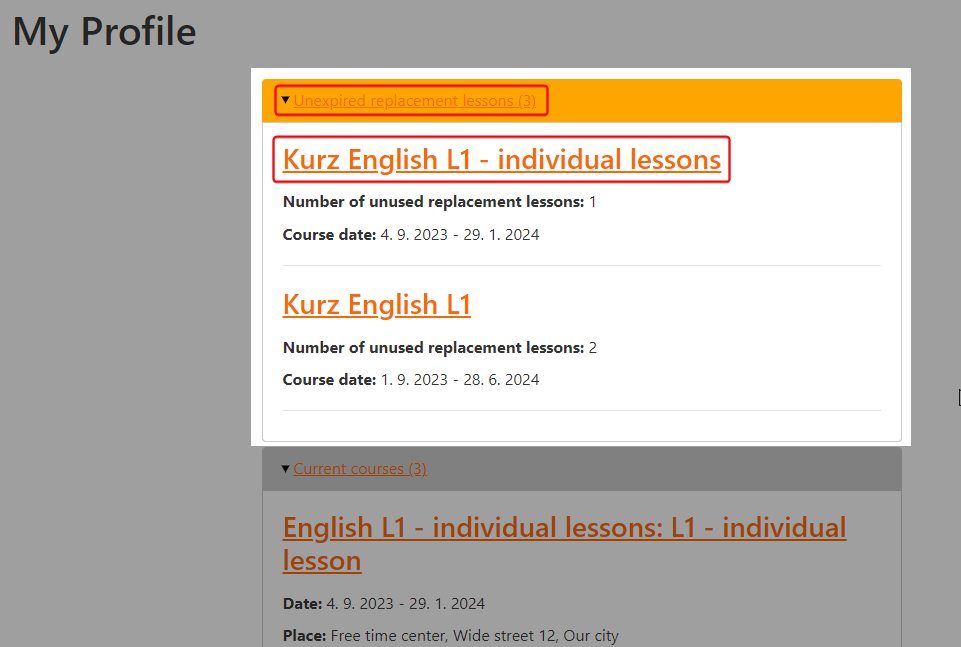

To select a replacement session, the client clicks on the programme and then clicks **Choose Replacement Lesson** for the cancelled session.

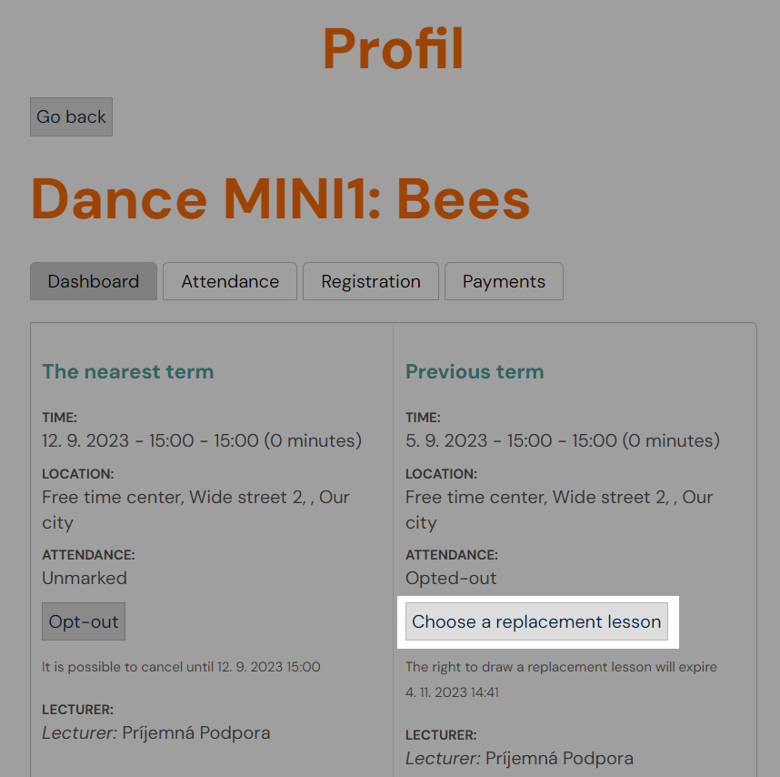

The available sessions are displayed based on the programme settings at each branch, including sessions from other linked branches.

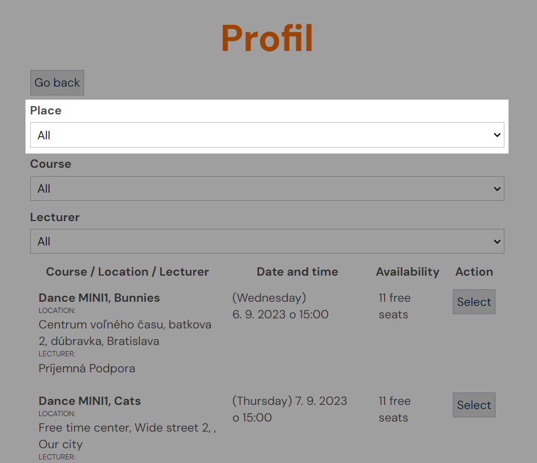

After selecting a replacement, the client sees the booked session with a note indicating that the session is operated by another branch.

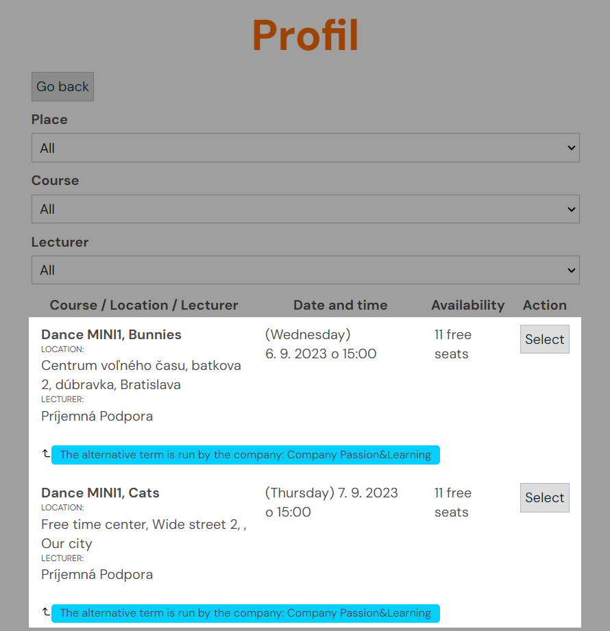

The client receives standard notification emails about the upcoming session, including the correct location and details from the branch where the replacement was booked.

### Admin view — home branch

When a client books a replacement at a different branch, the home branch admin can see **where** the client selected the replacement, but cannot see the location, time, or other details from the other branch. The admin can cancel the replacement and book a new one at their own branch.

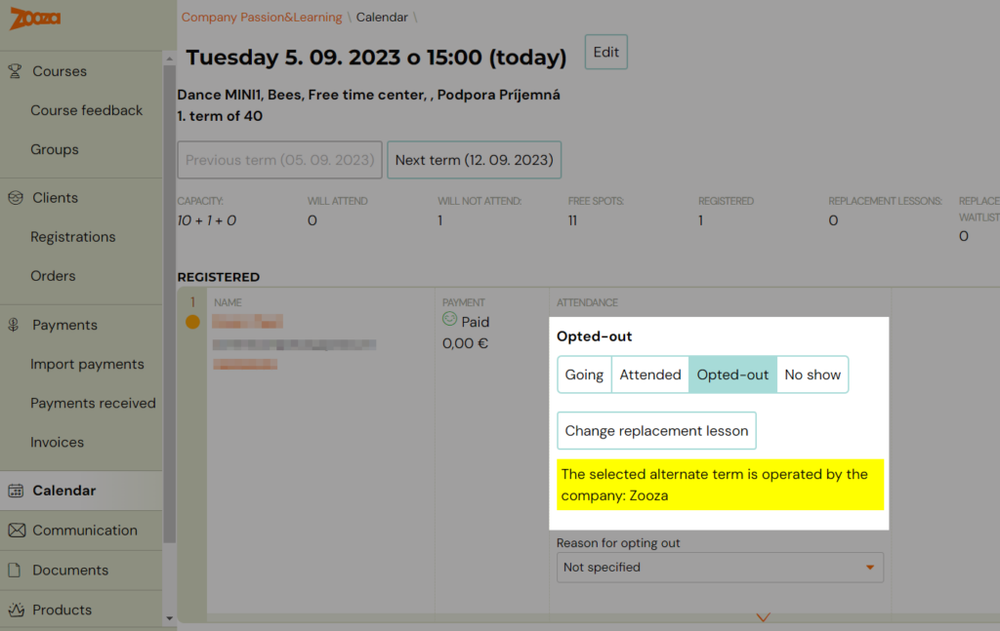

This restriction protects client personal data — the system prevents data from being shared with a third party without the client's consent.

### Admin view — host branch

When a replacement client from another branch books a session at your branch, the client's details appear in the attendance register for that session. As the host admin, you can:

1. Mark attendance — arrived or not arrived.
2. Cancel the replacement — this removes the client's data from the attendance record.

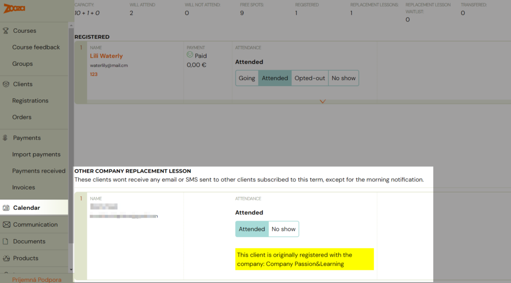

### Replacement report

In the **Calendar** tab, a report shows how many replacement sessions your clients used at your own branch versus other branches. The report includes the price for each replacement, which serves as a basis for financial arrangements between branches. Click the **Replacement lessons** button to view this report.

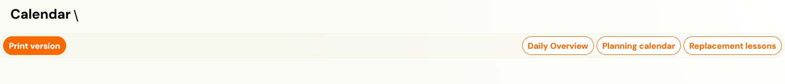

> **Note:** Financial settlements between branches happen outside Zooza, based on your mutual agreement. Zooza provides the data but does not process inter-branch payments.

### Common issues

- **Replacements between branches stopped working** — Verify that the cooperation link is still active in **Settings** → **Replacement lessons**. If the other branch cancelled the request, you need to re-link.
- **Sessions from another branch are available too early** — The 4-day rule applies across companies. If one company's classes have an earlier start date, their sessions may appear before expected.
- **Attendance marking for cross-company replacements** — There have been reported issues where a parent could not mark attendance for a cross-company replacement in the calendar. If this occurs, contact support with the specific registration and session details.

---

## Replacement credit management

### Viewing credits on a registration

1. Open the registration detail for the client.
2. Scroll to the bottom of the page to the **Credits** section.
3. Click to display all credits associated with that registration.
4. Each credit shows: the session it was generated from, its status (active, used, expired), and its expiration date.

### Deleting or expiring credits manually

If a replacement credit was created by mistake, or you need to remove it for any reason:

1. Open the registration detail.
2. Go to the **Credits** section at the bottom.
3. Find the replacement credit you want to manage.
4. Click the **More** button (on the right side of the credit row).
5. On the credit detail screen, you can:
   - **Change the expiration date** — set it to a past date to expire the credit immediately.
   - **Delete the credit** — use the delete button at the bottom of the screen to remove it entirely.

### Credit carry-over between billing periods

By default, replacement credits may expire at the end of the current class (group). You can change this behavior in the global replacement settings:

1. Go to **Settings > Replacement hours** (`zooza.app/#settings/replacements`).
2. Choose one of three expiration policies:
   - **Carry over** — credits transfer to the next billing period (trimester/semester). Use this if you want clients to retain unused credits across terms.
   - **Expire at end of class** — credits are valid only within the current class duration. This is the default.
   - **Expire after X days** — credits expire a set number of days after they are created, regardless of billing period boundaries.

The per-programme settings can override the global setting. Check the programme's **Settings > Replacement hours** section to confirm which policy applies.

---

## Replacement waiting list (queue)

When all available sessions are full, clients can join a **replacement waiting list** (queue) instead of giving up on finding a make-up session.

### How the waiting list works

1. The parent opens their profile and sees that all replacement sessions are full.
2. Instead of a booking button, they see an option to **join the waiting list** for one or more sessions.
3. When a spot opens up (e.g., another client cancels), the system notifies the first person in the queue.
4. The notification contains a link. The client must **click the link** to confirm they want the spot.
5. Only after clicking the link is the replacement confirmed and the child booked into the session.

### Enabling or disabling the waiting list

The waiting list can be enabled or disabled per programme:

1. Go to the programme settings.
2. Find the **Make-up sessions waitlist** option.
3. Toggle it on or off.

When the waiting list is disabled, clients only see sessions where a spot is currently available. If all sessions are full, no replacement options are shown.

### Viewing the waiting list in attendance

The waiting-list entries are visible in the attendance/session view. The process is fully automated.

<!-- REVIEW: Confirm where exactly admins can view and manage the replacement waiting list — is it visible in the session detail, the registration detail, or a dedicated section? -->

---

## Troubleshooting

### Client cannot see replacement sessions in their profile

Check the following:

1. **Attendance state** — The session must be marked as **Cancelled**, not **Did not attend**. Only the Cancelled state generates a replacement credit.
2. **Class has not started yet** — The 4-day rule prevents replacements into classes that have not started. Sessions become available 4 days before the class start date.
3. **Capacity is full** — All compatible sessions may be at capacity (including extra replacement capacity). If the waiting list is enabled, the client should see a queue option instead.
4. **Credit has expired** — Check the credit on the registration detail. It may have expired based on your expiration policy.
5. **Display limit** — With very large programmes (hundreds of sessions), the system limits the display to approximately 200 options. The specific session the client is looking for may not appear in their current view. Ask them to refresh or try again.
6. **Programme mismatch** — Replacements are only offered within compatible programmes/age groups. If the client is looking for a session in a different programme, it will not appear.

### Replacement was confirmed but not actually booked

This is a rare issue. If a client reports that they confirmed a replacement but it does not appear in their schedule:

1. Check the registration's credit section to see if the credit was consumed.
2. Check the session attendance to see if the child appears.
3. If neither shows the booking, contact Zooza support with the registration number and the approximate time the client attempted the booking.

### "Sign back up" button does not work

1. **Capacity check** — The original session may be full at the moment the client clicks the button, even if it appeared to have space when you checked.
2. **Timing** — The button may not work if the session has already passed the cancellation deadline.
3. **Bug edge cases** — There have been isolated cases where the attendance evaluation did not process correctly. If you can identify the exact time the client attempted, contact support for investigation.

### Cross-company replacements not working

1. Verify that inter-company replacement rules are still configured. Contact Zooza support to check.
2. Ensure the 4-day rule is applied consistently across linked companies.
3. Check that the programmes at both branches are compatible (matching age groups and programme types).
4. Ask the client to try refreshing their profile, as availability is calculated dynamically.

### Credits not carrying over to the next billing period

1. Check the global setting at **Settings > Replacement hours**. If the policy is set to "expire at end of class," credits will not carry over.
2. Check the per-programme setting, which may override the global policy.
3. Change the policy to "carry over" if you want credits to persist across billing periods.

### Too many or incorrect replacement credits

1. Open the registration detail and go to the **Credits** section.
2. Identify the incorrect credit.
3. Either change its expiration date to a past date or delete it using the **More** button on the credit row.

---

## Related guides

- [Attendance and Catch-up Classes FAQ](../faq/attendance-and-catchups-faq.md)
