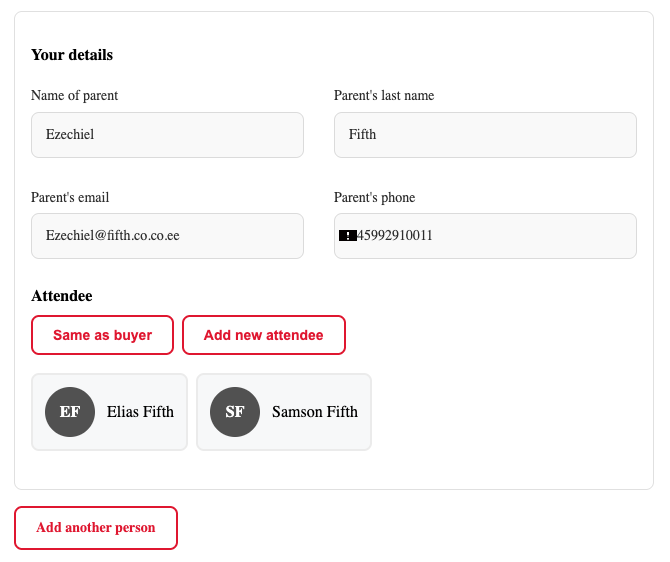
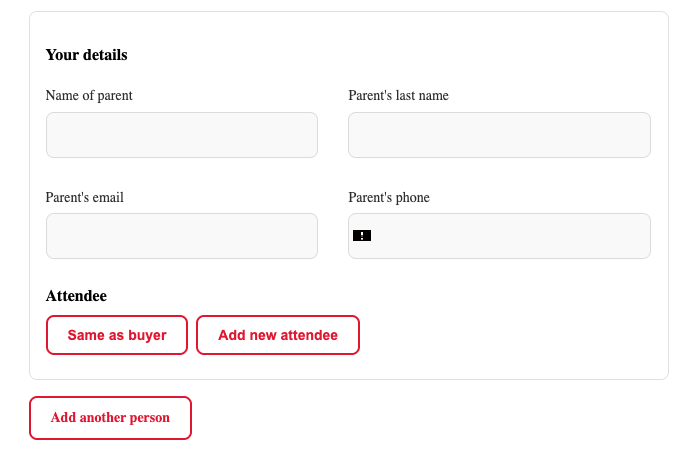

# Booking widget experience for returning clients

When a client logs in to the booking widget, the form experience changes significantly compared to first-time visitors. Returning clients no longer have to re-enter their children's details from scratch — they can select from people they have previously registered.

This guide explains how the updated booking flow works for logged-in returning clients, and what it means for your admin view.

---

## Overview: buyer vs. attendee

The booking form distinguishes between two roles:

| Role | Who it is | What happens |
|---|---|---|
| **Buyer** | The account holder — the parent or guardian who is making the booking. | For logged-in clients, the buyer's name and email are pre-filled from their account and cannot be changed. |
| **Attendee** | The person who will actually attend the class — typically the child. | Can be selected from a list of previously registered people, or entered as a new person. |

This separation means the system knows who is paying and who is attending, which is used for invoicing, communication, and loyalty discount calculations.

---

## The person selection step

When a logged-in client opens the booking form and the programme collects attendee details, the form shows a **person selection step** before the main registration form.

The client sees:
- A list of people they have previously registered (e.g., children by name)
- An option to add a new person

When the client selects a person from the list:
- The attendee fields are pre-filled with the saved details (name, date of birth, etc.)
- If the [Loyalty Program](./loyalty-program.md) is active, the price is recalculated based on the selected person's booking history. A different child may result in a different sibling discount tier.

When the client chooses "New person":
- The form shows empty fields to fill in manually
- The new person is saved to their account after the booking is completed

---

## The buyer section (account holder)

For logged-in clients, the **buyer section** of the form is pre-populated:

- **Name** — taken from the account, shown as read-only
- **Email** — locked to the account email; cannot be changed during booking

This ensures that confirmation emails, invoices, and loyalty discount tracking always use the correct account email. The email is the key identifier for all loyalty calculations (sibling discount, returning client discount, referral).

---

## What this means for admin

### In the booking record

Each booking now clearly shows both roles:
- **Buyer** (account holder) — the parent who made the booking
- **Attendee** — the child or person who attends

This is visible in the booking detail and in reports. It is the same information as before, but now structured more explicitly.

### For loyalty discounts

All loyalty discount calculations use the **buyer's email** as the identifier. When a logged-in client selects a different child for their booking, the loyalty engine recalculates eligibility based on that specific child's position in the family's booking history.

For example: if a parent has one child already registered (2nd child was added last term), selecting a third child in the person selection step triggers the 3rd-child tier of the sibling discount — automatically.

### For multiple-child bookings

When a programme allows multiple bookings per form submission (see [Allowing multiple booking](./allowing-multiple-booking.md)), logged-in clients can go through the person selection step for each child separately. They can mix existing people with new ones in a single submission.

---

## What changes for first-time visitors

Nothing. The person selection step only appears for logged-in clients who have a previous booking history. First-time visitors and non-logged-in clients see the standard booking form unchanged.

---

## Frequently asked questions

**Do clients need an account to use the person selection?**
Yes. This feature requires the client to be logged in to the booking widget. Clients without an account, or who are not logged in, see the standard form.

**Is the person selection step visible for all programmes?**
The step appears when the programme collects attendee details separate from the account holder (i.e., when the child's name, date of birth, etc. are collected). Programmes that only collect the registrant's own details may not show this step.

**Can a client update a previously registered person's details?**
The pre-filled details can be edited within the booking form. Updates made during booking are applied to that booking's record. Changes to the saved person's profile may or may not be persisted depending on configuration.

**Why is the email locked for logged-in clients?**
The email is the identifier used across all of Zooza — for loyalty discount tracking, invoicing, and communication. Allowing it to be changed mid-booking could create mismatches between the account and the booking records.

**What if a client wants to book under a different email?**
They need to log out and book as a new visitor, or contact you to merge their accounts.

For more, see [Booking Widget FAQ](../faq/booking-widget-faq.md).
