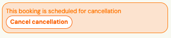
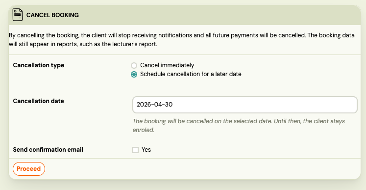

# Schedule a registration cancellation

When a client's registration needs to end on a specific future date — for example, they gave notice, their term ends, or you negotiated a final attended session — you can schedule the cancellation in advance. Zooza handles the rest:

- The registration stays active until the scheduled date.
- Sessions on and after the cancellation date are automatically hidden from the client's attendance list.
- You can reference the cancellation date in email and notification templates.

---

## Schedule a cancellation

1. Open the registration.
2. Click **Actions → Schedule cancellation**.
3. Set the **Cancellation date**.
4. Confirm.

The registration status shows as **Cancellation scheduled** with the target date. On that date, Zooza automatically cancels the registration.



---

## What happens to attendance

As soon as you save the scheduled cancellation, Zooza hides all sessions **on and after the cancellation date** from the client's attendance roster. This keeps trainer attendance lists clean — trainers do not see a slot for a client who is already effectively leaving.

**What gets hidden:** sessions with no attendance record yet, or sessions marked as `going`. Only these are affected automatically.

**What is NOT touched:** any session where you or another admin explicitly set a status — attended, cancelled, no-show, on hold, waitlist. Those remain exactly as you set them.

**Clients do not see sessions past the cancellation date** in their profile widget, even if the registration is still technically active.

---

## Change the cancellation date

1. Open the registration.
2. Click **Actions → Change cancellation date**.
3. Set the new date.
4. Confirm.

Zooza reverts attendance hiding under the old date and re-applies it under the new one. Sessions between the old and new date are restored to visible; sessions from the new date onward are hidden.


---

## Cancel the scheduled cancellation (revoke)

If the client changes their mind:

1. Open the registration.
2. Click **Actions → Revoke cancellation**.

All automatically hidden sessions are restored to visible. Any session you had explicitly set to a non-standard status is untouched.

---

## Use the cancellation date in email templates

Two merge variables are available for use in any email, SMS, or WhatsApp template that works with registration data:

| Variable | Value |
|---|---|
| <code>&#42;&#124;CANCELLATION_SCHEDULED&#124;&#42;</code> | `1` if a cancellation is scheduled, `0` if not |
| <code>&#42;&#124;CANCELLATION_DATE&#124;&#42;</code> | The cancellation date in `YYYY-MM-DD` format, or empty if not scheduled |

**Example — conditional block in a Mandrill email template:**

```
*|IF:CANCELLATION_SCHEDULED|*
Your registration will end on *|CANCELLATION_DATE|*.
*|END:IF|*
```

This block only renders when a scheduled cancellation exists. Use it in renewal reminders, session notifications, or any communication where the client should know their end date.

> **Note:** SMS and WhatsApp do not support conditional `IF` blocks — the variable substitutes as `1`/`0` or the date string directly. Design those templates accordingly.

---

## What happens on the cancellation date

The nightly job checks for registrations due for cancellation and transitions them to **Cancelled**. Sessions on that date and beyond remain hidden (they are not converted to a different status — they stay in the hidden state). Sessions before the cancellation date are unaffected.

---

## Related

- [Automated notifications](./automated-notifications.md)
- [Attendance management](./admin-attendance-management.md)
