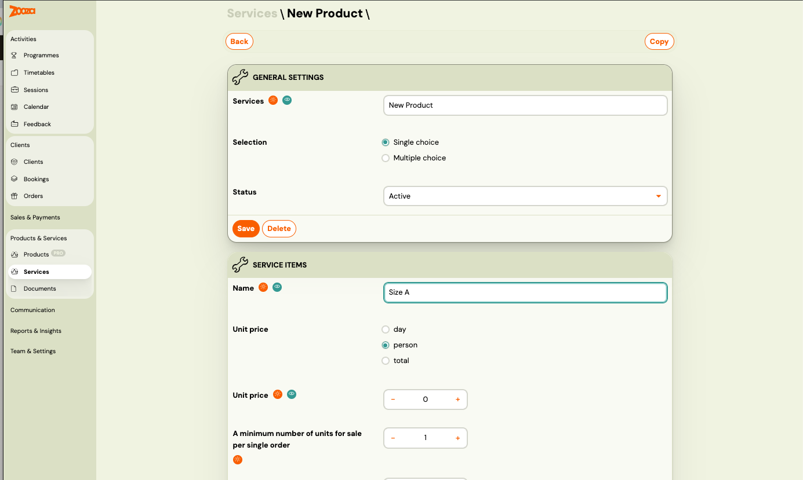
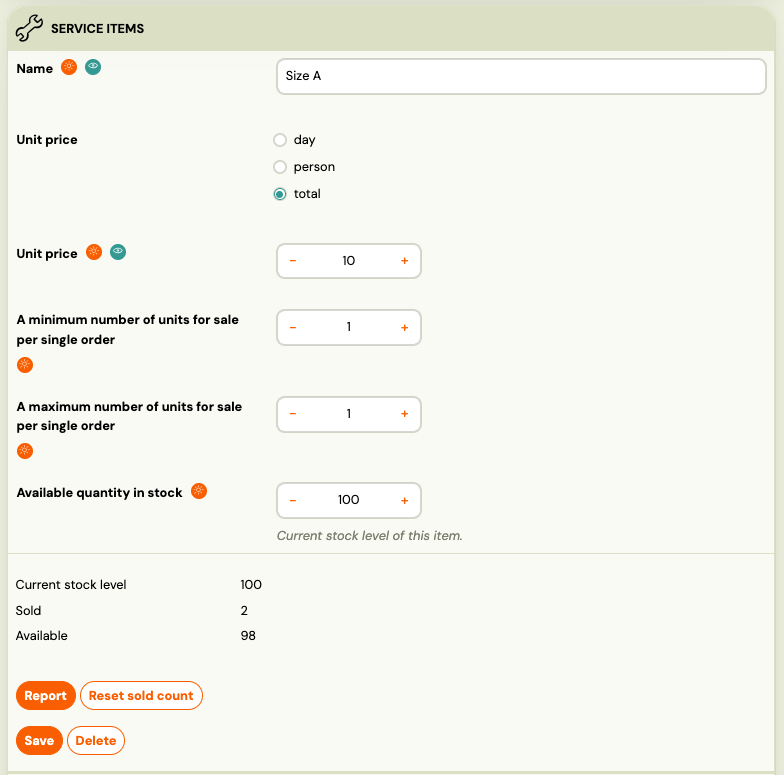
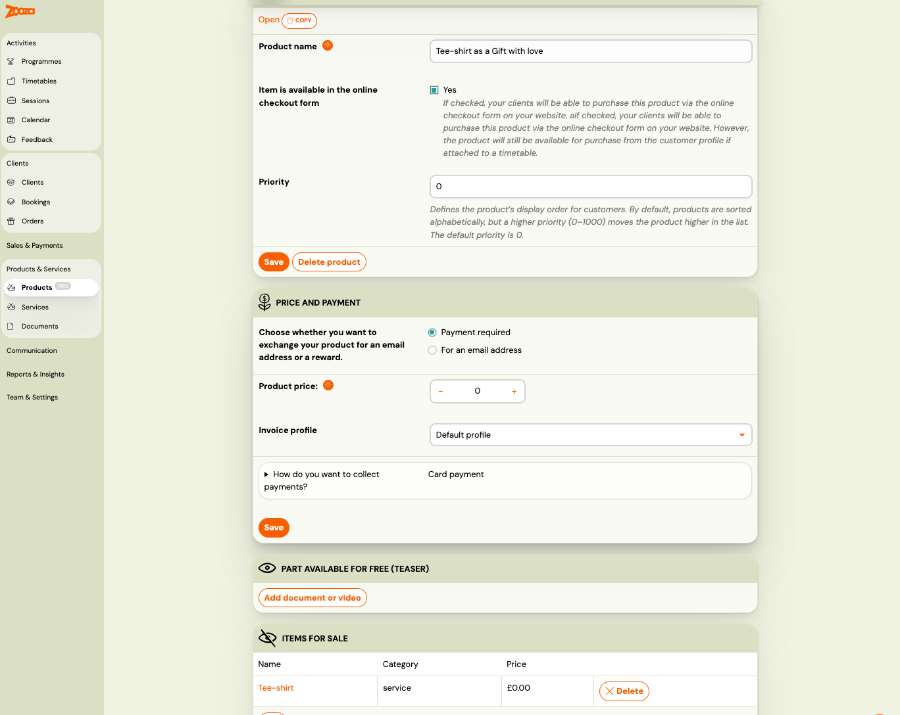
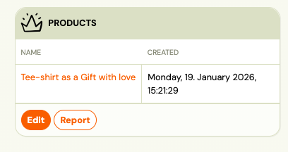
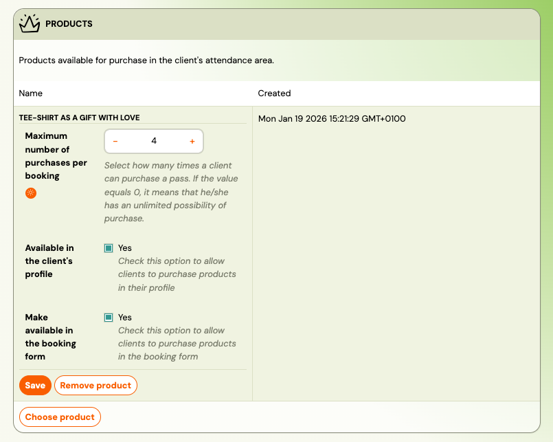
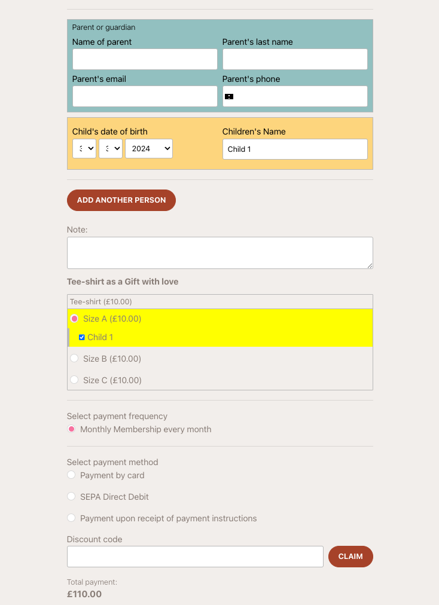

# How to sell products during booking / booking (T-shirt example)

## Overview

In Zooza, selling a physical product during the booking (booking) flow is a two-step setup:

1. Create Services (items / variants) – e.g., T-shirt sizes (S, M, L) with price and stock
2. Create a Product – class those services into one product called “T-shirt” and decide if it’s optional/mandatory Then you attach the product to a class / timetable, so it appears during booking and/or in the client profile.

 

## Step 1: Create Services first (variants like sizes)

1. Go to Services
2. Click Create new service
3. Create one service per variant (example):“T-shirt size S”
4. “T-shirt size M”
5. “T-shirt size L”
6. For each service:Set the unit price
7. Set max quantity per order (how many can be bought per booking)
8. If stock is limited, set stock quantity
9. Save each service

Why this step exists: Services work as the “items” (variants) inside a product.

## Step 2: Create the Product (the final thing you sell)

1. Go to Products
2. Click Create product
3. Fill in:Name (example: “T-shirt”)
4. Enable Available for online checkout (important if you sell online as a stand alone ITEM - not only during booking proces)
5. Decide what the product is used for:You can sell physical products (T-shirts, materials)
6. Or digital products (videos, ebooks, bundles) the same way (product + items)
7. or combination

## Step 3: Add items (services) into the product

1. Open your product (example: “T-shirt”)
2. In Items, click Add item
3. Add the services you created (S / M / L)

### Mandatory vs Optional

- Mandatory item selection (recommended for sizes):Enable Mandatory
- This forces the client to choose a size during booking (so the product shows correctly on the website and can’t be “half-selected”)

Optional product:

- If you do not make it mandatory, clients can skip buying the product during booking

Save the product.

## Step 4: Attach the product to a class / timetable (sell during booking)

1. Go to Timetable / Class
2. Open the class settings and find Product settings
 

3. Select which products you want to sell during bookingChoose “T-shirt”
4. Optional (recommended):Enable Available in client profile
5. This allows the product to be visible and purchasable from the parent / student profile after booking
 
6. Save

## Step 5: Test the booking flow

1. Open the booking / booking page as a client
2. Select a child (or a participant)
3. You will see the product (e.g., “T-shirt”) in the booking flow
4. When a size is selected, the total price increases accordinglyExample: Booking = £100
5. Booking + T-shirt = £100 + T-shirt price

## Notes & tips

- Use one service product with variants to keep it clean and easy to report.
- Use max quantity per order if you want to limit “how many per booking”.
- Using services always use stock number
- You can sell videos/ebooks/bundles the same way—create product and attach to booking. (Delivery is handled by your digital delivery process outside this specific setup.)

##

## What Zooza does (and what it doesn’t)

Zooza supports the operational layer of selling products around your bookings. It helps you:

- show products during booking / booking (or in the client profile as an upsell)
- record what was purchased (product + variant like size)
- track stock (if you use stock numbers)
- include the product in the booking price and record payment-related information
- keep everything visible for admins in booking and client records, including basic reporting context

### Important: Zooza is not full e-commerce fulfillment

Zooza does not handle the full e-commerce chain such as:

- shipping / delivery logistics
- packing / fulfillment workflows
- courier integrations
- returns and exchanges handling

That part (fulfillment and shipping) must be handled by the business owner using their own process/tools.

### Practical takeaway

Zooza is not a 100% e-commerce platform, but for smaller volumes and simple add-on sales (T-shirts, materials, simple digital add-ons), it is usually more than enough.
