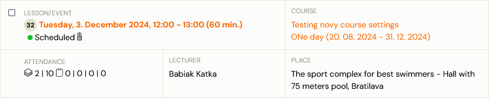
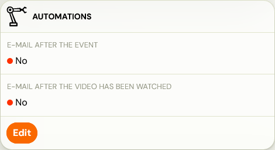
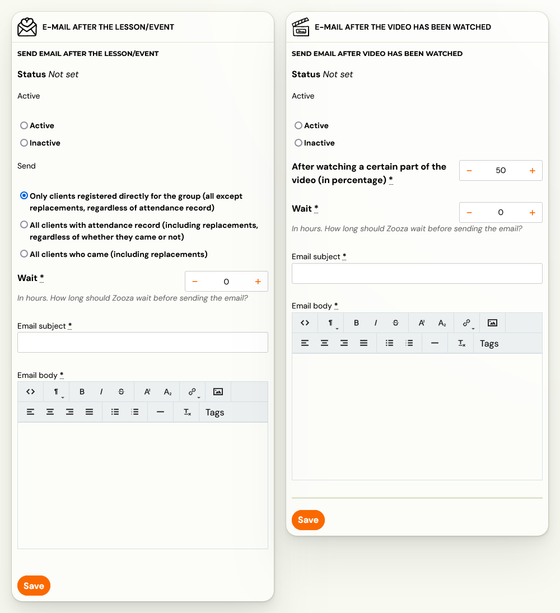

# Send an email after session/session

> For each session created within a programme, you can set up individual communication for registered clients. Use this when you need to communicate important information before or after the session -- for example, "don't forget to bring your workbook."

To set up communication, follow these steps:

1. Find the date you want to set up communication for. You can find it via the **Sessions/Sessions** tab or the **Classes** tab.
2. Click on the date of your choice.

3. In the session detail, open the **Automation** tile.

4. Two email options will be available:
   1. Email after the session/session
   2. Email after the video has been watched

5. Based on what you need, fill out all required fields and send the email.
