# Sending email/SMS to clients

For effective communication with your clients, you can use the messaging capabilities offered by the application. This method of communication is quick and easy.

> The biggest advantage is that you can find **every sent and received email/SMS** in the client details or in the message overview, so you know exactly what was communicated and when.

## Overview of messages

To view the total communication for all your clients:

1. Click on the **Communication** tab and then on **Messages Overview**.

In the message overview, messages can be filtered by:

- Email or phone number
- Type -- received emails, sent emails, SMS messages
- Templates -- by the name of the message template
- Condition -- unread, to do, solved

You can also sort them from newest or oldest.

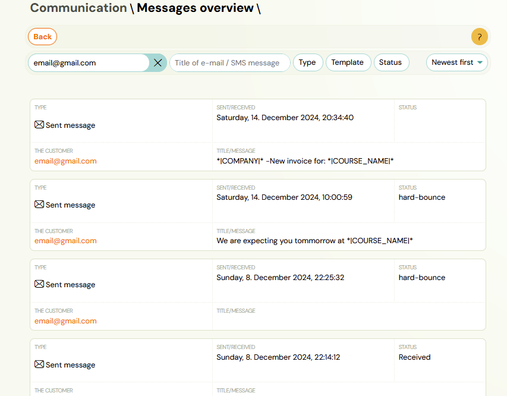

Clicking on the client's email takes you to the communication detail for the selected client.

You can also access the communication detail by searching for a specific registration and clicking the **Communication** button. In this section you can:

- Send a new message
- View the history of sent emails/SMS
- Filter messages
- View the content of sent and received messages
- See whether messages have been read or handled

A red ball with a number in the menu indicates whether you have received a new message from a client.

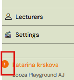

When you click on the indicator, you will see a list of unread messages. Click on the client's email to view a specific message.

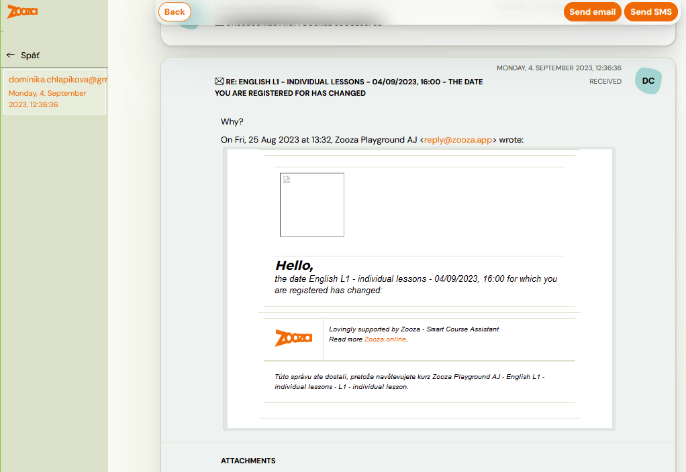

## Sending messages

The procedure for sending emails and SMS is the same:

1. Click on the **Communication** tab and then on **Send Email** or **Send SMS**.
2. Select a **Target group**.

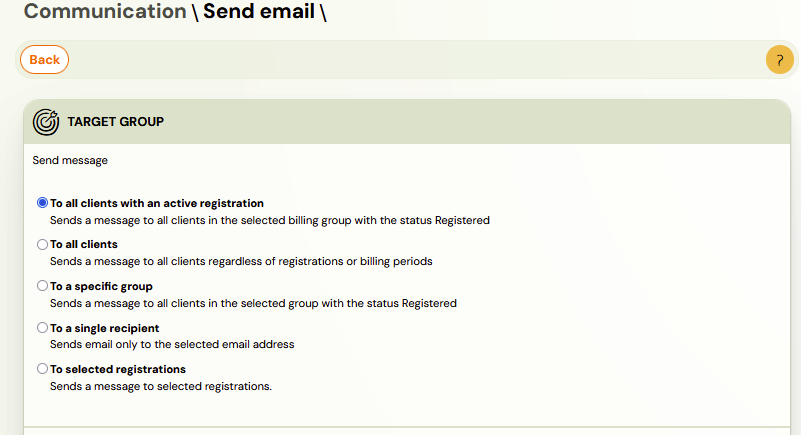

3. Check the **Promotional message** box if your message is promotional. This setting means that if any client has unsubscribed from receiving advertising messages, they will not receive them. If you want to send a message to all clients including those who have additional access to registrations, click the checkbox **Send email also to users with additional access to registration**.

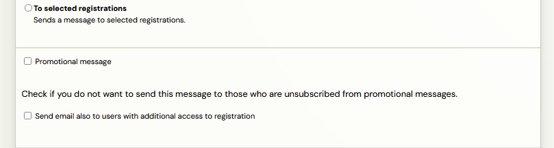

4. Choose who you want to send the message to:
   - **Clients** -- if a client has multiple registrations, they receive the email only once.
   - **Registrations** -- if you need to include specific information about each registration; a client with multiple registrations receives more emails.

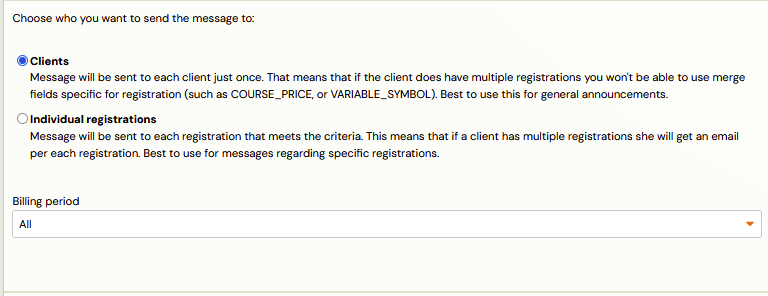

5. If you selected a specific group as your target, select the group.

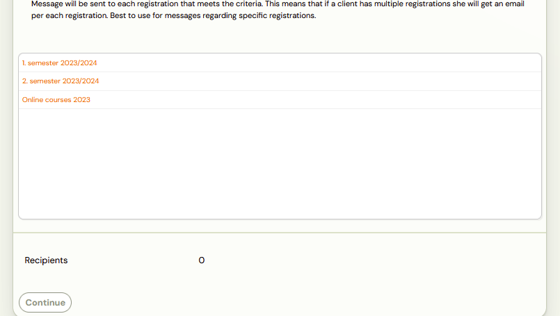

6. Choose whether to use a prepared template or create custom text. For custom text, use [dynamic tags](dynamic-tags.md) via the **Tags** button in the formatting panel.

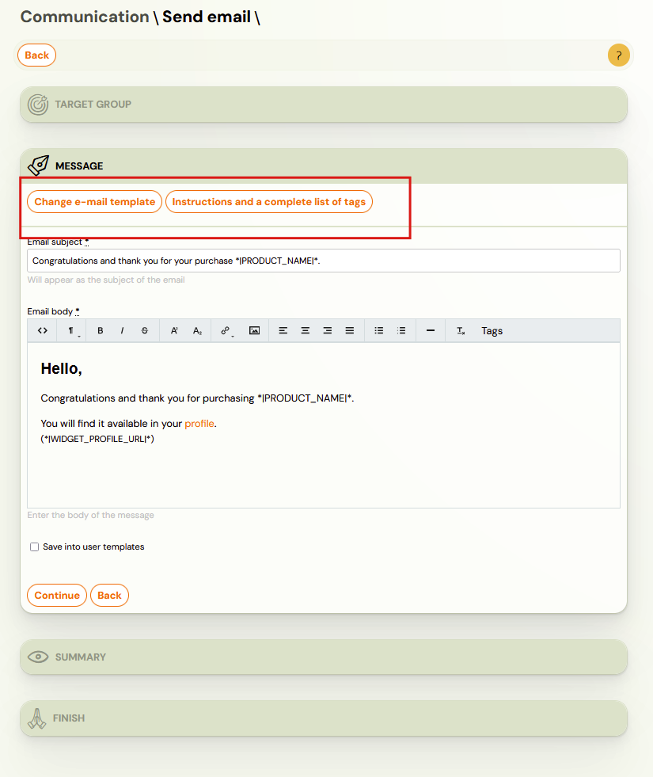

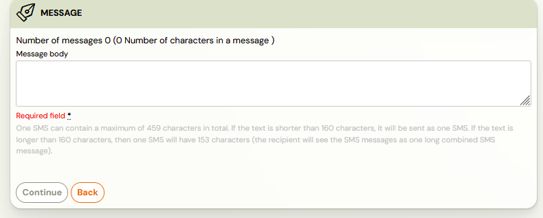

7. You will be taken to a summary screen where you can check your selections.

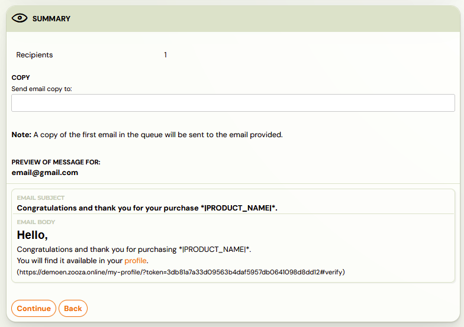

8. Click **Continue** and then **Send Message** to send your message.

> **Note:** To check each sent email, we recommend that you include your own email address.

> **Attention!** Zooza does not function as a marketing communications system that allows clients to opt out of receiving marketing/promotional messages. It is also not used to obtain information about how many clients opened the promotional email or responded to links. The **Promotional Email / Promotional SMS** function is for customer information only. If a client wants to unsubscribe from promotional emails, you can do it based on their request:
>
> 1. In the **Clients** section, open the client account and click on **Notes and preferences**.
> 2. Untick the **Send promotional emails** box.

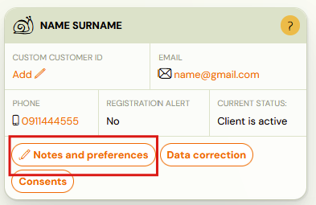

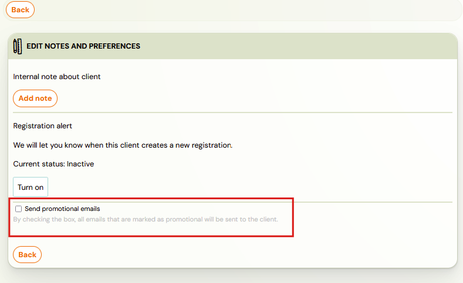

## How to send email/SMS to one client

You can also use the procedure above, but it assumes you know the recipient email. When communicating with a specific client:

1. In the **Registrations** tab, click on the name of the client you want to contact.
2. In the client registration details, click the **Email** or **SMS** button in the **Communication** section.

The recipient's details will automatically fill in. The rest of the process is the same as described above.

> **Attention!** If no communication has been sent to the client, a notification about this fact will be displayed in the overview of sent messages for the given registration.

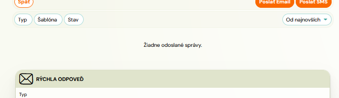

## How to set the sender name for SMS

For SMS, you can set the name under which the message appears on the client's phone (the sender name).

To set the name, go to **Settings --> General settings**.

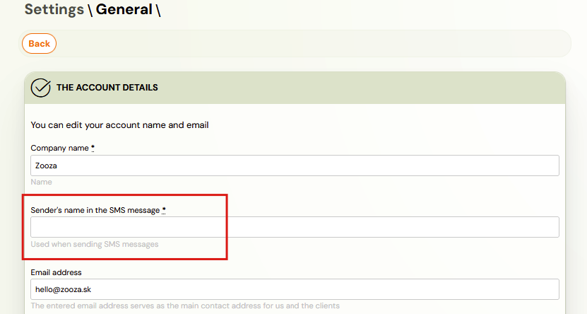
