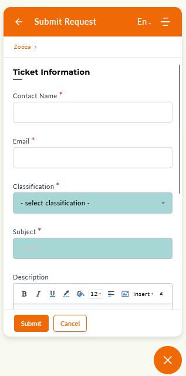
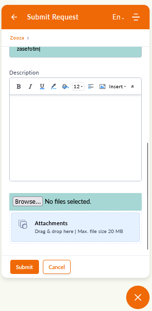
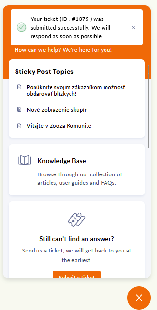
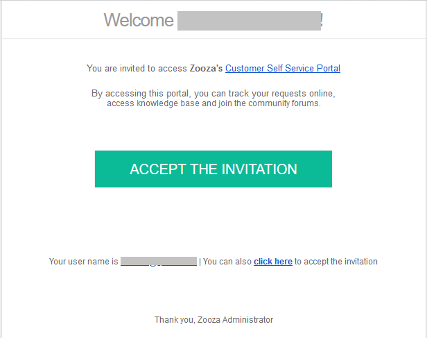
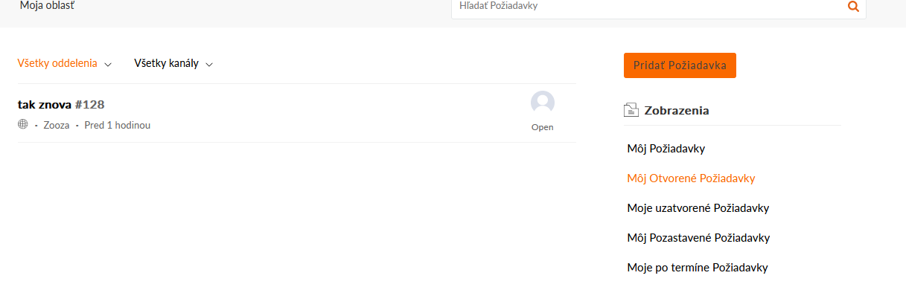

# Sending requests

As we understand how important it is to help you when something doesn't work as expected, we bring you news that will help you get in touch better and faster to resolve your request. As part of this, we have switched to a new system that collects your suggestions/requests to us, which even you can look back and check if they have been resolved, it also opens the gates to chat and other new features that we are gradually introducing and we will keep you informed. 

What all do we want to offer you to help you?

1. A new, more efficient way to send requests
2. An overview of all sent requests and their tracking
3. Chat
4. A new section of up-to-date and clearer manuals (currently under development)
5. A community where you will be able to engage, get to know and sell your Zooz experience to other clients (currently under development)

## A new way of submitting requests

In order to improve the services in Zooza, we have prepared a new way of sending requests, which will help you to check whether your request has been processed or not.

## How does it work?

In Zooza, you were used to an envelope where you filled in your name, email and described your problem or attached pictures. The new feature will be a bit different.

### Ticket - request

Ticket, or request form, is an enhanced feature of the original envelope that changes to a more detailed description so that we can better understand and properly prioritize how important your request is.

1. We have added a *Classification *field to the new form, which is a mandatory field based on the severity of the issue, as follows:
2. Next, you will find the *Subject *field, where you can briefly write what your request is about (e.g. Setting up replacement hours,...). This field is mandatory, it works like the subject of a message in classic email communication.
3. In the *Description *field you have the opportunity to describe in detail what is bothering you and we also recommend that you write how you proceeded or tried to proceed so that we can replicate your process and come to a solution as soon as possible. This applies to courses, groups or even appointments or clients. To help us navigate as easily as possible, it will help to send us the registration/course/group number, which can be found in the URL.E.g.: zooza.app/#registrations/196736 The registration number you are looking for is 196736.
4. Furthermore, on the bottom left there is an option to attach files where you can attach photos for graphical representation and better orientation.
 
 
5. When you are satisfied with your message, click *Submit
 
 *

Once submitted, you will see a window with your request number and an invitation to the Customer Self Service Portal will arrive in your email inbox, where you will see an overview of all the requests you have made. We recommend accepting this invitation, as it will open the door to other functionalities that will be gradually introduced to you.

 By clicking on *Accept the invitation*, i.e. Accepting the invitation to the new Customer Care community, you will be taken to an overview of all requests.

### Chat

As an innovation in Customer Care, we are introducing a chat that will answer your questions. Just open the window in the app again and switch to the *Chat *tab. In the chat you can ask questions regarding various settings of the app, how the features work, what to do if the client can't log in, etc.

If you do not get an answer to your question in the chat, the conversation will be redirected to the request and the question will be answered via this channel.

## Features that are currently under development

In order to continuously improve our support and communication with you, we are developing additional features to help you in your daily work with Zooza:

### Knowledge Base

We are updating and preparing new manuals for you to easily set up your courses. They will be available to all clients, there will be no need to log in to the community we described above in the requirements overview.

### Community

The community will aim to be an open discussion between clients, where you can exchange experiences or help each other with various setup questions.

### Chatbot

As part of the chat, we will also offer a trained chatbot whom you can ask a question to and it will either show you the solution using the manual or give you an answer based on the experience of our requests history. If you do not get the answer you need, chatbot will offer you the option to send a request.
