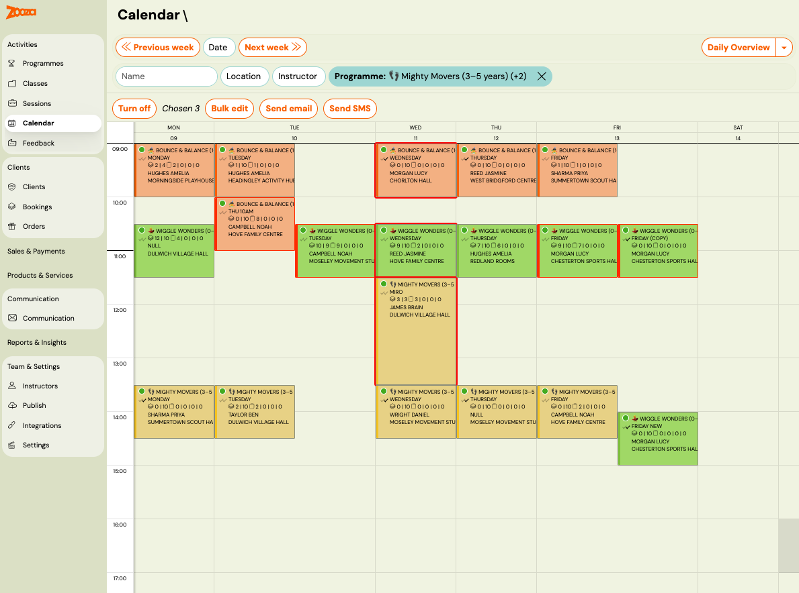
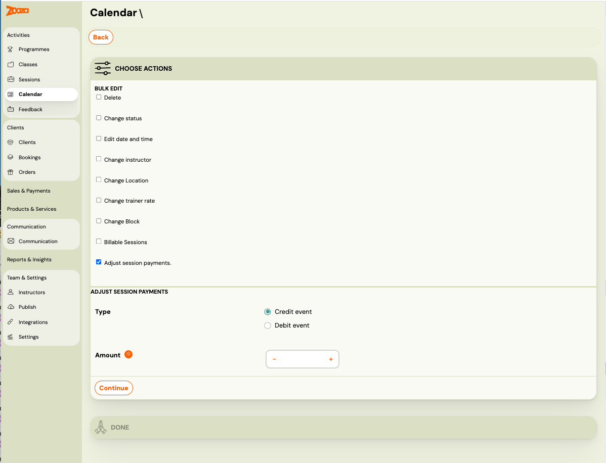
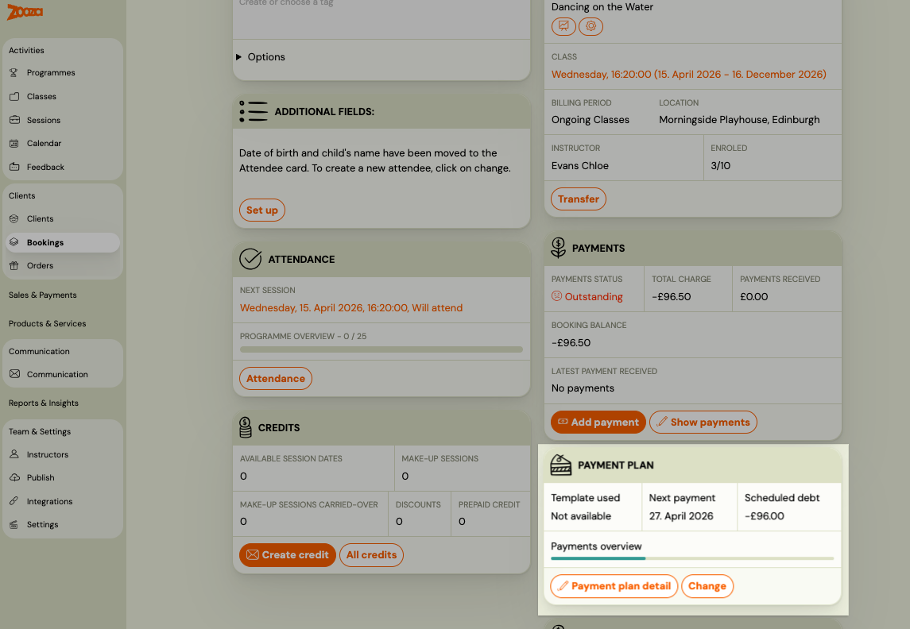
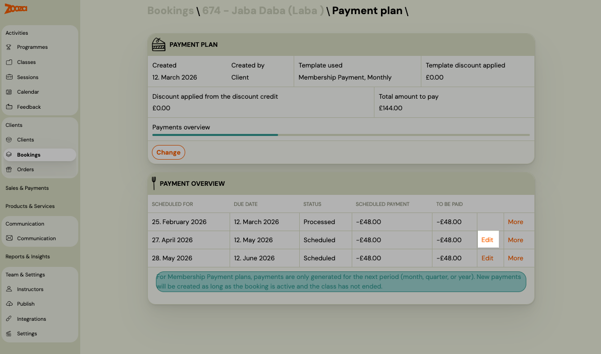
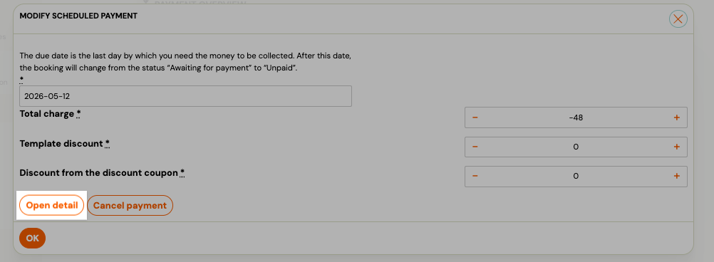
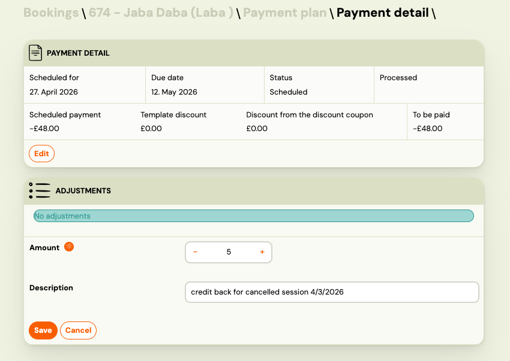

# Session payment adjustments

Payment adjustments let you credit or debit a client's scheduled payment — either in bulk across multiple sessions from the Calendar, or individually on a specific payment in a booking.

Use adjustments when:
- You cancel a session and want to reduce what clients owe for that billing period
- You need to manually correct a scheduled payment amount for a specific client
- A client attended an extra session that was not automatically accounted for

> **Note:** Adjustments affect scheduled payments only. They do not trigger an email notification to the client.

## How adjustments work

Each scheduled payment has a base amount set by the payment template. Adjustments are signed corrections stacked on top:

- **Credit** — reduces the amount the client owes (e.g. cancelled session, goodwill gesture)
- **Debit** — increases the amount the client owes (e.g. extra session, correction)

The final amount charged is always `base amount + all adjustments`, floored at zero. A client can never be charged a negative amount.

---

## Adjust session payments in bulk from Calendar

Use this when you cancel one or more sessions and want to credit all affected clients at once.

1. Go to **Calendar**.
2. Select the sessions you want to adjust using the checkboxes.
3. Click **Bulk edit**.
4. Check **Adjust session payments**.

   

5. Under **Type**, choose:
   - **Credit sessions** — to reduce the scheduled payment (most common when cancelling a session)
   - **Debit sessions** — to increase the scheduled payment
6. Set the **Amount** (per session, per client).
7. Click **Continue**, then confirm.

   

Zooza applies the adjustment to the next scheduled payment for each affected client. Clients on a fixed monthly or quarterly payment plan are adjusted the same way as Pay-as-you-go clients.

> **Which scheduled payment receives the adjustment?**
> The adjustment is applied to the client's next upcoming scheduled payment with status **Scheduled**. If a client has no upcoming scheduled payment (e.g. their plan has ended), no adjustment is created for that client.

---

## Adjust a single scheduled payment manually

Use this to correct or credit one specific client's scheduled payment.

1. Go to **Bookings** and open the booking.
2. In the **Payment plan** section, click on the scheduled payment you want to adjust.

   

3. You are now on the **Payment detail** screen. Scroll to the **Adjustments** section.

   

4. Enter the **Amount**:
   - Positive number = **credit** (reduces what the client owes)
   - Negative number = **debit** (increases what the client owes)
5. Enter a **Description** — e.g. *Cancelled session on 15 April* or *Manual correction*.
6. Click **Save**.

The adjustment appears in the list immediately. The **To be paid** amount at the top of the payment detail updates to reflect the new total.

### View existing adjustments

All adjustments on a scheduled payment are listed in the **Adjustments** section, including:
- Automatic adjustments created by session bookings or cancellations (Pay-as-you-go)
- Bulk adjustments applied from Calendar
- Manual adjustments you entered here

Each row shows the amount, description, and when it was created.

### Reverse a manual adjustment

If you entered an adjustment by mistake, you can reverse it:

1. In the **Adjustments** list, find the adjustment you want to reverse.
2. Click **Reverse**.

A new adjustment with the opposite sign is created. The original adjustment remains in the list for the audit trail.

> You can only reverse manual adjustments. Automatic adjustments (from session bookings/cancellations) are managed by the system and cannot be reversed manually.

---

## Pay-as-you-go: how adjustments work automatically

For [Pay-as-you-go programmes](pay-as-you-go-programme.md), adjustments happen automatically without any admin action:

- Client **books a session** → a credit adjustment equal to the unit price is added to their next scheduled payment
- Client **cancels a session** → the credit is removed (payment returns to previous amount)
- Admin **cancels a session** from the Calendar → all clients who were marked as attending receive a credit automatically

You can still add manual adjustments on top of the automatic ones if needed.

---

## Related guides

- [Pay-as-you-go programme](pay-as-you-go-programme.md) — How the session-based payment model works
- [Payment templates creation](payment-templates-creation.md) — Set up the base payment schedule
- [Edit payment on booking](edit-payment-on-booking.md) — Other ways to modify payments on a booking
