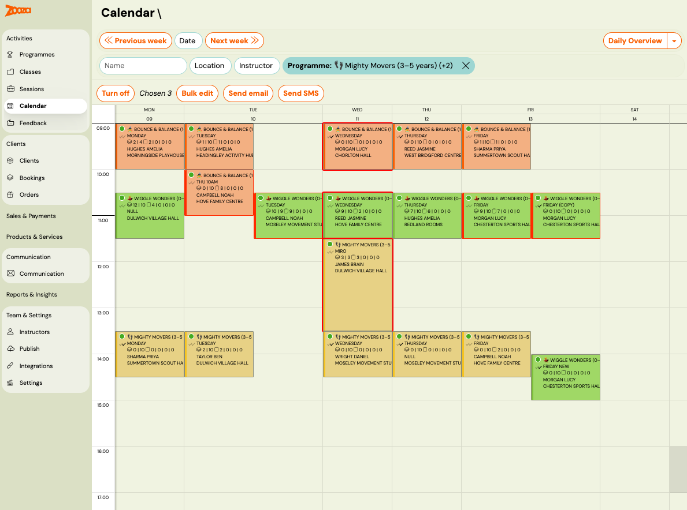
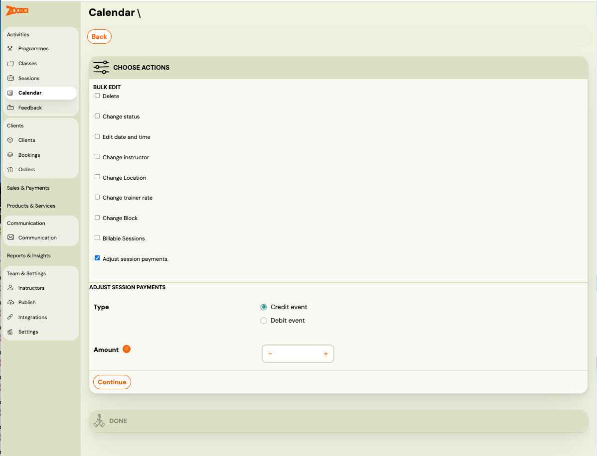
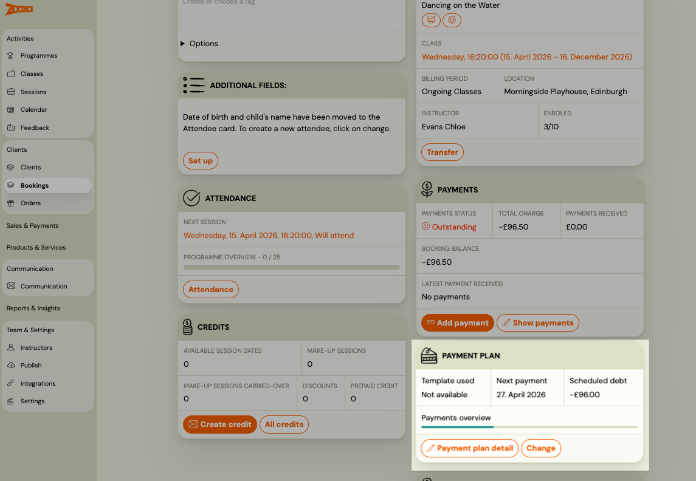
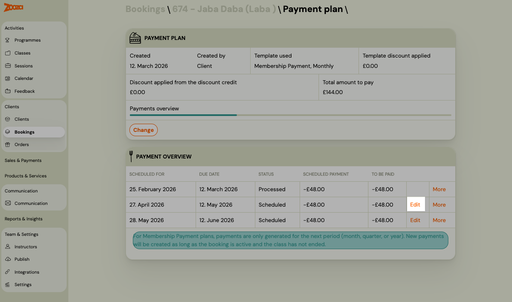
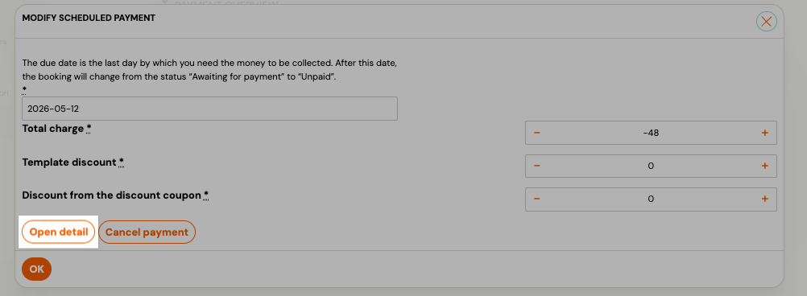
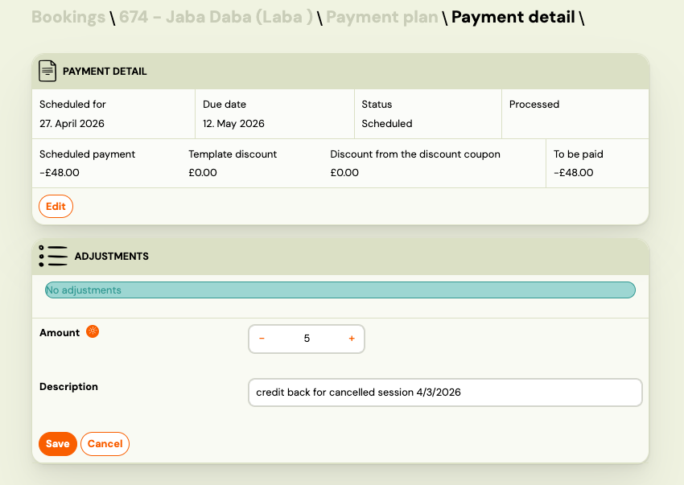

# Session payment adjustments

Payment adjustments let you credit or debit a client's scheduled payment — either in bulk across multiple sessions from the Calendar, or individually on a specific payment in a booking.

Use adjustments when:
- You cancel a session and want to reduce what clients owe for that billing period
- You need to manually correct a scheduled payment amount for a specific client
- A client attended an extra session that was not automatically accounted for

> **Note:** Adjustments affect scheduled payments only. They do not trigger an email notification to the client.

## How adjustments work

Each scheduled payment has a base amount set by the payment template. Adjustments are signed corrections stacked on top:

- **Credit** — reduces the amount the client owes (e.g. cancelled session, goodwill gesture)
- **Debit** — increases the amount the client owes (e.g. extra session, correction)

The final amount charged is always `base amount + all adjustments`, floored at zero. A client can never be charged a negative amount.

---

## Adjust session payments in bulk from Calendar

Use this when you cancel one or more sessions and want to credit all affected clients at once.

1. Go to **Calendar**.
2. Select the sessions you want to adjust using the checkboxes.
3. Click **Bulk edit**.
4. Check **Adjust session payments**.

   

5. Under **Type**, choose:
   - **Credit sessions** — to reduce the scheduled payment (most common when cancelling a session)
   - **Debit sessions** — to increase the scheduled payment
6. Set the **Amount** (per session, per client).
7. Click **Continue**, then confirm.

   

Zooza applies the adjustment to the next scheduled payment for each affected client. Clients on a fixed monthly or quarterly payment plan are adjusted the same way as Pay-as-you-go clients.

> **Which scheduled payment receives the adjustment?**
> The adjustment is applied to the client's next upcoming scheduled payment with status **Scheduled**. If a client has no upcoming scheduled payment (e.g. their plan has ended), no adjustment is created for that client.

---

## Adjust a single scheduled payment manually

Use this to correct or credit one specific client's scheduled payment.

1. Go to **Bookings** and open the booking.
2. In the **Payment plan** section, click on the scheduled payment you want to adjust.

   

3. You are now on the **Payment detail** screen. Scroll to the **Adjustments** section.

   

4. Enter the **Amount**:
   - Positive number = **credit** (reduces what the client owes)
   - Negative number = **debit** (increases what the client owes)
5. Enter a **Description** — e.g. *Cancelled session on 15 April* or *Manual correction*.
6. Click **Save**.

The adjustment appears in the list immediately. The **To be paid** amount at the top of the payment detail updates to reflect the new total.

### View existing adjustments

All adjustments on a scheduled payment are listed in the **Adjustments** section, including:
- Automatic adjustments created by session bookings or cancellations (Pay-as-you-go)
- Bulk adjustments applied from Calendar
- Manual adjustments you entered here

Each row shows the amount, description, and when it was created.

### Reverse a manual adjustment

If you entered an adjustment by mistake, you can reverse it:

1. In the **Adjustments** list, find the adjustment you want to reverse.
2. Click **Reverse**.

A new adjustment with the opposite sign is created. The original adjustment remains in the list for the audit trail.

> You can only reverse manual adjustments. Automatic adjustments (from session bookings/cancellations) are managed by the system and cannot be reversed manually.

---

## Applying a discount to a plan that is already running

Someone qualifies for a discount after their plan was set up — a sibling rate that
started late, a loyalty rule switched on part-way through the year. The instinct is
to build them a new payment plan. **Don't.** Edit the instalments in the plan they
already have.

**Why a new plan is the wrong tool:** a booking records income and expenses like a
bank account. Money already received is never removed, so a second plan on top does
not replace the first — it leaves you with an overpayment or an underpayment for
that period and a history nobody can read later.

### The rule that decides which instalment to edit

For **membership** plans, Zooza does not create every instalment up front. It adds
the next one as the period comes round, for as long as the booking is active and the
class is still running — and **each new instalment is copied from the last one that
exists, discount included.**

That single fact gives you both cases:

| What you want | What to edit |
|---|---|
| **A permanent discount** | The **last** scheduled instalment. The new amount carries forward into every instalment created after it, automatically. You do not need a new template or a new plan. |
| **A one-off or temporary discount** | Only the **earlier** instalments. Leave the last one at full price — otherwise your "one-off" copies forward and quietly becomes permanent. |

If the instalment you need does not exist yet, either wait for it to be generated or
add it with **Add scheduled payment**.

### If the instalment has already been paid

Edit it exactly the same way. The difference stays with the client as **credit on
their account** and comes off their next instalment on its own.

> **Do not double the discount on the following instalment to compensate.** People do
> this to "catch up" the amount, and it backfires: that inflated figure is then the
> last instalment, so it is the one that gets copied forward.

### Check whether the discount is per month or per instalment

A discount of 4 € **a month** is 12 € on a quarterly instalment, not 4 €. Work out
which the number is before you type it — this is the most common way these
corrections come out wrong.

---

## Pay-as-you-go: how adjustments work automatically

For [Pay-as-you-go programmes](pay-as-you-go-programme.md), adjustments happen automatically without any admin action:

- Client **books a session** → a credit adjustment equal to the unit price is added to their next scheduled payment
- Client **cancels a session** → the credit is removed (payment returns to previous amount)
- Admin **cancels a session** from the Calendar → all clients who were marked as attending receive a credit automatically

You can still add manual adjustments on top of the automatic ones if needed.

---

## Related guides

- [Pay-as-you-go programme](pay-as-you-go-programme.md) — How the session-based payment model works
- [Payment templates creation](payment-templates-creation.md) — Set up the base payment schedule
- [Edit payment on booking](edit-payment-on-booking.md) — Other ways to modify payments on a booking
