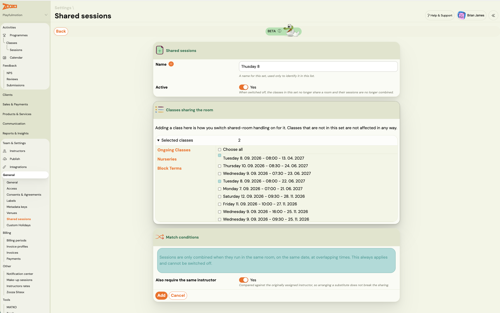

# Shared sessions — two classes in one room

You may run more than one class in the same room at the same time. The usual case is splitting returning students from newcomers: one class for existing students who booked the whole term, another for people dropping in, both in the same hall on the same Monday evening.

Zooza normally treats each class's capacity separately, which is wrong here — two classes of ten in a room that holds ten will let you book twenty people into ten places.

**Shared sessions** combine those sessions so the room's real capacity is what counts.

## Setting it up

**Go to Team & Settings → General → Shared sessions.**

> This screen is marked **BETA**. It works, but expect it to keep changing.

You create a **shared-sessions set** — the classes that share a room — and putting a class in the set is how you switch the behaviour on for it. Classes that are not in a set are not affected in any way.

1. Give the set a **name**. It is only used to identify the set in this list; clients never see it.
2. Leave **Active** switched on.
3. Under **Classes sharing the room**, tick every class that runs in that room at that time. The picker is grouped by programme down the left side — choose the programme, then tick its classes, or use **Choose all**. The number of selected classes is shown above the list.
4. Set **Match conditions** if you need them (see below).
5. Click **Add**.

That is the whole setup. There is no session-by-session builder — you say which classes share a room, and Zooza combines the individual dates itself.

### Match conditions

Sessions are only ever combined when they run **in the same room, on the same date, at overlapping times**. That is not a setting — it always applies and cannot be switched off, which is why you cannot accidentally combine two classes in different rooms or on different days.

There is one optional condition on top:

**Also require the same instructor** — only combine when it is the same person. It is compared against the **originally assigned** instructor, so arranging a substitute for one session does not break the sharing.

Leave it off when the point is the room rather than the person, which is the usual case.

### Switching a set off

Each set has an **Active** switch. Turn it off and the classes in it stop sharing a room — their sessions are no longer combined — without you having to take the set apart. Deleting the set does the same thing permanently.

## Checking what is actually combined

The **Combined sessions** view lists the sessions that have been combined, grouped by date, with a match key showing why each group belongs together.

It is **read-only on purpose**. It shows what is combined right now and is recalculated whenever sessions are regenerated, so it cannot drift out of step with reality the way a hand-maintained list would.

Each combined session shows its capacity, taken **from the room**. You can override it for a single shared session — useful when one week's session moves to a smaller space — and revert to the room capacity afterwards.

## Free places by date

This is where the number you should trust lives, and it is usually **lower than the class capacity**. That is not a fault.

The two kinds of booking hold places differently:

- A client **enrolled in a class** holds a place on **every** shared date. They are coming each week, so their place is reserved each week.
- A client who **books a single session** holds a place on **that date only**.

So a room with ten places and six enrolled students has four places on every date, and those four are all a drop-in can take. The class still says capacity ten; the shared session says four.

The **Free places by date** view shows the shared room capacity, the places held on every date, the places booked for that specific date, and what is left. **Read that number, not the class capacity**, when you are deciding whether someone fits.

## The attendance register

A combined session has one register listing everyone in the room, with each person tagged by the class they belong to. It is a merged **view** — attendees stay attributed to their own class for attendance, payments and reporting.

## How it interacts with other settings

- **[Priority registration](priority-registration.md)** — a returning-student class can open before the newcomer class in the same room. Sharing is what stops the second class from selling places the first one is holding.
- **[Delayed start](delayed-start-registration.md)** — when a shared room is full now but frees up later, a delayed start is offered against the **shared** capacity, not the individual class's.
- **[Extra capacity](capacity-and-extra-capacity.md)** — make-up and trial places also draw on the shared pool.

## Troubleshooting

**Two classes are in the same room but were not combined.** Check that both are in the same set, that the sessions genuinely overlap in time, and that the venue is the same record on both — two venues with the same name are two different places.

**A substitute instructor broke the sharing.** It should not. Matching uses the originally assigned instructor. If it did break, check whether the instructor was changed on the class itself rather than assigned as a substitute for that session.

**The class shows free places but a booking is refused.** The class capacity is not the limit here. Open **Free places by date** for that date.

**The class list in the set looks incomplete.** Only the first batch of your classes is listed. If you have a lot of classes and cannot find the one you want, that is why.
