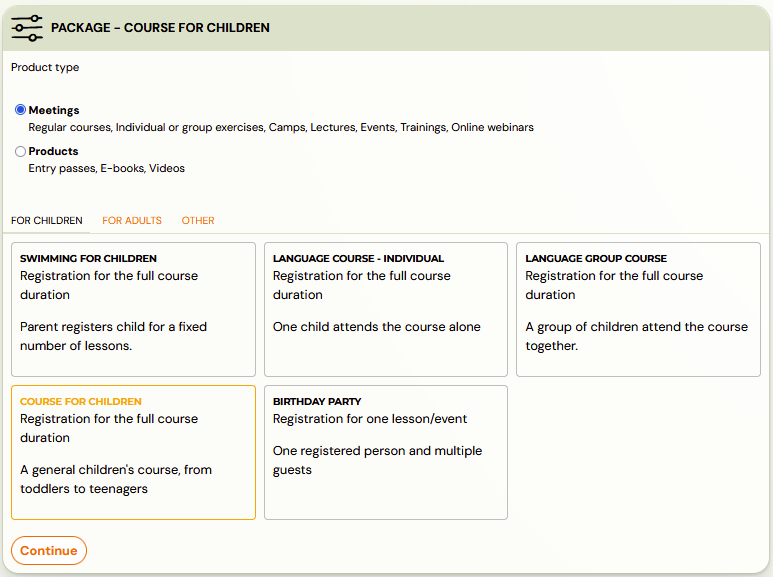
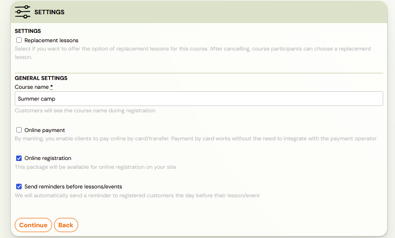
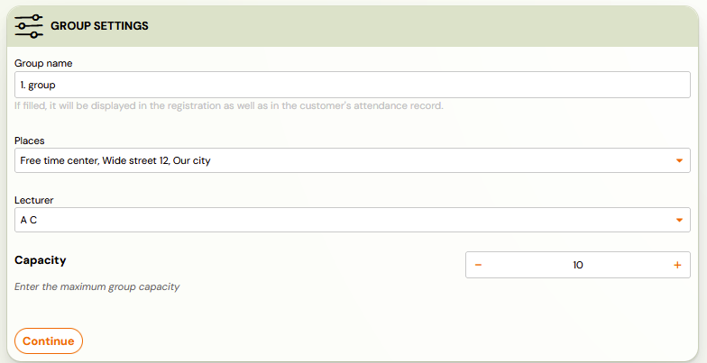
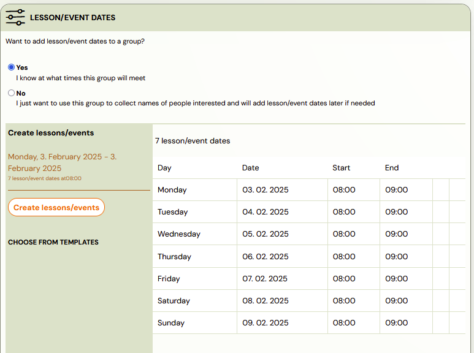

# Summer camps creation

## Creating summer camps

If you are creating an offer for summer camps for week-long camps, you will create the offer as follows:

- Create a new course, in the *Courses* section click on the *New Course* button and select *Meetings*
- Select the registration type – registration for the entire duration
of the course, as in this case you wish to create a camp where clients
sign up for a full week
- Click *Continue

*

- Then fill in all required fields and click *Continue.* Choose a name such as *Summer Camp, Summer Dance Camp, Day Summer Camp*, or whatever suits you. This name is visible to your clients.

- Then create the group(s) according to your wishes by clicking the *Add* button and fill in the required data for the group. You can create multiple groups at once. Click *Continue* again to go to the next step.

- Fill the group with dates according to your wishes, if you can determine
 them right away. Groups need to be filled with terms individually. If
you don’t want to create dates, the group will be created as the [group – Interested](group-interested.md) and you can add dates afterwards.

- Detailed instructions on how to create terms can be found in this [manual](https://support.zooza.online/portal/en/kb/articles/creating-events-in-groups).

Next, fill in all the important fields in the course settings. You can open each subpage by clicking on “edit” in that subpage.

## Edit summer camp settings

1. Fill in the price and payment method.
2. If you offer clients the option to pay in installments or offer a
discount in the case of siblings, activate payment templates in the
“price and payments” section. If you do not have the necessary payment
template created, create one in the “settings” section in the left menu
at the bottom, under “payment templates” and activate it for the course.
3. Set the display in the online registration on your site. Decide how
late registrations will be approved – manually or automatically with an
aligned price
4. Manage your replacement lessons settings, although chances are you don’t want to have replacement lessons enabled for day camp.
5. Course Settings – describe the camp, or insert a URL link to click
through to your page where there is more information about the specific
camp
6. In the course settings section, select the “for children” option and
 the registration fields will automatically be renamed from “name” to
“parent’s name”. You set the “child’s name” field in the extra fields.
7. Add tags for easier searching and choose a color for this course – camp. It will be prettier when it’s more colorful. 🙂
8. Set up extra registration fields to collect information about the
child, allergies, or other information you need to collect when
registering a client. Check the box and enter your own name. This will
be displayed to the client during online registration. There are also
extra untitled fields below, you can use these to rename according to
your requirements – child’s allergies, child’s experience with dancing
or other.

Then create specific groups for this course, i.e. in the case of camps these will be your week-long tours.

## Group creation

If you did not do so in the initial course setup, you still have this
option within the course settings. Click on the “New Group” box, located
 either at the top right or at the bottom under the settings for the
course, and start creating a specific group of children who will attend a
 specific week,

1. Fill in the name of the group – if the topics change from one tour
to another. For example, one week will be a camp focused on the theme of *Space* so name the specific group/tour. If you have all the
tours exactly the same, you can leave the group name blank. The group
will pull information from the course title and differentiate themselves
 from the others with different dates or location.
2. Choose your billing period. If you don’t have a billing period
created, create one in the “Settings” section in the bottom left menu,
under “Billing Periods.”
3. Choose the place where the camp will take place. If you don’t have
the space you need, create one in the “settings” section in the bottom
left menu, under “locations.”
4. Choose a lecturer for a specific tour. If you don’t have the
necessary tutor created, create one in the “settings” section in the
left menu at the bottom, under “accesses.”
5. If you want, choose a rate for the tutor, for easier calculation of
the remuneration for the tutor. If you have not created the necessary
rate, create it in the “settings” section in the left menu at the
bottom, under “lecturers’ rates.”
6. Determine your capacity for the tour.
7. You do not need to enter the price of the course and, if applicable,
 the registration fee if you have already filled in these details in the
 course settings. If there is a different price for the tour you are
creating, enter it and that price will be displayed.
8. If you offer clients the option to pay in installments or offer a
discount in the case of siblings, activate payment templates. If you do
not have the necessary payment template created, create one in the
“settings” section in the left menu at the bottom, under “payment
templates” and activate it for the course.
9. Click on “create.”

Add specific dates for a particular group / tour.

## Events creation

In the case of a day camp it will be 5 dates (Mon-Fri) of one day (e.g. 8 hours from 8am to 4pm)

1. Click on Add terms
2. Choose a date – the date of the first term for a specific tour
3. Choose a time – the start time of each date, day. When are the children due to arrive at the camp?
4. Choose the length of the term in minutes – the time the children
stay in the camp. For example 480 minutes if it is 8 hours. The end time
 of the day camp is calculated.
5. Choose a repetition count of 5 if you are creating weekly rounds for days Monday through Friday
6. The terms will be automatically displayed and when you are satisfied with them, click on “OK” and then on “Create terms”

## Other course settings

Once you have created the terms, you can still adjust other settings in the specific group.

For example, you add a second lecturer. Insert documents, links or
videos that the client can easily view in their profile. Add your tags
for easier searching or group notes.

## How to easily create your next tour?

You don’t have to laboriously create a new group, in your case
another tour of your camp, from scratch. Click the “Copy” button and
simply copy the group.

Other dates, place or lecturer can be adjusted afterwards. The system guides you through the steps before you finish copying.
