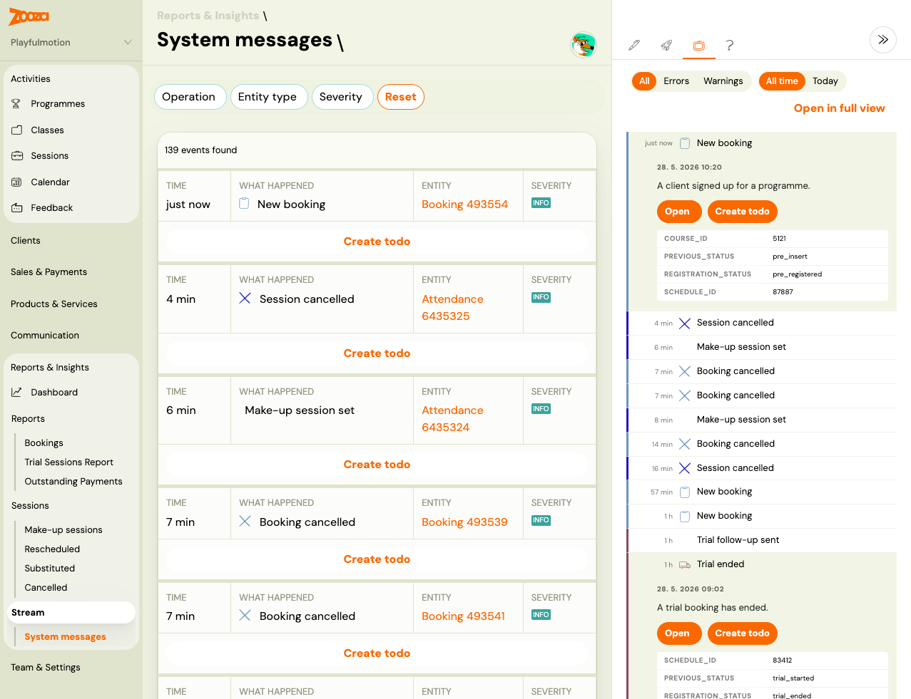

# Stay on top of activity with system messages

System messages are admin-only notifications that appear automatically when key events happen in your account — a new booking comes in, a payment is received, a session is cancelled, or a client sets a make-up. You do not need to configure them; they are always on for all admin users.

System messages appear in two places:

- **Right sidebar** — a compact notification panel accessible from anywhere in the app, updated in real time.
- **System messages screen** — the full view at **Reports & Insights → System messages**, showing the complete history with filters.

---

## The right sidebar

The notification panel on the right side of the app shows the most recent system messages. Click any item to open the related record (booking, client profile, session) directly. The sidebar updates in real time — new events appear without refreshing the page.

To open the full history, click **Open in full view** at the top of the panel.

---

## The System messages screen

> **Navigation:** Go to **Reports & Insights → System messages**.

The screen shows a chronological list of events. Each row includes:

| Column | Description |
|---|---|
| **Time** | How long ago the event happened (e.g. "4 min", "1 hour") |
| **What happened** | Event type and a short description |
| **Entity** | The related booking or class (clickable link) |
| **Severity** | Visual tag — e.g. INFO |
| **Create todo** | Quick action to create a follow-up task directly from the event |

### Filters

| Filter | Options |
|---|---|
| **Operation** | Filter by event type (New booking, Session cancelled, Make-up session set, Booking cancelled, …) |
| **Entity type** | Filter by the type of entity the event is about |
| **Security** | Filter by severity level |
| **Today / Yesterday** | Quick date shortcuts |
| **Reset** | Clear all filters |

---

## Event types

| Event | When it appears |
|---|---|
| **New booking** | A client completes a registration through the widget |
| **Session cancelled** | A session is cancelled in the admin app |
| **Make-up session set** | A client selects a make-up session after a cancellation |
| **Booking cancelled** | A registration is cancelled |
| **Trial booked** | A trial session is booked |
| **Trial follow-up sent** | An automated trial follow-up message was sent |
| **Payment received** | An incoming payment (Stripe, GoCardless, or bank transfer) is paired to a booking |
| **Scheduled payment dispatched** | A batch of payment reminders was sent to clients |
| **Attendance replacement set** | A make-up replacement is confirmed |

---

## Who sees system messages

System messages are visible to all users with admin access (owner, main member, member, and similar admin-equivalent roles). Customer-only accounts do not have access to this screen or the sidebar panel.

System messages created by your own actions are marked as already seen — you will not get notified about changes you made yourself.

---

## Creating a to-do from a system message

Each row has a **Create todo** button. Use this to create a follow-up task linked to the event — for example, to call a client after a cancellation or to confirm a make-up booking. Todos are visible in the Todos section of the app.
