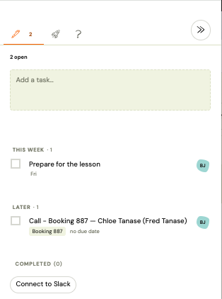

# Manage your to-do list

The Zooza to-do list is a lightweight task tracker built into the app sidebar. Use it to leave yourself a quick reminder, assign a follow-up to a teammate, or flag something that came up while you were reviewing a booking or a payment. Each todo can be linked to the screen where it was created, so clicking through takes you straight back to the relevant record.

---

## Open the to-do list

Click the **To-dos** icon in the persistent sidebar on the left. The panel shows all open tasks assigned to you, sorted by due date (overdue first, tasks without a date last).

The sidebar icon shows a badge with the count of open tasks assigned to you.

---

## Create a to-do

### From the sidebar

1. Click **To-dos** in the sidebar.
2. Click **Add to-do**.
3. Type your task (up to 500 characters).
4. Optionally select an **assignee** (defaults to you) and a **due date**.
5. Press **Save**.

The todo appears at the top of the list immediately.

### From a booking, event, or payment

When you are looking at a specific record — a registration, an event, a payment — you can create a todo that links back to it:

1. Open the record (e.g. a booking detail page).
2. Click **Add to-do** in the sidebar — it pre-fills a short context prefix based on the record you are viewing, for example `Registration 1234 — `.
3. Add your reminder after the prefix, or replace it entirely.
4. Save.

In the to-do list, a small icon next to the task shows its context type. Clicking the icon navigates directly to that record.

This context link is stored automatically — you do not need to copy URLs or record numbers.

---

## Assign a to-do to a teammate

In the **Assignee** field, select any team member from your company. They receive a real-time notification in their Zooza sidebar and, if your company has Slack connected, in the configured Slack channel.

You can also assign a todo to yourself (the default) and reassign it later.

> You can only assign todos to users in the same Zooza company. Cross-company assignment is not supported.

---

## Set a due date

Click the **Due date** field and pick a date. Due dates are optional.

Tasks are sorted by due date ascending — overdue tasks appear first, tasks without a date appear last. The sidebar badge counts all open tasks assigned to you regardless of date.

---

## Mark a to-do as done

Click the checkbox next to the task. The todo moves out of the active list.

**Who gets notified when you complete a todo:**
- If a colleague assigned the todo to you, they receive a notification when you mark it done.
- If you assigned the todo to yourself, no notification is sent.

---

## Reopen a completed to-do

1. In the to-do list, switch the filter to **Done**.
2. Find the task and click **Reopen**.

The todo returns to the active list and is assigned back to the original assignee.

---

## Delete and undo

Click the **Delete** icon on a todo to remove it. Only the person who created the todo can delete it.

An **Undo** option appears briefly after deletion. Click it to restore the task if you deleted it by mistake.

> Deleted todos are not permanently erased immediately — they are hidden and can be recovered briefly via Undo. After that, recovery is not possible.

---

## Real-time notifications

Zooza updates the sidebar and badge counts in real time — you do not need to refresh the page. Notifications fire when:

| Event | Who gets notified |
|---|---|
| Todo assigned to you | You |
| Todo reassigned to someone else | The new assignee (and the previous assignee is notified they were removed) |
| Assignee marks your todo as done | You (the creator) |
| Todo reopened and assigned back | The assignee |

Self-assignments and self-completions are silent — no notification is sent.

---

## Privacy and visibility

- You can only see todos where you are the **creator** or the **assignee**.
- You cannot see todos between other colleagues that do not involve you.
- Owners and Assistants do not have a company-wide view of all todos — the list is always personal.

---

## Limits

| Setting | Value |
|---|---|
| Maximum task length | 500 characters |
| Assignee | Must be a user in the same Zooza company |
| Context link | One entity per todo (registration, event, payment, etc.) |
| Attachments, comments, subtasks | Not supported |

---

## Related

- [To-do list FAQ](../faq/todos-faq.md)
- [Use Zooza from Slack](./zooza-in-slack.md) — create todos from Slack
