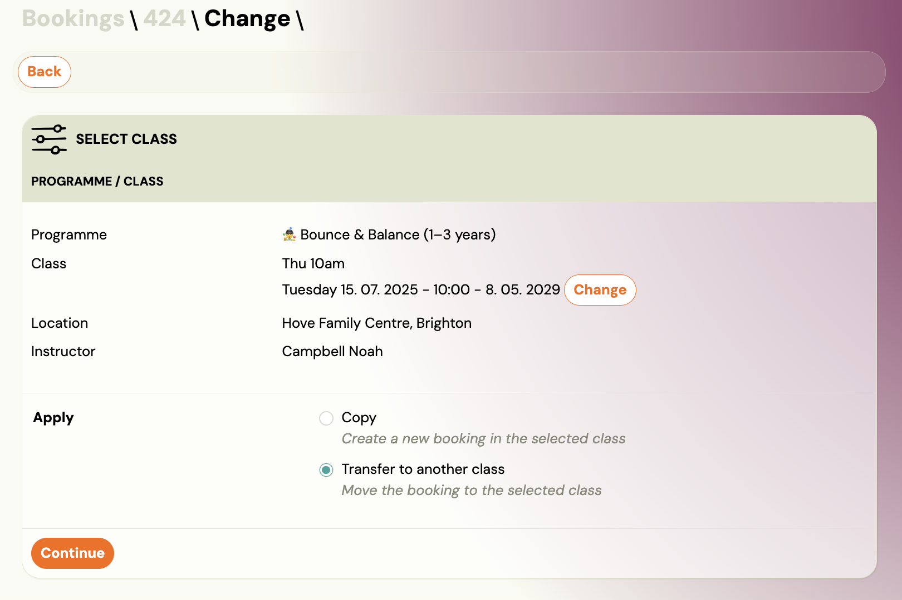

# Transfer and copy bookings

<!-- Synonyms: move booking, move client, relocate booking, duplicate booking, presunúť klienta, kopírovať registráciu, presun registrácie, premiestniť booking -->

Zooza lets you **transfer** or **copy** a booking from one class to another. Both actions use the same wizard — the only difference is what happens to the original booking.

- **Transfer** — moves the booking to the target class. The original booking no longer exists in the old class. The client gets the remaining sessions in the new class.
- **Copy** — creates a new booking in the target class. The original booking stays in the old class unchanged.

Both features are available to admins and instructors.

> **Navigation:** Go to **Bookings** → open the booking detail → click **Transfer** or **Copy booking**.

## When to use Transfer vs Copy

| Scenario                                                                        | Use          |
| ------------------------------------------------------------------------------- | ------------ |
| Client wants to switch to a different location, day, or time                    | **Transfer** |
| Client or instructor requests a class change (skill level, interest, age group) | **Transfer** |
| Client wants to continue in the next term and asks you to handle it             | **Copy**     |
| Client wants to attend an additional class alongside the current one            | **Copy**     |
| You need to move a client to a holding/collection class temporarily             | **Transfer** |
| You are setting up a new term and carrying forward existing bookings            | **Copy**     |

A transfer can be done at any time — before the programme starts, during, or after it ends.

## How to transfer a booking

1. Go to **Bookings** and open the booking you want to transfer.
2. Click **Transfer** (in the Class card, bottom right).

### Step 1 — Select the target class

The wizard shows a list of available classes. Use the filters at the top to narrow the list:

| Filter | Description |
|---|---|
| `Name` | Search by class name. |
| `Billing period` | Filter by term/period. |
| `Programme` | Filter by programme. |
| `Location` | Filter by venue. |
| `Instructor` | Filter by instructor. |
| `Day` | Filter by day of the week. |

Each class row shows the name, programme, location, instructor, and current capacity (e.g. "1/2" means 1 of 2 slots filled).

Click **Choose** next to the target class.

### Step 2 — Confirm the selection

The wizard shows the selected class details (programme, class name, location, instructor). Verify this is correct.

Under **Apply**, select **Transfer to another class** (move the booking to the selected class).

Click **Continue**.

### Step 3 — Review remaining sessions and payments

The wizard shows:

- **Remaining sessions** — how many sessions the client will get in the new class.
- **Capacity warning** — if any sessions in the target class exceed capacity, Zooza warns you. You can still proceed, but consider resolving attendance on those sessions first.

#### Set up payments

| Field | Description |
|---|---|
| `Paid` | Amount already paid on the original booking. |
| `Amount to pay` | Remaining amount due. |
| `Current account balance` | Client's current balance (negative = credit). |
| `Do not change payments` | Check this to keep the original payment schedule exactly as it is. **This is the safest option.** |
| `Payment plans are available in this class` | Yes/No — whether to apply a payment plan from the target class. |

**Recommended approach:** Check **Do not change payments** to transfer the booking with the existing payment intact. You can adjust the payment afterwards if needed. This avoids accidentally overwriting the payment schedule with the target class settings.

If you do want to change the payment:

| Option | Description |
|---|---|
| **Current class price** | Use the price configured on the target class. |
| **Custom amount** | Enter a specific total amount. |
| **Scheduled payment amount: Custom amount** | Set a custom amount per instalment (template discounts will not apply). |

You can also set the **Booking fee**, **First scheduled payment date**, and **Payment frequency** (select from available payment templates).

#### Send notification

- **Send confirmation email** — check this to send the client a confirmation email as if they had enrolled themselves via the website.

Click **Continue**, then **Submit** to complete the transfer.

### After the transfer

Once the transfer is complete, Zooza redirects you to the new booking. Verify:

1. **Attendance** — check that the remaining sessions are correct.
2. **Payment plan** — verify the debt and instalment schedule.
3. **Debt amount** — make sure the amount matches what you expect.

Only then inform the client — either through Zooza (**Communication** tab on the booking) or via your usual channel.

## How to copy a booking

The process is almost identical to a transfer:

1. Go to **Bookings** and open the booking.
2. Click **Copy booking** (in the Booking card, left side).
3. Select the target class using the same filters and class list.
4. Under **Apply**, select **Copy** (create a new booking in the selected class).
5. Click **Continue**.
6. Review sessions and set up payments (same options as transfer).
7. Click **Continue**, then **Submit**.

The key differences from a transfer:

- The **original booking remains unchanged** in the old class.
- A **new booking number** is created for the copy.
- **Payment schedules do not carry over** — the new booking gets the payment settings from the target class. Review and adjust if needed.
- **Make-up credits and attendance history stay with the original** booking. The copied booking starts clean.

## Common scenarios

### Next term continuation

A client wants to continue in the next term but asks you to handle it instead of booking online.

1. Open the current booking → **Copy booking**.
2. Select the new term's class.
3. Set up payments according to the new term pricing.
4. Send the confirmation email so the client gets payment instructions.

### Change of location or schedule

A client asks to move from the Wednesday class to the Friday class at a different location.

1. Open the booking → **Transfer**.
2. Filter by the new day/location and select the target class.
3. Check **Do not change payments** (the price is usually the same).
4. Submit and notify the client.

### Adding a second class

A client wants to attend an additional class alongside their current one (e.g., a different skill level or interest).

1. Open the existing booking → **Copy booking**.
2. Select the additional class.
3. Set up payments for the new booking separately.
4. The client now has two active bookings — one per class.

### Instructor recommends a class change

An instructor notices a client would be better suited to a different skill level or age group.

1. The instructor or admin opens the booking → **Transfer**.
2. Selects the recommended class.
3. Keeps payments unchanged.
4. Notifies the client about the change and the reason.

## Tips

- **Always check payments after transfer/copy.** The most common mistake is forgetting to tick **Do not change payments**, which silently replaces the payment schedule with the target class settings.
- **Transfers can be done at any time** — before, during, or after the programme. There is no restriction on timing.
- **You cannot transfer or copy clients — only bookings.** A client can have multiple bookings across different programmes. Each booking is managed independently.
- **External instructors cannot transfer or copy bookings.** Only admins, owners, and standard instructors have this permission.

## Related

- [Transfer and Copy FAQ](../faq/transfer-and-copy-faq.md) — common questions about transfers and copies.
- [Bookings List Reference](../reference/bookings-list.md) — full reference of booking detail fields and actions.
- [New Programme with Existing Clients](new-programme-existing-clients.md) — strategies for term transitions.
- [Payment Templates](payment-templates-creation.md) — setting up payment schedules.
- [Payments and Billing FAQ](../faq/payments-and-billing-faq.md) — what happens to payment schedules when copying bookings.
