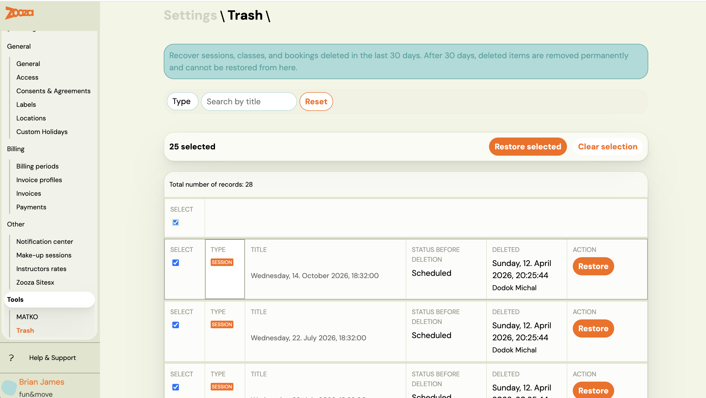
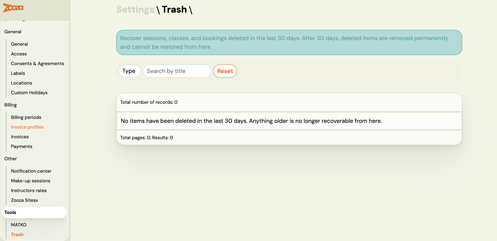

# Recover deleted registrations, classes, and sessions

Deleted items are not immediately gone. Zooza keeps them in **Trash** for 30 days, after which they are permanently removed and cannot be recovered. During those 30 days you can restore any item with a single click.

> **Access:** Settings → Tools → Trash. Requires `delete_courses` permission (owner role).

---

## Cancelled vs. deleted vs. permanently removed — what is the difference?

This is the most common source of confusion. A registration (or class) can be in one of three states that look similar but behave very differently:

| State | What happened | Where to find it | Can it be undone? |
|---|---|---|---|
| **Cancelled** | The registration was cancelled — client is no longer attending, but the record still exists | Registrations list with status filter set to *Cancelled* | Yes — change status back to Active manually |
| **Deleted (in Trash)** | The registration was moved to Trash | **Settings → Tools → Trash** | Yes — within 30 days |
| **Permanently removed** | 30 days have passed since deletion, or it was hard-deleted | Nowhere — it is gone | No |

**If you cannot find a registration in the main list**, check two places in this order:
1. Registrations list → change the status filter to **All** or **Cancelled** — it may still be there as cancelled.
2. **Settings → Tools → Trash** — it may have been deleted.

---

## What can be restored

| Type | What it is |
|---|---|
| **Session** (event) | A single session within a class |
| **Class** (schedule) | An entire class with all its sessions |
| **Registration** | A client's booking on a class |

Items deleted more than 30 days ago are permanently gone and cannot be recovered from here.

---

## Why is the Restore button greyed out?

The **Restore** button is inactive when one of these conditions is true:

- **The class the registration belonged to no longer exists.** A registration cannot be restored if its parent class has been permanently deleted. Restore the class first, then restore the registration.
- **The item's 30-day window has expired.** The record is visible temporarily in some views but can no longer be recovered.
- **You do not have the required permission.** Restore requires the `delete_courses` permission (owner role). Ask your account owner to restore the item for you.

---

## Restoring a single item

1. Go to **Settings → Tools → Trash**.
2. Use the **Type** filter or the search field to find the item.
3. Click **Restore** on the row.
4. Confirm the action in the dialog.

The item is removed from the Trash list and restored to its original location in the app.

> **Note:** Restore is a database-level operation. It does not re-send notifications, re-trigger integrations, or cascade to dependent records. For example, restoring a class does not automatically restore registrations that were on it — restore each type separately if needed.

---

## Restoring multiple items at once

1. Check the boxes next to the items you want to restore. Use the header checkbox to select all items on the current page.
2. The bulk action bar appears above the table showing the count.
3. Click **Restore selected**.
4. Confirm in the dialog.

The system processes each item independently. If some succeed and others fail, you get a success count plus individual error messages for the failures. Successfully restored items are removed from the list; failed items stay so you can retry or investigate.

The bulk restore is capped at 100 items per action.

---

## Filtering the list

| Filter | Options |
|---|---|
| **Type** | All, Session, Class, Registration |
| **Search** | Free text — searches by title |

Pagination is standard. Changing pages clears any checkboxes you have selected.

---

## Empty state

If the list shows *"No items have been deleted in the last 30 days"*, there is nothing to recover. Items deleted before the 30-day window are gone permanently.

---

## What restore does not do

- **No notification to clients.** Restoring a registration does not send a confirmation email to the client.
- **No cascading restore.** Restoring a class does not restore the registrations that were on it. Restore each record type separately.
- **No integration triggers.** GoCardless mandates, Stripe charges, and invoicing integrations are not re-triggered.
- **No undo for permanent deletions.** Items deleted more than 30 days ago cannot be recovered from Trash or by Zooza support.

---

## Related

- [Archive or delete a programme](../guides/archive-or-delete-programme.md) — how to safely deactivate programmes
- [Settings](../reference/settings-hub.md) — overview of all settings sections
