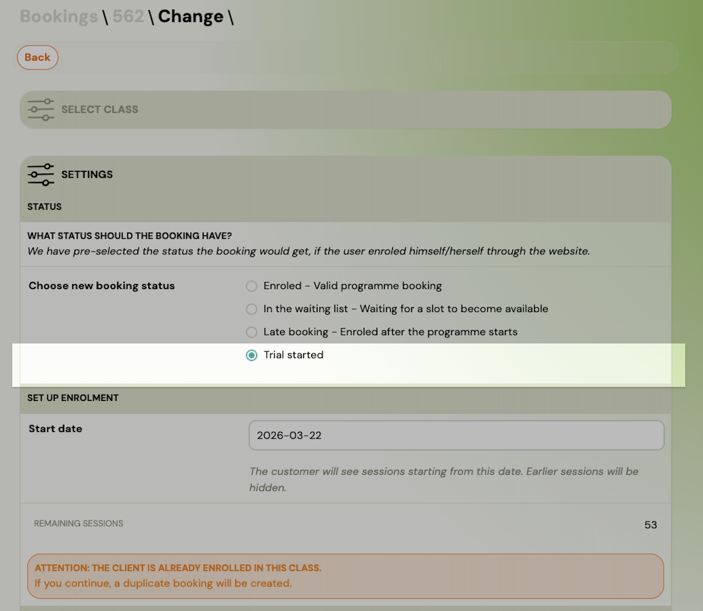
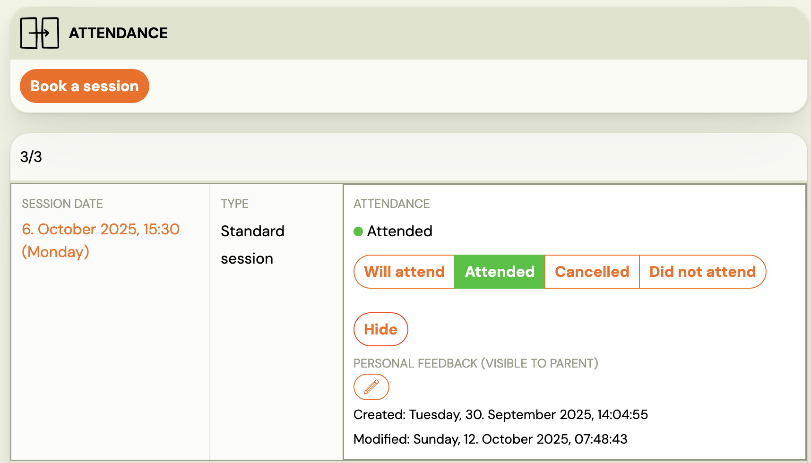
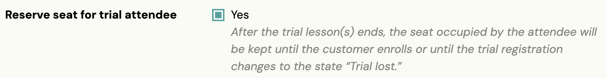
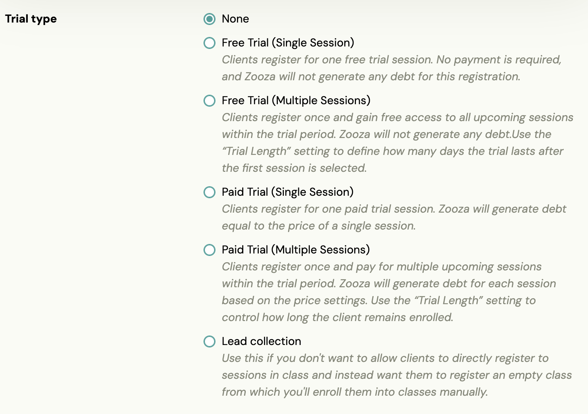

# Daily Business with Trials: Setup, Transfers, and Adjustments

## Trials are a great way to introduce new clients to your classes — and Zooza gives you full flexibility to manage how they work. Below you’ll find the most common trial-related actions and how to handle them step by step.

Trial bookings cannot be created manually by admins or instructors and must be submitted by the client via the website booking form.

### How can I make sure parents can’t choose their own trial start date — only the next available one?

You can control which trial dates appear on your website directly in the programme settings. Go to:
 Programme > Settings > Trial > Sessions Shown in Form

Here you can decide whether to:

- Show a fixed number of future sessions, or
- Show sessions within a specific date range (for example, always the next three weeks).

### How to transfer a trial booking to another class

If you just need to move one session, open the booking → Attendance → click Book a session, then select the new date and class.

If you’re moving the entire trial booking to a different class:

1. Open the booking detail.
2. Go to the Class section and click Transfer.
3. Select the new class (you can filter by programme or location).
4. Click Transfer to another class → Continue.
5. The booking status will remain Trial started.
6. Choose the next session date.
7. Keep the payment unchanged if it’s already paid — tick Do not change payments.
8. Decide whether to notify the client about the change (checkbox).
9. Confirm by clicking Continue.
10. Go to Attendance to hide or add sessions as needed.

&amp;amp;amp;lt;br&amp;amp;amp;gt;

### When transferring a trial, how do I hide old sessions and add new ones correctly?

You can manage attendance flexibly:

- Click Hide to remove a session. This hides it from reports and from the client’s view. The client won’t get notifications for it.
- Click Book a session to add a new one.

You’ll find both options in the Attendance section of the booking.

### How to reschedule a single trial session

1. Go to the booking → Attendance.
2. Click Hide to remove the original date.
3. Click Book a session to add the new date. The client and instructor will both receive a notification and see the updated session in their profile.

### How to reserve a seat for the trial participant

If you want a trial participant to keep their seat reserved in the class until they either enrol or are marked as lost, go to: Programme > Settings > Trial > Reserve seat for trial attendee and check the box.

### How to change the trial duration (e.g. more than one session)

To set a longer or paid trial, open:
 Programme > Settings > Trial

Under Trial type, choose between:

- Free trial (single or multiple sessions), or
- Paid trial (single or multiple sessions).

You can also adjust the unit price per session here.

### How to allow only trial bookings in classes

If you want clients to book only trials (and not full enrolments), open: Programme > Settings > Online Registration (Edit)

Under Booking Options Shown on Website, select: Trials only (or any other option that fits your setup).

### Tip

Most trial settings are controlled at the programme level — so each programme can have its own unique setup, payment type, and visibility rules.

###

### Trial Sessions and Class Overcapacity (Important Note)

In Zooza, class overcapacity can occur when Trial Sessions are used together with [Blocks](blocks-creation.md) within the same Class.

For Trial Sessions, it is possible to configure the booking to reserve capacity for the full Class period. This setup works reliably only in Class without Blocks.

If a Class uses Blocks, the system cannot determine which Block the capacity should be reserved for when a Trial Session is configured to reserve a seat. In this case, Trial Sessions reserve capacity only for individual dates, not for the full Class period. As a result, subsequent full-period bookings may exceed the Class's total capacity.

### How to avoid overcapacity

At the moment, the only reliable way to prevent overcapacity in Class with Blocks is to configure Trial Sessions to use Extra Capacity.

If Extra Capacity is not used, Class capacity must be actively monitored, and Trial Sessions should be managed manually.

### What if a trial client doesn’t show up?

If a parent booked a trial but didn’t attend, the outcome depends on your trial settings.

- If your trials are configured to hold a spot in the class, the trial may still be “active” and can continue to count towards capacity until the trial process ends.
- If you don’t plan to continue with that parent, the recommended action is to mark the booking as *Trial Lost*.

### How to mark a trial as “Trial Lost”

1. Open the booking detail.
2. Change the status to Trial Lost.
3. If you send the optional email, the parent will receive a message with a link to book again (they’ll be taken to the booking form).

This stops the trial flow and releases the spot in the class.

