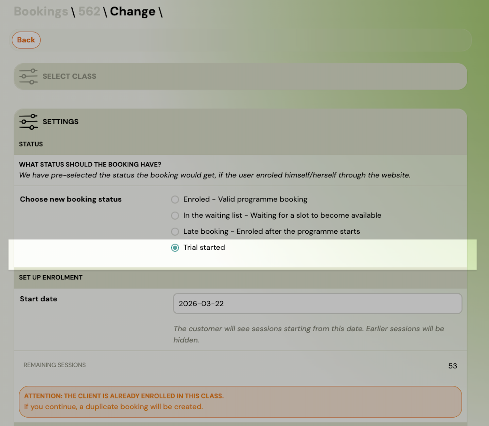
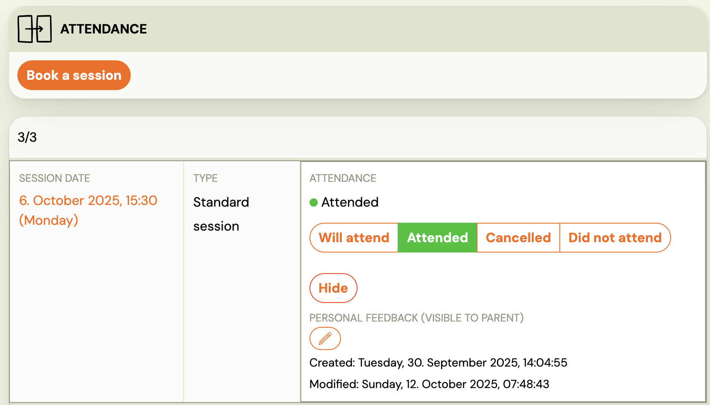
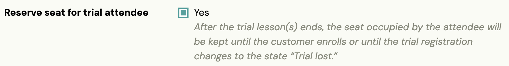
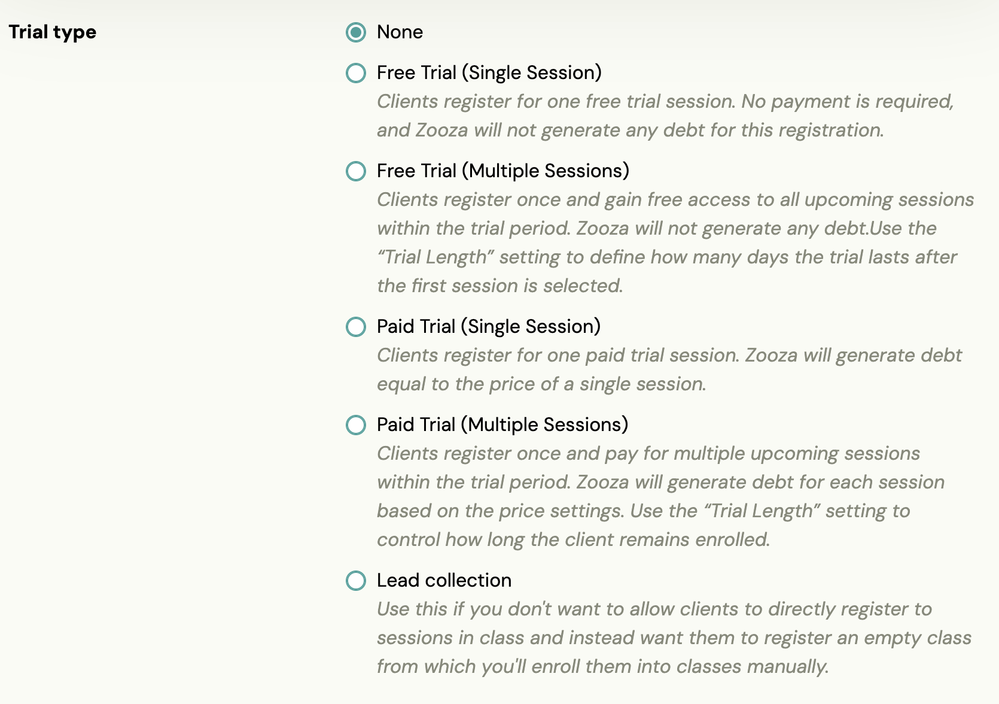
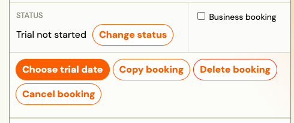
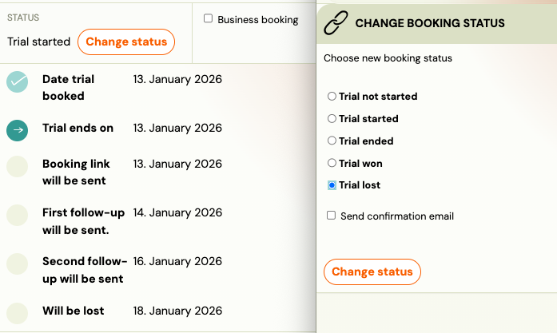

# Daily Business with Trials: Setup, Transfers, and Adjustments

Trials are a great way to introduce new clients to your classes — and Zooza gives you full flexibility to manage how they work. Below you'll find the most common trial-related actions and how to handle them step by step.

> **Note:** Trial bookings cannot be created manually by admins or instructors. They must be submitted by the client via the website booking form.

---

## Controlling which trial dates appear on your website

You can control which trial dates are shown on your booking form directly in the programme settings. Go to **Programme → Settings → Trial → Sessions Shown in Form**.

Options:
- Show a fixed number of future sessions, or
- Show sessions within a specific date range (e.g. always the next three weeks).

---

## How to transfer a trial booking to another class

**Moving a single session only:** Open the booking → **Attendance** → click **Book a session**, then select the new date and class.

**Moving the entire trial to a different class:**

1. Open the booking detail.
2. Go to the **Class** section and click **Transfer**.
3. Select the new class (you can filter by programme or location).
4. Click **Transfer to another class → Continue**.
5. The booking status remains *Trial started*.
6. Choose the next session date.
7. If already paid, tick **Do not change payments** to keep the payment unchanged.
8. Decide whether to notify the client (checkbox).
9. Confirm by clicking **Continue**.
10. Go to **Attendance** to hide old sessions and add new ones as needed.

---

## How to hide old sessions and add new ones after a transfer

You can manage attendance flexibly from the **Attendance** section of the booking:

- **Hide** — removes a session from reports and the client's view. The client won't receive notifications for it.
- **Book a session** — adds a new session.

---

## How to reschedule a single trial session

1. Go to the booking → **Attendance**.
2. Click **Hide** to remove the original date.
3. Click **Book a session** to add the new date.

The client and instructor will both receive a notification and see the updated session in their profile.

---

## How to reserve a seat for a trial participant

If you want a trial participant to keep their seat reserved until they either enrol or are marked as lost:

Go to **Programme → Settings → Trial → Reserve seat for trial attendee** and check the box.

---

## How to set trial duration and type (free vs. paid, multi-session)

To configure a longer or paid trial, go to **Programme → Settings → Trial**.

Under **Trial type**, choose between:
- Free trial (single or multiple sessions)
- Paid trial (single or multiple sessions)

You can also set the unit price per session here.

---

## How to allow only trial bookings in a class

If you want clients to book only trials (not full enrolments):

Go to **Programme → Settings → Online Registration (Edit)** → under **Booking Options Shown on Website**, select **Trials only** (or whichever option fits your setup).

> **Tip:** Most trial settings are controlled at the programme level — so each programme can have its own unique setup, payment type, and visibility rules.

---

## Trial sessions and class overcapacity

Class overcapacity can occur when trial sessions are used together with [Blocks](blocks-configuration.md) within the same class.

When trials are configured to reserve capacity for the full class period, this works reliably only in classes **without** Blocks. If a class uses Blocks, the system cannot determine which Block the capacity should be reserved for — trials then reserve capacity only for individual dates, not the full period. This can cause subsequent full-period bookings to exceed total class capacity.

**How to avoid overcapacity:** Configure trial sessions to use **Extra Capacity**. If Extra Capacity is not used, class capacity must be actively monitored and trials managed manually.

---

## How to convert an existing booking to trial status

If a booking was created as a regular registration or waitlist entry but should have been a trial, an admin can convert it without starting from scratch.

**Prerequisite:** The programme must have trials enabled (Trial type must not be set to *None*).

1. Open the booking detail.
2. Click **Change status**.

   

3. Select **Convert to trial**.
4. Choose a trial date.

After converting, the booking enters the standard trial flow — the same automation (follow-ups, auto-lost) applies as for any trial. Manually enrol the client into a specific trial session from the **Attendance** section.

> **Note:** This is a one-way conversion. A trial booking cannot be converted back to a regular registration.

---

## What if a trial client doesn't show up?

If a client booked a trial but didn't attend, the outcome depends on your trial settings:

- If trials are configured to hold a spot, the trial may still be active and count towards capacity until the trial process ends.
- If you don't plan to continue with that client, mark the booking as **Trial Lost**.

### How to mark a trial as Trial Lost

1. Open the booking detail.
2. Change the status to **Trial Lost**.
3. Optionally send an email — the client will receive a message with a link to book again (takes them back to the booking form).

This stops the trial flow and releases the spot in the class.

