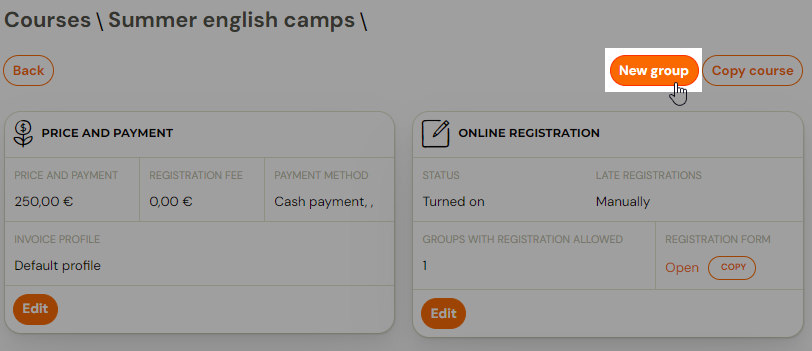
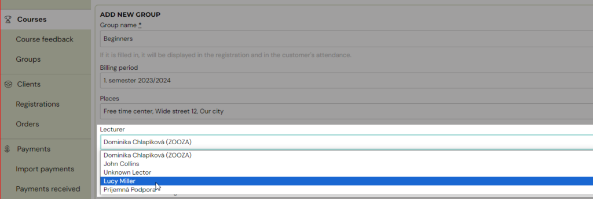
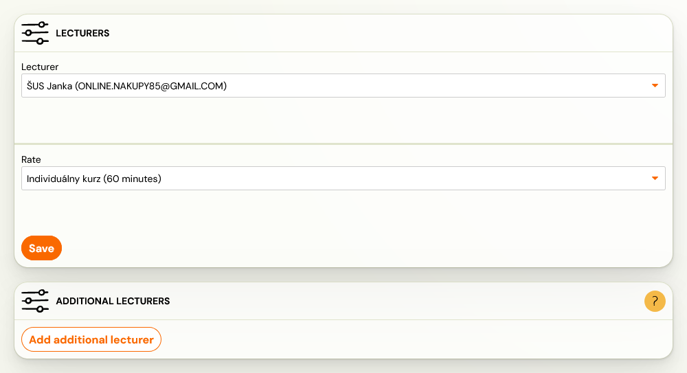
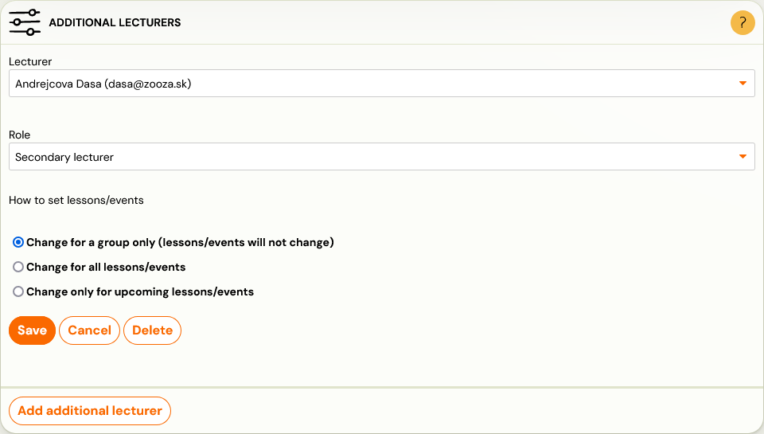

# 2 instructors per class

Do you have 2 instructors in one class, or a main instructor and his assistant?

1. The first instructor is added when the class is created. A class is added by clicking on the Create new class button in the details of the specific programme for which the class is being created

1. In the basic settings while creating a new class select 1. instructor from the offer of instructors. The instructor can be changed later in the class settings.

1. Then in the class settings you have the option to add a second instructor. Click on Classes. Find and click on the class in which you want to manage the settings, and in the Instructors tile, click *Change*. This will open the Instructors settings, where you have the option to *Add additional instructor*

1. Select the following:
2. *Instructor*
3. *Instructor Role* - select whichever role is appropriate for your programme and type of instructor collaboration. The choice of role has no influence on the administration. This role is also displayed in the class details for the client.

Term Settings:

1. Change on class only - this setting will not change on terms
2. Change on all dates
3. Change on upcoming dates only - if you are adding a second instructor during the programme, we recommend selecting this option for proper setup and calculation of rates.
 

For instructors, you can also use rate functionality. Thus, you can
calculate rewards for instructors within the app. You will especially
appreciate this setting if you have multiple instructors working at
different intensities. Please refer to [the instructions for](https://www.zooza.online/support/setting-the-rate-reward-for-lecturer/) more information.
