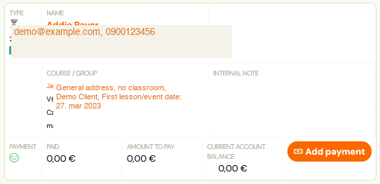

# Types of bookings

## Booking options

## Normal booking

If the class has not yet started, each booking will proceed in
standard mode. Thus, after booking, the client’s payment is
expected and the client is automatically subscribed to the class of his
choice.

## Waiting list

If the capacity of the class is full, the bookings will be
switched to the waiting list mode. Such clients receive a different
notification email and are not expected to pay for the programme. On the
contrary, clients expect you to reach out to them and offer them a
different class, or directly create a new class and move them into it.

## Late booking

Once a class starts, regardless of whether it is full or not, all
bookings are automatically classified as late. Similar to a waiting
 list, you will be expected to communicate with the client and
negotiate payment terms and their joining an already established class
or other suitable solution.

## Trial

The Trial Session status is visible on the booking only during the period when the client is logged in for a trial session. Detailed information on setting up trial sessions at the programme level can be found [here](../setup/trial-lessons.md).

## Booking status

Each booking contains an icon that shows what type it is.

Attention! The booking creation status is always the last record, previous records/changes are overwritten.

## Manually

The booking was created manually by the administrator directly in the application.

## By Client

The booking was created by the client himself via the booking form on the organizer's website.

## Copied

The application administrator used the copy booking function and thus the client booking was copied to the next programme.

## Moved

The application used the move booking function and thus the client's booking was moved to another programme/class.

## Payment

Each booking, in addition to its main status (Registered, Waitlisted, Late Booking), also has a billing status.

## Unpaid

Typically this is a new booking that has not yet been paid.
Payment status does not affect whether or not a client can attend a
programme. It’s purely up to you and your setup whether you want to have
the money upfront before the programme starts, or if you’re also
comfortable collecting money from clients on an ongoing basis.

## Partially reimbursed

Booking whose debt has not been settled in full. Typically, this
 may be the case where you and the client have agreed on two or three
instalments of the full amount of the programme.

## Paid

The best condition. The client paid everything.

## Overpaid

This also happens. If the client sends more money than needed, the
system will automatically highlight this and notify the client as
well.
