# User roles

For adding additional Zooza users, you have a choice of different roles that are set according to how much data about your clients they can see and edit.

## Add instructor

The process of adding a instructor is very simple. Under Settings, open the Access icon and click the Add button. Then fill in all the details that are required.

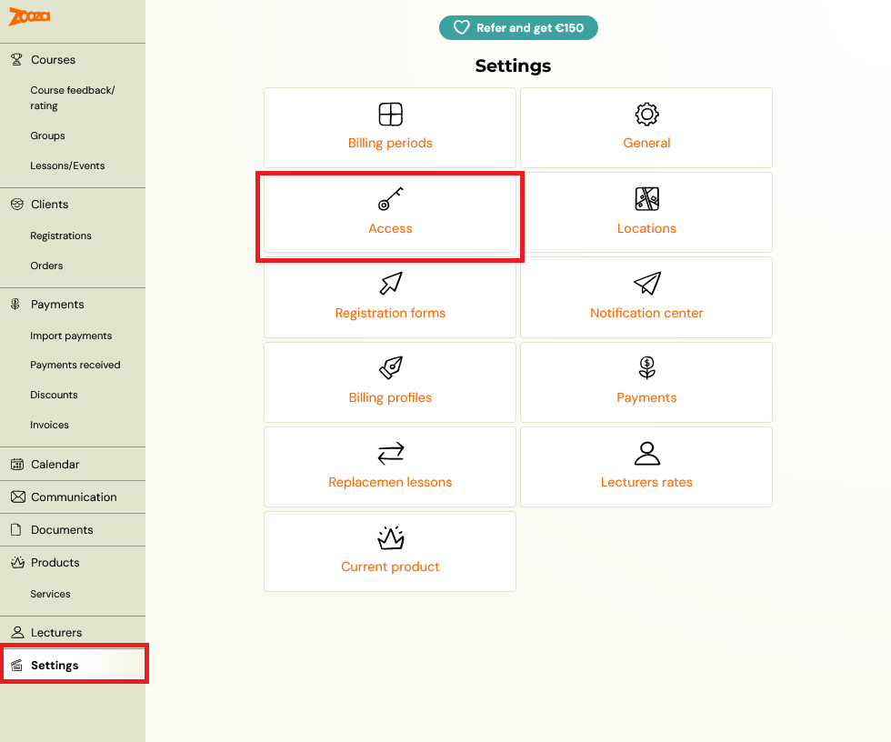

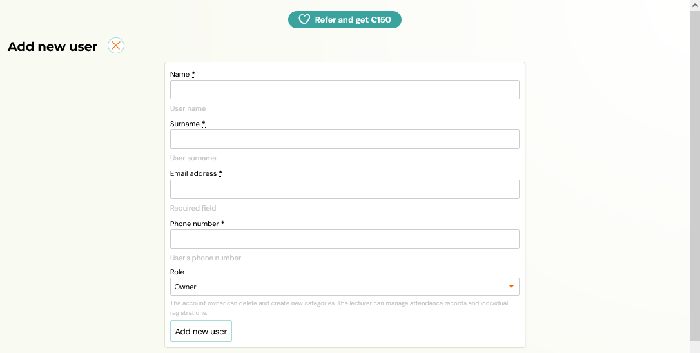

Warning! When filling in the Email field, enter ONLY functional email addresses. If you fill in an address such as [demo@example.com](mailto:demo@example.com), it may happen that such an account is actually active and in use and this user will be able to get into your Zooz account, thus compromising data security. If you want to test a role/feature, we recommend using an email address that you have not yet registered with Zooza to ensure your security.

 The last field to select is the user role, you can choose from the following:

- Owner
- Assistant
- Main instructor
- Instructor
- External instructor
- Receptionist

For all the differences between these roles, please refer to the table below the form in the application or read later in this manual.

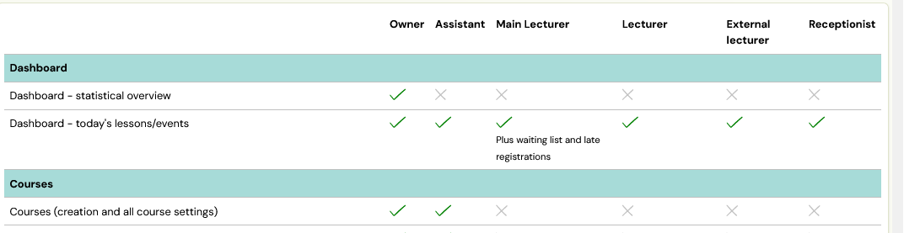

Click the *Add New User* button to save your settings.

## Team members

Setting the basic view for individual team members will make it easier for you to specify some of the features available for instructor roles according to your needs. You decide how a instructor should see the attendance report, how they can manage their own availability, whether instructors can see client details or send messages to clients in term details. Last but not least, you have the option to allow instructors to create substitutions on appointments for easier administration. You can find out all the information on how to set up the substitution and how it works in this [manual.](lecturer-substitution.md)

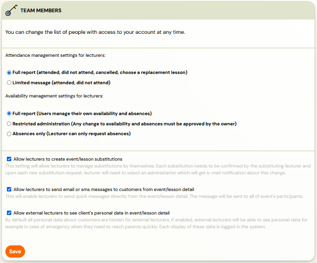

## Owner

Owner role has a full ownership of the application and can access all functionalities and settings available in Zooza.

## Assistant

The role of assistant is intended for a person who helps you to organise
 programmes and therefore has broad rights within the application.

- He sees today’s dates on the dashboard and doesn’t see the statistical reports like the owner. If the assistant (role) is also the receptionist (physically) – they can quickly fill in attendance. By clicking on the Detail button next to a given term, it will display all the people registered for that term.

- Assistant has a full report – Arrived / Arrived / Signed Out /
Didn’t Arrive to fill out the attendance form and has the option for the
 client to select an alternate session.

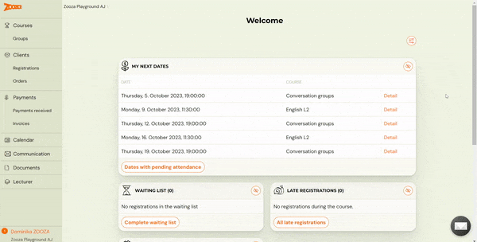

- It has the right to create programmes, change their settings, create or
 copy classes and add dates. In classes, he can edit settings and modify
existing dates – change the time, change the instructor or cancel the
session and inform clients about it at the click of a button – just like
you do.

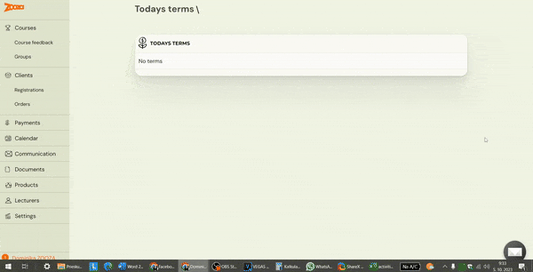

- He has the right to communicate to all clients, via both email and
SMS. It can send an email, whether to a booking, a class, to all
clients, and just like you, it can enter its own text or choose from a
menu of email templates. He cannot create or edit email templates.
- Of course, the right to manage clients’ attendance and payments is a
 available However, they can only add payment. They do not have the
right to make other adjustments to the price – granting a discount,
changing the amount due or refunding the payment.

- They can do all the editing on the booking – change the
booking status, copy the booking, move the booking, edit
the child’s name or other information in the extra fields section

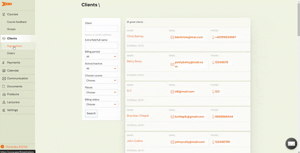

- It has a limited *Payments* section – in which it can’t do
imports, it can’t see invoices and it can’t issue invoices. It only sees
 a summary of payments, so for example unpaired payments, which he can
help you pair.
- Sees the complete *Calendar* with all classes of all instructors
- It can add both *Documents* and *Products* and assign them to classes.
- In the *Instructors* section, he can see all team members and
manage their personal data, enter a price to the rate, enter and edit
working hours as well as call up a report.
- It has access to the *Settings* section – it can add a new team member, add a location or a billing period. Cannot edit Payment Templates.

## Main instructor

The main instructor is the instructor who has more competences than the
instructor. In addition to taking attendance, it has the authority to
adjust the dates of all classes. Assign dates to other instructors or make
other changes to dates. He has the ability to upload documents and
videos and add them to classes.

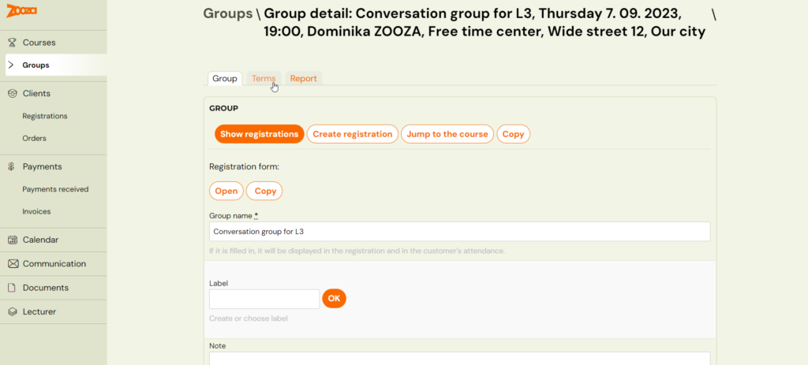

- Cannot see Programmes and Programme Settings, so can’t edit them in any way
- He sees all the classes of all the instructors, he can make changes in them
- So he can make changes even on dates – change of instructor, time, place…
- He can only see their clients, bookings and orders.
- Sees payments, payments received and invoices
- Has the right to manage client payments
- He can see the whole calendar with all the dates, he can record attendance
- Has the ability to communicate to their clients
- Has the ability to upload documents and videos and add them to classes and appointments
- Does not have access to settings (locations, access, billing periods, billing profiles, payment templates…)

## Instructor

The main task of the instructor is to fill in the attendance in his classes, in the *Calendar* section. In the *Instructors* section he can enter his working hours and absences as set by you / the owner in the general settings. And they can see the *Clients* and *Bookings* subpages – but only their clients. Also has a *Communication* option for their clients

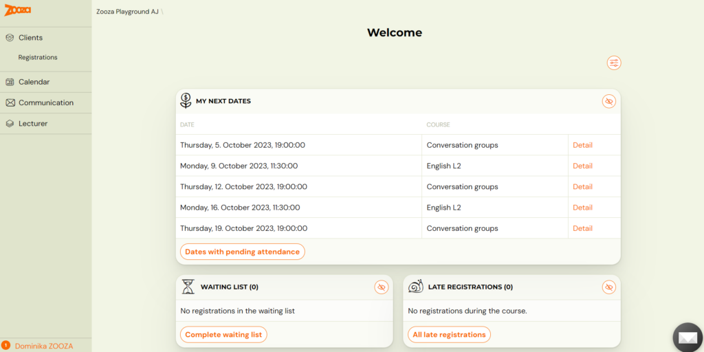

- Taking attendance – in the *Calendar* section they can see
all their appointments and the appointments of other instructors, if their
 are assigned to them (as a substitute or as a second instructor). They
can also see today’s dates on the home page / dashboard.
- They have a full report or a limited report to fill out the
attendance form – depending on your preference. Attendance management
settings for the instructor are made by the owner in the general settings.
- They can search under *Bookings* and *Clients*.
The client’s booking card is visible in its entirety. They can see
the contact details, have the option to move, copy, delete the
booking. They can edit the child’s name or other data from the
extra fields.
- They can *Add Payment* and also have the right to assign a
payment template (such as one with a sibling discount) to bookings,
 provided you have made the payment template visible to instructors. It
can also modify payments – enter a discount, refund a payment, modify
the amount owed or the registration fee.
- They have the right to communicate, send email and SMS, but only to their clients.
- It does not have access to other parts of the administration.

### External instructor

A instructor you trust a little less or don’t want to burden him with
any additional tasks. His only job is to fill out the attendance.

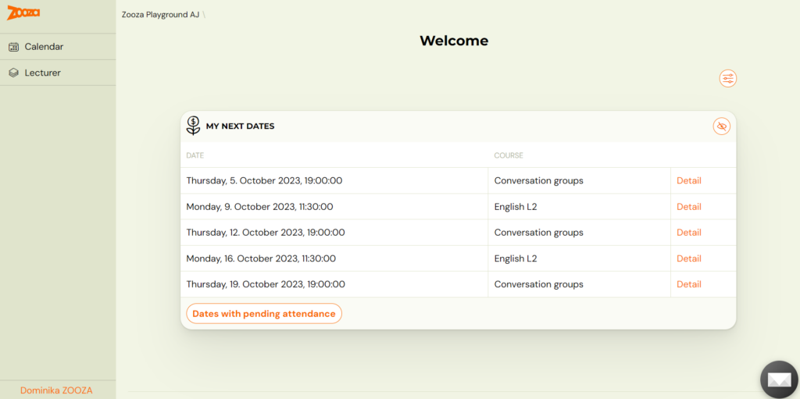

- On the initial dashboard, they can see today’s dates so they can quickly record attendance.
- If they need to look at the dates of other days, they can access the *Calendar*.
 Of course, they can see all the dates on which they appears – their
own, those on which they are assigned as a 2nd instructor, or those on
which they are assigned only to a specific date as a substitute.
- When they open a booking through a specific date in the
calendar, they are presented with a view of the Client Booking
Card, which has limited functionality. They do not see the client’s
contact details, they do not have the right to move or copy the
booking. They can only edit data from extra fields (Child’s name,
age, address…)

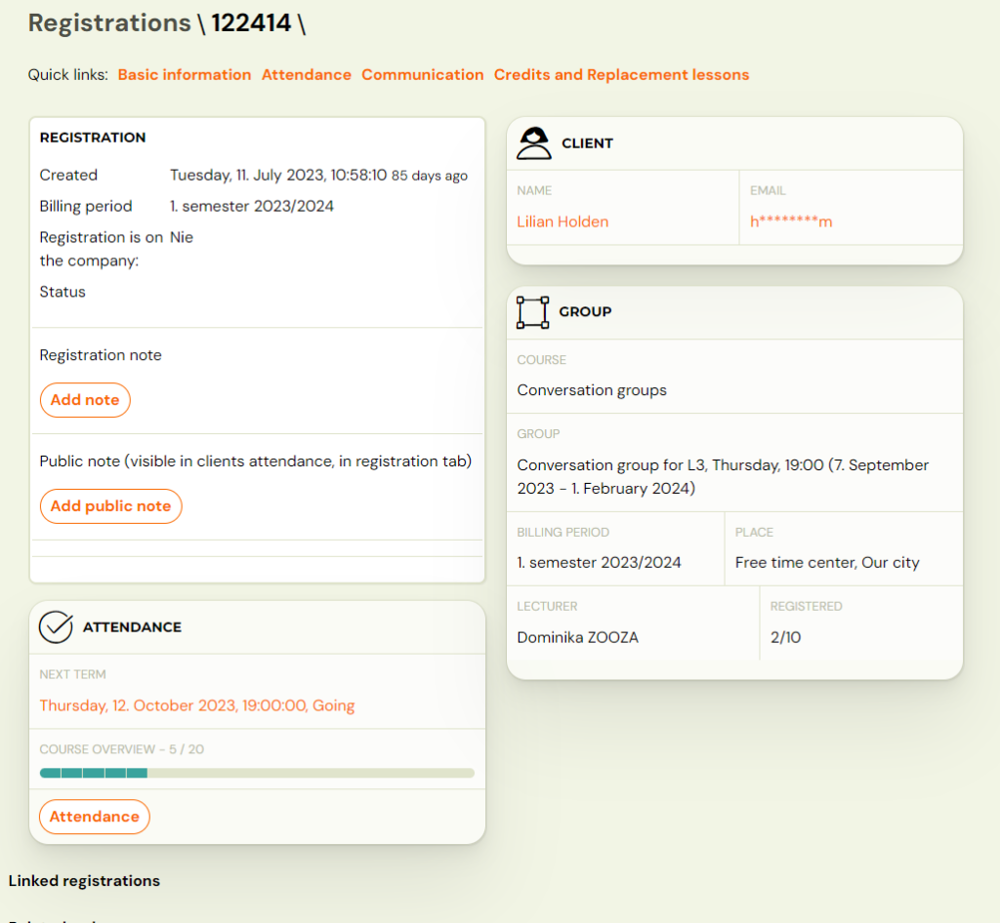

- They do not have the right to add payment or work with payments in any way.
- He can write an internal note in the session/session details.
- If it is set that instructors can send messages, he will be shown the option to send email/SMS in the session/session detail.
- He can also view personal details if required by clicking on the eye.

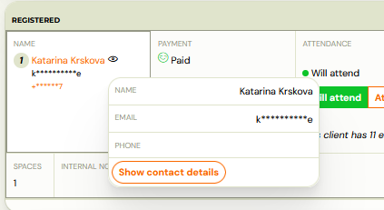

### Inactive instructor

Marking a user as an inactive instructor will prevent access to the
administration, but at the same time you won’t lose the data where the
user was listed as a instructor.

## Receptionist

This role is for receptionists who work at your organisation’s
reception in the sense of – temporary worker, student. They therefore
have very limited rights and basically just take attendance or add cash
payment.

- They see the dates of the current day. They have them immediately on
 the dashboard/homepage. If they are on a different page, they can go
back to the home page by clicking on the Zooza logo in the top left

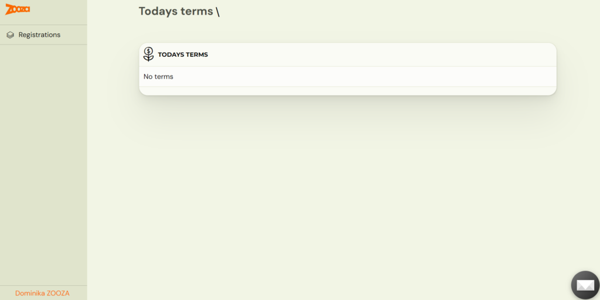

- They can open the date of the current day by clicking on *Detail*. They will see the list of those logged in for the day and can record attendance *Arrived / Did not arrive*
- Cannot see client contact details (email, phone number)

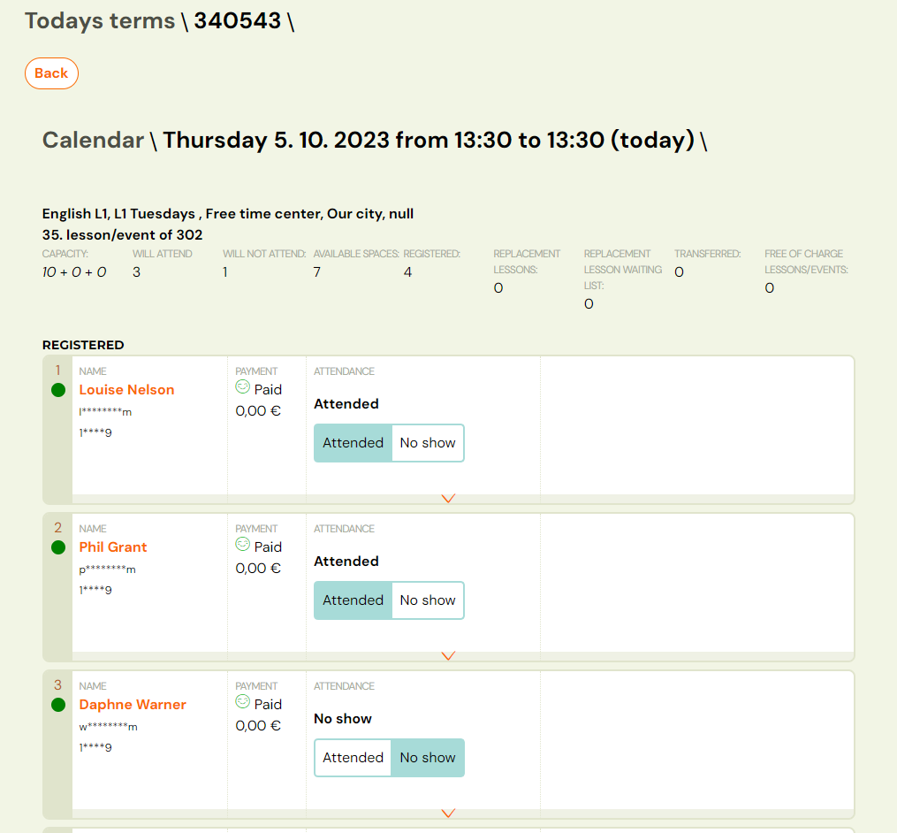

- They can open the client’s booking card by clicking on the orange *Client Name.* They have limited options here:
- Cannot copy/move booking
- Cannot delete booking
- Can add a note and a public note
- Can see attendance, can mark present/absent, but can’t select an alternate session for the client
- Can see payments – can add a payment. Cannot change payments, refund, enter discount, etc.

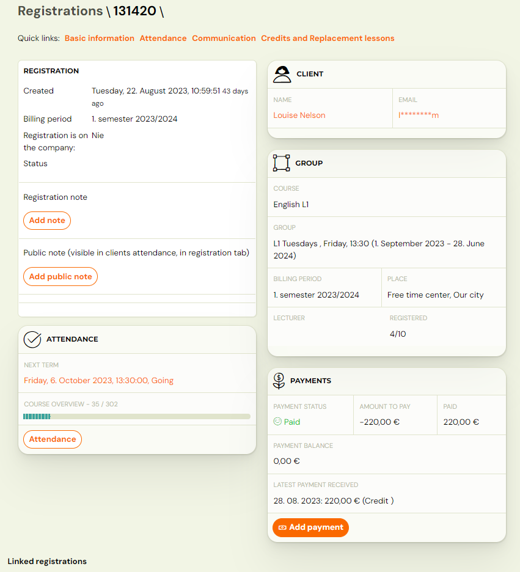

- When the user clicks on the bookings tab, he/she will see all the bookings in which he/she can search by using the filter. So add payment to all bookings (even outside of today)

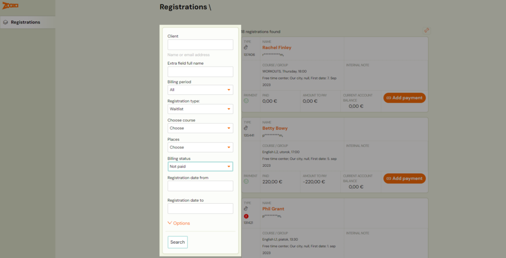

- For the programme type – Open programme, the receptionist can register the client for the date.
- It does not have access to other parts of the administration. It does not have the right of communication to clients.

Example: i offer Pilates as an open programme –
clients sign up for individual classes at their own discretion. If the
client does not manage to book himself in the profile, he just arrives,
the receptionist can also add him to the term

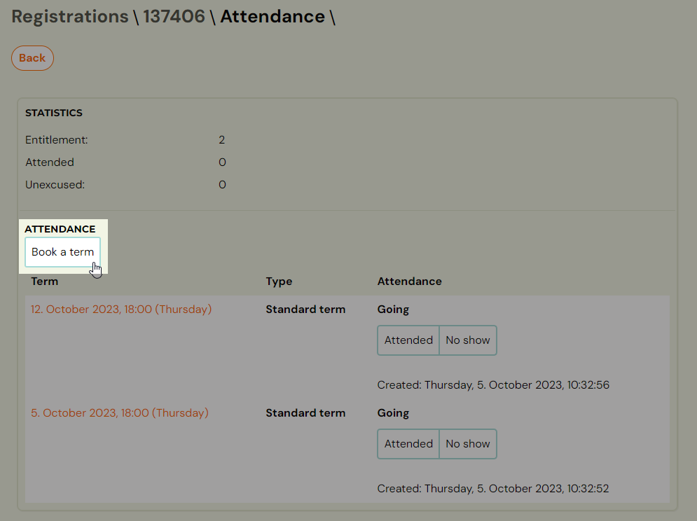
