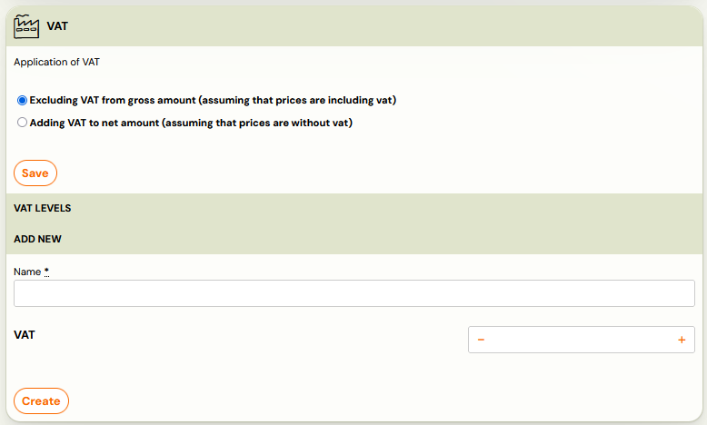
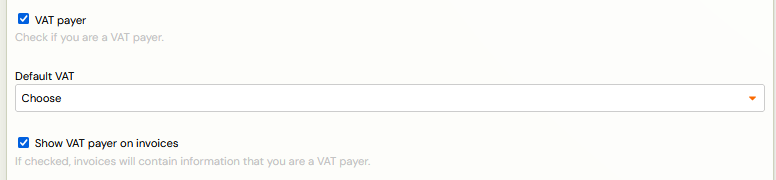
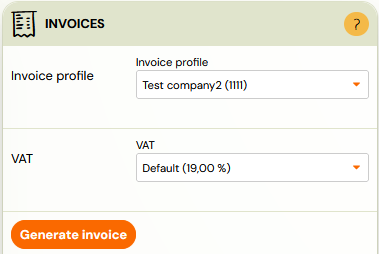

# VAT management

For clients who are VAT payers and need to indicate the amount of tax on invoices, Zooza offers the possibility to set it directly within the invoice data. This functionality ensures transparent and automated VAT processing when issuing invoices and recording payments, thus simplifying administration and facilitating compliance with tax obligations. 

You can set the VAT level in 3 places:

1. Billing
2. Invoice profile
3. Booking level

## 1. Billing

First you need to create a VAT level, which will then appear on invoices for your clients. This setting is visible in the Settings - Invoicing section, where you will find a tile called VAT at the bottom of the screen. Here you can define the amount of tax that will be automatically applied when invoicing.

When configuring VAT in the application, you have a choice of two ways to apply it:

1. No VAT on the gross amount - it is assumed that the price entered at the rate already contains VAT, which is then calculated retroactively on the total amount.
2. Adding VAT to the net amount - VAT is automatically added to the amount entered, with the final price containing the base + tax.

Depending on your organisation's requirements and accounting, you can create the level of VAT that will be applied to your invoicing.

Exmple: I own a sports club where I offer different types of training. I am a VAT payer and have to quote 23% VAT on invoices for each training session. I will set this rate as the VAT rate with the no VAT on gross method so that the system will correctly calculate the tax on the total programme price entered. I then apply this level of VAT in the invoice profiles.

## 2. Invoice profile

If you have enabled automatic invoice generation, it is important to set the VAT in the appropriate invoicing profile. In the case of multiple invoicing profiles that are subject to VAT, you need to set these values for each of them.

1. Open the Invoicing profile.
2. Check the VAT payer option.
3. Select the default VAT value.
4. If you want the VAT value to be displayed on the invoice, tick the Display VAT payment on invoice option.

## 3. Booking level

If you do not have automatic invoice generation enabled, or if you need to issue an invoice manually for a specific booking, you can also set the VAT at the booking level.

1. Open the booking detail.
2. Go to the Payments section and open the Invoices tile.
3. Select an invoicing profile (other than the default) and then the VAT level.
4. Click on Generate Invoice.

