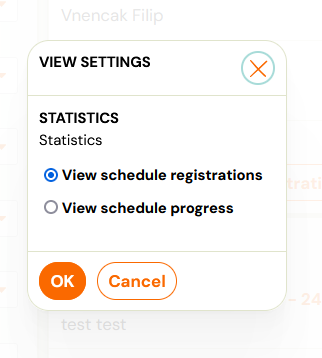
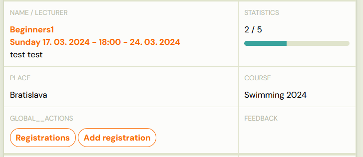
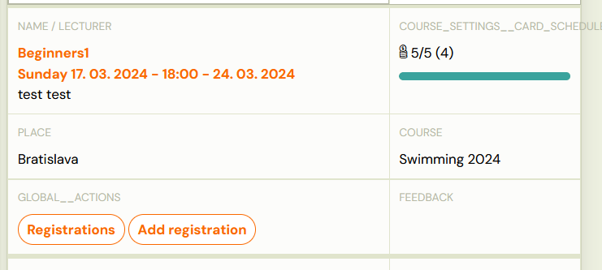
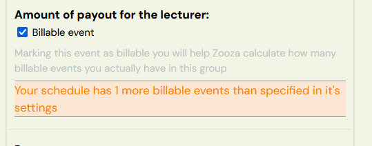
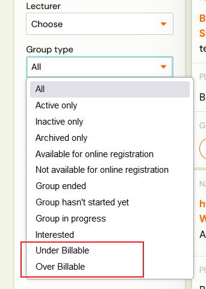
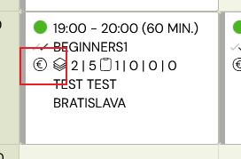
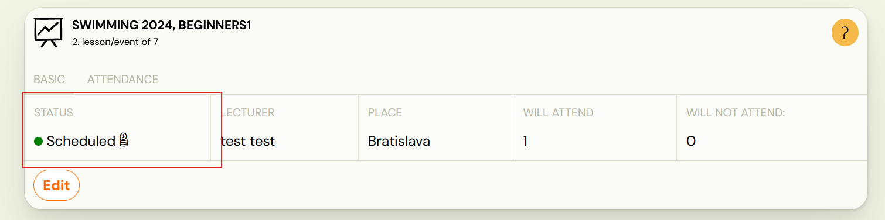
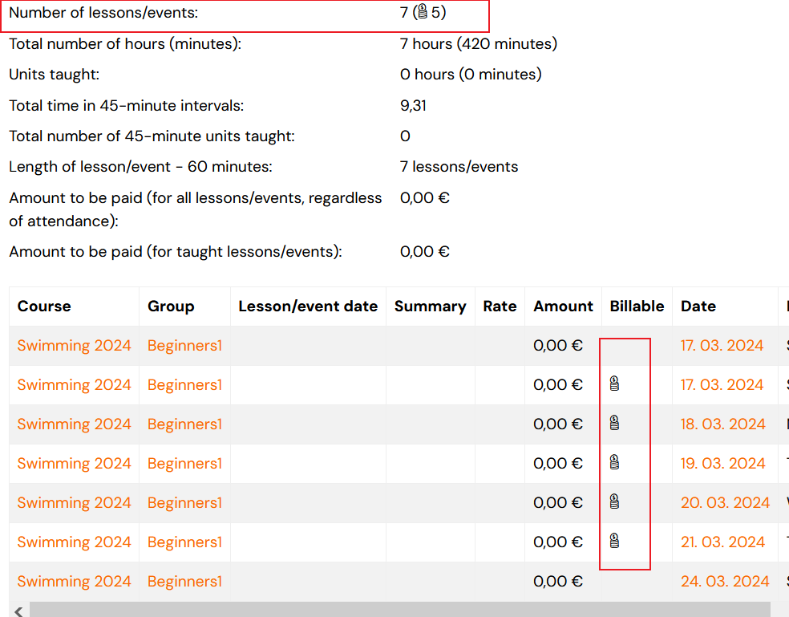
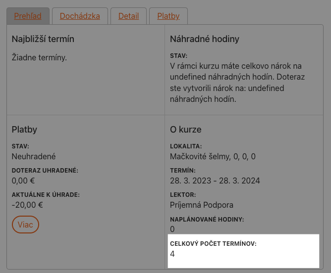

# Viewing/tracking billable events

If you already have set up billable events, the application will start calculating the progression of the group differently: You can switch between the types of statistics in the group list. Next to the *Sort* drop-down menu there is a filter button to set the View Settings. You can switch between viewing the *schedule registrations* or the *schedule progress*.

This selection is then saved and retained in all user sessions.

## View schedule progress

If the group does not have set billable events, then the view of
schedule progress for groups shows the total number of available dates
(scheduled, unscheduled) compared to the number of events that have
already happened.

If the group already has billable events set, the view shows the
total number of billable events available compared to the number of
billable events that have already happened. Next to the coin pile icon
there is number in brackets indicating the number of billable events
subject to payment that are set on the group or on the course.

Attention! The setting on the group/course specifies how many billable events the
group SHOULD HAVE. When viewing with billable events, we are looking at
ACTUAL STATUS of events that are marked as paid. The number in
parentheses serves as confirmation that the group does not actually
contain MORE or LESS billable events than it should.

## Viewing over/under drawn billable events

As mentioned earlier, the number of events actually paid may differ
from the settings in the group/course. Zooza will notify you of this
status as follows:

- In group list when the group overrun is displayed: 2/4 (10)
- This
means that the group has already set 2 billable events out of 4, but the
 total should be set to 10 events.

In group detail

- under billable events setting, a warning will
appear to remind you that you have more or less billable events than you
 should have

In event detail

- under billable events setting, a warning will
appear to remind you that you have more or less billable events than you
 should have.

You can view the overdrawn/under drawn billable events using the filter at the group level.

## View billable events in calendar

1. On the calendar tile there is a “EURO coins” icon, which indicates whether the date is paid or not.

1. On the date detail of the calendar, a coin pile icon is also displayed in the *Status* section to indicate that the date is paid.

## View in the Lecturer report

In order to view a billable event in the lecturer report, see the *Paid* column, which indicates that the term is paid.

## View in the Client profile

In the client profile on the course report, the field: Total Events
is displayed, which shows either the total number of billable events set
 for this group, or the total number of events in the group (if no
billable events are set).

