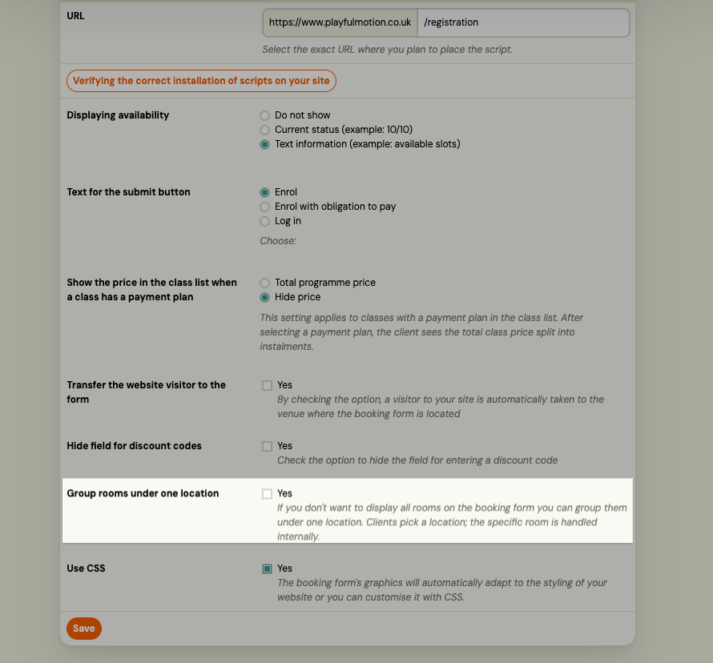

# Group rooms under one place in the booking widget

By default, the registration widget lists each room at a location as a separate option in the place selection step. If your venue has multiple rooms but you do not want clients to choose a specific room — only the location — you can enable **Merge rooms**.

When enabled, the widget shows one entry per location. The room is still assigned automatically based on the selected schedule.

---

## Enable merge rooms

1. Go to **Settings → Widgets**.
2. Open the registration widget you want to configure.
3. Find the **Merge rooms** checkbox and enable it.
4. Click **Save**.

The widget immediately shows grouped places for new visitors.

> **New widgets** have merge rooms enabled by default. Existing widgets keep their current setting until you change it.

---

## When to use this

- You have a venue with multiple rooms (e.g. Studio A, Studio B) but clients should just select the venue.
- You want to reduce the number of choices in the booking flow.
- The schedule already determines which room a client is assigned to — the choice is an internal detail.

## When to leave it off

- You want clients to actively choose a specific room (e.g. small group vs. large group).
- Your rooms have meaningfully different capacities or purposes that clients need to know about.

---

## Reset to defaults

If you reset a registration widget to its default settings, **Merge rooms is enabled** as part of the reset. Review your widget settings after resetting if you prefer the per-room view.

---

## Related

- [Deploying Zooza on your website](../setup/deploying-zooza-on-website.md)
- [Booking widget FAQ](../faq/booking-widget-faq.md)
