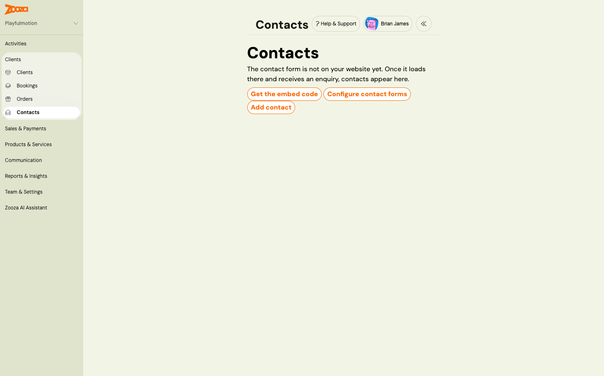
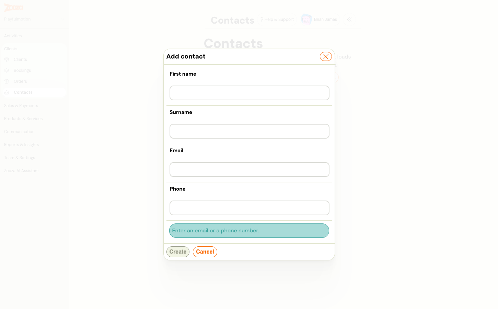
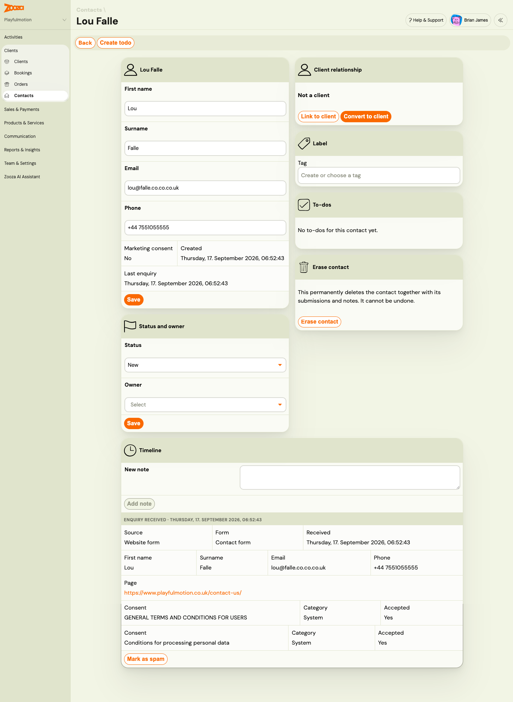
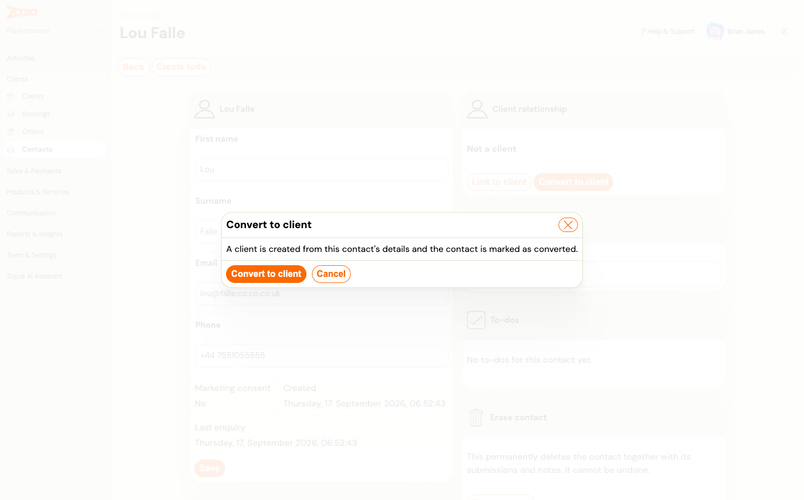
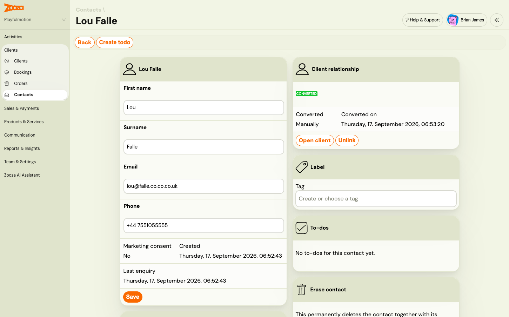

# Work with contacts and enquiries

Every enquiry sent through your [contact form](contact-form-lead-capture.md), and every contact you add by hand, lives under **Clients → Contacts**. This is where your team sees who wrote, what they asked, who is looking after them and how far the conversation has got.

Anyone who can view clients can view contacts. Editing a contact, adding notes, rescuing spam and converting to a client need the permission to edit clients.

## The Contacts list

> **Navigation:** Go to **Clients → Contacts**.

Each row shows the name, email and phone, **Status**, **Owner**, the date of the **Last enquiry**, the **Form** it came through and the **Source**: *Website form* or *Added manually*. A badge marks contacts who are an **Existing client** or **Converted**. Click the name to open the contact.

Filters narrow the list and stay in the address bar, so you can bookmark a view:

- **Search** matches the beginning of a name, email or phone number.
- **Status**, **Owner**, **Form**, **Source**, **Label**.
- **UTM source**, **UTM medium**, **UTM campaign**: the campaign that brought the visitor. See [Track campaigns and conversions](contact-form-campaign-tracking.md).
- **Existing client**, **Converted**: yes or no.
- **Created from / to** and **Last enquiry from / to**.
- One filter per active [custom contact field](../setup/custom-contact-fields.md): an option for choice fields, yes or no, a from–to range for numbers and dates, exact text for short text.

**New enquiries announce themselves.** When an enquiry arrives, everyone who can view contacts sees a *New enquiry* or *Another enquiry* toast in the app with a link to the contact. There is no unread counter in the menu.

When the list is empty, the page says why: the widget is not set up, the form is not on your website yet, or no contact matches the filters.

**Add a contact by hand.** Click **Add contact**, enter the name and an email or a phone number, and click **Create**. Use this for enquiries that came by phone or in person, so they are followed up like the rest. Such contacts have the source *Added manually*.

## Statuses and owners

| Status | Meaning |
|---|---|
| **New** | Nobody has picked the enquiry up yet. Every new contact starts here. |
| **In progress** | Someone is talking to the person. |
| **Lost** | The person decided not to join, or never answered. Keep the contact; they may come back. |
| **Converted** | The contact became a client. Set by Zooza when you convert the contact or the person books. You cannot select it by hand. |

The **Owner** is the team member responsible for the contact. A form can assign an owner to every new contact automatically. Change the status and owner in the **Status and owner** card and click **Save**. Every change is written to the timeline with who made it.

## The contact detail

- **Identity card**: name, email and phone, editable. **Marketing consent** shows *Yes* with a date when the person accepted a consent in the Marketing category on the form. Below it, when the contact was created and when they last wrote.
- **Status and owner**: see above.
- **Client relationship**: whether the contact is a client. See [Contacts and clients](#contacts-and-clients-link-convert-unlink).
- **Label**: attach labels, the same ones you use on programmes and bookings. See [Labels](labels.md).
- **To-dos**: the to-dos on this contact. See [To-dos on a contact](#to-dos-on-a-contact).
- **Erase contact**: permanent deletion. See [Erase a contact](#erase-a-contact).
- **Timeline**: everything that happened, newest first.

## Timeline: enquiries, notes and activity

Each **Enquiry received** entry shows the source, the form, the date, the answers to every field, the page the form was sent from, the referrer and campaign parameters, and each consent with its category and whether it was accepted. A person who sends the form twice gets two entries on the same contact, and their details are filled in from the second enquiry only where they were empty before. Nothing is overwritten.

Write a **New note** and click **Add note** to record a call or a decision. Notes can be edited and deleted. System entries record status and owner changes, linking, unlinking and conversion, and to-dos closed by colleagues.

**Mark as spam** at the bottom of an enquiry moves it to the Spam list. If it was the contact's only enquiry, the contact is deleted with it. Emails and to-dos already sent for it are not recalled.

## To-dos on a contact

Click **Create todo** in the header to add a to-do for this contact, or let the form create one for every enquiry. The **To-dos** card lists every open to-do on the contact, whoever it is assigned to, with completed ones as history.

Contact to-dos are team work. Anyone who can edit contacts can tick a colleague's to-do as done, reopen it, reassign it or change its due date. If Peter takes the call that Andrea's to-do was about, Peter closes it. The timeline records *Peter completed a to-do assigned to Andrea*. Everywhere else in Zooza, to-dos keep their usual rules. See the [To-do list FAQ](../faq/todos-faq.md).

## Contacts and clients: link, convert, unlink

A contact is not a client. It has no login, no bookings and no place in the Clients list. The **Client relationship** card shows one of three states.

**Not a client.** Two buttons:

- **Link to client**: pick an existing client if you know the enquiry is from someone who is already with you under a different email address.
- **Convert to client**: Zooza creates a client from the contact's name, email and phone and marks the contact **Converted**. No email is sent to the person. From here on, book them like any client, for example from **Bookings → Add booking**.

**Existing client.** The enquiry's email address belongs to someone who is already your client. Zooza linked the two automatically when the enquiry arrived. Click **Open client** to see their bookings.

**Converted.** The card shows whether the conversion was manual or automatic, and when. A contact is converted automatically when the person books through your booking form with the same email address.

**Unlink** removes the connection without changing the client. A converted contact goes back to **In progress**.

On the client's side, the client detail in **Clients** lists the contact records that belong to them.

## Spam: review and rescue

Zooza's spam protection is invisible to visitors. Anything it catches is kept for 30 days in **Clients → Contacts → Spam**, then deleted. Each row shows the form, when it was received, the name and email or phone as submitted, and the reason:

| Reason | What happened |
|---|---|
| Hidden anti-spam field was filled in | A bot filled a field humans cannot see |
| Submitted too quickly | Sent within three seconds of the page loading |
| Invalid form token, Form token expired, Form token already used | The form was not loaded from your page normally, or the page was open for more than a day |
| Anti-bot check failed | The browser did not complete the invisible check |
| Content looks like spam | Several links in the message, or every field filled with the same text |
| Marked by staff | Someone clicked **Mark as spam** on the contact |

Click **Not spam** to rescue a genuine enquiry. It becomes a contact, your team is notified and the to-do is created as usual. The automatic reply is not sent for enquiries older than an hour.

Spam never becomes a contact, never sends an email and never creates a to-do. The visitor sees the normal thank-you message, so a spammer cannot tell.

## Erase a contact

**Erase contact** permanently deletes the contact together with its enquiries, notes and labels. Use it for a data deletion request. It cannot be undone. To-dos that pointed at the contact stay in the to-do list. If the contact was converted, the client is not deleted.

## Related

- [Contact form (lead capture): turn website enquiries into contacts](contact-form-lead-capture.md)
- [Set up a contact form](../setup/contact-form-setup.md)
- [Track campaigns and conversions from the contact form](contact-form-campaign-tracking.md)
- [Custom contact fields](../setup/custom-contact-fields.md)
- [To-do list FAQ](../faq/todos-faq.md)
- [Labels](labels.md)
- [Contact form and contacts FAQ](../faq/contact-form-and-contacts-faq.md)
