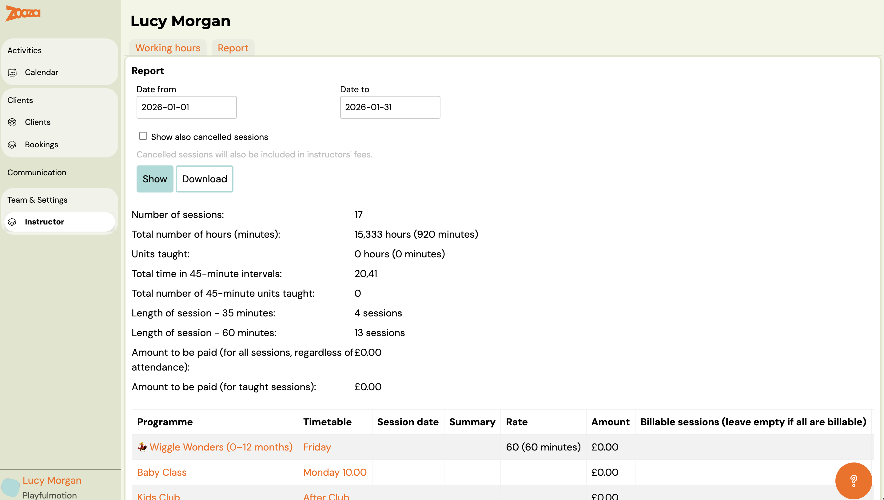
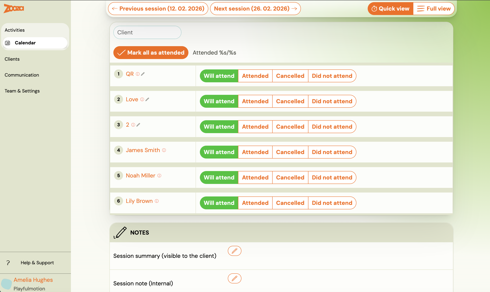
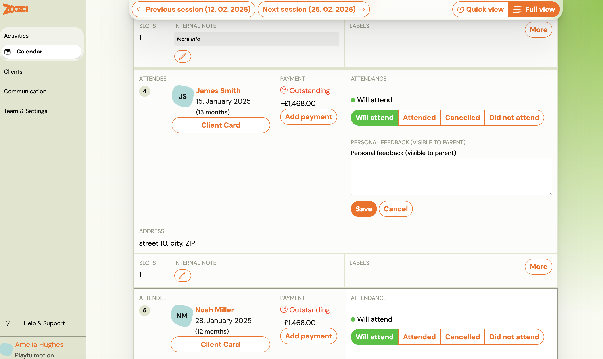
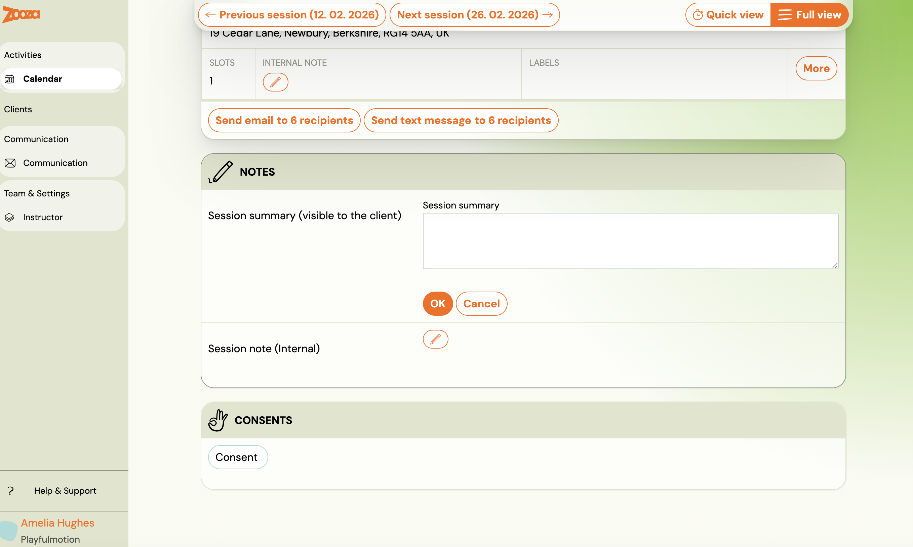
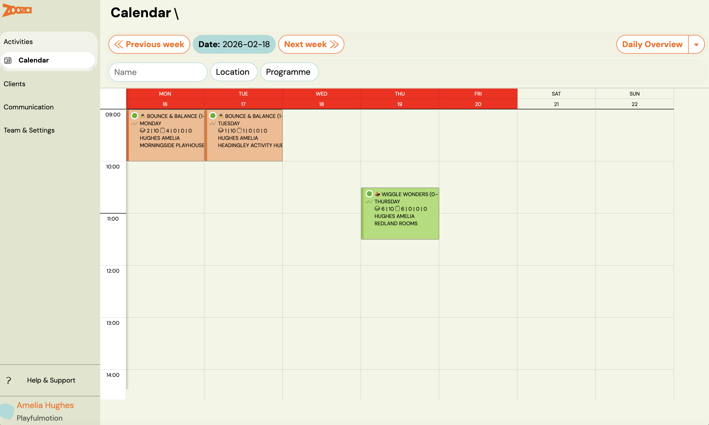

# Zooza 101 for Instructors

*A simple guide to get you started*

This guide explains the basics every instructor needs to know when working with Zooza.
It is short, practical, and focused on what matters most in your daily work.

## 1. Logging in to Zooza

To access Zooza, you must have your email address assigned to your instructor profile by the organisation you work with.

### How to log in

1. Open [https://zooza.online/access](https://zooza.online/access)
2. Select the region where your organisation operates
3. Enter your email address
4. Zooza will send you a login link or code
5. Open the link (or enter the code) to access the application

That’s it.
No password is needed.

## 2. Your main task: Attendance management

Your primary responsibility in Zooza is to mark attendance for your classes.

### 🎥 How to mark attendance as an instructor in Zooza

[https://www.loom.com/share/372a39657cb74874b2d56432af036f28](https://www.loom.com/share/372a39657cb74874b2d56432af036f28)

In this video, we’ll show you how instructors mark attendance in Zooza.

### Step-by-step

Step 1 – Log in
Log in to the Zooza application using your instructor account.

Step 2 – Use the dashboard
On the dashboard, you’ll see a list of your upcoming classes.

Step 3 – Open the class
Click on the class or session you are about to run.

Step 4 – Mark attendance
Mark each child as present or absent.

Step 5 – Add notes (optional)
If needed, you can add a note:

- for a specific child, or
- for the whole class

These notes can be shared with parents, depending on the organisation’s settings.

Step 6 – Use the calendar (alternative view)
You can also open your calendar from the menu.
This shows all your classes for the selected week.

Step 7 – That’s it
Attendance is saved directly in the class view.
No further steps are required.

Note: Exact rules may vary based on internal policies of the organisation, but this is the standard workflow.

## 3. Reporting your taught hours

Zooza also gives you access to your personal teaching reports.

### Where to find it

1. Open Team & Settings
2. Go to Instructor
3. Here you can see:your taught hours report
4. your instructor profile
5. your availability and absence management

This section is typically used for internal reporting and planning.

## 4. Use Zooza on your mobile phone

Most instructors use Zooza on their mobile phone.

Zooza works as a web app and can be added to your phone’s home screen so it looks and behaves like a regular app.

👉 [Follow this guide to add Zooza to your home screen](../setup/add-zooza-app-to-phone.md)

## Final note

Zooza is designed to be simple, fast, and practical for instructors.
If something is unclear, your organisation’s admin can help or provide additional rules specific to your team.
