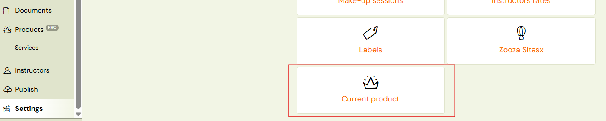
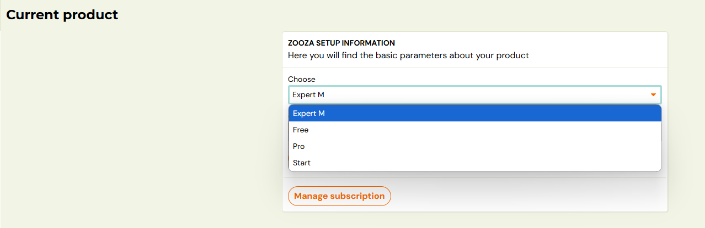
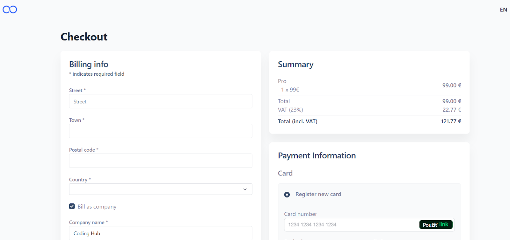
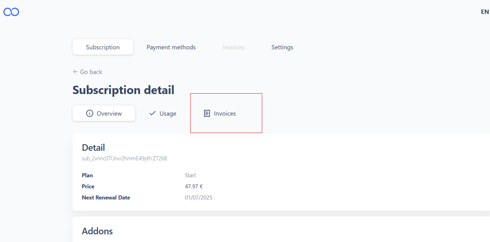
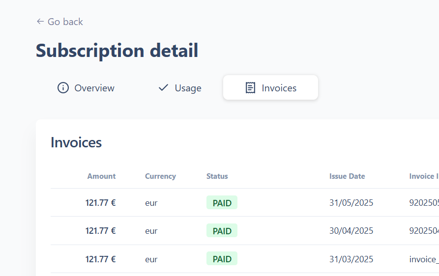
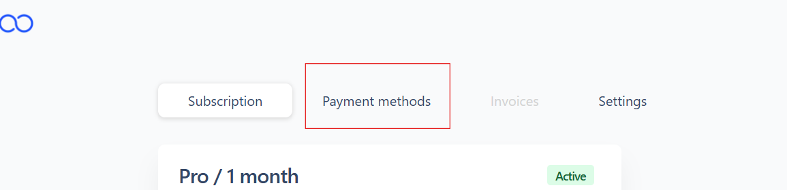

# Billing and Payments for Zooza

As of June 2025, all billing and payment management for Zooza services is handled exclusively through the Zooza platform, in cooperation with our partner [Buyloop](http://buyloop.io/)(a subscription and billing management provider).

## Client Access for setup: Invoices and Payments

1. Client logs into their Zooza account.
2. Navigation: Settings ➡ Current Product ➡ Change Subscription➡Checkout
 
3. Choose your type of subscription for Zooza
 
4. Enter your billing info and payment information
5. To pay online, the client must register a payment card under *Payment Methods.
 
 *

## Client Access to invoices and subscription

View issued invoices and manage your subscription.

Client logs into their Zooza account in Buyloop:

1. Go to Settings ➡ Current Product ➡ Manage Subscription ➡ Details ➡ Invoices
 
 
2. Click on a specific invoice to download it (available on the right-hand side).
 
3. To pay online, the client must register a payment card under* Payment Methods.
 

*

Key Notes:

1. All invoices and payment management are now only available through the Zooza interface
2. [Buyloop](http://buyloop.io/)handles automated invoicing and payment tracking.
3. A notification email is sent to the client each time a new invoice is generated, and the payment is automatically charged to the client’s card.
4. Clients can view their full invoice history in the platform.
5. All billing and payments related to your use of Zooza will be handled exclusively through this new portal in client´s Zooza profile
