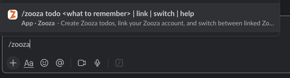

# Use Zooza from Slack

Once your workspace is connected to Zooza, team members can create todos without leaving Slack — using the `/zooza` slash command or the **Create Zooza todo** message shortcut.

> **Prerequisite:** Your Zooza company must be connected to Slack. Ask your Owner or Assistant to complete the setup in **Settings → Integrations → Slack**. See [Connect Slack to Zooza](../setup/slack-integration.md).


---

## Link your Slack account to Zooza

The first time you use `/zooza` or the message shortcut, Zooza looks up your Slack email address and tries to match it to a Zooza user in your connected company.

**If your Slack email matches your Zooza email:** you are linked automatically. No extra step needed.

**If your emails are different:** the Zooza bot sends you a direct message asking you to verify your Zooza account:

1. Reply to the bot message with `/zooza link`.
2. Enter your Zooza email address in the prompt.
3. Zooza sends a 6-digit verification code to that email.
4. Enter the code in the Slack modal to confirm.

Your accounts are now linked. This verification only happens once.

---

## Create a todo with /zooza

In any Slack channel or direct message, type:

```
/zooza todo <your task here>
```

**Example:**
```
/zooza todo Follow up with Anna about missed payment
```

Zooza creates the todo and assigns it to you. You get a confirmation from the bot.

The todo is visible immediately in your Zooza sidebar under **To-dos**. You can open it in Zooza and assign it to a colleague, add a due date, or link it to a specific booking.

---

## Create a todo from a Slack message

If a message in Slack prompts you to do something, you can turn it into a Zooza todo without retyping it:

1. Hover over the message.
2. Click the **More actions** button (⋯).
3. Select **Create Zooza todo**.

Zooza creates a todo with the message text and a link back to the original Slack message. The todo is assigned to you.



---

## Slash command reference

| Command | What it does |
|---|---|
| `/zooza todo <message>` | Create a new todo assigned to you |
| `/zooza help` | Show available commands |
| `/zooza switch` | Change your default Zooza company (franchise users only) |
| `/zooza link` | Link your Slack account to a different Zooza email |

---

## Working across multiple companies (franchise)

If your Slack account is connected to a workspace shared by multiple Zooza companies (a franchise network), Zooza asks you to choose your default company the first time you create a todo:

1. The bot sends you an interactive picker listing all companies you have access to.
2. Select the company this todo belongs to.
3. Zooza remembers your choice for future commands.

To change your default company at any time, use `/zooza switch`.

---

## What the Zooza bot can and cannot do from Slack

| Action | Supported |
|---|---|
| Create a todo | Yes |
| Assign a todo to a colleague from Slack | No — open in Zooza after creating |
| Mark a todo as done from Slack | No |
| See your todo list | No — open Zooza |
| Receive a notification when assigned a todo | Yes (if your company has Todos channel configured) |

---

## Related

- [Manage your to-do list](./todos.md)
- [Connect Slack to Zooza](../setup/slack-integration.md)
- [Slack FAQ](../faq/slack-faq.md)
