# Bookings

The Bookings screen lists all bookings across your programmes. Use it to search, filter, and manage individual enrolments, payments, attendance, and communication.

> **Navigation:** Go to **Clients** → **Bookings**.

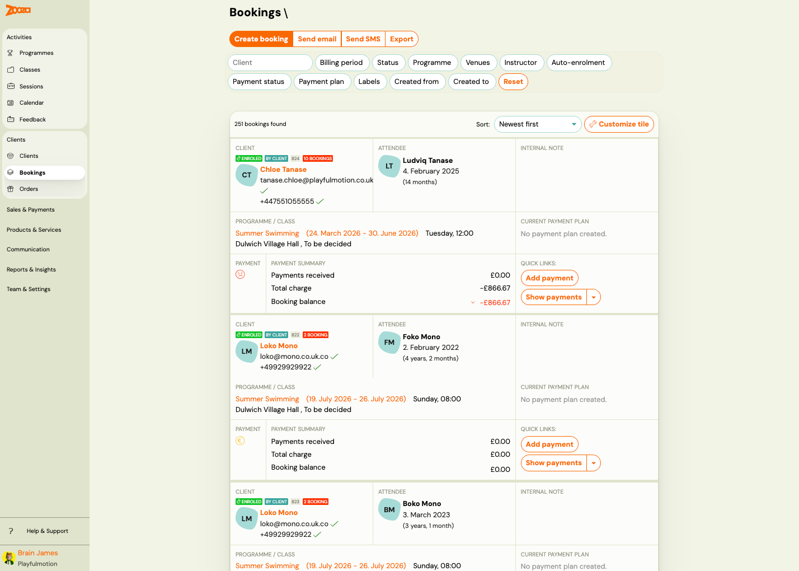

## List View

Each booking card shows:

| Field | Description |
|---|---|
| `Type` | Booking number and status badges (e.g. "Enrolled", "Imported", "Trial started"). |
| `Client` | Client name, email, and phone with verification ticks. |
| `Attendee` | The person attending — may differ from the client (e.g. a child). Shows name, date of birth, and age. |
| `Programme / Class` | Programme name, class name with date range, day/time, and venue with instructor. |
| `Internal note` | Optional internal note. |
| `Payment` | Payment status icon (green = paid, red = overdue). |
| `Paid` | Total amount paid. |
| `Amount to pay` | Outstanding amount (negative = owed). |
| `Current account balance` | Running balance — red if negative. |

Each booking has **Add payment** and **Show payments** action buttons.

The header shows total count, e.g. "23 bookings found".

### Filters

The left sidebar provides filters:

- **Client** — search by name, email, reference number, or phone.
- **Billing period** — filter by billing period.
- **Status** — filter by booking status (Enrolled, Waiting list, Cancelled, etc.).
- **Choose programme** — filter by programme.
- **Venues** — filter by venue/location.
- **Instructor** — filter by instructor.
- **Auto-enrolment** — filter by auto-enrolment status (All, Yes, No).
- **Billing** — filter by billing status.
- **Payment frequency** — filter by payment frequency type.
- **Tag** — filter by custom tag. Type a tag and click **OK**.
- **Booking date from / to** — filter by date range.

Click **Search** to apply filters.

### Top Actions

| Button | Description |
|---|---|
| **Create booking** | Opens the new booking wizard (see [Create New Booking](#create-new-booking)). |
| **Send email** | Send an email to filtered/selected clients. |
| **Send SMS** | Send an SMS to filtered/selected clients. |
| **Export** | Export the bookings list. |

## Booking Detail

Click a booking card to open the detail page.

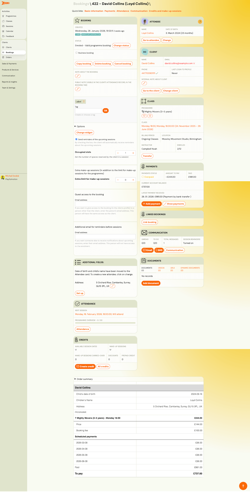

The booking detail is a dense page with multiple sections. Quick links at the top provide navigation: **Basic information**, **Payments**, **Attendance**, **Communication**, **Credits and make-up sessions**.

### Booking Section (Left Column)

| Field | Description |
|---|---|
| `Created` | Date and time the booking was created, with relative time (e.g. "3 weeks ago"). |
| `Status` | Current booking status with badges (e.g. "Enrolled", "Trial started") and a **Change status** button. |
| `Business booking` | Checkbox — mark as a business booking. |
| `Copy booking` | Creates a copy of this booking. |
| `Cancel booking` | Opens the cancellation form. |
| `Note about the booking` | Editable public note (visible in the client's attendance record). |
| `Label` | Add custom labels/tags. |
| `Tag` | Add custom tags. Type and click **OK**. |

#### Options

Expandable section with additional settings:

- **Change widget** — change the booking widget used.
- **Send reminders of the upcoming sessions** — toggle automatic session reminders.
- **Occupied slots** — set the number of spaces reserved by this booking in a session (default: 1).
- **Extra make-up sessions** — add extra make-up session slots beyond the programme default.
- **Extra limit for make-up sessions** — adjust the limit.
- **Guest access to the booking** — grant access via email address.
- **Additional email for reminders before sessions** — add extra email addresses for session reminders.

#### Additional Fields

Shows address and other custom fields. Click **Set up** to configure.

#### Attendance Summary

Shows next session date/time with attendance status, and a programme overview counter (e.g. "0 / 200"). Click **Attendance** to open the full attendance tab.

#### Credits Summary

Quick overview showing:

- `Available session dates` / `Make-up sessions` / `Make-up sessions carried over` / `Discounts` / `Prepaid credit`

Buttons: **Create credit** and **All credits**.

#### Order Summary

Shows the order details including child's date of birth, children's name, address, programme, price, booking fee, scheduled payments, paid total, and "To pay" balance.

### Attendee Card (Right Column)

| Field | Description |
|---|---|
| `Name` | Attendee name (clickable). |
| `Date of birth` | Attendee's date of birth and age. |
| **Go to attendee** | Link to the attendee's client profile. |
| **Change** | Change the attendee for this booking. |

### Client Card

| Field | Description |
|---|---|
| `Name` | Client (payer) name. |
| `Email` | Client email. |
| `Phone` | Client phone number. |
| `Last login to profile` | Timestamp of client's last login. |
| `Internal note about client` | Staff-only note about this client. |
| **Go to the client** | Link to the client's profile. |
| **Change client** | Reassign the booking to a different client. |

### Class Card

| Field | Description |
|---|---|
| `Programme` | Programme name with emoji icon. |
| `Class` | Class name, schedule, and date range. |
| `Billing period` | Payment grouping. |
| `Location` | Venue name and address. |
| `Instructor` | Assigned instructor. |
| `Enrolled` | Current enrolment count vs. capacity (e.g. "7/10"). |
| **Transfer** | Transfer this booking to a different class. |

### Payments Card

| Field | Description |
|---|---|
| `Payments status` | Status icon with label (e.g. "Paid"). |
| `Amount to pay` | Outstanding amount. |
| `Paid` | Total amount paid. |
| `Current account balance` | Running balance. |
| `Latest payment received` | Date and amount of last payment. |
| **Add payment** | Record a new payment. |
| **Show payments** | Open the full payments tab. |

### Linked Bookings

Shows related bookings. Click **Link booking** to connect another booking.

### Communication Card

| Field | Description |
|---|---|
| `Unread` / `To do` / `Total messages` / `Session reminders` | Communication statistics. |
| **Email** / **SMS** / **Communication** | Quick action buttons. |

### Products Card

Lists available products for this booking with a **Buy** action.

### Documents Card

| Field | Description |
|---|---|
| `Documents` / `Videos` / `URLs` / `Dynamic documents` | Counts for each document type. |
| **Add document** | Attach a new document. |

## Trial Booking Detail

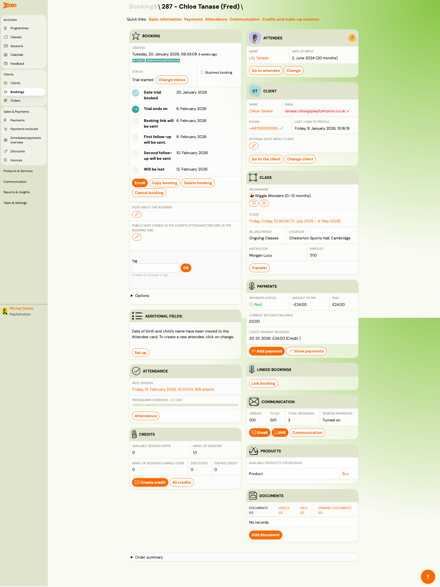

Trial bookings show additional fields in the Booking section:

| Field | Description |
|---|---|
| `Date trial booked` | When the trial was created. |
| `Trial ends on` | Expiry date for the trial period. |
| `Booking link will be sent` | Date the booking link email is scheduled. |
| `First follow-up will be sent` | Date of the first follow-up email. |
| `Second follow-up will be sent` | Date of the second follow-up email. |
| `Will be lost` | Date the trial lead will be marked as lost. |

Additional action buttons for trials:

- **Enroll** — convert the trial to a full enrolment.
- **Copy booking** — duplicate the booking.
- **Delete booking** — permanently remove the booking.
- **Cancel booking** — cancel the trial.

## Create New Booking

> **Navigation:** Bookings list → **Create booking**.

The booking creation wizard has multiple steps:

### Step 1: Choose Timetable

Shows the selected programme/class details:

| Field | Description |
|---|---|
| `Programme` | Programme name. |
| `Class` | Class name and date range. |
| `Location` | Venue and address. |
| `Instructor` | Assigned instructor. |

Click **Change** to select a different class.

### Step 2: Create a Booking

| Field | Description |
|---|---|
| `Choose` | **Create a booking by searching for an existing client** or **Create a booking for a new client**. |
| `Name` | Client's first name (required). |
| `Surname` | Client's last name (required). |
| `Email address` | Client's email (required). |
| `Phone number` | Client's phone (required). |
| `Client is also an attendee` | Checkbox — uncheck if the client only manages/pays for the booking (e.g. parent booking for a child). |
| `Name` (attendee) | Attendee's first name (shown when "Client is also an attendee" is unchecked). |
| `Surname` (attendee) | Attendee's last name. |

> **Note:** No confirmation email is sent automatically when creating a booking manually. A confirmation email must be sent manually.

Click **Continue** to proceed, or **Back** to return.

## Change Booking Status

> **Navigation:** Booking detail → **Change status**.

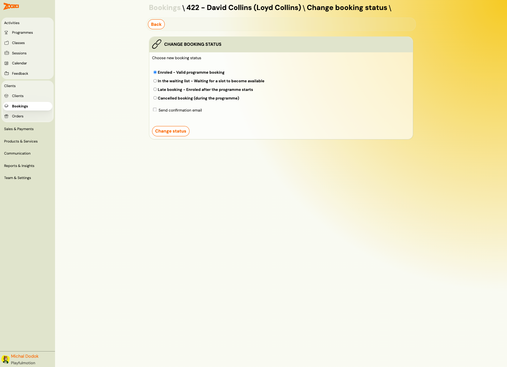

Available statuses:

- **Enrolled** — Valid programme booking.
- **In the waiting list** — Waiting for a slot to become available.
- **Late booking** — Enrolled after the programme starts.
- **Cancelled booking (during the programme)** — Cancelled mid-programme.

Options:

- **Send confirmation email** — checkbox to notify the client about the status change.

Click **Change status** to apply.

## Cancel Booking

> **Navigation:** Booking detail → **Cancel booking**.

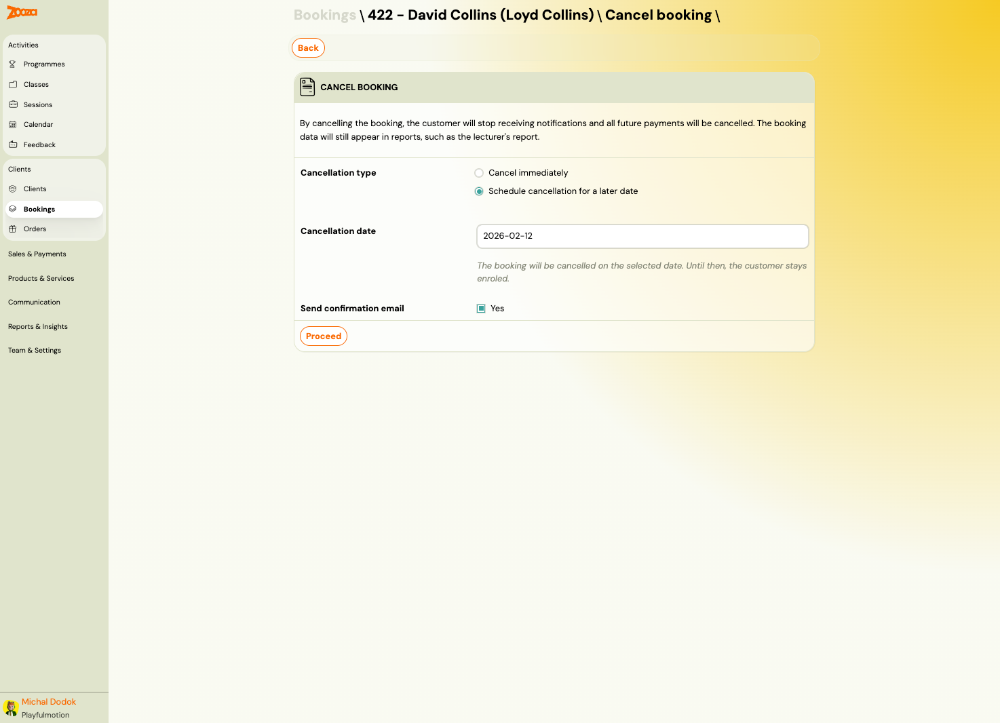

Cancellation notice: "By cancelling the booking, the client will stop receiving notifications and all future payments will be cancelled. The booking data will still appear in reports, such as the instructor's report."

| Field | Description |
|---|---|
| `Cancellation type` | **Cancel immediately** or **Schedule cancellation for a later date**. |
| `Cancellation date` | Date picker (shown when scheduling). The booking will be cancelled on this date; until then, the client stays enrolled. |
| `Send confirmation email` | Checkbox — notify the client. |

Click **Proceed** to confirm.

## Change Class (Transfer)

> **Navigation:** Booking detail → **Transfer** (in Class card) or **Change** link.

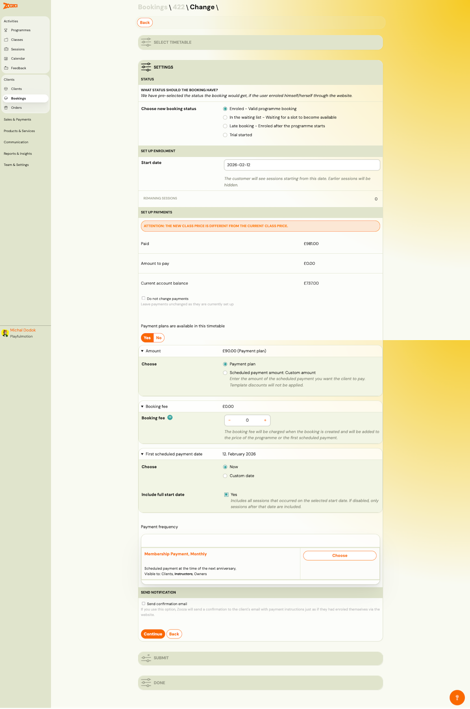

The transfer wizard includes:

### Settings — Status

Choose the booking status after transfer:

- Enrolled — Valid programme booking
- In the waiting list — Waiting for a slot to become available
- Late booking — Enrolled after the programme starts
- Trial started

### Set Up Enrolment

| Field | Description |
|---|---|
| `Start date` | The client will see sessions starting from this date. Earlier sessions will be hidden. |
| `Remaining sessions` | Count of sessions remaining after the start date. |

### Set Up Payments

Shows a warning if the new class price differs from the current class price.

| Field | Description |
|---|---|
| `Paid` | Amount already paid. |
| `Amount to pay` | Remaining amount. |
| `Current account balance` | Current balance. |
| `Do not change payments` | Checkbox — leave payments unchanged. |
| `Payment plans available` | Yes/No toggle for payment plan usage. |
| `Amount` | Payment plan amount. |
| `Choose` | **Payment plan** or **Scheduled payment amount: Custom amount**. |
| `Booking fee` | One-time fee with +/- controls. |
| `First scheduled payment date` | Choose **Now** or **Custom date**. |
| `Include full start date` | Checkbox — include sessions on the start date. |
| `Payment frequency` | Select from available payment templates. |

### Send Notification

- **Send confirmation email** — checkbox to send the client a confirmation.

Click **Continue** to proceed, or **Back** to return.

## Payments Tab

> **Navigation:** Booking detail → **Payments** (quick link) or **Show payments**.

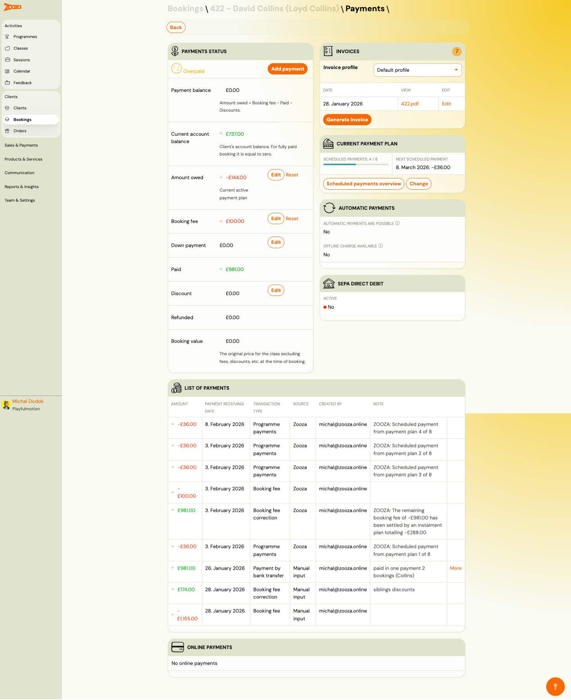

### Payments Status

| Field | Description |
|---|---|
| `Status` | Payment status with icon (e.g. "Overpaid", "Paid", "Unpaid"). |
| `Payment balance` | Formula: Amount owed + Booking fee − Paid − Discounts. |
| `Current account balance` | Client's overall account balance. |
| `Amount owed` | Current active payment plan amount. **Edit** / **Reset** buttons. |
| `Booking fee` | One-time fee. **Edit** / **Reset** buttons. |
| `Down payment` | Initial payment amount. **Edit** button. |
| `Paid` | Total paid. **Edit** button. |
| `Discount` | Applied discount amount. **Edit** button. |
| `Refunded` | Total refunded amount. |
| `Booking value` | Original class price excluding fees and discounts at time of booking. |

Button: **Add payment**.

### Invoices

| Field | Description |
|---|---|
| `Invoice profile` | Dropdown to select invoice profile (e.g. "Default profile"). |
| Invoice list | Shows date, view link (PDF), and edit link for each invoice. |
| **Generate invoice** | Create a new invoice. |

#### Edit Invoice Dialog

| Field | Description |
|---|---|
| `Period Start` / `Period End` | Invoice period date range. |
| `Debt within the period` | Total debt for the period. |
| `Amount paid within the period` | Total payments within the period. |
| `Invoice date` | Date shown on the invoice. |
| `Delivery date` | Delivery/service date. |
| `Payment method` | Dropdown (e.g. "Transfer payment"). |
| `Use default item description` | Checkbox. |
| `Send invoice to customer via email` | Checkbox. |
| `Item description` | Editable description text. |

### Current Payment Plan

Shows progress bar for scheduled payments (e.g. "4 / 8"), next scheduled payment date and amount. Buttons: **Scheduled payments overview** and **Change**.

### Automatic Payments

| Field | Description |
|---|---|
| `Automatic payments are possible` | Yes/No. |
| `Offline charge available` | Yes/No. |

### SEPA Direct Debit

Shows whether SEPA direct debit is active.

### List of Payments

Table with all payment transactions:

| Column | Description |
|---|---|
| `Amount` | Payment amount (negative = charge, positive = payment received). |
| `Payment receiving date` | Date payment was recorded. |
| `Transaction type` | E.g. "Programme payments", "Booking fee", "Booking fee correction", "Payment by bank transfer". |
| `Source` | "Zooza" (automatic) or "Manual input". |
| `Created by` | User who recorded the payment. |
| `Note` | Additional notes (e.g. "paid in one payment 2 bookings"). |

### Online Payments

Lists any online payments received.

## Current Active Payment Plan

> **Navigation:** Payments tab → **Scheduled payments overview**.

Shows the payment plan header:

| Field | Description |
|---|---|
| `Created` | Date the plan was created. |
| `Created by` | User who created the plan. |
| `Template used` | Payment template name and type (e.g. "Monthly, Prepaid Periodic Payment, Monthly"). |
| `Template discount applied` | Discount amount from the template. |
| `Discount applied from the discount credit` | Discount from credits. |
| `Total amount to pay` | Total amount across all scheduled payments. |
| `Automatic payments available` | Yes/No. |

Button: **Delete** — removes the payment plan.

### Payment Overview Table

| Column | Description |
|---|---|
| `Scheduled for` | Session/period date. |
| `Due date` | Payment due date. |
| `Status` | "Processed" or "Scheduled". |
| `Processed` | Timestamp when processed. |
| `Template discount` | Discount from template. |
| `Discount from the discount coupon` | Coupon discount. |
| `Scheduled payment` | Scheduled charge amount. |
| `To be paid` | Actual amount to pay. |

Scheduled (future) payments show an **Edit** link.

## Offline Payment Detail

> **Navigation:** Payments tab → click a payment row.

### Offline Payment

| Field | Description |
|---|---|
| `Amount` | Payment amount. |
| `Created` | Timestamp. |
| `Transaction type` | E.g. "Payment by bank transfer". |
| `Source` | "Manual input" or "Zooza". |
| `Created in Zooza` | Timestamp in Zooza system. |
| `Created by` | User who recorded it. |
| `Note` | Free-text note. |
| `Payment posting date` | Date the payment was posted. |
| `Payment date` | Actual payment date. |
| `IBAN` | Bank account number (if applicable). |

### Move Payment

Transfer a payment to another booking. Requirements: no refund or correction on the payment, and the target booking must manage its own payments.

Button: **Move payment**.

### Refund

Shows refunded amount. Button: **Refund payment**.

### Correct Payment

Shows payment corrections amount. Button: **Correct payment**.

## Attendance Tab

> **Navigation:** Booking detail → **Attendance** (quick link).

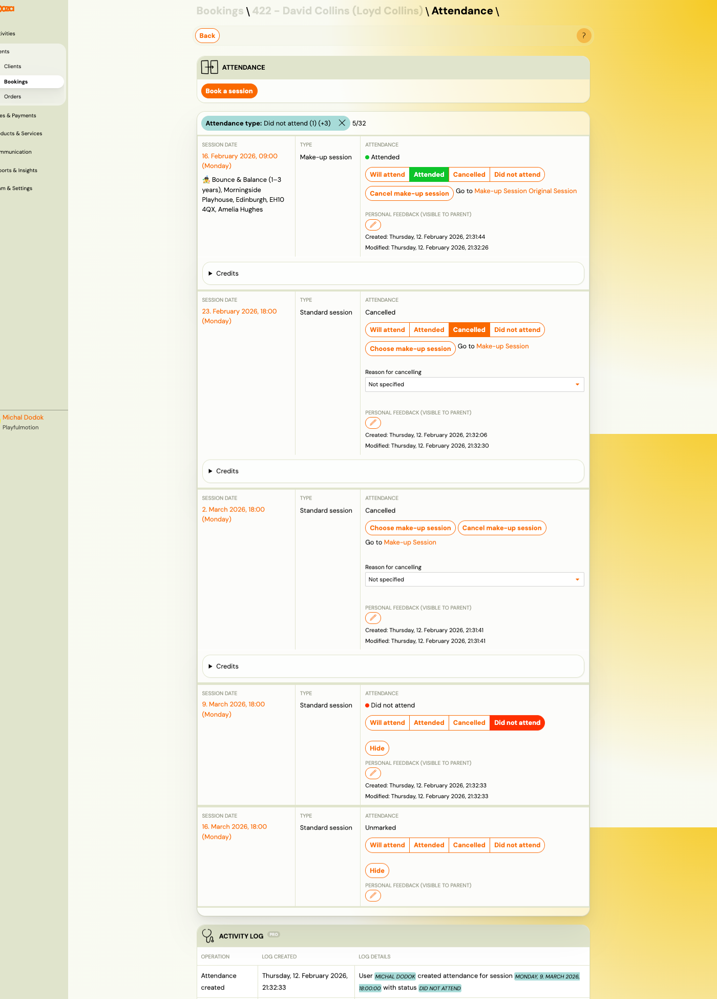

The attendance tab lists every session for this booking. Button: **Book a session**.

Filter: **Attendance type** — filter by status (e.g. "Did not attend (1) (+3)") with count.

Each session row shows:

| Field | Description |
|---|---|
| `Session date` | Date and time (e.g. "16. February 2026, 18:00 (Monday)"). |
| `Type` | "Standard session" or "Make-up session". For make-up sessions, the programme and venue are also shown. |
| `Attendance` | Current status — "Attended", "Cancelled", "Did not attend", or "Unmarked". |

Attendance action buttons:

- **Will attend** — mark as planning to attend.
- **Attended** — mark as attended (highlighted green when active).
- **Cancelled** — mark as cancelled (highlighted orange when active).
- **Did not attend** — mark as absent (highlighted red when active).

For cancelled sessions:

- **Choose make-up session** — opens the make-up session picker.
- **Cancel make-up session** — cancel an assigned make-up.
- **Go to Make-up Session** — link to the make-up session detail.
- `Reason for cancelling` — dropdown to select cancellation reason.

Each session shows:

- **Personal feedback (visible to parent)** — editable feedback field with created/modified timestamps.
- **Credits** — expandable section showing credits related to this session.
- **Hide** — collapse the session details.

### Choose Make-up Session

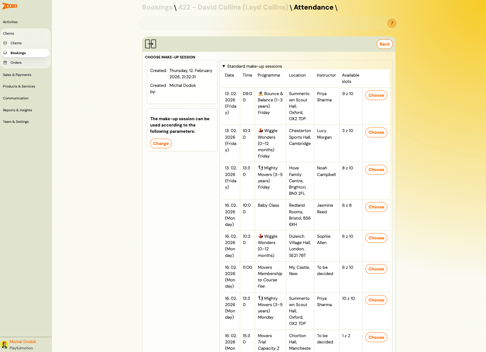

Shows available make-up sessions in a table:

| Column | Description |
|---|---|
| `Date` | Session date. |
| `Time` | Start time. |
| `Programme` | Programme name. |
| `Location` | Venue name. |
| `Instructor` | Instructor name. |
| `Available slots` | Remaining capacity (e.g. "9 z 10"). |

Includes filter by **Change** to modify make-up session parameters.

Click **Choose** to assign a make-up session.

### Activity Log

At the bottom, an activity log tracks all attendance changes:

| Column | Description |
|---|---|
| `Operation` | Action type (e.g. "Attendance created"). |
| `Log created` | Timestamp. |
| `Log details` | Description with user, session date, and status. |

## Credits and Make-up Sessions Tab

> **Navigation:** Booking detail → **Credits and make-up sessions** (quick link).

Button: **Create credit for booking**.

### Make-up Sessions

| Column | Description |
|---|---|
| `Status` | "Not used" or "Used". |
| `Created by` | User who created the credit. |
| `Used by` | User who redeemed it. |
| `Date created` | Creation timestamp. |
| `Used on` | Redemption timestamp. |
| `Date of expiry` | Expiration date. |
| `Value` | Credit value (e.g. "£10.00"). |
| **More** | Link to credit detail. |

### Additional Sections

- **Transferred make-up sessions** — credits transferred from other bookings.
- **Discounts** — discount credits applied.
- **Create a free session or discount voucher for booking** — manually created vouchers.
- **Purchased gift vouchers redeemed for this booking** — gift vouchers used.
- **Entry pass** — entry pass credits.

### New Credit

> **Navigation:** Credits tab → **Create credit for booking**.

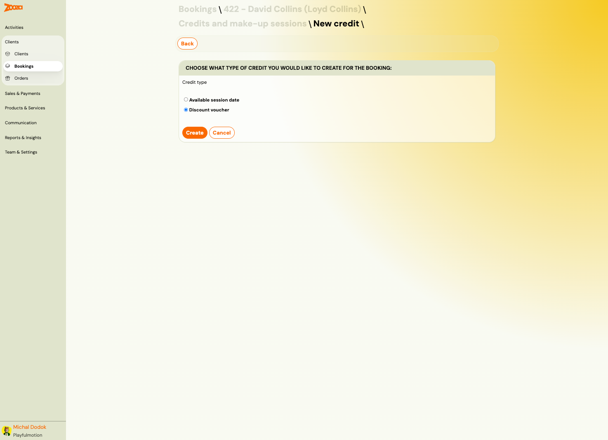

| Field | Description |
|---|---|
| `Credit type` | **Available session date** — a make-up session slot. **Discount voucher** — a monetary discount. |

Click **Create** to add the credit, or **Cancel** to discard.

### Credit Detail

> **Navigation:** Credits tab → **More** on a credit row.

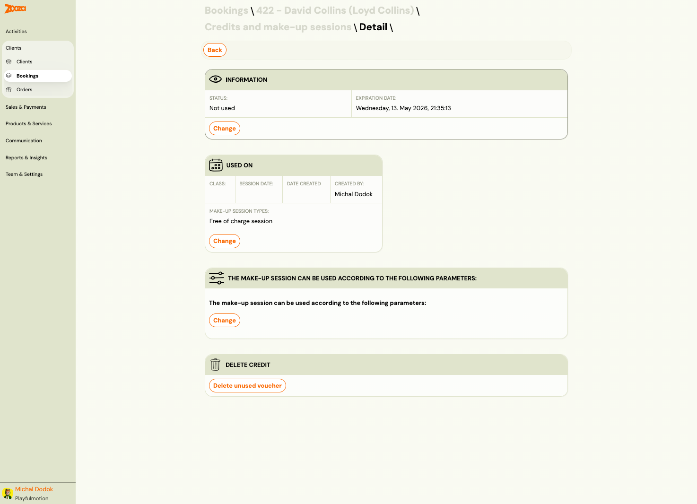

#### Information

| Field | Description |
|---|---|
| `Status` | "Not used" or "Used". |
| `Expiration date` | When the credit expires. |

Button: **Change** — modify the credit information.

#### Used On

| Field | Description |
|---|---|
| `Class` | Class where the credit was used. |
| `Session date` | Session date. |
| `Date created` | When it was redeemed. |
| `Created by` | User who redeemed it. |
| `Make-up session types` | E.g. "Free of charge session". |

Button: **Change** — modify the usage details.

#### Make-up Session Parameters

Shows the parameters that govern where and when the credit can be used. Button: **Change**.

#### Delete Credit

Button: **Delete unused voucher** — removes an unused credit.

## Communication Tab

> **Navigation:** Booking detail → **Communication** (quick link).

### Top Actions

| Button | Description |
|---|---|
| **Send email** | Compose and send an email to this client. |
| **Send SMS** | Send an SMS to this client. |

### Filters

- **Type** — filter by message type.
- **Template** — filter by template used.
- **Status** — filter by delivery status.
- **Sort** — "Most recent first" (default).

### Message List

Each message shows:

| Field | Description |
|---|---|
| Type label | E.g. "Cancellation confirmation", "New payment". |
| Direction | "IN" badge for inbound/system messages. |
| Content | Subject line or preview (e.g. "Attendance successfully cancelled"). |
| Timestamp | Date and time. |
| Scope | E.g. "Global-block". |

### Quick Reply

Compose a message directly from the communication tab:

| Field | Description |
|---|---|
| `Type` | **Email** or **SMS** radio buttons. |
| `Email subject` | Subject line (required for email). |
| `Email body` | Rich text editor with formatting toolbar. |

Click **Send** to send the message.

## Related

- [Common Booking Scenarios](../faq/common-booking-scenarios.md) — FAQ for booking-related tasks.
- [Booking and Booking FAQ](../faq/registration-and-booking-faq.md) — common booking questions.
- [Payment Pairing Guide](../guides/payment-pairing.md) — how to match payments to bookings.
- [Attendance and Catch-ups FAQ](../faq/attendance-and-catchups-faq.md) — make-up session questions.
